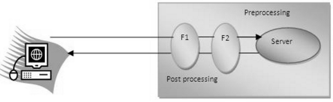

Filters
==========

A filter is invoked at the **preprocessing and postprocessing of a request.**



Filter is defined in the web.xml file, if we remove the entry of filter from the
web.xml file, filter will be removed automatically and we don't need to change
the servlet. So it will be easier to maintain the web application.

**Usage of Filter**

-   recording all incoming requests

-   logs the IP addresses of the computers from which the requests originate

-   conversion

-   data compression

-   encryption and decryption

-   Input validation etc.

**Advantage of Filter**

-   Filter is pluggable.

-   One filter don't have dependency onto another resource.

-   Less Maintenance


# Filter API

Like servlet filter have its own API.**The javax.servlet** package contains the
**3 interfaces**

1.  **Filter**

2.  **FilterChain**

3.  **FilterConfig**

**1) Filter interface**

For creating any filter, you must implement the Filter interface. Filter
interface provides the life cycle methods for a filter.

| **Method**                                                                              | **Description**                                                                                                                                 |
|-----------------------------------------------------------------------------------------|-------------------------------------------------------------------------------------------------------------------------------------------------|
| public void init(FilterConfig config)                                                   | init() method is invoked only once. It is used to initialize the filter.                                                                        |
| Public void doFilter(HttpServletRequest req,HttpServletResponse res, FilterChain chain) | doFilter() method is invoked every time when user request to any resource, to which the filter is mapped.It is used to perform filtering tasks. |
| public void destroy()                                                                   | This is invoked only once when filter is taken out of the service.                                                                              |

**2) FilterChain interface**

The object of FilterChain is responsible to invoke the next filter or resource
in the chain.This object is passed in the doFilter method of Filter
interface.The FilterChain interface contains only one method:

`public void doFilter(HttpServletRequest, HttpServletResponse)`:
It passes the control to the next filter or resource.

<br>

index.html
```html
<a href="servlet1">click here</a>
```

MyFilter.java
```java
public class MyFilter implements Filter{  
  
public void init(FilterConfig arg0) throws ServletException {}  
      
public void doFilter(ServletRequest req, ServletResponse resp, FilterChain chain) throws IOException, ServletException {  
          
    PrintWriter out=resp.getWriter();  
    out.print("filter is invoked before");  
          
    chain.doFilter(req, resp);//sends request to next resource  
          
    out.print("filter is invoked after");  
    }  
    public void destroy() {}  
}
```

HelloServlet.java
```java
public class HelloServlet extends HttpServlet {  
    public void doGet(HttpServletRequest request, HttpServletResponse response)  
            throws ServletException, IOException {  
  
        response.setContentType("text/html");  
        PrintWriter out = response.getWriter();  
      
        out.print("<br>welcome to servlet<br>");            
    }    
}
```

web.xml
```xml
<web-app>  
  
<servlet>  
<servlet-name>s1</servlet-name>  
<servlet-class>HelloServlet</servlet-class>  
</servlet>  
  
<servlet-mapping>  
<servlet-name>s1</servlet-name>  
<url-pattern>/servlet1</url-pattern>  
</servlet-mapping>  
  
<filter>  
<filter-name>f1</filter-name>  
<filter-class>MyFilter</filter-class>  
</filter>  
   
<filter-mapping>  
<filter-name>f1</filter-name>  
<url-pattern>/servlet1</url-pattern>  
</filter-mapping>  
    
</web-app>
```


<br>


### FilterConfig

An object of FilterConfig is created by the web container. This object can be
used to get the configuration information from the web.xml file.

1.  **public void init(FilterConfig config):** init() method is invoked only
    once it is used to initialize the filter.

2.  **public String getInitParameter(String parameterName):** Returns the
    parameter value for the specified parameter name.

3.  **public java.util.Enumeration getInitParameterNames():** Returns an
    enumeration containing all the parameter names.

4.  **public ServletContext getServletContext():** Returns the ServletContext
    object
```xml
<filter>  
  <filter-name>f1</filter-name>  
  <filter-class>MyFilter</filter-class>  
  	<init-param>  
  		<param-name>age</param-name>  
 		<param-value>27</param-value>  
  	</init-param>  
  </filter>  

  <filter-mapping>  
  <filter-name>f1</filter-name>  
  <url-pattern>/servlet1</url-pattern>  
  </filter-mapping>  

```

