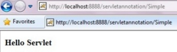

# Servlets with Annotation 

-   Annotation represents the metadata.

-   If you use annotation, deployment descriptor (web.xml file) is not required.

-   But you should have tomcat7 as it will not run in the previous versions of
    tomcat.

    **@WebServlet(-/url")** annotation is used to map the servlet with the
    specified name.

```java
@WebServlet("/Simple")  
public class Simple extends HttpServlet {  
    private static final long serialVersionUID = 1L;  
  
    protected void doGet(HttpServletRequest request, HttpServletResponse response)  
                            throws ServletException, IOException {  
          
  
        response.setContentType("text/html");  
        PrintWriter out=response.getWriter();  
          
        out.print("<html><body>");  
        out.print("<h3>Hello Servlet</h3>");  
        out.print("</body></html>");  
    }  
}
```



