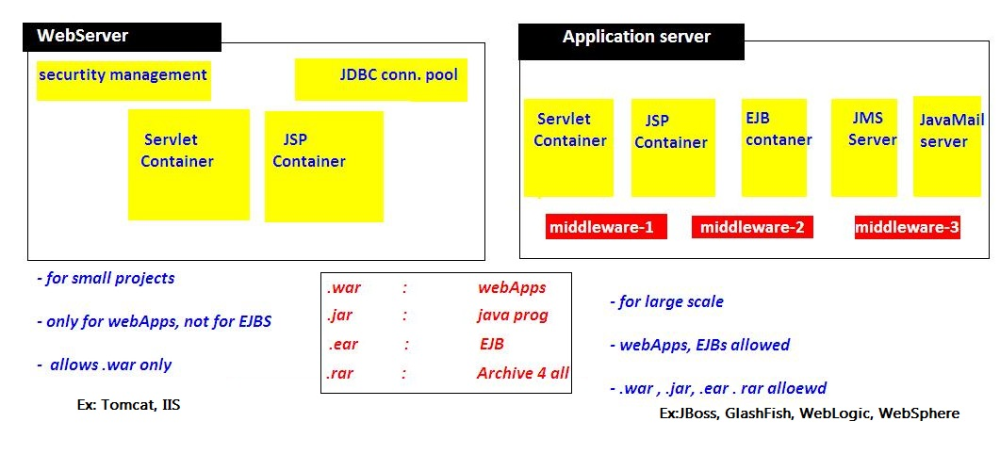

Basics of Web Technologies
============================

| **Static Website**                                                                                    | **Dynamic Website**                                                                                                   |
|-------------------------------------------------------------------------------------------------------|-----------------------------------------------------------------------------------------------------------------------|
| Prebuilt content is same every time the page is loaded.                                               | Content is generated quickly and changes regularly.                                                                   |
| It uses the **HTML **code for developing a website.                                                   | It uses the server side languages such as **PHP, SERVLET, JSP, and ASP.NET **etc. for developing a website.           |
| It sends exactly the same response for every request.                                                 | It may generate different HTML for each of the request.                                                               |
| The content is only changes when someone publishes and updates the file (sends it to the web server). | The page contains **"server-side"** code it allows the server to generate the unique content when the page is loaded. |

 

**1. HTTP (Hyper Text Transfer Protocol)**  
HTTP is TCP/IP based communication protocol, which is used to deliver the data
like image files, query results, HTML files etc on the World Wide Web (WWW) with
the default port is TCP 80. It provides the standardized way for computers to
communicate with each other.

There are three fundamental features that make the HTTP a simple and powerful
protocol used for communication:

-   **HTTP is media independent:** It refers to any type of media content can be
    sent by HTTP as long as both the server and the client can handle the data
    content.

-   **HTTP is connectionless:** It is a connectionless approach in which HTTP
    client i.e., a browser initiates the HTTP request and after the request is
    sends the client disconnects from server and waits for the response.

-   **HTTP is stateless:** The client and server are aware of each other during
    a current request only. Afterwards, both of them forget each other. Due to
    the stateless nature of protocol, neither the client nor the server can
    retain the information about different request across the web pages.

 

**2. HTTP Requests**  
The request sends by the computer to a web server that contains all sorts of
potentially interesting information is known as HTTP requests.

It will send following information to Server

-   The analysis of source IP address, proxy and port

-   The analysis of destination IP address, protocol, port and host

-   The Requested URI (Uniform Resource Identifier)

-   The Request method and Content

-   The User-Agent header

-   The Connection control header

We have following HTTP request methods:

 

**3. GET vs POST**

| **GET**                                                                                                                | **POST**                                                                                   |
|------------------------------------------------------------------------------------------------------------------------|--------------------------------------------------------------------------------------------|
| 1) In case of Get request, only  limited amount of data can be sent because data is sent in header.                 | In case of post request, large amount of data can be sent because data is sent in body. |
| 2) Get request is not secured because data is exposed in URL bar.                                                  | Post request is secured because data is not exposed in URL bar.                        |
| 3) Get request **can be bookmarked.**                                                                                  | Post request **cannot be bookmarked.**                                                     |
| 4) Get request is **idempotent.** It means second request will be ignored until response of first request is delivered | Post request is **non-idempotent.**                                                        |
| 5) Get request is **more efficient** and used more than Post.                                                          | Post request is **less efficient** and used less than get.                                 |

 

**4. Servlet Container:**  
is the place where Servlet programs are executed

The servlet container is used in java for dynamically generate the web pages on
the server side. Therefore the servlet container is the part of a web server
that interacts with the servlet for handling the dynamic web pages from the
client.

*The Servlet Container performs many operations that are given below:*

**Life Cycle Management**

1.  **Multithreaded support**

2.  **Object Pooling**

3.  **Security etc.**

 

**5. Web Server VS Application Server**

 

**6. Content Type**

Content Type is also known as MIME (Multipurpose internet Mail Extension) Type.
It is a HTTP header that provides the description about what are you sending to
the browser.

-   **It supports the non-ASCII characters**

-   **It supports the multiple attachments in a single message**

-   **It supports the attachment contains audio, images and video files etc.**

-   **It supports the unlimited message length.**

Commonly used content types are given below:

-   **text/html**

-   **text/plain**

-   **application/msword**

-   **application/vnd.ms-excel**

-   **application/jar**

-   **application/pdf**

-   **application/octet-stream**

-   **application/x-zip**

-   **images/jpeg**

-   **images/png**

-   **images/gif**

-   **audio/mp3**

-   **video/mp4**

-   **Video/quicktime etc.**