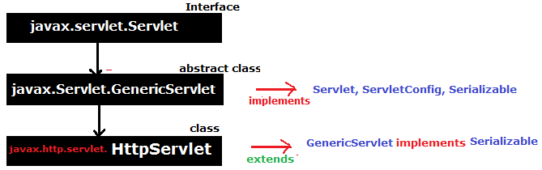

3.Servlet API
=============

we can create any servlet program by using below 3 ways

# **1.javax.servlet.Servlet (Interface)**

Servlet interface is the ROOT interface of Servlet API. It provides common
behaviour to all the servlets.

| **Method**                                                           | **Description**                                                                                                 |
|----------------------------------------------------------------------|-----------------------------------------------------------------------------------------------------------------|
| **public void init(ServletConfig config)**                           | Initializes the servlet. It is the life cycle method of servlet and invoked by the web container **only once.** |
| **public void service(ServletRequest req,ServletResponse response)** | Provides response for the incoming request. **It is invoked at each request by the web container.**             |
| **public void destroy()**                                            | Is invoked only once and indicates that servlet is being destroyed.                                             |
| **public ServletConfig getServletConfig()**                          | Returns the object of ServletConfig.                                                                            |
| **public String getServletInfo()**                                   | returns information about servlet such as writer, copyright, version etc.                                       |

<u>Steps to implement Servlet program using Servlet Interface</u>

1.  Create a Class which **implements Servlet Interface**

2.  **Implement** all **5** abstract **methods**

3.  Write Request Processing logic in **service(req,res) method**

# **2.javax.servlet.GenericServlet (abstract class)**

-   GenericServlet class implements Servlet, ServletConfig and Serializable
    interfaces.

-   It provides implementation for all methods of Servlet interface **except the
    service().**

-   **it is protocol-independent**, so it can handle any request of any protocol

-   Create servlet by providing the implementation of the service() method.

**Init(),destroy(),getServletConfig(),getservletInfo() are inherted and
implemented**

**1. public abstract void service(ServletRequest req, ServletResponse res)**

**2. public void init()**
it is a convenient method for the servlet programmers, now there is no need to
call super.init(config)

**3. public ServletContext getServletContext()**

**4. public String getInitParameter(String name**)

**5. public Enumeration getInitParameterNames()**

**6. public String getServletName()**

<u>Steps to write Servlet Program using GenericServlet</u>

1.  Create a Class which **extends GenericServlet Interface**

2.  Implement & Write Request Processing logic in **service(req,res) method**

# **3.javax.servlet.http.HttpServlet**

HttpServlet class extends the GenericServlet class and implements Serializable
interface. It provides http specific methods such as doGet, doPost, doHead,
doTrace etc.

**We have 2 service methods**

1.  **Public void service(ServletRequest req,ServletResponse res)** dispatches
    the request to the protected service method by converting the request and
    response object into http type.

2.  **protected void service(HttpServletRequest req,HttpServletResponse res)** : Receives the request from the service method, and dispatches the request to the doXXX() method depending on the incoming http request type.

**7 proteced doXXX (HttpServletRequest, HttpServletResponce) service methods**

1.  **protected void doGet(Htt**pServletRequest req, HttpServletResponse res)

2.  **protected void doPost(Ht**tpServletRequest req, HttpServletResponse res)

3.  **protected void doHead(H**ttpServletRequest req, HttpServletResponse res)

4.  **protected void doOptions**(HttpServletRequest req, HttpServletResponse
    res)

5.  **protected void doPut(Htt**pServletRequest req, HttpServletResponse res)

6.  **protected void doTrace(H**ttpServletRequest req, HttpServletResponse res)

7.  **protected void doDelete(HttpServletRequest req, HttpServletResponse res)**

<u>Steps to write Servlet Program using GenericServlet</u>
1.  Create a Class which **extends HttpServlet Interface**

2.  Write Request Processing logic in **service(req,res) OR Not Recommended**

3.  Write Request Processing logic in **doXXX(req,res) doGet,doPost
    Recommended**
