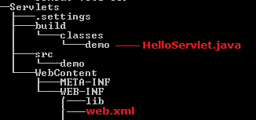
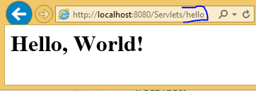

Servlet Lifecycle
===================

First we see the example, then we can understand the Lifecycle. For every
Servlet program contains following strcuture



Here **Servlets** is Application name

<br>


**Example 1: Using Servlet Interface**
```java
public class HelloServlet implements Servlet{
	ServletConfig config = null;
	@Override
	public void init(ServletConfig config) throws ServletException {
 this.config = config;
 System.out.println("1.Init...");
	}
	@Override
	public void service(ServletRequest req, ServletResponse res) throws ServletException, IOException {
 System.out.println("2.Service ...");
	PrintWriter pw =	res.getWriter();
	pw.write("<h1>Hello, World!</h1>");
	}
	@Override
	public void destroy() {
 System.out.println("3.Destroy ..");
	}
	@Override
	public ServletConfig getServletConfig() {
 System.out.println("4.getServletConfig ..");
 return config;
	}
	@Override
	public String getServletInfo() {
 return "getServletInfo";
	}
}
```


```xml
web.xml
---------------
<?xml version="1.0" encoding="UTF-8"?>
<web-app>
	<servlet>
 <servlet-name>hello</servlet-name>
 <servlet-class>demo.HelloServlet</servlet-class>
	</servlet>

	<servlet-mapping>
 <servlet-name>hello</servlet-name>
 <url-pattern>/hello</url-pattern>
	</servlet-mapping>

	<welcome-file-list>
 <welcome-file>index.jsp</welcome-file>
	</welcome-file-list>	 
</web-app>
```



### Flow of Excecution

1.  When ever we deploys the application, container loads the application &
    creates **ServletContext** Object & waits for the Request

2.  if we give **<load-on-startup>**1**</load-on-startup>**  container will
    creates ServletConfig Object when the time of Deploying application

3.  when we give the url : **http://localhost:8080/Servlets/hello ,** request
    goes to container, and it searches for **/hello** url pattern in web.xml

4.  web.xml searches for **/hello** , in <servlet-mapping> and gets
    **Servelt-name**

5.  container loads demo.HelloServlet class and creates creates
    **ServletConfig** Object and calls inti() method

6.  for every request it will calls **service(req,res)** method, for 100
    requests it will execute 100 times

7.  **destroy()** method will be called before servlet is removed from the
    container, and finally it will be garbage collected as usual.

In above **<load-on-startup>**1**</load-on-startup>** we may give (1,2..10).
based up on priority order it will creates the ServletConfig Object

**<welcome-file-list>**

-   If we want to make any page/servlet as Homepage we have to specify in this
    tag

-   If it contains more then 1 file, it will give priority by the Order


<br>


**Example 2: Using GenericServlet**
```java
public class HelloServlet extends GenericServlet  {
	public void service(ServletRequest req, ServletResponse res) throws ServletException, IOException {
 res.setContentType("text/html");
 PrintWriter pw = res.getWriter();
 pw.write("Hello, Generic Servlet"); 
	}
}
```

<br>

**Example 3: Using HttpServlet**
```java
public class HelloServlet extends HttpServlet  {	
	@Override
	public void service(ServletRequest req, ServletResponse res) throws ServletException, IOException {
 System.out.println("Public Service ........");
	}
	
	@Override
	protected void service(HttpServletRequest req, HttpServletResponse res) throws ServletException, IOException {
 System.out.println("Protecd Service ........");
	}
	
	@Override
	protected void doGet(HttpServletRequest req, HttpServletResponse resp) throws ServletException, IOException {
 System.out.println("doGet() ....");
	}
	
	@Override
	protected void doPost(HttpServletRequest req, HttpServletResponse resp) throws ServletException, IOException {
 // TODO Auto-generated method stub
 System.out.println("doPost() ....");
	}
}
-----------------------
INFO: Reloading Context with name [/Servlets] is completed
Public Service........
```


-   Container first calls **public Service(req,res)** method

-   Public Service() method internally calls **protected Service(req,res)**
    method

-   Protected Service() method will internally calling **doGet() or doPost() or
    doXXX()** depends on the type of http method used by the client

-   If the client is **not specifying the type of Http** method then Http
    protocol by **default consider GET method**,

-   so **finally** the client request is processed at **doGet() method**
