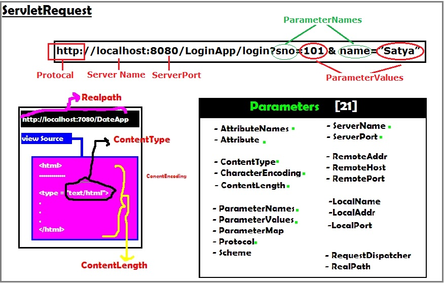
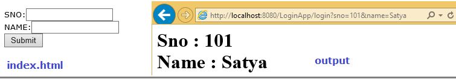
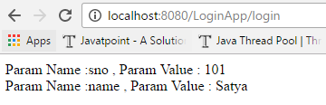
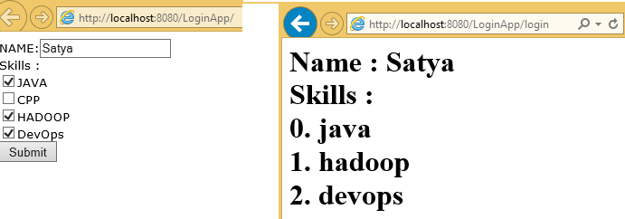
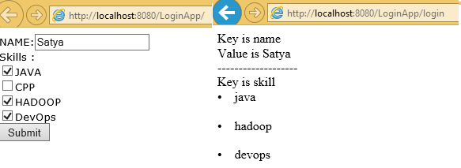

ServletRequest
=============================================

ServletRequest is send to Server to process particular request. It can send
following details to servlet by submitting FORM or by URL. We can get these
details at server side




### Example to getRequest details
```java
public class ServletReq extends HttpServlet {
	@Override
	protected void doGet(HttpServletRequest req, HttpServletResponse res) throws ServletException, IOException {
		res.setContentType("text/html");
		PrintWriter pw = res.getWriter();
		pw.println("<br> getProtocol   \t:" + req.getProtocol());
		pw.println("<br> getServerName \t:" + req.getServerName());
		pw.println("<br> getServerPort \t:" + req.getServerPort());
		pw.println("<br> getRemotePort \t:" + req.getRemotePort());
		pw.println("<br> getLocalPort  \t:" + req.getLocalPort());

		pw.println("<br> getContentType   \t:" + req.getContentType());
		pw.println("<br> getContentLength \t:" + req.getContentLength());
	pw.println("<br> CharacterEncoding\t:" + req.getCharacterEncoding());
		pw.println("<br> req.getScheme    \t:" + req.getScheme());
	}
}
-----------------------------
getProtocol   :HTTP/1.1 
getServerName :localhost 
getServerPort :8080 
getRemotePort :63205 
getLocalPort  :8080 
getContentType :null 
getContentLength :-1 
CharacterEncoding :null 
req.getScheme  :http
```

<br>

We mainly use ServletRequest **Object to retrieve data from FORM Submission or
URL**

We can get the parameters by using following methods

1.  public String **getParameter(“paramname");**

2.  public Enumeration **getParameterNames();**

3.  public String[] **getParamterValues(“paramname");**

4.  public Map **getParameterMap();**

<br>

<u>Example: getParamater ()</u>

**Index.html**
```html
<form action="login" method="get">
		SNO:<input type="text" name="sno"><br> 
	      NAME:<input type="text" name="name"><br> 
	   <input type="submit" value="Submit">
</form>
```


**LoginServlet.java**
```html
public class LoginServlet extends HttpServlet {
	protected void doGet(HttpServletRequest req, HttpServletResponse res) throws ServletException, IOException {
		PrintWriter pw = res.getWriter();
		res.setContentType("text/html");
		String sno = req.getParameter("sno");
		String name = req.getParameter("name");
		pw.println("<h1>Sno : " + sno);
		pw.println("<br>Name : " + name);
		pw.close();
	}
}
```

web.xml
```html
<web-app 
  <servlet>
    <servlet-name>login</servlet-name>
    <servlet-class>demo.LoginServlet</servlet-class>
  </servlet>
  <servlet-mapping>
    <servlet-name>login</servlet-name>
    <url-pattern>/login</url-pattern>
  </servlet-mapping>   
</web-app>
```



Make sure if we use GET method in form we must use doGet (Req, Res) & for POST
we have to use doPost(req,res). Otherwise it throws Get/Post not supported
error.in this type of case write logic doGet() & call doGet() in doPost()

<br>

<u>public Enumeration getParameterNames();</u>

Sometimes we don’t know the request parameter names, in this case we use
getParameterNames ();. See the same UI for this only Servlet code is changed
```html
public class LoginServlet extends HttpServlet {
	protected void doPost(HttpServletRequest req, HttpServletResponse res) throws ServletException, IOException {
		PrintWriter pw = res.getWriter();
		res.setContentType("text/html");
		Enumeration e = req.getParameterNames();
		while (e.hasMoreElements()) {
			String s = (String) e.nextElement();
pw.write("Param Name :" +s + ",Param Value : " + req.getParameter(s)+"<br>");
		}
		pw.close();
	}
}
```



<br>

**getParamterValues(“paramname"), getParameterMap();** are used in the case of
Single parameter can having multiple values, like checkboxes. See below example

<u>getParamterValues(“paramname") Example</u>
```java
<form action="login" method="post">		  
	   NAME:<input type="text" name="name"><br> 
	   Skills : <br>
           <input type="checkbox" name="skill" value="java">JAVA<br>
           <input type="checkbox" name="skill" value="cpp">CPP<br>
           <input type="checkbox" name="skill" value="hadoop">HADOOP<br>
           <input type="checkbox" name="skill" value="devops">DevOps<br>
	   <input type="submit" value="Submit">
	</form>
--------------------------------------------------------------------	
	
public class LoginServlet extends HttpServlet {
	protected void doPost(HttpServletRequest req, HttpServletResponse res) throws ServletException, IOException {
		PrintWriter pw = res.getWriter();
		res.setContentType("text/html");
		pw.write("<h1> Name : " + req.getParameter("name"));
		pw.write("<br> Skills : <br> ");
		String[] skills = req.getParameterValues("skill");
		for (int i = 0; i < skills.length; i++) {
			pw.write(i + ". " + skills[i] + "<br>");
		}
		pw.close();
	}
}
```



<br>

<u>getParameterMap(); Example</u>

```java
public class LoginServlet extends HttpServlet {
	protected void doPost(HttpServletRequest req, HttpServletResponse res) throws ServletException, IOException {
		PrintWriter pw = res.getWriter();
		res.setContentType("text/html");

		Map m = req.getParameterMap();
		Set s = m.entrySet();
		Iterator it = s.iterator();

		while (it.hasNext()) {
		Map.Entry  entry =  it.next();

		String key = entry.getKey();
		String[] value = entry.getValue();
		pw.println("Key is " + key + "<br>");

	if (value.length > 1) {
	  for (int i = 0; i < value.length; i++) {
		pw.println("<li>" + value[i].toString() + "</li><br>");
		}
	} else
	   pw.println("Value is " + value[0].toString() + "<br>");
	pw.println("-------------------<br>");
		}
		pw.close();
	}
}
```

