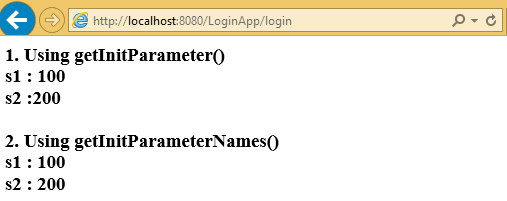

ServletConfig 
===============================================

-   ServletConfig is one of the **pre-defined interface**.

-   ServletConfig object exists **one per servlet program**.

-   An object of ServletConfig created by the container **during its
    initialization phase**.

-   An object of ServletConfig is available to the servlet during its execution,
    once the servlet execution is completed, automatically ServletConfig
    interface object will be removed by the container.

-   **It contains <init-param> details at web.xml, of a particular servlet.**

-   The moment when we are using an object of ServletConfig, **we need to
    configure the web.xml by writing <init-param> tag under <servlet> tag of
    web.xml**.

<br>


### How to get ServletConfig Object

We can ServletConfig object in 2 ways

**1. By calling getServletConfig() on current servlet**  
```java
ServletConfig conf = getServletConfig();
```
Above method is available in Servlet interface, inherited in to GenericServlet &
HttpServlet

**2. ServletConfig object will be available in init() method of the servlet.**
```java
public void init(ServletConfig config)
{
// …………………
}
```

<br>

### How to place `<init-param> `in web.xml

We have to place `<init-param>` in between **<servlet>** tags


```java
public class LoginServlet extends HttpServlet {
	protected void doPost(HttpServletRequest req, HttpServletResponse res) throws ServletException, IOException {
 PrintWriter pw = res.getWriter();
 res.setContentType("text/html");

 ServletConfig cfg = getServletConfig();
 pw.write("<h3> 1. Using getInitParameter()");
 pw.write("<br> s1 : " + cfg.getInitParameter("s1"));
 pw.write("<br> s2 :" + cfg.getInitParameter("s2"));

 pw.write("<br><br>  2. Using getInitParameterNames()");
 Enumeration e = cfg.getInitParameterNames();
 while (e.hasMoreElements()) {
 	String s = (String) e.nextElement();
 	pw.write("<br>" +s + "\t : " + cfg.getInitParameter(s));
 }
	}
}
```

