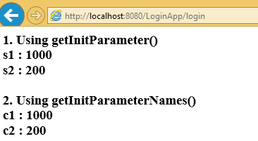
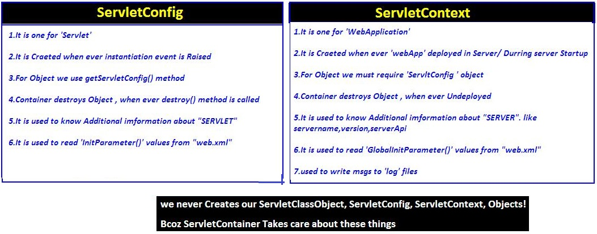

7.ServletContext
================================================

-   Object of ServletContext interface is available **one per web application.**

-   ServletContext object is automatically created by the container **when the
    web application is deployed**.

-   <context-param> is placed between <web-app> tags. Because the parameters
    can be accessed by all the servlets in the Web Application


<br>

### how to get ServletContext Object

We have 3 ways

**1. Using ServletConfig Object**
```java
ServletConfig conf 	= getServletConfig();
ServletContext context 	= conf.getServletContext();
```


**2. By calling getServletContext() on GenericServlet**
```java
>   ServletContext ctx = getServletContext();
```
getServletContext () method is defined in GenericServlet


**3. By calling getServletContext() on HttpServlet**
```java
>   ServletContext ctx = getServletContext();
```
getServletContext () method is defined in GenericServlet inherited to
HttpServlet


<br>


### How to place <context-param> in web.xml

<context-param> is placed between <web-app> tags. Because the parameters can
be accessed by all the servlets in the Web Application
```xml
<web-app>
	<context-param>
 <param-name>c1 </param-name>
 <param-value>1000</param-value>
	</context-param>

	<context-param>
 <param-name>c2 </param-name>
 <param-value>200</param-value>
	</context-param>

	<servlet>
 <servlet-name>login</servlet-name>
 <servlet-class>demo.LoginServlet</servlet-class>
	</servlet>
	<servlet-mapping>
 <servlet-name>login</servlet-name>
 <url-pattern>/login</url-pattern>
	</servlet-mapping>
	<welcome-file-list>
 <welcome-file>index.html</welcome-file>
	</welcome-file-list>
</web-app>
```
 
<br>


### how to context-params in Servlet Program

We have two methods

-   **public String getInitParameter(“param name");**

-   **public Enumeration getInitParameterNames();**

```java
public class LoginServlet extends HttpServlet {
	protected void doPost(HttpServletRequest req, HttpServletResponse res) throws ServletException, IOException {
 PrintWriter pw = res.getWriter();
 res.setContentType("text/html");

 ServletConfig cfg = getServletConfig();
 ServletContext context = cfg.getServletContext();

 pw.write("<h3> 1. Using getInitParameter()");
 pw.write("<br> s1 : " + context.getInitParameter("c1"));
 pw.write("<br> s2 : " + context.getInitParameter("c2"));

 pw.write("<br><br>  2. Using getInitParameterNames()");
 Enumeration e = context.getInitParameterNames();
 while (e.hasMoreElements()) {
 	String s = (String) e.nextElement();
 pw.write("<br>" + s + "\t : " + context.getInitParameter(s));
 }
	}
}
```




