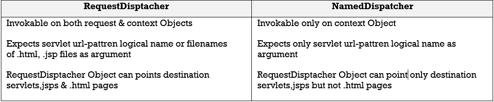
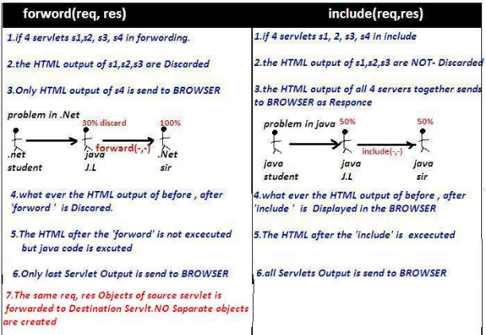
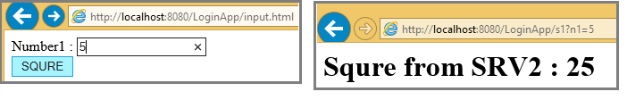
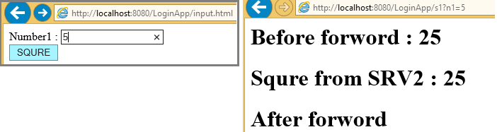

Servlet Chaining
==================

Servlet chaining is used to achieve Communication between servlets. To perform
this we have to use **RequestDisptcher** interface. following are the possible
ways to achieve Servlet Chaining

1.  **rd. forward(req, res)**

2.  **rd. include (req, res)**

3.  **res.sendRedirect(/url)**


<br>

<u>RequestDisptcher Interface</u>

The RequestDispatcher interface provides the facility of dispatching the request
to another resource it may be html, servlet or jsp. We have 2 main methods in
this RequestDisptcher

1.  **public void forward(ServletRequest req,ServletResponse res)**

2.  **public void include (ServletRequest req,ServletResponse res)**


<br>

### How to get RequestDisptcher Object

We have 3 ways to get RequestDisptcher object

1.**using Request object**
```java
RequestDispatcher rd  =  request.getRequestDispatcher("/url or servletname"); 
rd.forward(req, res); 
rd.include(req, res);
```
If we use **request** object, the webresource programs **are must be** in **same
web application**


2.**using ServletContext object with getRequestDispatcher(“url") method**
```java
RequestDispatcher rd  =  context.getRequestDispatcher("/url or servletname"); 
rd.forward(req, res); 
rd.include(req, res);
```
If we use **Context** object, the webresource programs **are may in
same/different web applictions**


3.**using ServletContext object with getNamedDispatcher(“servletname")
    method**
```java
RequestDispatcher rd  =  context. getNamedDispatcher("serv1"); 
rd.forward(req, res); 
rd.include(req, res);
```
-   **/URL** if we are placing .html, .jsp type of files we have to add **‘/’**
    in path

-   **Servletname** if we are using logical names of servlet/jsp like serv1,
    serv2 etc, then **we must not to** add **‘/’** in path




<br>

### Servlet chaining in Same Server
We can use forward(), include() methods to perform chaining between two servlets
which are resides in same web application or different web applications of same
server




<br>

### Forword() example

**Input.html**
```html
<form action="s1" method="GET">
   Number1 : <input type="text" name="n1"><br> 
   <input type="submit"  value="SQURE">
</form>
```


**Web.xml**
```xml
<web-app>
	<servlet>
		<servlet-name>s1</servlet-name>
		<servlet-class>demo.srv1</servlet-class>
	</servlet>
	<servlet>
		<servlet-name>s2</servlet-name>
		<servlet-class>demo.srv2</servlet-class>
	</servlet>
	<servlet-mapping>
		<servlet-name>s1</servlet-name>
		<url-pattern>/s1</url-pattern>
	</servlet-mapping>
	<servlet-mapping>
		<servlet-name>s2</servlet-name>
		<url-pattern>/s2</url-pattern>
	</servlet-mapping>
</web-app>
```


srv1.java
```java
public class srv1 extends HttpServlet {
	public void doGet(HttpServletRequest req, HttpServletResponse res) throws ServletException, IOException {
		ServletConfig cg = getServletConfig();
		ServletContext sc = cg.getServletContext();
		res.setContentType("text/html");
		PrintWriter pw = res.getWriter();		
		
		String s1 = req.getParameter("n1");
		int a = Integer.parseInt(s1);
		int b = a * a;
		
		pw.println("<h1>Before forword		:	" + b + "</h1>");	
		RequestDispatcher rd = sc.getRequestDispatcher("/s2");
		rd.forward(req, res);	// (1)		
		pw.println("<h1> After forword</h1>");
	}

	public void doPost(HttpServletRequest req, HttpServletResponse res) throws ServletException, IOException {
		doGet(req, res);
	}
}
```

srv2.java
```java
public class srv2 extends HttpServlet {
	public void doGet(HttpServletRequest req, HttpServletResponse res) throws ServletException, IOException {
		res.setContentType("text/html");
		PrintWriter pw = res.getWriter();
		String s1 = req.getParameter("n1");
		int a = Integer.parseInt(s1);
		int b = a * a;
		pw.println("<h1>Squre from SRV2		:	" + b + "</h1>");
	}
	public void doPost(HttpServletRequest req, HttpServletResponse res) throws ServletException, IOException {
		doGet(req, res);
	}
}
```


In above (1), if we just replace with **include(req, res)** as below it include
serv1 result also
```java
RequestDispatcher rd = sc.getRequestDispatcher("/s2");
		  rd.include(req, res);
```





<br>


### Servlet chaining in Different Server

We can use `res.sendRedirect(url)` method to perform chaining between two servlets
which are running on different servers


```java
public class srv3 extends HttpServlet {
	public void doGet(HttpServletRequest req, HttpServletResponse res) throws ServletException, IOException {
		res.setContentType("text/html");
		PrintWriter pw = res.getWriter();
		pw.println("<h1>Before sendReditrect</h1>");
		res.sendRedirect("http://www.google.com");
		pw.println("<h1>After sendReditrect</h1>");
		 
	}
	public void doPost(HttpServletRequest req, HttpServletResponse res) throws ServletException, IOException {
		doGet(req, res);
	}
}
```


| **forward() method**                                               | **sendRedirect() method**                       |
|--------------------------------------------------------------------|-------------------------------------------------|
| The forward() method works at server side.                         | The sendRedirect() method works at client side. |
| It sends the same request and response objects to another servlet. | It always sends a new request.                  |
| It can work within the server only.                                | It can be used within and outside the server.   |

    