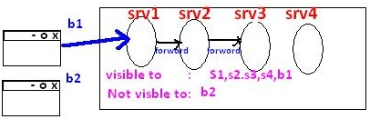

Attributes
============

The servlet programmer can pass information from one servlet to another using
attributes. It is just like passing object from one class to another so that we
can reuse the same object again and again.

We have 3 types of scopes for attributes

1.  **Request scope**

2.  **Session scope**

3.  **Application scope (ServletContext Scope)**

<br>

**Attributes can be apply**

-   if Both Source& Destination Servlets are in same/different web application

-   if Both Source& Destination Servlets are in same Server

-   It is **not** applicable if Both Source& Destination **Servlets are in
    different Server**

<br>

We have 3 methods to deal with attribues

1.  **public void setAttribute(String name,Object object**

2.  **public Object getAttribute(String name)**

3.  **public void removeAttribute(String name)**


<br>

# **1. Request Attribute:**
It applicable only if both servlets must be in
**CHAIN**


```java
public class srv1 extends HttpServlet {
	public void doGet(HttpServletRequest req, HttpServletResponse res) throws ServletException, IOException {
  req.setAttribute("uname", "ADMIN");
  req.setAttribute("pwd", "123abc$");  
  RequestDispatcher rd = req.getRequestDispatcher("/s2");
  rd.forward(req, res); 
	}
}

--------------------------------------
public class srv2 extends HttpServlet {
	public void doGet(HttpServletRequest req, HttpServletResponse res) throws ServletException, IOException {
 res.setContentType("text/html");
 PrintWriter pw = res.getWriter();
 pw.write("Username : "+req.getAttribute("uname"));
 pw.write("Password : "+req.getAttribute("pwd"));
	}
}
---------------------------------------
Output: Username: ADMIN  Password : 123abc$
```


# **2.Session Attribute:** 
It applicable per **one browser window** at a time.
I.e Session is maintain in single window




```java
public class srv1 extends HttpServlet {
	public void doGet(HttpServletRequest req, HttpServletResponse res) throws ServletException, IOException {
 HttpSession sess = req.getSession();
 sess.setAttribute("id", "10001");
 sess.setAttribute("name", "Satya"); 
	}
}
-------------------------------------------
public class srv2 extends HttpServlet {
	public void doGet(HttpServletRequest req, HttpServletResponse res) throws ServletException, IOException {
 res.setContentType("text/html");
 PrintWriter pw = res.getWriter();
 HttpSession sess = req.getSession();
 pw.write("ID : "+sess.getAttribute("id"));
 pw.write("<br>Name : "+sess.getAttribute("name"));
	}
}
---------------------------------------------
Output  ID : 10001   Name : Satya
```


# **3.Application /Context Attribute**

-   It can applicable both servlets **must be in Single Server**

-   No need of Servlet Chaining & Session because it is per web application


```java
public class srv1 extends HttpServlet {
	public void doGet(HttpServletRequest req, HttpServletResponse res) throws ServletException, IOException {
 ServletContext cxt= req.getServletContext();
 cxt.setAttribute("name", "Johnny");
 cxt.setAttribute("age", "26"); 
	}
}
---------------------------------------
public class srv2 extends HttpServlet {
	public void doGet(HttpServletRequest req, HttpServletResponse res) throws ServletException, IOException {
 res.setContentType("text/html");
 PrintWriter pw = res.getWriter();
 ServletContext cxt= req.getServletContext();
 pw.write("Name: "+cxt.getAttribute("name"));
 pw.write("Age : "+cxt.getAttribute("age"));
	}
}
------------------------------------------
Output: Name: Johnny Age : 26
```

<br>


**Stateless Behaviour:** is nothing but while processing current request in any
web resource program is cannot use previous request data is nothing but
Statteless here.

**HTTP is a Stateless protocol that means each request is considered as the new
request**

To make our HttpServlet as a Stateful resource program we use Session Tracking
