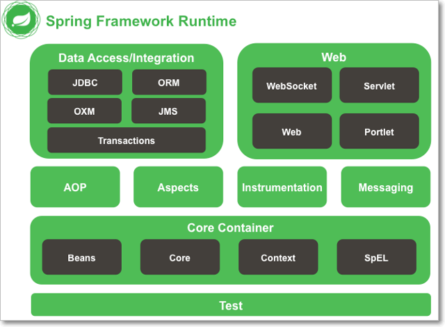
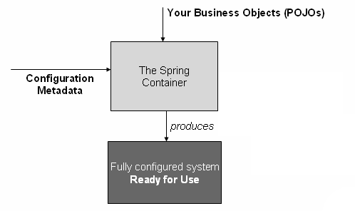

Spring - Introduction
=======================



IoC Container
-------------

###### Dependency Injection((Design Pattern))

The Dependency Injection is a design pattern that removes the dependency of the
programs. In such case **we provide the information from the external source
such as XML file**. It makes our code loosely coupled and easier for testing.
```java
class Employee {
	Address address;
	Employee(Address address) {
		this.address = address;
	}
	public void setAddress(Address address) {
		this.address = address;
	}
}
```

In above program, instance of Address class is provided by **external source
such as XML file either by constructor or setter method.**

<br>

### IOC Container (Inversion of Control)

In Spring framework, **IOC container is responsible for Dependency Injection**.
We provide meta-data to the IOC container either by XML file or annotation. 

The IoC container is responsible to instantiate, configure and assemble the
objects. **The IoC container gets information from the XML file** and works
accordingly.it will perform below tasks.

-   instantiate the application class
-   configure the object
-   assemble the dependencies between the objects

<br>

There are two types of IoC containers.
1.  **BeanFactory**
2.  **ApplicationContext** 

<br>


**1.BeanFactory**

-   The BeanFactory interface provides a basic configuration mechanism capable
    of managing any type of object.

-   It only supports Bean **instantiation/wiring**

-   XmlBeanFactory is the implementation class
    ```java
    Resource resource=new ClassPathResource("applicationContext.xml");
    BeanFactory factory=new XmlBeanFactory(resource);
    ```


**2.ApplicationContext**

-   **ApplicationContext** is a sub-interface of **BeanFactory**. It adds easier
    integration with Spring’s AOP features; message resource handling (for use
    in internationalization), event publication; and application-layer specific
    contexts such as the **WebApplicationContext** for use in web applications.

-   In short, the BeanFactory provides the configuration framework and basic
    functionality, and the **ApplicationContext adds more enterprise-specific
    functionality.**

The most commonly used ApplicationContext implementations are:

-   [FileSystemXmlApplicationContext](https://docs.spring.io/spring-framework/docs/current/javadoc-api/org/springframework/context/support/FileSystemXmlApplicationContext.html) Here
    you need to provide the full path of the XML bean configuration file to the
    constructor.

-   [ClassPathXmlApplicationContext](https://docs.spring.io/spring-framework/docs/current/javadoc-api/org/springframework/context/support/ClassPathXmlApplicationContext.html) Here
    you do not need to provide the full path of the XML file but you need to set
    CLASSPATH properly because this container will look bean configuration XML
    file in CLASSPATH.

-   [WebXmlApplicationContext](https://docs.spring.io/spring-framework/docs/current/javadoc-api/org/springframework/web/context/support/XmlWebApplicationContext.html) –
    This container loads the XML file with definitions of all beans from within
    a web application.
```java
ApplicationContext context = new ClassPathXmlApplicationContext("applicationContext.xml");
```


| **Feature**                                    | BeanFactory | ApplicationContext |
|------------------------------------------------|-------------|--------------------|
| Bean instantiation/wiring                      | Yes         | Yes                |
| Automatic BeanPostProcessorregistration        | No          | Yes                |
| Automatic BeanFactoryPostProcessorregistration | No          | Yes                |
| Convenient MessageSource access (for i18n)     | No          | Yes                |
| ApplicationEvent publication                   | No          | Yes                |


<br>

### Configuration metadata

Your application classes are combined with configuration metadata so that after
the **ApplicationContext** is created and initialized, you have a fully
configured and executable system or application.



As the diagram shows, the Spring IoC container consumes a form of *configuration
metadata*; we can confiure metadata in following ways.

-   **XML based Configuration**: Configuration metadata is traditionally
    supplied in a simple and intuitive XML format.

-   [Annotation-based
    configuration](https://docs.spring.io/spring/docs/5.0.0.RELEASE/spring-framework-reference/core.html#beans-annotation-config):
    Spring 2.5 introduced support for annotation-based configuration metadata.

-   [Java-based
    configuration](https://docs.spring.io/spring/docs/5.0.0.RELEASE/spring-framework-reference/core.html#beans-java)**:**
    from Spring 3.0 onwards, you can define beans external to your application
    classes by using Java rather than XML files. To use these new features, see
    the @Configuration, @Bean, @Import and @DependsOn annotations.


<br>

Spring – HelloWorld Example
---------------------------
```java
public class Student {
	private String name;

	public String getName() {
		return name;
	}

	public void setName(String name) {
		this.name = name;
	}

	public void getData() {
		System.out.println("Hello, " + name);
	}
}
```

//SpConfig.xml
```xml
<beans xmlns="http://www.springframework.org/schema/beans"
	xmlns:xsi="http://www.w3.org/2001/XMLSchema-instance"
	xsi:schemaLocation="http://www.springframework.org/schema/beans
	http://www.springframework.org/schema/beans/spring-beans-3.0.xsd">

	<bean id="hello" class="core.Student">
		<property name="name" value="Satya" />
	</bean>

</beans>
```

```java
package core;

public class App {
	public static void main(String[] args) {

		// Instantiating a container
		ApplicationContext context = new ClassPathXmlApplicationContext("SpConfig.xml");

		Student student = (Student) context.getBean("hello");

		student.getData();
	}
}
Hello, Satya
```
