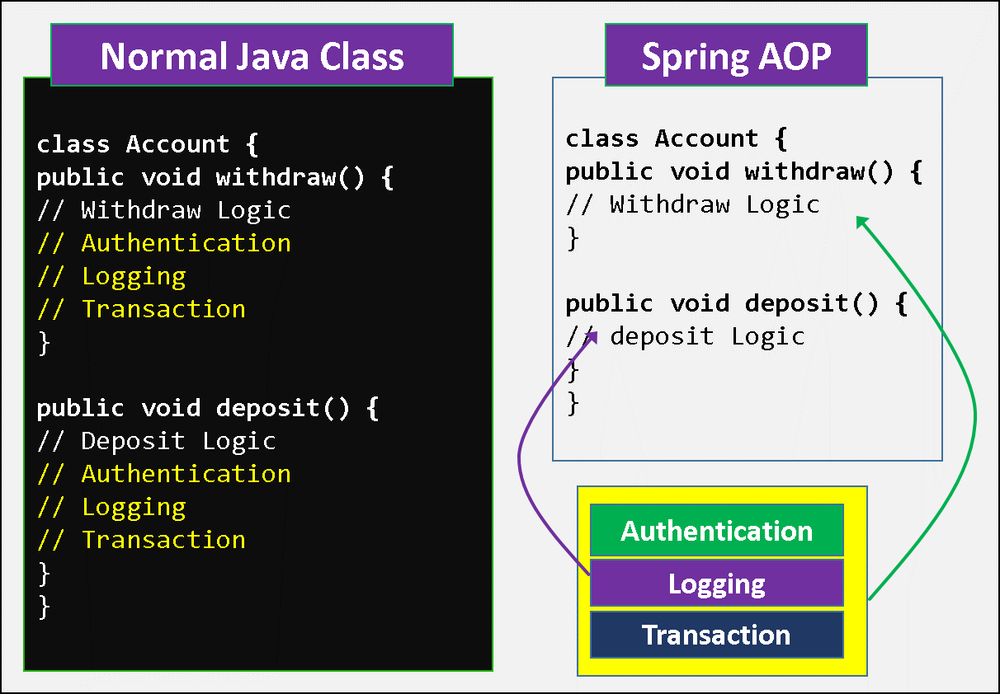
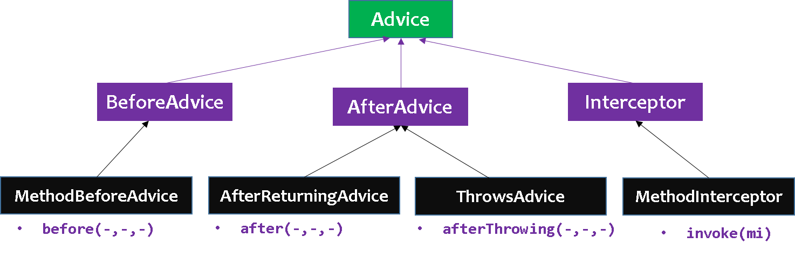

Spring AOP
============

Spring AOP (**Aspect-oriented programming**) framework is used for adding
different cross-cutting functionalities. cross-cutting functionalities means
adding different types of services to the application at runtime automatically.

In below Account class, we have **withdraw() & deposit()** methods each have
Authentication, Logging, Trasaction cross-cutting functionalities. These are
repeating in same class & also if we have 50 methods, we have to write these
functionalities in 50 methods so, code is repeating.



In order to overcome the above problems, we need to separate the business logic
and the services, is known as AOP, Using AOP the business logic and
cross-cutting functionalities are implemented separately and executed at run
time as combine.

**AOP is a Specification**, Spring framework is implemented it. AOP
implementations are provided by

-   Spring AOP, AspectJ, JBoss AOP

AOP Terminology
---------------

We use these 9 terminilogies very common on Spring AOP

1.  **Aspect**

2.  **Advice**

3.  **JoinPoint**

4.  **Pointcut**

5.  **Introduction**

6.  **Target**

7.  **Proxy**

8.  **Weaving**

9.  **Adviser**

### 1. Aspect

-   An aspect represents the cross-cutting functionality name, **just name
    only.**

-   Aspect denotes **only the cross-cutting functionality name not its
    implementation**

-   In above, we have 3 Aspects: **Authentication Aspect, Logging Aspect,
    Transaction Aspect.**

### 2. Advice

-   Advice is **the implementation of Aspect**.

-   An Advice provides the code for implementation of the service.

-   The Implementation of above aspects called as **Authentication Advice,
    Logging Advice, Transaction Advice.**



In Spring AOP we have 4 **Types of Advices**

###### 1.Before Advice

-   services will be applied **before business logic**

-   **MethodBeforeAdvice **interface extends the** BeforeAdvice **interface**.**

-   If we implement MethodBeforeAdvice interface, we need to override
    **before()** method.

-   before() method are executed at before business logic
    ```java
    public class  beforeAdvice implements MethodBeforeAdvice
    {
        public void before(Method m,Object args[], Object target)throws Exception
        {
                    //My Before Logic...
        }
    }
    ```


###### 2.After Advice

-   services will be applied **After business logic**

-   **AfterReturningAdvice **interface extends
    the** AfterAdvice **interface**.**

-   we need to override **afterReturning()** method
    ```java
    public class  afterAdvice implements AfterReturningAdvice
    {
    public void afterReturning(Object retnVal,Object args[], Object target)throws Exception
        {
                    //My Before Logic...
        }
    }
    ```


###### 3.Around Advice

-   It is the **combination of both Before and After Advice.**

-   **MethodInterceptor** interface extends the **Interceptor** interface**.**

-   In Around Advice, we implement Before and After Advice in a single method
    called **invoke(),** in order to separate Before an After services to
    execute business logic, in the middle we call **proceed()** method
```java
public class Client implements MethodInterceptor
{
    public Object invoke(MethodInvocation mi)throws Throwable
    {
        //Before Logic     
        Object ob = mi.proceed();
        //After logic
        return ob;
 
    }
}
```


###### 4.Throws Advice

-   services will be applied **when business logic methods throws an
    exception.**

-   **ThrowsAdvice** interface also extends the **AfterAdvice** interface.

-   we should implement **afterThrowing() **method
```java
public class Client implements ThrowsAdvice
{
   public void afterThrowing(Method m,Object args[],Object target,Exception e)
   {
       // our services
   }
}
```


### 3. JoinPoint

While creating the business logic of the method the **additional services are
needed to be injected** at different places or points, we call such points
as **joinpoints**.  At a joinpoint a new service will be added into the normal
flow of a business method.

While executing the business method, the services are required at the
following **3** places, we call them as JoinPoints.

-   Before business logic of the method starts

-   After business logic of the method got completed

-   If business logic throws an exception at run time

### 4. Pointcut

A pointcut defines what advices are required at what join points. In above
diagram **Authentication Advice, Logging Advice, Transaction Advice** are
required after withdraw logic & after balance logic. So this point is known as
PointCut.

### 5. Introduction

It means introduction of additional method and fields for a type. It allows you
to introduce new interface to any advised object.

### 6. Target Object

It is the object i.e. being advised by one or more aspects. It is also known as
proxied object in spring because Spring AOP is implemented using runtime
proxies.

### 7. Aspect

It is a class that contains advices, joinpoints etc.

### 8. Interceptor

It is an aspect that contains only one advice.

### 9. AOP Proxy

It is used to implement aspect contracts, created by AOP framework. It will be a
JDK dynamic proxy or CGLIB proxy in spring framework.

### 10. Weaving

It is the process of linking aspect with other application types or objects to
create an advised object. Weaving can be done at compile time, load time or
runtime. Spring AOP performs weaving at runtime.

Spring AOP can be used by 3 ways given below. But the widely used approach is
Spring AspectJ Annotation Style. The 3 ways to use spring AOP are given below:

-   **By Spring1.2 Old style (dtd based)**

-  **By AspectJ : annotation-style**

-  **By AspectJ : XML configuration-style**
