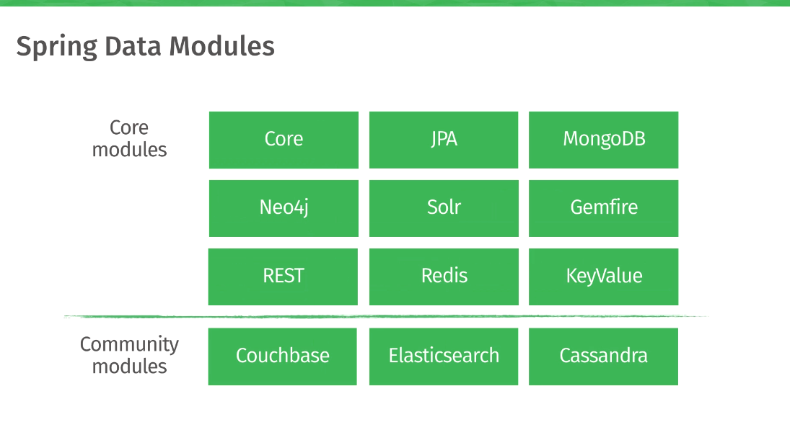

Spring Data 
==============

When Spring Framework was created, in early 2000s, the only kind of database was
relational database - Oracle, MS SQL Server, My SQL etc. In the last few years,
there are a wide variety of databases that are getting popular - most of them
not relational and not using SQL. Wide variety of terminology is used to refer
to these databases. NoSQL, for example.

ORM frameworks (Hibernate) and specifications(JPA) were good fit for the
relational databases. But, the newer databases, have different needs

### Main modules

-   [Spring Data JDBC](https://spring.io/projects/spring-data-jdbc) - Spring
    Data repository support for JDBC.

-   [Spring Data JPA](https://spring.io/projects/spring-data-jpa) - Spring Data
    repository support for JPA.

-   [Spring Data MongoDB](https://spring.io/projects/spring-data-mongodb) -
    Spring based, object-document support and repositories for MongoDB

-   [Spring Data LDAP](https://spring.io/projects/spring-data-ldap) - Spring
    Data repository support for [Spring
    LDAP](https://github.com/spring-projects/spring-ldap).

-   [Spring Data REST](https://spring.io/projects/spring-data-rest) - Exports
    Spring Data repositories as hypermedia-driven RESTful resources.
