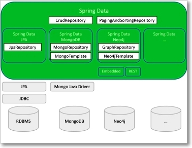

Spring Transaction
====================

A database transaction is a sequence of actions that are treated as a single
unit of work. These actions should either complete entirely or take no effect at
all.

The concept of transactions can be described with the following four key
properties described as **ACID** −

-   **Atomicity** − A transaction should be treated as a single unit of
    operation, which means either the entire sequence of operations is
    successful or unsuccessful.

-   **Consistency** − This represents the consistency of the referential
    integrity of the database, unique primary keys in tables, etc.

-   **Isolation** − There may be many transaction processing with the same data
    set at the same time. Each transaction should be isolated from others to
    prevent data corruption.

-   **Durability** − Once a transaction has completed, the results of this
    transaction have to be made permanent and cannot be erased from the database
    due to system failure.

###### Types of Transaction Management

In J2EE, Transaction Management can be divided in two types.

-   **Global Transaction**

-  **Local Transaction**

<br>

**Global Transaction**

-   Use to work with multiple transaction resources like RDBMS or Message Queue
    (Pros)

-   Managed by Application Server (WebSphere, Weblogic) using JTA (Cons)

-   JNDI is required to use JTA

-   Code can not be reused as JTA is available at server level(Cons)

-   Example of Global Transaction: EJB CMT

**Local Transaction**

-   Use to work with specific resource (transaction associated with JDBC)

-   Can not work across multiple transaction resource opposite to Global
    transaction (cons)

-   Most of web application uses only single resources hence it is best option
    to use in normal app

<br>

### Approach for transaction management

Spring supports two different approach for transaction management.

**1.Programmatic Transaction Management**  
Here you will **write code for transaction management**. Spring API dependency.
Not good for maintenance. Good for development. Flexibity.

**2.Declarative Transaction Management**  
Here you will **use XML or annotation for transaction management**. Less
flexible but preferable over programmatic approach. In normal case no code is
required for transaction management.

<br>

### 1.Programmatic Approch : using Java Classes

The key to the Spring transaction abstraction is defined by
the *org.springframework.transaction.PlatformTransactionManager* interface,
which is as follows –

<u>PlatformTransactionManager</u>
```java
public interface PlatformTransactionManager {
   TransactionStatus getTransaction(TransactionDefinition definition);
   throws TransactionException;
   
   void commit(TransactionStatus status) throws TransactionException;
   void rollback(TransactionStatus status) throws TransactionException;
}
```


<u>TransactionDefinition</u>
```java
public interface TransactionDefinition {
   int getPropagationBehavior();
   int getIsolationLevel();
   String getName();
   int getTimeout();
   boolean isReadOnly();
}
```


<u>TransactionStatus</u>  
The TransactionStatus interface provides a simple way for transactional code to control transaction execution and query transaction status.
```java
public interface TransactionStatus extends SavepointManager {
   boolean isNewTransaction();
   boolean hasSavepoint();
   void setRollbackOnly();
   boolean isRollbackOnly();
   boolean isCompleted();
}
```

We have to use above classes to do Programatic Transaction management
```java
DefaultTransactionDefinition def = new DefaultTransactionDefinition();
// explicitly setting the transaction name is something that can only be done programmatically
def.setName("SomeTxName");
def.setPropagationBehavior(TransactionDefinition.PROPAGATION_REQUIRED);

TransactionStatus status = txManager.getTransaction(def);
try {
  // execute your business logic here
}
catch (MyException ex) {
  txManager.rollback(status);
  throw ex;
}
txManager.commit(status);
```


### 2.Declarative Approch : Using Annotations & XML

To start using **@Transactional** annotation in a Spring based application, we
need to first enable annotations in our Spring application by adding the needed
configuration into spring context file –

| 1 | <tx:annotation-driven transaction-manager="txManager"> |
|---|-----------------------------------------------------------|


Next is to define the transaction manager bean, with the same name as specified
in the above **transaction-manager**attribute value.

We have following types of transaction managers based upon the framework we use

For Simple JDBC
```java
<bean id="txManager" 
 class="org.springframework.jdbc.datasource.DataSourceTransactionManager">
	<property name="dataSource" ref= "datasource" />
</bean>
```

For Hibernate
```java
<bean id="txManager" 
 class="org.springframework.orm.hibernate3.HibernateTransactionManager">
	<property name="sessionFactory" ref= "sessionFactory" />
</bean>
```


For JPA
```xml
<bean id="txManager" 
 class="org.springframework.orm.jpa.JpaTransactionManager">
	<property name="entityManagerFactory" ref="entityManagerFactory" />
</bean>
```

We are now ready to use @Transactional annotation either at the class or method level
```java
@Transactional(value = "myTransactionManager", propagation = Propagation.REQUIRED, readOnly = true)
public void myMethod() {
	...
}
```

```java
public class Customer {

	private int id;
	private String name;
	private Address address;
}

public class Address {

	private int id;
	private String city;
	private String country;
}
```

```java
package prog;

import javax.sql.DataSource;
import org.springframework.jdbc.core.JdbcTemplate;
import org.springframework.transaction.annotation.Transactional;

public class CustomerDAO {

	private DataSource dataSource;

	public void setDataSource(DataSource dataSource) {
 this.dataSource = dataSource;
	}

	@Transactional
	public void create(Customer customer) {
 String queryCustomer = "insert into Customer (id, name) values (?,?)";
 String queryAddress = "insert into Address (id, city,country) values (?,?,?)";

 JdbcTemplate jdbcTemplate = new JdbcTemplate(dataSource);

 jdbcTemplate.update(queryCustomer, new Object[] { customer.getId(), customer.getName() });
 System.out.println("Inserted into Customer Table Successfully");

 jdbcTemplate.update(queryAddress,
  new Object[] { customer.getId(), customer.getAddress().getCity(), customer.getAddress().getCountry() });
 System.out.println("Inserted into Address Table Successfully");
	}

}
```

```java
package prog;

import org.springframework.context.support.ClassPathXmlApplicationContext;

public class App {

	public static void main(String[] args) {
 ClassPathXmlApplicationContext context = new ClassPathXmlApplicationContext("spring.xml");

 CustomerDAO dao = context.getBean("customerDAO", CustomerDAO.class);

 Address address = new Address();
 address.setId(2);
 address.setCountry("India");
 address.setCity("HYD");

 Customer customer = new Customer();
 customer.setId(2);
 customer.setName("Pankaj");
 customer.setAddress(address);

 dao.create(customer);
 context.close();
	}
}
-------------output--------------
INFO: Loaded JDBC driver: com.mysql.jdbc.Driver
Inserted into Customer Table Successfully
Inserted into Address Table Successfully
```

```xml
<?xml version="1.0" encoding="UTF-8"?>
<beans>

	<!-- Enable Annotation based Declarative Transaction Management -->
	<tx:annotation-driven proxy-target-class="true"
 transaction-manager="transactionManager" />

	<!-- Creating TransactionManager Bean, since JDBC we are creating of type 
 DataSourceTransactionManager -->
	<bean id="transactionManager"
 class="org.springframework.jdbc.datasource.DataSourceTransactionManager">
 <property name="dataSource" ref="dataSource" />
	</bean>
	
	<!-- MySQL DB DataSource -->
	<bean id="dataSource"
 class="org.springframework.jdbc.datasource.DriverManagerDataSource">

 <property name="driverClassName" value="com.mysql.jdbc.Driver" />
 <property name="url" value="jdbc:mysql://localhost:3306/smlcodes" />
 <property name="username" value="root" />
 <property name="password" value="root" />
	</bean>

	<bean id="customerDAO" class="prog.CustomerDAO">
 <property name="dataSource" ref="dataSource"></property>
	</bean>

<!-- 	<bean id="customerManager" class="prog.CustomerService">
 <property name="customerDAO" ref="customerDAO"></property>
	</bean> -->

</beans>
```


