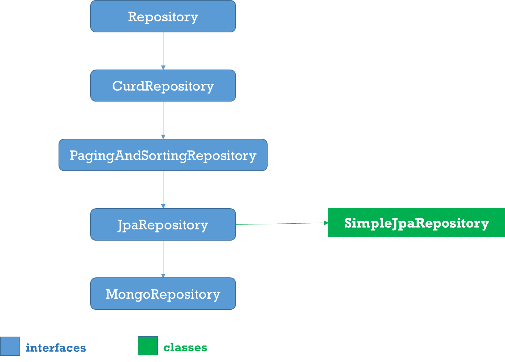

Spring 4 Enhancement – Spring Data Commons 
=============================================

Spring Data Commons provides all the common abstractions that enable you to
connect with different data stores.

Spring Data Coomons provides classes & methods, which are common for all the
SQL, NoSQL, BigData databases

The Spring Data Commons project provides general infrastructure and interfaces
for the other, more specific data projects. Regardless of the type of datastore,
Spring Data supports the following aspects with a single API:

-   Execute CRUD (create, read, update, delete) operations

-   Sorting

-   Page-wise reading (pagination)



###### 1.Repositoy
Root interface for all Repositoty classes. It is a **marker interface(no
methods)**

###### 2.CurdRepositoy
 It provides generic **CRUD** operations irrespective of the underlying
database. It extends **Repository** interface.
```java
public interface CrudRepository<T, ID> extends Repository<T, ID> {
	save(S entity);
	saveAll(Iterable<S> entities);

	Optional<T> findById(ID id);
	Iterable<T> findAll();
	Iterable<T> findAllById(Iterable<ID> ids);
	
	void deleteById(ID id);
	void delete(T entity);
	void deleteAll(Iterable<? extends T> entities);
	void deleteAll();
	
	boolean existsById(ID id);
	long count(); 
}
```

###### 3.PagingAndSortingRepository
PagingAndSortingRepository provides options to

-   **Sort** your data using **Sort interface**

-   **Paginate** your data using **Pageable interface**, which provides methods
    for pagination - getPageNumber(), getPageSize(), next(), previousOrFirst()
    etc
    ```java
    public abstract interface PagingAndSortingRepository extends CrudRepository {
    
    public Iterable findAll(Sort sort);
    public Page findAll(Pageable pageable);
    
    }
    ```


###### 4.JpaRepository

JPA specific extension
of [Repository](https://docs.spring.io/spring-data/commons/docs/current/api/org/springframework/data/repository/Repository.html?is-external=true)
```java
public interface JpaRepository<T, ID extends Serializable> extends
PagingAndSortingRepository<T, ID> {
  List<T> findAll();
  List<T> findAll(Sort sort);
  List<T> save(Iterable<? extends T> entities);
  void flush();
  T saveAndFlush(T entity);
  void deleteInBatch(Iterable<T> entities);
}
```

###### 5.MongoRepository

Mongo
specific [Repository](https://docs.spring.io/spring-data/commons/docs/current/api/org/springframework/data/repository/Repository.html?is-external=true) interface.

```java
public interface MongoRepository<T, ID> extends PagingAndSortingRepository {
List<T>	findAll()
List<T>	findAll(Sort sort)

List<S>	saveAll(Iterable<S> entities)
List<S>	insert(Iterable<S> entities)
S	insert(S entity)

}
```

###### 6.Custom Repository

-   You can create a custom repository extending any of the repository classes -
    Repository, PagingAndSortingRepository or CrudRepository. For example,
    ```java
    interface PersonRepository extends CrudRepository<User, Long> { 
    	
    }
    ```


-   Spring Data also provides the feature of query creation from interface
    method names.
```java
interface PersonRepository extends Repository<User, Long> {

  List<Person> findByEmailAddressAndLastname(EmailAddress emailAddress, String lastname);

  // Enables the distinct flag for the query
  List<Person> findDistinctPeopleByLastnameOrFirstname(String lastname, String firstname);
  List<Person> findPeopleDistinctByLastnameOrFirstname(String lastname, String firstname);

  // Enabling ignoring case for an individual property
  List<Person> findByLastnameIgnoreCase(String lastname);
  // Enabling ignoring case for all suitable properties
  List<Person> findByLastnameAndFirstnameAllIgnoreCase(String lastname, String firstname);

  // Enabling static ORDER BY for a query
  List<Person> findByLastnameOrderByFirstnameAsc(String lastname);
  List<Person> findByLastnameOrderByFirstnameDesc(String lastname);
}
```

###### 7.Defining Query Methods

The repository proxy has two ways to derive a store-specific query from the
method name:

-   By deriving the query from the method name directly.
    ```java
    List<Person> findByEmailAddressAndLastname(EmailAddress emailAddress, String lastname);
    ```


-   By using a manually defined query.
    ```java
    @Query("select u from User u")
    
    List<User> findAllByCustomQueryAndStream();
    ```


-   Limiting the result size of a query with Top and First
    ```java
    User findFirstByOrderByLastnameAsc();
    
    User findTopByOrderByAgeDesc();
    
    Page<User> queryFirst10ByLastname(String lastname, Pageable pageable);
    
    Slice<User> findTop3ByLastname(String lastname, Pageable pageable);
    
    List<User> findFirst10ByLastname(String lastname, Sort sort);
    
    List<User> findTop10ByLastname(String lastname, Pageable pageable);
    ```
