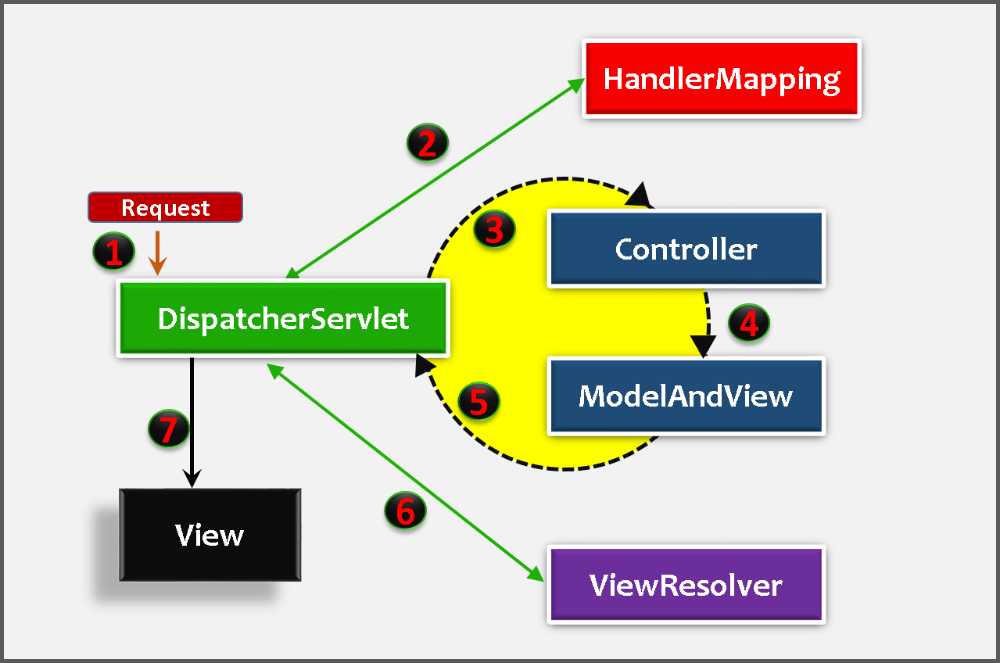
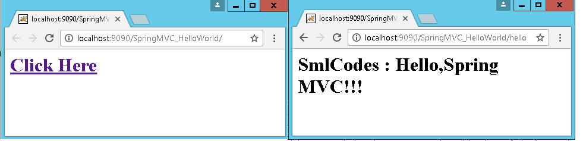

Spring MVC - Introduction
===========================

The Spring Web MVC framework provides Model-View-Controller (MVC) architecture
and ready components that can be used to develop flexible and loosely coupled
web applications. The MVC pattern results in separating the different aspects of
the application (input logic, business logic, and UI logic), while providing a
loose coupling between these elements.

-   The **Model** encapsulates the application data and in general they will
    consist of POJO.

-   The **View** is responsible for rendering the model data and in general it
    generates HTML output that the client's browser can interpret.

-   The **Controller** is responsible for processing user requests and building
    an appropriate model and passes it to the view for rendering.

<br>

### Spring MVC Flow Diagram



**1.** First request will be received by **DispatcherServlet**

**2. DispatcherServlet** asks **HandlerMapping for Controller class** name for
the current request. HandlerMapping will returns controller class name to
DispatcherServlet.

**3,4,5. DispatcherServlet** will transfer request to **Controller**, Controller
will process the request by executing appropriate methods and
returns **ModeAndView** object. ModeAndView object (contains *Model *data
and *View *name) back to the **DispatcherServlet**

**6.** Now DispatcherServlet send the model object to the **ViewResolver** to
get the actual view page.

**7.** Finally, DispatcherServlet will pass the *Model* object to
the *View* page to display the result.

Note: All these below Examples are comes under Spring 3.0

<br>

#### Spring MVC –HelloWorld Example

We are going to create following files in this example

1.  Create the request, view pages **(index.jsp, hello.jsp)**

2.  Create the controller class **(HelloWorldController.java)**

3.  Configure entry of controller, Front controller in **web.xml** file

4.  Configure ViewResolver, View components in **serveltname-servlet.xml.**

5.  Test the Applciation by running on server
```dos
SpringMVCBasic
    |	
    +---src
    |   \---controller
    |           HelloWorldController.java
     \---WebContent
        |   index.jsp
        \---WEB-INF
            |   hello-servlet.xml
            |   web.xml
            |
            +---jsp
            |       helloView.jsp
            |
            \---lib
```

1.Create the request, view pages (index.jsp, hello.jsp)
```jsp
//index.jsp
<h1>
<a href="helloController">Click Here</a>
</h1> 

./jsp/hello.jsp
<h1> SmlCodes :  ${message} </h1>
```

2.Create the controller class –HelloWorldController.java 
```java
package controller;

@Controller
public class HelloWorldController {
	@RequestMapping("/helloController")
	public ModelAndView helloWorld() {
 String message = "Hello,Spring MVC!!!";
 return new ModelAndView("helloView", "message", message);
        //it will search for helloView.jsp in JSP Folder
	}
}
```

-   To create the controller class, we have to use **@Controller** and
    **@RequestMapping** annotations.

    -   **@Controller** annotation marks this class as **Controller**.

    -   **@Requestmapping** annotation is used to map the class with the
        specified name.

-   **@Controller** facilitates **auto-detection** of Controllers which
    eliminates the need for configuring the Controllers in DispatcherServlte's
    Configuration file.

-   For enabling **auto-detection** of annotated controller’s **component-scan**
    has to be added in configuration file (hello-servlet.xml) **with the package
    name** where all the controllers are placed.
    ```xml
    <context:component-scan base-package="controller"></context:component-scan>
    ```


-   Controller class returns the instance of **ModelAndView** controller with
    the mapped name, message name and message value. The message value will be
    displayed in the jsp page.


<u>3.Configure DispatcherServlet, Controller Entry in web.xml</u>

-   In Spring Web MVC, **DispatcherServlet** class works as the front
    controller. It is responsible to manage the flow of the spring mvc
    application.

-   DispatcherServlet is a normal servlet class which
    implements **HttpServlet** base class.

-   we have to configure DispatcherServlet in **web.xml.**

-   Configure <url-pattern>, any url with given pattern will call Spring MVC
    Front controller.  
  
```xml
<!-- file : web.xml -->
<?xml version="1.0" encoding="UTF-8"?>
<web-app>
  <servlet>
    <servlet-name>hello</servlet-name>
    <servlet-class>org.springframework.web.servlet.DispatcherServlet</servlet-class>
  </servlet>
  <servlet-mapping>
    <servlet-name>hello</servlet-name>
    <url-pattern>/</url-pattern> //<url-pattern>*.html</url-pattern>
  </servlet-mapping>
</web-app>
```

<u>4.Configure ViewResolver, View components in hello-servlet.xml</u>  
Once the **DispatcherServlet** is initialized, it will looks for a file
names **[servlet-name]-servlet.xml** in **WEB-INF** folder. In above example,
the framework will look for **hello-servlet.xml**.  

```xml
// hello-servlet.xml
<?xml version="1.0" encoding="UTF-8"?>
<beans>
   <context:component-scan base-package="controller"></context:component-scan>
   
   <bean class="org.springframework.web.servlet.view.InternalResourceViewResolver">
	<property name="prefix" value="/WEB-INF/jsp/"></property>
	<property name="suffix" value=".jsp"></property>
   </bean>

</beans>
```


<u>5.Test the Applciation by running on server</u>




### Flow of execution

-   Run the application, **index.jsp** file will executed, it has a link `<a href="helloController">`

-   Once you click on that link, container will check the URL pattern at web.xml
    and passes the request to the DispatcherServlet

-   DispatcherServlet takes this ‘*helloController’* & asks
    **HandlerMapping **for** Controller class**

-   HaandlerMapping scans the all the controllers classes in the packges &
    searches for the Class which is conating *helloController* as
    @RequestMapping("/*helloController*"). Then it will return
    HelloWorldController class to DispacherServelt.

-   DispatcherServlet Excecutes methods which is having
    @RequestMapping("/*helloController*") in our controller class, that methods
    gives **ModelAndView** object as return type.  
	
    ```java
    return new ModelAndView("helloView", "message", message);
    ```


-   first argument is ‘View’ page name(helloView), second, third are <Key,
    Value> pair of Model Object for passing data to View Page.

-   DispatcherServlet forwards request to `ViewResolver(hello-servlet.xml)` &
    search for View pages (helloView.jsp) location, ViewResolver returns
    ViewPage to DispatcherServlet

-   DispatcherServlet will displays View page with data to the client.
