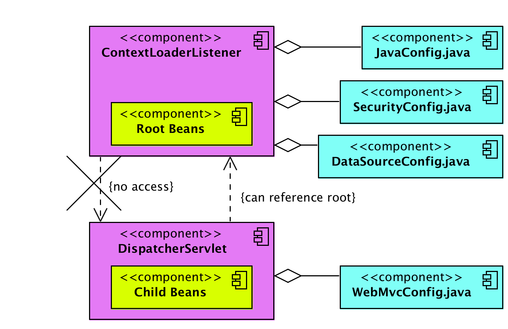

Spring MVC - ContextLoaderListener vs DispatcherServlet
=========================================================
In XML based Spring MVC configuration, you must have seen two declarations
in web.xml file i.e. ContextLoaderListener and DispatcherServlet. Let’s try to
understand their purpose in framework and their differences.

```xml
<servlet>
    <servlet-name>employee-services</servlet-name>
    <servlet-class>org.springframework.web.servlet.DispatcherServlet</servlet-class>
    <init-param>
        <param-name>contextConfigLocation</param-name>
        <param-value>classpath:employee-services-servlet.xml</param-value>
    </init-param>
    <load-on-startup>1</load-on-startup>
</servlet>
```
In above XML based Spring MVC configuration, you have two declarations in web.xml file i.e. ContextLoaderListener and DispatcherServlet. Let’s try to understand their purpose in framework and their differences.


### Root and child contexts

Before reading further, please understand that –

-   Spring can have multiple contexts at a time. One of them will be root
    context, and all other contexts will be child contexts.

-   All child contexts can access the beans defined in root context; but
    opposite is not true. Root context cannot access child contexts beans.


### DispatcherServlet – Child application contexts

[DispatcherServlet](https://docs.spring.io/spring-framework/docs/current/javadoc-api/org/springframework/web/servlet/DispatcherServlet.html) is
essentially a Servlet (it extends HttpServlet) whose primary purpose is to
handle incoming web requests matching the configured URL pattern. It take an
incoming URI and find the right combination of controller and view. So it is the
front controller.

When you define a DispatcherServlet in spring configuration, you provide an XML
file with entries of controller classes, views mappings etc.
using contextConfigLocation attribute.

```xml
web.xml
--------------------
<servlet>
    <servlet-name>employee-services</servlet-name>
    <servlet-class>org.springframework.web.servlet.DispatcherServlet</servlet-class>
    <init-param>
        <param-name>contextConfigLocation</param-name>
        <param-value>classpath:employee-services-servlet.xml</param-value>
    </init-param>
    <load-on-startup>1</load-on-startup>
</servlet>
```

If you do not provide configuration file, then it will load its own
configuration file using [servlet_name]-servlet.xml. Web applications can define
any number of DispatcherServlet entries. Each servlet will operate in its own
namespace, loading its own application context with mappings, handlers, etc.

It means that each DispatcherServlet has access to web application
context. Until specified, each **DispatcherServlet** creates own internal web
application context.

```dos
Starting Spring 3.x, method DispatcherServlet(WebApplicationContext
webApplicationContext) create a new DispatcherServlet with the given web
application context. It is possible only in Servlet 3.x environment through
the ServletContext.addServlet(java.lang.String, java.lang.String) API support.
```


### ContextLoaderListener – Root application context

[ContextLoaderListener](https://docs.spring.io/spring-framework/docs/current/javadoc-api/org/springframework/web/context/ContextLoaderListener.html) creates
the root application context and will be shared with child contexts created by
all **DispatcherServlet** contexts. You can have only one entry of this
in web.xml.
```xml
web.xml
<listener>
  <listener-class>
    org.springframework.web.context.ContextLoaderListener
  </listener-class>
</listener>
  
<context-param>
  <param-name>contextConfigLocation</param-name>
  <param-value>/WEB-INF/spring/applicationContext.xml</param-value>
</context-param>
```

The context of ContextLoaderListener contains beans that globally visible, like
services, repositories, infrastructure beans, etc. After the root application
context is created, it’s stored in ServletContext as an attribute, the name is:
```java
org/springframework/web/context/ContextLoader.java
servletContext.setAttribute(WebApplicationContext.ROOT_WEB_APPLICATION_CONTEXT_ATTRIBUTE,this.context);
 
//Where attibute is defined in /org/springframework/web/context/WebApplicationContext.java as
 
WebApplicationContext.ROOT_WEB_APPLICATION_CONTEXT_ATTRIBUTE = WebApplicationContext.class.getName() + ".ROOT";
```


To get root application context in Spring controller, you can
use WebApplicationContextUtils class.
```java
Controller.java
@Autowired
ServletContext context;
 
ApplicationContext ac = WebApplicationContextUtils.getWebApplicationContext(context);
 
if(ac == null){
    return "root application context is null";
}
```

Below image describe the whole relation in single view.



<br>


### **ContextLoaderListener vs DispatcherServlet**

1.  ContextLoaderListener creates root application context.

2.  DispatcherServlet entries create one child application context per servlet
    entry.

3.  Child contexts can access beans defined in root context.

4.  Beans in root context cannot access beans in child contexts (directly).

5.  All contexts are added to ServletContext.

6.  You can access root context using WebApplicationContextUtils class.

Generally, you will define all MVC related beans (controller and views etc)
in DispatcherServletcontext, and all cross-cutting beans such as security,
transaction, services etc. at root context by ContextLoaderListener.

Generally, this setup works fine because rarely you will need to access any MVC
bean (from child context) into security related class (from root context).
Mostly we use security beans on MVC classes, and they can access it with above
setup.
