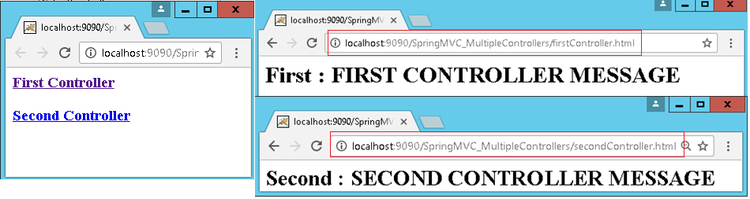

Spring MVC –Multiple Controllers
==================================

We can have many controllers in real-time appplications.in this example we will see how to use multiple controllers in our application. In this example we are taking two controllers

    -   FirstController
    -   SecondController


**1.View Pages**
```html
//index.jsp
<a href="firstController.html">First Controller</a>
<a href="secondController.html">Second Controller</a>

//firstView.jsp
<h1> First :  ${m1} </h1>

//secondView.jsp
<h1> Second :  ${m2} </h1>
```


**2.Controller Classes**
```java
//FirstController.java
package controller;
@Controller
public class FirstController {
	@RequestMapping("/firstController")
	public ModelAndView firstMethod(){		
		return new ModelAndView("firstView","m1", "FIRST CONTROLLER MESSAGE");
	}	
}
//SecondController.java
package controller;
@Controller
public class SecondController {
	@RequestMapping("/secondController")
	public ModelAndView firstMethod(){		
		return new ModelAndView("secondView","m2", "SECOND CONTROLLER MESSAGE");
	}	
}
```


FrontController configuration **web.xml**, view pages in **hello-servlet.xml**
are same as above example


