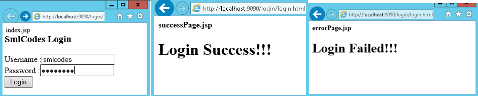

Spring MVC –Request and Response Example
==========================================

For doing Request & Response type of jobs in Spring MVC, we need to pass
**HttpServletRequest** and **HttpServletResponse** objects in the request
processing **method of the Controller** class

1.View Pages
```html
//index.jsp
<h3>SmlCodes Login</h3>
<form action="login.html" method="post">
	Username :<input type="text" name="username" /><br /> 
	Password :<input type="password" name="password" /><br /> 
	<input type="submit" value="Login" />	
</form>

//successPage.jsp
<h1> ${msg}  </h1>

//errorPage.jsp
<h1> ${msg}  </h1>
```


2.Controller Class: LoginController.java 
```java
package controller;
@Controller
public class LoginController {

	@RequestMapping("/login")
	public ModelAndView login(HttpServletRequest req, HttpServletResponse res) {
		String username = req.getParameter("username");
		String password = req.getParameter("password");

		if (username.equals(password)) {
			return new ModelAndView("successPage", "msg", "Login Success!!!");
		}
		else {
			return new ModelAndView("errorPage", "msg", "Login Failed!!!");
		}
	}
}
```

FrontController configuration **web.xml**, view pages in **hello-servlet.xml**
are same as above example


