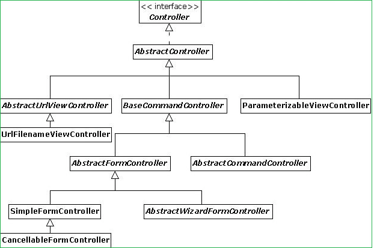

Spring MVC - Controller classes
=================================

In this Spring MVC, **DispatcherServlet** works as the Frontcontroller and it
delegates the request to the Controller. Developers extends the abstract
controller provided by the framework and writes the business logic there. The
actual business related processing is done in the Controller.

 Spring MVC provides many abstract controllers, which is designed for specific
tasks. Here is the list of abstract controllers that comes with the Spring MVC
module:



### MultiActionController
```java
@Deprecated
public class MultiActionController extends AbstractController implements LastModified
```


**MultiActionController** is used to group related actions into a single
controller, the method handler has to follow below signature
```java
public (ModelAndView | Map | String | void) actionName(
		HttpServletRequest, HttpServletResponse [,HttpSession] [,CommandObject]);
```

<br>


#### Example: 
StudentController.java
```java
package controller;

public class StudentController extends MultiActionController {
	public ModelAndView add(HttpServletRequest request, HttpServletResponse response) throws Exception {
		return new ModelAndView("StudentPage", "msg", "addStudent() method");
	}

	public ModelAndView update(HttpServletRequest request, HttpServletResponse response) throws Exception {
		return new ModelAndView("StudentPage", "msg", "updateStudent() method");
	}

	public ModelAndView delete(HttpServletRequest request, HttpServletResponse response) throws Exception {
		return new ModelAndView("StudentPage", "msg", "deleteStudent() method");
	}

	public ModelAndView list(HttpServletRequest request, HttpServletResponse response) throws Exception {
		return new ModelAndView("StudentPage", "msg", "listStudent() method");
	}
}
```


**hello-servlet.xml**
```xml
<beans>

<bean class="org.springframework.web.servlet.mvc.support.ControllerClassNameHandlerMapping"/>

	<bean class="controller.StudentController">
		<property name="methodNameResolver">
			<bean				class="org.springframework.web.servlet.mvc.multiaction.InternalPathMethodNameResolver">
				<property name="prefix" value="check" />
				<property name="suffix" value="Student" />
			</bean>
		</property>
	</bean>

	<bean id="viewResolver"
		class="org.springframework.web.servlet.view.InternalResourceViewResolver">
		<property name="prefix">
			<value>/WEB-INF/jsp/</value>
		</property>
		<property name="suffix">
			<value>.jsp</value>
		</property>
	</bean>

</beans>
```

Now, the reuqested URL will map to the method name in the following patterns

-   **Student**Controller –> **/student\***

-   /student/**add**.htm –> **add()**

-   /student/**delete**.htm –> **delete()**

-   /student/**update**.htm –> **update()**

-   /student/**list**.htm –> **list()**
