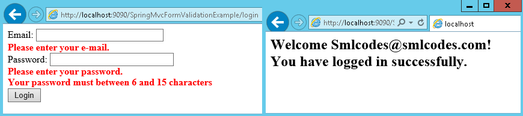

Spring MVC - Form Handling
============================

Spring framework provides the form specific tags for designing a form. You can
also use the simple html form tag also for designing the form. To use the form
tag in your JSP page you need to import the Tag Library into your page as.
```xml
<%@taglib prefix="form" uri="http://www.springframework.org/tags/form"%>
```


The main difference between HTML tags & Spring form tags is just append
**<form: {element}>.**

**Examples**:**<form:form>, <form:input>, <form:password>
<form:radiobutton> etc.,**

In this example we will see the Spring forms and data binding to a controller.
Also, we will have a look at *@ModelAttribute* annotation

<br>


### @ModelAttribute  

By using* @ModelAttribute* You can map your form fields to a Model class
object.
```java
@RequestMapping(value = "/addEmployee", method = RequestMethod.POST)
    public String submit( @ModelAttribute("employee") Employee employee ) {
          ----
   ----
        }
```


In above example form data is mapped to **employee** object

#### SpringMvc –FormHandling Example

View Pages -LoginForm.jsp, LoginSuccess.jsp
```xml
// LoginForm.jsp
<%@ taglib prefix="form" uri="http://www.springframework.org/tags/form"%>
<style>
.error {
	color: red;
	font-weight: bold;
}
</style>
<form:form action="login" commandName="userForm">
	Email: <form:input path="email" size="30" /><br>
	<form:errors path="email" cssClass="error" /><br>	
	Password: <form:password path="password" size="30" /><br>
	<form:errors path="password" cssClass="error" /><br>
	<input type="submit" value="Login" /><br>
</form:form>
</body>
</html>

// LoginSuccess.jsp
<h2>Welcome ${userForm.email}! You have logged in successfully.</h2>
```


Model class –User.java
```java
public class User {
	@NotEmpty
	@Email
	private String email;

	@NotEmpty(message = "Please enter your password.")
	@Size(min = 6, max = 15, message = "Your password must between 6 and 15 characters")
	private String password;

	public String getEmail() {
		return email;
	}
	public void setEmail(String email) {
		this.email = email;
	}
	public String getPassword() {
		return password;
	}
	public void setPassword(String password) {
		this.password = password;
	}
}
```

-   Here we declared validations using Annotations. We will need
    the **validation-api-1.1.0.Final.jar **and **hibernate-validator-5.0.1.Final.jar** files
    in order to use the Bean Validation API in our Spring MVC application.

-   As we can see, the validation constraint annotations used here are:
    **@NotEmpty, @Email and @Size.**

We **don’t specify error messages for the email field here**. Instead, the error
messages for the email field will be specified in a properties file in order to
demonstrate localization of validation error messages.
```xml
//messages.properties
NotEmpty.userForm.email=Please enter your e-mail.  
Email.userForm.email=Your e-mail is incorrect.
```

<br>

Controller class – LoginController.java
```java
@Controller
public class LoginController {
	@RequestMapping(value = "/login", method = RequestMethod.GET)
	public String viewLogin(Map<String, Object> model) {
		User user = new User();
		model.put("userForm", user);
		return "LoginForm";
	}
@RequestMapping(value = "/login", method = RequestMethod.POST)
public String doLogin(@Valid @ModelAttribute("userForm") User userForm, BindingResult result,
			Map<String, Object> model) {
		if (result.hasErrors()) {
			return "LoginForm";
		}
		return "LoginSuccess";
	}
}
```


Web.xml
```xml
<web-app>
  	<display-name>SpringMvcFormValidationExample</display-name>
	<servlet>
		<servlet-name>SpringController</servlet-name>
		<servlet-class>org.springframework.web.servlet.DispatcherServlet</servlet-class>
		<init-param>
			<param-name>contextConfigLocation</param-name>
			<param-value>/WEB-INF/spring-mvc.xml</param-value>
		</init-param>
		<load-on-startup>1</load-on-startup>
	</servlet>
	<servlet-mapping>
		<servlet-name>SpringController</servlet-name>
		<url-pattern>/</url-pattern>
	</servlet-mapping>
</web-app>
```


spring-mvc.xml
```xml
<beans>
	<mvc:annotation-driven />	//Enable Validation annotations
	<context:component-scan base-package="controller" />

	<bean id="viewResolver"
		class="org.springframework.web.servlet.view.InternalResourceViewResolver">
		<property name="prefix" value="/WEB-INF/views/" />
		<property name="suffix" value=".jsp" />
	</bean>

	<bean id="messageSource"		class="org.springframework.context.support.ReloadableResourceBundleMessageSource">
		<property name="basename" value="/WEB-INF/messages" />
	</bean>
</beans>
```


