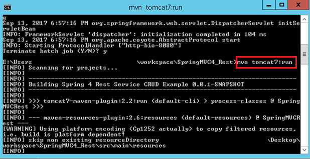
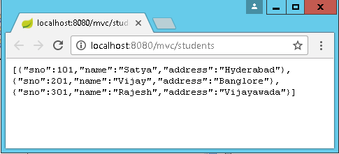
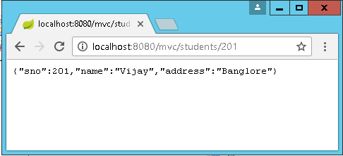

Spring 4 MVC REST Service Example
---------------------------------

 Spring 4 **@RestController**annotation is introduced. And also we have
**@RequestBody, @ResponseBody, @ResponseEntity**annotations which are used
to bind the HTTP request/response body with a domain object in method parameter
or return type.

### @RequestBody

If a method parameter is annotated with **@RequestBody**, Spring will bind the
incoming HTTP request body to the method parameter. While doing that, Spring
will use HTTP **Message converters** to convert the HTTP request body into class
object based on **Accept** header present in request.

-   The **Accept** header is used by HTTP clients [browsers] to tell the server
    what content types they will accept.

-   The server sends back the response, which will include
    a **Content-Type** header telling the client what the content type of the
    returned content actually is. In case of POST or PUT request, browsers do
    send data in request, so they actually send content-type as well.

```java
@RequestMapping(value="/user/create", method=RequestMethod.POST)
public ResponseEntity<Student> createUser(@RequestBody User user, UriComponentsBuilder ub){
		System.out.println("Creating User "+user.getName());
		
		if(userService.isUserExist(user)){
			System.out.println("A User with name "+user.getName()+" already exist");
			return new ResponseEntity<Void>(HttpStatus.CONFLICT);
		}

		userService.saveUser(user);
		
		HttpHeaders headers = new HttpHeaders();
	    headers.setLocation(ub.path("/user/{id}").buildAndExpand(user.getId()).toUri());
```
See above, Method parameter **user** is marked with **@RequestBody** annotation

### @ResponseEntity
 It represents the **entire HTTP response**. Here we can specify status code,
headers, and body. 

### @ResponseBody
If a method is annotated with **@ResponseBody**, Spring will bind the **return
value to outgoing HTTP response body**.

While doing that, Spring will use HTTP Message converters to convert the return
value to HTTP response body, based on **Content-Type** present in request HTTP
header

<br>

## Spring 4 MVC REST Controller Example
The demo REST application will have Student resource. This student resource can
be accessed using standard GET, POST, PUT, DELETE http methods. We will create
below REST endpoints for this project.

| **REST Endpoint**  | **HTTP Method** | **Description**                               |
|--------------------|-----------------|-----------------------------------------------|
| **/students**      | GET             | Returns the list of students                  |
| **/students/{id}** | GET             | Returns student detail for given student {id} |
| **/students**      | POST            | Creates new student from the post data        |
| **/students/{id}** | PUT             | Replace the details for given student {id}    |
| **/students/{id}** | DELETE          | Delete the student for given student {id}     |

**1.Set Annotation based Configuration for Spring 4 MVC REST**

For this Spring 4 MVC REST tutorial we are going to use Spring’s Java based
configuration or **annotation based configuration** instead of old XML
configuration. So now let us add the Java Configuration required to bootstrap
Spring 4 MVC REST in our webapp.

Create AppConfig.java file under /src folder. Give appropriate package name to
your file. We are
using @EnableWebMvc, @ComponentScan and @Configuration annotations. These
will bootstrap the spring mvc application and set package to scan controllers
and resources.
```java
package smlcodes.config;

@Configuration
@EnableWebMvc
@ComponentScan(basePackages = "smlcodes")
public class AppConfig {

}
```

**2.Set Servlet 3 Java Configuration**

Create **AppInitializer** class under config package. This class will replace
**web.xml** and it will map the spring’s dispatcher servlet and bootstrap it.
```java
package smlcodes.config; 
public class AppInitializer extends AbstractAnnotationConfigDispatcherServletInitializer {

	@Override
	protected Class[] getRootConfigClasses() {
		return new Class[] { AppConfig.class };
	}
	@Override
	protected Class[] getServletConfigClasses() {
		return null;
	}
	@Override
	protected String[] getServletMappings() {
		return new String[] { "/" };
	}
}
```

**3.Create the Student Model**
Next let us create Student model class that will have few properties such as
firstName, lastName, email etc. This bean will hold student information
```java
package smlcodes.model;
public class Student {
	private int sno;
	private String name;
	private String address;	
	
	public Student(int sno, String name, String address) {
		super();
		this.sno = sno;
		this.name = name;
		this.address = address;
	}	
	public Student() {
		super();
	}
	//Setters & getters
}
```


**4.Create the Dummy Student Data Access Object (DAO)**

we will create a dummy data access object that will store student details in a
list. This DAO class can be easily replaced with Spring Data DAO or custom DAO.

The StudentDAO contains
methods `list(), get(), create(), update() and delete()` to perform CRUD operation
on students.
```java
package smlcodes.dao;

@Component
public class StudentDAO {
	private static List<Student> students;
	
//Instance block
{
		students = new ArrayList();
		students.add(new Student(101, "Satya", "Hyderabad"));
		students.add(new Student(201, "Vijay", "Banglore"));
		students.add(new Student(301, "Rajesh", "Vijayawada"));
	}
	
	public List list() {
		return students;
	}
	
	public Student get(int sno) {
		for (Student c : students) {
			if (c.getSno()==sno) {
				return c;
			}
		}
		return null;
	}
	
	public Student create(Student student) {
		student.setSno(new Random().nextInt(1000));
		students.add(student);
		return student;
	}
	public int delete(int sno) {
		for (Student c : students) {
			if (c.getSno()==sno) {
				students.remove(c);
				return sno;
			}
		}

		return 0;
	}

	
	public Student update(int sno, Student student) {
		for (Student c : students) {
			if (c.getSno()==sno) {
				student.setSno(c.getSno());
				students.remove(c);
				students.add(student);
				return student;
			}
		}

		return null;
	}
}
```

**5.Create the Student REST Controller**

Now let us create StudentRestController class. This class is annotated
with @RestControllerannotation.

Also note that we are using new annotations **@GetMapping, @PostMapping,
@PutMapping** and **@DeleteMapping** instead of standard **@RequestMapping**.

These annotations are available since Spring MVC 4.3 and are standard way of
defining REST endpoints. They act as wrapper to @RequestMapping. For example
@GetMapping is a composed annotation that acts as a shortcut for
**@RequestMapping(method = RequestMethod.GET).**
```java
package smlcodes.controller;

@RestController
public class StudentRestController {

	@Autowired
	private StudentDAO studentDAO;

	@GetMapping("/students")
	public List getStudents() {
		return studentDAO.list();
	}

	@GetMapping("/students/{sno}")
	public ResponseEntity getStudent(@PathVariable("sno") int sno) {
		Student student = studentDAO.get(sno);
		if (student == null) {
	return new ResponseEntity("No Student found for ID " + sno, HttpStatus.NOT_FOUND);
		}
		return new ResponseEntity(student, HttpStatus.OK);
	}

	@PostMapping(value = "/students")
	public ResponseEntity createStudent(@RequestBody Student student) {
		studentDAO.create(student);
		return new ResponseEntity(student, HttpStatus.OK);
	}

	@DeleteMapping("/students/{sno}")
	public ResponseEntity deleteStudent(@PathVariable int sno) {
		if (studentDAO.delete(sno) == 0) {
	return new ResponseEntity("No Student found for ID " + sno, HttpStatus.NOT_FOUND);
		}
		return new ResponseEntity(sno, HttpStatus.OK);
	}

	@PutMapping("/students/{sno}")
	public ResponseEntity updateStudent(@PathVariable int sno, @RequestBody Student student) {
		student = studentDAO.update(sno, student);
		if (null == student) {
	return new ResponseEntity("No Student found for ID " + sno, HttpStatus.NOT_FOUND);
		}
		return new ResponseEntity(student, HttpStatus.OK);
	}
}
```


6.Test the Application

To test application, fisrt do **mvn clean install**

To run application use **mvn tomcat7:run**



All List : <http://localhost:8080/mvc/students>



Get one :
[http://localhost:8080/mvc/students/{id}](http://localhost:8080/mvc/students/%7bid%7d)



POST the student details to <http://localhost:8080/mvc/students> using POSTMan
extension
