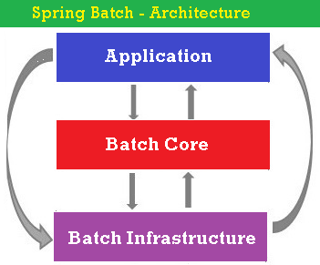
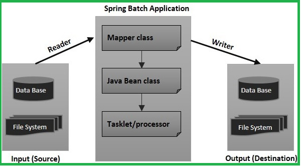

Spring JEE 
===========

This Module is for implementing the middleware services required for Business
logic. This spring JEE module is an abstraction layer on top of RMI, Java mail,
JMS, Jars etc.

**There is a difference between AOP and JEE modules**

-   AOP is just for applying the services (or) injecting the services but not
    for implementing the services, whereas JEE is a module for implementing the
    services.

-   For real time Business logic development with middleware services, we use
    spring core, spring AOP, and spring JEE modules.

What is Spring Security
-----------------------

Spring security framework focuses on providing both **authentication and
authorization** in java applications. It also takes care of most of the common
security vulnerabilities such as CSRF attack.

It’s very beneficial and easy to use Spring security in web applications,
through the use of annotations such as @EnableWebSecurity. You should go
through following posts to learn how to use Spring Security framework.

-   [Spring Security in Servlet Web
    Application](http://www.journaldev.com/2715/spring-security-example-tutorial)

-   [Spring MVC and Spring Security Integration
    Example](http://www.journaldev.com/2736/spring-security-example-userdetailsservice)

Spring Batch
------------

In any enterprise application we facing some situations like we want to execute
multiple tasks per day in a specific time for particular time period so to
handle it manually is very complicated. For handling this type of situation we
make some automation type system which execute in particular time without any
man power.

Spring Batch provides reusable functions that are essential in processing
**large volumes of records, including logging/tracing, transaction management,
job processing statistics, job restart, skip, and resource management.**

Spring batch contains above 3 components

-   **Application** −contains all the jobs and the code we write using the
    Spring Batch framework.

-   **Batch Core** − contains all the API classes that are needed to control and
    launch a Batch Job.

-   **Batch Infrastructure** –contains readers, writers, and services used by
    both application &Batch components.

Sample SpringBatch Applications

-   Spring Batch application read XML data and Writer to MySQL.

-   Spring Batch application read CSV data and Writer to XML file.

-   Spring Batch application read MySQL data and Writer to XML file.

-   Spring Batch application read MySQL data and Writer to TEXT file.

