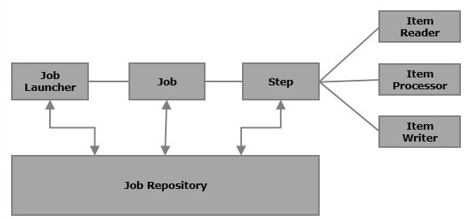
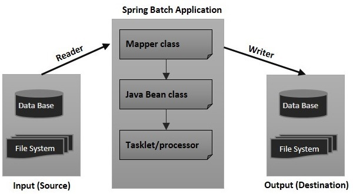

# Spring Batch

**Batch processing** is a processing mode which involves execution of series of
automated complex jobs without user interaction. A batch process handles bulk
data and runs for a long time.

Spring Batch applications support −

-   Automatic retry after failure.

-   Tracking status and statistics during the batch execution and after
    completing the batch processing.

-   To run concurrent jobs.

-   Services such as logging, resource management, skip, and restarting the
    processing.

Example: Import Users via Excel

## Components of Spring Batch




#### 1.Job

In a Spring Batch application, a job is the batch process that is to be
executed. It runs from start to finish without interruption. This job is further
divided into **steps** (or a job contains steps).

We will configure a job in Spring Batch using an XML file or a Java class.
Following is the XML configuration of a Job in Spring Batch.


``` xml
<job id = "jobid"> 
   <step id = "step1" next = "step2"/> 
   <step id = "step2" next = "step3"/> 
   <step id = "step3"/> 
</job>
```


  


#### 2.Step

A `step` is an independent part of a job which contains the necessary
information to define and execute the job (its part).

As specified in the diagram, each step is composed of an `ItemReader`,
`ItemProcessor` (optional) and an `ItemWriter`. **A job may contain one or more
steps**.

  


#### 3.Readers, Writers, and Processors

-   **Item reader** reads data into a Spring Batch application from a particular
    source.

-   **Item writer** writes data from the Spring Batch application to a
    particular destination.

-   **Item processor** is a class which contains the processing code which
    processes the data read into the spring batch. If the application reads
    **"n"** records, then the code in the processor will be executed on each
    record.

For example, if we are writing a job with a simple step in it where we read data
from MySQL database and process it and write it to a file (flat), then our step
uses −

-   A **reader** which reads from MySQL database.

-   A **writer** which writes to a flat file.

-   A **custom processor** which processes the data as per our wish.


``` xml
<job id = "helloWorldJob"> 
   <step id = "step1"> 
      <tasklet> 
         <chunk reader = "mysqlReader" writer = "fileWriter" 
            processor = "CustomitemProcessor" ></chunk> 
      </tasklet> 
   </step> 
</ job>
```


  


#### 4.Job repository

A Job repository in Spring Batch provides Create, Retrieve, Update, and Delete
(CRUD) operations for the JobLauncher, Job, and Step implementations. We will
define a job repository in an XML file as shown below.


``` xml
<job-repository id = "jobRepository" 
   data-source = "dataSource" 
   transaction-manager = "transactionManager" 
   isolation-level-for-create = "SERIALIZABLE" 
   table-prefix = "BATCH_" 
   max-varchar-length = "1000"/>
```

  


#### 5.JobLauncher

JobLauncher is an interface which launces the Spring Batch job with the **given
set of parameters**. **SampleJoblauncher** is the class which implements the
**JobLauncher** interface. Following is the configuration of the JobLauncher.


``` xml
<bean id = "jobLauncher" 
   class = "org.springframework.batch.core.launch.support.SimpleJobLauncher"> 
   <property name = "jobRepository" ref = "jobRepository" /> 
</bean>
```



## Spring Batch Example – Excel/CSV File To MySQL Database

CSV file data : src/main/resources/cvs/Users.csv

| uid | address    | age | name    |
|-----|------------|-----|---------|
| 401 | Mumbai     | 35  | Smith   |
| 402 | Delhi      | 36  | Kivell  |
| 403 | Bangalore  | 37  | Gill    |
| 404 | Hyderabad  | 38  | Jardine |
| 405 | Ahmedabad  | 39  | Andrews |
| 406 | Chennai    | 40  | Gill    |
| 407 | Kolkata    | 41  | Morgan  |
| 408 | Surat      | 42  | Andrews |
| 409 | Pune       | 43  | Jardine |

Create Model class to Hold CSV Data

``` java
public class User {
	private Integer uid;
	private String address;
	private Integer age;
	private String name;
}
```

  


**Job Cofiguration XML files**

**database.xml:** /src/main/resources/spring/batch/config/database.xml

-   Contains `dataSource` bean contains DB connection details.

-   `transactionManager` *–* Transaction managenet

-   create job-meta tables configuration.


``` xml
<beans>
    <!-- connect to database -->
	<bean id="dataSource"
		class="org.springframework.jdbc.datasource.DriverManagerDataSource">
		<property name="driverClassName" value="com.mysql.jdbc.Driver" />
		<property name="url" value="jdbc:mysql://localhost:3306/microservices" />
		<property name="username" value="root" />
		<property name="password" value="root" />
	</bean>
	<bean id="transactionManager"
		class="org.springframework.batch.support.transaction.ResourcelessTransactionManager" />
	
	<!-- create job-meta tables automatically -->
	<jdbc:initialize-database data-source="dataSource">
		<jdbc:script location="org/springframework/batch/core/schema-drop-mysql.sql" />
		<jdbc:script location="org/springframework/batch/core/schema-mysql.sql" />
	</jdbc:initialize-database>
</beans>
```

  


**Context.xml**

It Spring Batch Core Settings. It Defines jobRepository and jobLauncher.


``` xml
<beans>
    <!-- stored job-meta in database -->
	<bean id="jobRepository"
		class="org.springframework.batch.core.repository.support.JobRepositoryFactoryBean">
		<property name="dataSource" ref="dataSource" />
		<property name="transactionManager" ref="transactionManager" />
		<property name="databaseType" value="mysql" />
	</bean>

	<!-- stored job-meta in memory -->
	<!-- 
	<bean id="jobRepository"
		class="org.springframework.batch.core.repository.support.MapJobRepositoryFactoryBean">
		<property name="transactionManager" ref="transactionManager" />
	</bean>
 	-->
 
	<bean id="jobLauncher"
		class="org.springframework.batch.core.launch.support.SimpleJobLauncher">
		<property name="jobRepository" ref="jobRepository" />
	</bean> 
</beans>
```


  


**jobConfig.xml**

This is the main xml file to configure the Spring batch job. This jobConfig.xml
file define a job to read a user.csv file, match it to User plain pojo and write
the data into MySQL database.

``` xml
<beans>
    <bean id="userOb" class="com.spring.model.User" scope="prototype" />    
	<batch:job id="CsvToMySQL-job">
		<batch:step id="step1">
			<batch:tasklet>
				<batch:chunk reader="cvsFileItemReader" writer="mysqlItemWriter"
					commit-interval="2">
				</batch:chunk>
			</batch:tasklet>
		</batch:step>
	</batch:job>

	
	<bean id="cvsFileItemReader" class="org.springframework.batch.item.file.FlatFileItemReader">
		<!-- Read a csv file -->
		<property name="resource" value="classpath:cvs/Users.csv" />

		<property name="lineMapper">
			<bean class="org.springframework.batch.item.file.mapping.DefaultLineMapper">

				<!-- split it -->
				<property name="lineTokenizer">
					<bean
						class="org.springframework.batch.item.file.transform.DelimitedLineTokenizer">
						<property name="names" value="uid,address,age,name" />
					</bean>
				</property>

				<property name="fieldSetMapper">				    		      
					<!-- map to an object -->
					<bean
						class="org.springframework.batch.item.file.mapping.BeanWrapperFieldSetMapper">
						<property name="prototypeBeanName" value="userOb" />
					</bean>
					
				</property>

			</bean>
		</property>

	</bean>

	<bean id="mysqlItemWriter"
		class="org.springframework.batch.item.database.JdbcBatchItemWriter">
		<property name="dataSource" ref="dataSource" />
		<property name="sql">
			<value>
            <![CDATA[        
            	insert into batch_user(uid,address,age,name) values (:uid, :address, :age, :name)
            ]]>
			</value>
		</property>
		<!-- It will take care matching between object property and sql name parameter -->
		<property name="itemSqlParameterSourceProvider">
			<bean
				class="org.springframework.batch.item.database.BeanPropertyItemSqlParameterSourceProvider" />
		</property>
	</bean>

</beans>
```


Create a main class , which calls CsvToMySQL-job via jobLauncher


``` java
public class CSVToMySQLExample {
	public static void main(String[] args) {

		String[] springConfig  = 
			{	"spring/batch/config/database.xml", 
				"spring/batch/config/context.xml",
				"spring/batch/jobs/jobConfig.xml" 
			};
		
		ApplicationContext context = new ClassPathXmlApplicationContext(springConfig);
		
		JobLauncher jobLauncher = (JobLauncher) context.getBean("jobLauncher");
		Job job = (Job) context.getBean("CsvToMySQL-job");

		try {
			JobExecution execution = jobLauncher.run(job, new JobParameters());
			System.out.println("Exit Status : " + execution.getStatus());

		} catch (Exception e) {
			e.printStackTrace();
		}
		System.out.println("Done");
	}
}
```

#### Does Spring Batch require a database?

**Spring Batch by default uses a database to store metadata on the configured
batch jobs**. In this example, we will run Spring Batch without a database.
Instead, an in-memory Map based repository is used

  


#### How does Spring Batch handle transactions?

Spring Batch handles transactions **at the step level**. This means that Spring
Batch will never use only one transaction for a whole job (unless the job has a
single step). Remember that you're likely to implement a Spring Batch job in one
of two ways: using a **tasklet** or using a **chunk-oriented** step.


``` xml
	<batch:job id="CsvToMySQL-job">
		<batch:step id="step1">
			<batch:tasklet>
				<batch:chunk reader="cvsFileItemReader" writer="mysqlItemWriter"
					commit-interval="2">
				</batch:chunk>
			</batch:tasklet>
		</batch:step>
	</batch:job>
```

  


#### [How One can keep track of failed records in Spring Batch?](https://stackoverflow.com/questions/44065756/how-one-can-keep-track-of-failed-records-in-spring-batch)

  


**Method1** : We can keep track of records which was failed during the reading
step of a job. We need to use **SkipListener** for this.

``` java
public class SkipListener implements org.springframework.batch.core.SkipListener {

    public void onSkipInProcess(Object arg0, Throwable arg1) {
    }

    public void onSkipInRead(Throwable arg0) {
        System.out.println(arg0);
    }

    public void onSkipInWrite(Object arg0, Throwable arg1) {
    }

}
```

I want to store the line skipped by reader in another csv file.

SpringBatch provides methods on the StepExecution objects :

-   Read : stepExecution.**getReadCount**()

-   Read Failed : stepExecution.**getReadSkipCount**()

-   Processed : stepExecution.**getProcessCount**()

-   Processed Failed : stepExecution.**getProcessSkipCount**()

-   Written : stepExecution.**getWriteCount**()

-   Written Failed : stepExecution.**getWriteSkipCount**()

  


**Method 2 : Retry Sample**

The purpose of this sample is to show how to use the automatic retry
capabilities of Spring Batch.

The retry is configured in the step through the SkipLimitStepFactoryBean:

``` xml
<bean id="step1" parent="simpleStep"
    class="org.springframework.batch.core.step.item.FaultTolerantStepFactoryBean">
    ...
    <property name="retryLimit" value="3" />
    <property name="retryableExceptionClasses" value="java.lang.Exception" />
</bean>
```

Failed items will cause a rollback for all Exception types, up to a limit of 3
attempts. On the 4th attempt, the failed item would be skipped, and there would
be a callback to a ItemSkipListener if one was provided (via the "listeners"
property of the step factory bean).
