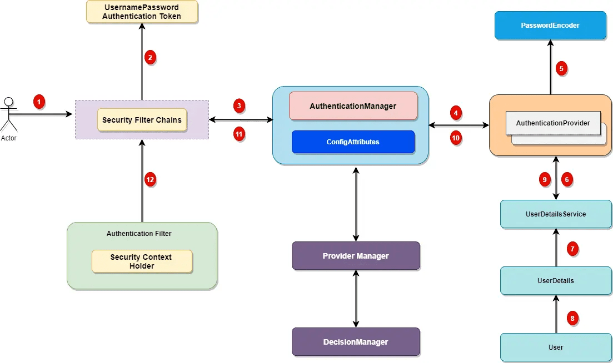

Spring Security 
===========
Before we dive in to *Spring Authentication* and its various features, let's look at the *Spring security authentication.*

Spring Security Authentication
------------------------------

One of the core aim for any security framework is to verify the caller's claim, the caller is who they claim to be. Authentication is the process to validate credentials and caller's claim. In this article, we will look at the core of *spring security authentication architectur*e and its various components.

Let's look at a top level workflow of the classes and filters involved in *security authentication* process.



*Spring security* comes with a set of security filters. Each request to the server is intercepted by these filters. These filters will process the request based on the logic and will pass or reject the incoming request, let's look at the distinct steps of the *authentication process*.

1\. Incoming HTTP Request
-------------------------

Each incoming request will go through a chain of *filters for authentication and authorization* process. Look at the step 1 in above diagram, each request is passing through the security filter chain. Keep in mind the following points.

1.  Each request will pass through the filters until it reaches relevant authentication filter.
2.  Each request can go through a distinct set of security filters. We can configure filters by request patterns or even based on the request headers.
3.  In above diagram, login request goes through the filter chains and reaches to the `UsernamePasswordAuthenticationFilter`.
4.  Similarly, a basic authentication request goes through the chains of filters until it reaches `BasicAuthenticationFilter`.

2\. AuthenticationToken Based on User Credentials
-------------------------------------------------

For the user login, once the *authentication request* reached the authentication filter, it will extract the username and password from the request payload. Spring security will create an Authentication object based on the username and password. This is how the Authentication objection creation look like:

```
UsernamePasswordAuthenticationToken authentication
 = new UsernamePasswordAuthenticationToken(username, password);
```


3\. Authentication Manager
--------------------------

*Authentication Manager* is the core for the *Spring security authentication process*. `AuthenticationManager` is the API that defines how *Spring Security's Filters perform authentication*.

```
public interface AuthenticationManager {
    Authentication authenticate(Authentication authentication) throwsAuthenticationException;
}
```


Before we move ahead, let's cover important points for the AuthenticationManager.

1.  Internally the `AuthenticationProvider`  are responsible to perform the authentication process.
2.  `ProviderManager` manager is the most commonly used implementation of `AuthenticationProvider.`
3.  `ProviderManager` delegates the request to the list of `AuthenticationProvider` (We will discuss this in details during this series).

  
  <br>

4\. AuthenticationProviders
---------------------------

The `AuthenticationProvider` are responsible to process the request and perform a specific authentication. It provides a mechanism for getting the user details with which we can perform authentication. This is how the `AuthenticationProvider` interface looks like:

```
public interface AuthenticationProvider {

    Authentication authenticate(Authentication authentication) throws AuthenticationException;
    boolean supports(Class<?> authentication);
}
```


Our `AuthenticationProvider` can't execute directly but we can configure multiple provider using the `AuthenticationProvider`.


If you are curious, here is the list of some OOTB authentication providers.

1.  DaoAuthenticationProvider.
2.  JAAS Authentication
3.  OpenID Authentication
4.  X509 Authentication
5.  SAML 2.0
6.  OAuth 2.0
7.  RememberMeAuthenticationProvider
8.  LdapAuthenticationProvider
 
  
  <br>


5\. Custom Authentication Provider
----------------------------------

For enterprise applications, we may need a custom authentication provider. Implement the `AuthenticationProvider` interface to create a custom authentication provider for your application.

```
@Component
public class CustomAuthenticationProvider implements AuthenticationProvider {
    @Override
    public Authentication authenticate(Authentication auth) throws AuthenticationException {
      String username = authentication.getName();
      String pwd = authentication.getCredentials().toString();
      if ("javadevjournal".equals(username) && "pass".equals(pwd)) {
            return new UsernamePasswordAuthenticationToken(username, password, Collections.emptyList());
       } else {
            throw new BadCredentialsException("User authentication failed!!!!");
       }
    }
    @Override
    public boolean supports(Class<?>auth) {
        return auth.equals(UsernamePasswordAuthenticationToken.class);
    }
}
```


The last step is to configure our *custom authentication provider with Spring security*. We do that by creating a custom configuration class and extending the `WebSecurityConfigurerAdapter`.

```
@Configuration
public class WebSecurityConfig extends WebSecurityConfigurerAdapter {

    @Autowired
    CustomAuthenticationProvider customAuthenticationProvider;

    @Override
    public void configure(AuthenticationManagerBuilder auth) throws Exception {
        //configuring our custom auth provider
        auth.authenticationProvider(customAuthProvider);
    }
}
```

  
  <br>


6\. Spring Security UserDetailsService
--------------------------------------

Not all, but few authentication provider may need `UserDetailsService` to get the user details stored in the database by username (e.g. `DaoAuthenticationProvider`). Most of the standard web application may use the `UserDetailsService` to get user information during login process. This is how the `UserDetailsService` interface look like:

```
package org.springframework.security.core.userdetails;

public interface UserDetailsService {
    UserDetails loadUserByUsername(String var1) throws UsernameNotFoundException;
}
```


It's a common use case to define a [custom UserDetailsService](https://www.javadevjournal.com/spring/spring-security-userdetailsservice/ "Spring Security UserDetailsService") for our application.
  
  <br>

7\. Authentication and Authentication Exception
-----------------------------------------------

During the authentication process, if the user authentication is successful, we will send a fully initialized Authentication object back. For failed authentication, `AuthenticationException` will be thrown. A fully populated authentication object carries the following details:

-   User credentials.
-   List of granted authorities (for authorization).
-   Authentication flag.

```
public interface Authentication extends Principal, Serializable {
    Collection<? extends GrantedAuthority> getAuthorities();

    Object getCredentials();
    Object getDetails();
    Object getPrincipal();
    boolean isAuthenticated();
    void setAuthenticated(boolean var1) throws IllegalArgumentException;
}
```

  
  <br>


8\. Setting Authentication SecurityContext
------------------------------------------

The last step on the successful authentication is setting up the authentication object in the `SecurityContext`. It wraps the `SecurityContext` around the `SecurityContextHolder`. Keep in mind following points:

1.  The `SecurityContextHolder` is where Spring Security stores the details about authenticated users.
2.  Spring security will not validate how the `SecurityContextHolder` is populated.
3.  If it finds values in the `SecurityContextHolder`, it assumes that current user is an authenticated user.

This is how the `SecurityContextHolder` populates

```
SecurityContext context = //get the context from security holder
UsernamePasswordAuthenticationToken authentication = new UsernamePasswordAuthenticationToken(username, password);
context.setAuthentication(authentication);
SecurityContextHolder.setContext(context);
```


Summary 
--------

In this article, we saw  spring security architecture and authentication process. We also take a detailed look at the *spring security authentication architecture*. To summarize, we covered the following items.The source code for this article is available on [GitHub](https://github.com/javadevjournal/javadevjournal/tree/master/spring-security/spring-security-series "GitHub").

1.  What is the overall architecture for the spring security authentication?
2.  How the authentication filters work together.
3.  What is the purpose of authentication manager?
4.  Overview of the authentication providers.
5.  Important of the `SecurityContextHolder`


REf 
https://www.javadevjournal.com/spring-security/spring-security-authentication/
