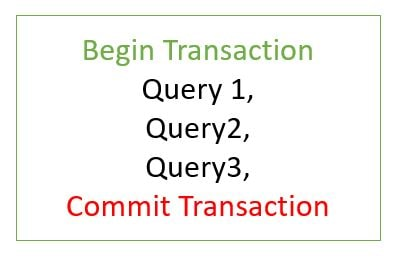
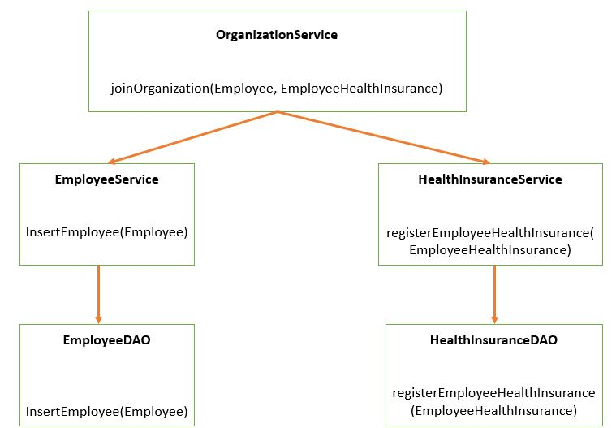
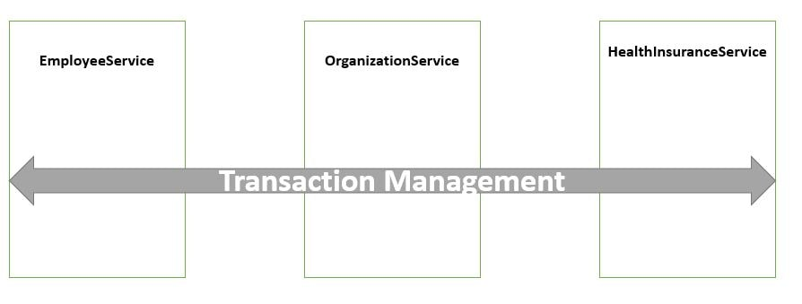
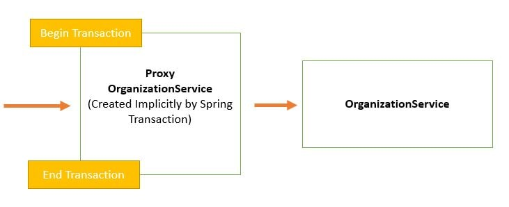

# Spring Transaction Management

A Database transaction is a **single logical unit of work which accesses and
possibly modifies the contents of a database.**  

### @Transactional Annotation

If Employee joins in Organization, at the time of Empoyee creation only we want
to insert policy to him.

We any of one operation fails, we don’t want to insert any recored in another
table.

~~~~~~~~~~~~~~~~~~~~~~~~~~~~~~~~~~~~~~~~~~~~~~~~~~~~~~~~~~~~~~~~~~ java
@Override
public void joinOrganization(Employee employee, EmployeeHealthInsurance employeeHealthInsurance) {
	employeeService.insertEmployee(employee);
	healthInsuranceService.registerEmployeeHealthInsurance(employeeHealthInsurance);
}
~~~~~~~~~~~~~~~~~~~~~~~~~~~~~~~~~~~~~~~~~~~~~~~~~~~~~~~~~~~~~~~~~~~~~~~~~~~~~~~~

We will be using the **@Transactional annotation.** Transaction is a cross
cutting concern, and it is implemented using AOP in Spring Boot.  

~~~~~~~~~~~~~~~~~~~~~~~~~~~~~~~~~~~~~~~~~~~~~~~~~~~~~~~~~~~~~~~~~~ java
@Override
@Transactional
public void joinOrganization(Employee employee, EmployeeHealthInsurance employeeHealthInsurance) {
	employeeService.insertEmployee(employee);	 
	healthInsuranceService.registerEmployeeHealthInsurance(employeeHealthInsurance);
}

@Override
@Transactional
public void leaveOrganization(Employee employee, EmployeeHealthInsurance employeeHealthInsurance) {
	employeeService.deleteEmployeeById(employee.getEmpId());
	healthInsuranceService.deleteEmployeeHealthInsuranceById(employeeHealthInsurance.getEmpId());
}
~~~~~~~~~~~~~~~~~~~~~~~~~~~~~~~~~~~~~~~~~~~~~~~~~~~~~~~~~~~~~~~~~~~~~~~~~~~~~~~~

Spring Boot implicitly creates a **proxy for the transaction annotated
methods.** So for such methods the proxy acts like a wrapper which takes care of
creating a transaction at the beginning of the method call and committing the
transaction after the method is executed.  

