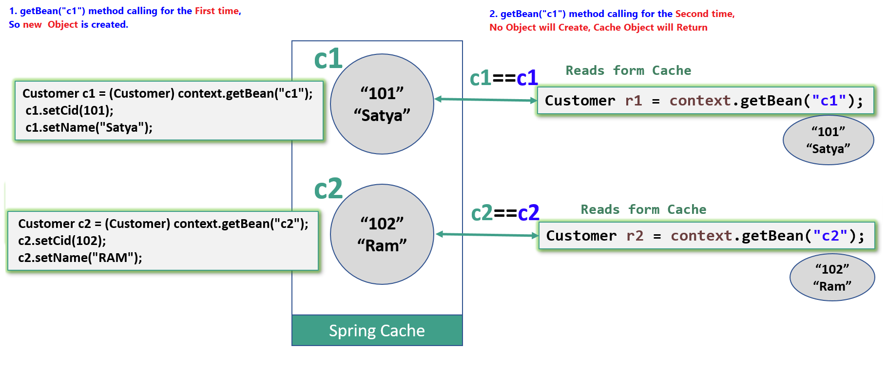

Spring – Spring Bean Internal Working
=======================================

**Spring IoC container** receives metadata from either an **XML file, Java
annotations, or Java code**. 

By reading the configuration metadata container gets its instructions, which
POJO class objects to instantiate, configure, and assemble.

The Objects which are created through this process called **Spring Beans**.

The responsibilities of IoC container are:

-   **Instantiating the bean**

-   **Wiring the beans together**

-   **Configuring the beans**

-   **Managing the bean’s entire life-cycle**


If you look at the picture above, you can see that there is a lot of squares in
there.

That’s how the spring container would look like if you graphed it all out. The
little squares are the **Spring beans** and you can
see **their references**. Some of them are standalone, some of them are
referencing other beans. Just how they wired up and how it makes all these
objects that we’re using altogether.

### Spring `<bean>` configuration

A Spring IoC container manages one or more ***beans***. These beans are created with
the configuration metadata that you supply to the container, for example, in the
form of XML  `<bean>` definitions.

bean definitions are represented as **BeanDefinition** objects, which contain
following metadata:
```xml
<beans>

	<bean
	    id="student" 
	    name="student" 
	    class="core.Student"
	    scope="prototype" 
	    autowire="byName"
	    dependency-check="simple" 
	    lazy-init="true/false" 
	    init-method="initIt" 
	    destroy-method="cleanUp">
	</bean>
	

	<import resource="connection/Spring-Connection.xml" />
	<import resource="moduleA/Spring-ModuleA.xml" />

</beans>
```

###### 1.Id
 A bean will have only one Unique id, **special charaters are not allowd.**


###### 2.name
A single bean can have multiple names(aliases) & allowes Special Charaters,
However, the names must still unique, otherwise
**BeanDefinitionParsingException** – Bean name ‘kingBean’ is already used in
this file 
```xml
<bean id="foo" name = "myFoo,kingBean,notBar" class="com.Foo">
</bean>
```


###### 3.class

This attribute is mandatory and specify the bean class to be used to create the
bean. You should specify fully qualified class name. Include package name.

###### 4.scope

5 types of bean scopes supported:

1.  **singleton(default)** – Return a single bean instance per Spring IoC
    container

2.  **prototype** – Return a new bean instance each time when requested

3.  **request** – each HTTP request has its own instance of a bean created

4.  **session** – Scopes a single bean definition to the lifecycle of an
    HTTP Session

5.  **application** – Scopes a single bean definition to the lifecycle of
    a ServletContext

The **`request, session, and application`** scopes are *only* available if you use a
**web-aware Spring ApplicationContext** implementation (such
as **`XmlWebApplicationContext`**). 

If you use these scopes with regular Spring IoC
containers such as the `ClassPathXmlApplicationContext`, you get
an `IllegalStateException:unknown bean scope`  complaining about an unknown bean scope.

**By XML**  

```xml
<bean id="student" class="core.Student" scope="singleton/prototype/request/session/application">
---
</bean>
```

You can also use annotation to define your bean scope.  
```java
@Service
@Scope("prototype")
public class CustomerService 
{
	String message;
	
	public String getMessage() {
 return message;
	}

	public void setMessage(String message) {
 this.message = message;
	}
}
```

Enable auto component scanning  
```xml
<beans>
       <context:component-scan base-package="com.smlcodes.customer" /> 
</beans>
```

<br>


>  ## SingleTon Vs Prototype


<u>Singleton</u>  
when you define a bean definition and it is scoped as a **singleton**, the
Spring IoC container creates **exactly one instance with that particular ID** of
the object defined by that bean definition.

This **single instance is stored in a cache** of such singleton beans, and all
subsequent requests and references for that named bean return the cached object.

**The singleton scope is the default scope in Spring.**


```java
package core;

public class Customer {

	private int cid;
	private String name;

	public int getCid() {
 return cid;
	}

	public void setCid(int cid) {
 this.cid = cid;
	}

	public String getName() {
 return name;
	}

	public void setName(String name) {
 this.name = name;
	}

}
```


```xml
//Default is ‘SingleTon’
<beans xmlns="http://www.springframework.org/schema/beans"
	xmlns:xsi="http://www.w3.org/2001/XMLSchema-instance"
	xsi:schemaLocation="http://www.springframework.org/schema/beans
	http://www.springframework.org/schema/beans/spring-beans-3.0.xsd">

	<bean id="c1" class="core.Customer">
	</bean>

	<bean id="c2" class="core.Customer">
	</bean>


</beans>
```

```java
public class ScopeApp {
	public static void main(String[] args) {

 // Instantiating a container
 ApplicationContext context = new ClassPathXmlApplicationContext("scope.xml");

	// *********** Setting Data 
 Customer c1 = (Customer) context.getBean("c1");
  c1.setCid(101);
  c1.setName("Satya");

  Customer c2 = (Customer) context.getBean("c2");
  c2.setCid(102);
  c2.setName("RAM");
  

	//********* retrieve it again   
  Customer r1 = (Customer) context.getBean("c1");
  System.out.println("R1 ==>" +r1.getCid()+" : "+r1.getName());
  

  Customer r2 = (Customer) context.getBean("c2");
  System.out.println("R2 ==>" +r2.getCid()+" : "+r2.getName());
 
	}
}
R1 ==>101 : Satya
R2 ==>102 : RAM
```

Since the bean ‘Customer’ is in singleton scope, the second retrieval by ‘**R1,
R2** will display the same data set by **‘C1, C2’** also, even it’s retrieve by
a new getBean() method.

In singleton, only a single instance per Spring IoC container, no matter how
many time you retrieve it with getBean(), it will always return the same
instance

<br>

<u>Prototype</u>  
The non-singleton, prototype scope of bean deployment results in the *creation
of a new bean instance* every time a request for that specific bean is made.

If you change `scope="prototype"` the Spring.Xml , it will create new bean
every time its called.
```xml
<beans>
	<bean id="c1" class="core.Customer" scope="prototype">
	</bean>

	<bean id="c2" class="core.Customer" scope="prototype">
	</bean>
</beans>
```


You will get following output.
```python
R1 ==>0 : null
R2 ==>0 : null
```
In prototype scope, you will have a new instance for each getBean() method
called.


###### 6.dependency-check

In Spring, you can use dependency checking feature to make sure the required
properties have been set or injected.

4 dependency checking modes are supported:

-   **none (default)** – No dependency checking.

-   **simple** – If any properties of primitive type (int, long, double…) and
    collection types (map, list..) have not been set,
    **UnsatisfiedDependencyException** will be thrown.

-   **objects** – If any properties of object type have not been set,
    **UnsatisfiedDependencyException** will be thrown.

-   **all** – If any properties of any type have not been set, an
    **UnsatisfiedDependencyException**  
    will be thrown

Explicitly define the dependency checking mode for every bean class is tedious
and **error prone**.

you can set a `default-dependency-check` attribute in the
`<beans>` root element to force the entire beans declared within `<beans>` root element to apply this rule. 

However, this root default mode will be overridden
by a bean’s own mode if specified.

**In XML**
```xml
<beans xmlns="http://www.springframework.org/schema/beans"
	xmlns:xsi="http://www.w3.org/2001/XMLSchema-instance" 
	default-dependency-check="all">

<bean id="CustomerBean" class="com.smlcodes.Customer" 
                        dependency-check="simple/objects/all">
     <property name="person" ref="PersonBean" />
     <property name="action" value="buy" />
</bean>

</beans>
```

**Using Annotations**

Spring’s dependency checking in bean configuration file is used to make sure all
properties of a certain types (primitive, collection or object) have been set.

In most scenarios, you just need to make sure a particular property has been
set, but not all properties.

For this case, you need **@Required** annotation, see following example :

A Customer object, apply @Required in setPerson() method to make sure the
person property has been set.
```java
public class Customer 
{
	private Person person;
	private int type;
	private String action;
	
	public Person getPerson() {
 return person;
	}
	@Required
	public void setPerson(Person person) {
 this.person = person;
	}
}
```

register an **RequiredAnnotationBeanPostProcessor** to aware of the
**@Required** annotation in bean configuration file.
```xml
<beans>
	...
	<context:annotation-config />
	...
</beans>
```


###### 7.Import

**Using Java** : You may load multiple Spring bean configuration files in the
code :
```java
ApplicationContext context = new ClassPathXmlApplicationContext(new String[] {"Spring-Common.xml",
              "Spring-Connection.xml","Spring-ModuleA.xml"});
```


**Using xml** : SpringAll.xml
```xml
<import resource="common/Spring-Common.xml"/>
<import resource="connection/Spring-Connection.xml"/>
<import resource="moduleA/Spring-ModuleA.xml"/>
```

Now you can load a single xml file like this :
```java
ApplicationContext context = new ClassPathXmlApplicationContext(SpringAll.xml);
```


###### 8.Lazy-init

**By default, Spring “application context" eagerly creates and initializes** all
beans during application startup itself. It helps in detecting the bean
configuration issues at early stage, in most of the cases.

But sometimes, you may need to mark some or all beans to be lazy initialized,
means Beans should initailze when they are required, by using **lazy-init**
attribute. 

The Objects with huge data not required to initialize at Startup.
those type of objects we should mark as lazy init objects.

```java
public class A {
	public A(){
 System.out.println("-- A initialized");
	}
}

public class B {
	public B() {
 System.out.println("-- B initialized");
	}
}
```

```xml
<beans>
	 <bean id="a" class="core.A" lazy-init="default" />
	 <bean id="b" class="core.B" lazy-init="true" />	 	 
</beans>
```

```java
public class LazyTest {
	public static void main(String[] args) {

 System.out.println("**** Eager Inits START ****");
 ApplicationContext context = new ClassPathXmlApplicationContext("Spring.xml");
 System.out.println("**** Eager Inits End ****");
 
 System.out.println("Lazy Init ...Intializes Only when calling getBean()");
 context.getBean("b");
 
	}
}
```

```op
**** Eager Inits START ****
-- A initialized
**** Eager Inits End ****
Lazy Init ...Intializes Only when calling getBean()
-- B initialized
```


<u>Using XML</u>  
1.Lazy load specific beans only
```xml
<beans> 
<bean id="e" class="EmployeeManagerImpl"  lazy-init="true"/> 
<beans>
```

2.Lazy load all beans
```xml
<beans default-lazy-init="true"> 
<bean id="e" class="EmployeeManagerImpl" /> 
<beans
```


<u>Using Annotations</u>  
1.Lazy load specific beans only
```java
@Configuration
public class AppConfig {

	@Lazy
	@Bean
	public EmployeeManager employeeManager() {
 return new EmployeeManagerImpl();
	}
}
```

2.Lazy load all beans
```java
@Lazy
@Configuration
public class AppConfig {

	@Bean
	public EmployeeManager employeeManager() {
 return new EmployeeManagerImpl();
	}

}
```

###### init-method, destroy-method
to understand these, you must know Bean Lify Cycle, Let’s Start!!
