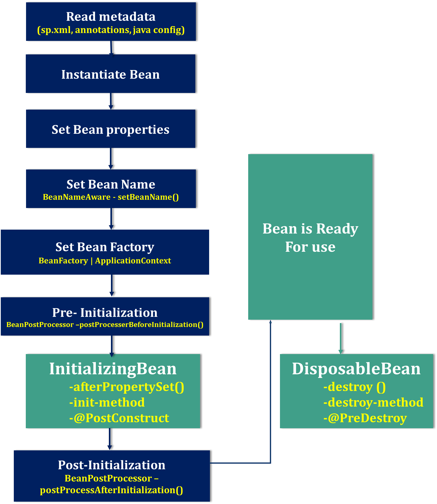

Spring Bean Life Cycle
========================



### **1.Read metadata**
Spring container reads metadata from **SpringConfiguration.xml (or
annotations/java config)** file and looks for the **<bean>** definitions.


### **2.Instantiate**  
Spring **instantiate** the bean by calling no argument default constructor of
that class, If there is **only parameterized constructor** in the class, then
bean must be defined in **spring.xml** file with **constructor injection**
otherwise it will throw **BeanCreationException**.


### **3.Inject Bean properties**
Once instantiate completed, **Sprin injects the values and references into the
bean’s properties**.


### **4.Set Bean Name**
If the bean implements **BeanNameAware** interface, Spring executes
**setBeanName()** method by passing Bean Id(bean id="ob"). By this method Spring
container sets the **bean name.**


### **5.Set Bean Factory**

-   If the bean implements **BeanFactoryAware** interface, Spring executes
    **setBeanFactory()** method by passing current **BeanFactory** reference
    which is used in our Appplciation.

-   If the bean implements **ApplicationContextAware** interface, Spring
    executes **setApplicationContext()** method by passing current
    **ApplicationContext** reference which is used in our Appplciation.


### **6.Pre- Initialization**

Apply this **BeanPostProcessor** to the given new bean instance **before any
bean initialization callbacks** (like InitializingBean's afterPropertiesSet or a
custom init-method) by using **postProcesserBeforeInitialization()** method. .
The bean will already be populated with property values. Note it says that "*The
bean will already be populated with property values*"


### **7. Initialize beans**
-   If the bean implements **IntializingBean**,its **afterPropertySet()** method
    is called.

-   If the bean has custom **init-method**, then specified initialization method
    is called.

-   If we are using annotations, use **@PostConstruct**  on the Top of the
    method


### **8.Post-Initialization**

Apply this **BeanPostProcessor** to the given new bean instance after any bean
initialization callbacks (after InitializingBean’s, afterPropertiesSet, custom
init-method) by **postProcessAfterInitialization().**


### **9.Ready to Use**
Now the bean is ready to be used by the application.


### **10. DisposableBean**
-   If the bean implements **DisposableBean**, the Spring IoC container will
    call the **destroy()** method .

-   If a custom **destroy-method** is defined, the container calls the specified
    method.

-   If we are using annotations, use **@PreDestroy** on the Top of the method


<hr>
Spring Bean Lifecycle Example
<hr>

```java
package lifycycle;

import org.springframework.beans.BeansException;
import org.springframework.beans.factory.BeanNameAware;
import org.springframework.beans.factory.DisposableBean;
import org.springframework.beans.factory.InitializingBean;
import org.springframework.beans.factory.config.BeanPostProcessor;

public class Student implements BeanNameAware, BeanPostProcessor, InitializingBean, DisposableBean {

	public void setBeanName(String beanname) {
		System.out.println("setBeanName : " + beanname);

	}

	public Object postProcessBeforeInitialization(Object arg0, String arg1) throws BeansException {
		System.out.println("BeanPostProcessor : postProcessBeforeInitialization ");
		return null;
	}

	public Student() {
		System.out.println("Student Contrscutor...");
	}

	public Object postProcessAfterInitialization(Object arg0, String arg1) throws BeansException {
		System.out.println("BeanPostProcessor : postProcessAfterInitialization ");
		return null;
	}

	private int sno;
	private String name;
	private Address address;

	public int getSno() {
		return sno;
	}

	public void setSno(int sno) {
		System.out.println("\t SNO Property Set");
		this.sno = sno;
	}

	public String getName() {
		return name;
	}

	public void setName(String name) {
		System.out.println("\t NAME Property Set");
		this.name = name;
	}

	public Address getAddress() {
		return address;
	}

	public void setAddress(Address address) {
		System.out.println("\t ADDRESS OBJECT Property Set");
		this.address = address;

	}

	public void afterPropertiesSet() throws Exception {	
		System.out.println("InitializingBean : afterPropertiesSet");
	}

	public void destroy() throws Exception {
		System.out.println("DisposableBean : destroy");
	}

}
```


```java
package lifycycle;

public class Address {
	private String city;

	public String getCity() {
		return city;
	}

	public void setCity(String city) {
		System.out.println("\t \t CITY Property Set");
		this.city = city;
	}

}
```


SpringConfig.xml
```xml
<beans xmlns="http://www.springframework.org/schema/beans"
	xmlns:xsi="http://www.w3.org/2001/XMLSchema-instance"
	xsi:schemaLocation="http://www.springframework.org/schema/beans
	http://www.springframework.org/schema/beans/spring-beans-3.0.xsd">

	<bean id="st" class="lifycycle.Student">
		<property name="sno" value="101" />
		<property name="name" value="Satya" />
		<property name="address">
			<ref bean="addr" />
		</property>
	</bean>

	<bean id="addr" class="lifycycle.Address">
		<property name="city" value="HYDERABAD" />
	</bean>

</beans>
```

```java
public class App {

	public static void main(String[] args) {
		 
		ApplicationContext context = new ClassPathXmlApplicationContext("SpringConfig.xml");
		Student s = (Student) context.getBean("st");
		System.out.println(s.getSno());
		System.out.println(s.getName());
		System.out.println(s.getAddress().getCity());
	}
}
```


```op
Student Contrscutor...
	 	 CITY Property Set
Jan 03, 2019 12:43:46 PM org.springframework.context.support.AbstractApplicationContext$BeanPostProcessorChecker postProcessAfterInitialization
INFO: Bean 'addr' of type [class lifycycle.Address] is not eligible for getting processed by all BeanPostProcessors (for example: not eligible for auto-proxying)
	 SNO Property Set
	 NAME Property Set
	 ADDRESS OBJECT Property Set
setBeanName : st
InitializingBean : afterPropertiesSet
Jan 03, 2019 12:43:46 PM org.springframework.beans.factory.support.DefaultListableBeanFactory preInstantiateSingletons
INFO: Pre-instantiating singletons in org.springframework.beans.factory.support.DefaultListableBeanFactory@2a098129: defining beans [st,addr]; root of factory hierarchy
101
Satya
HYDERABAD
```
