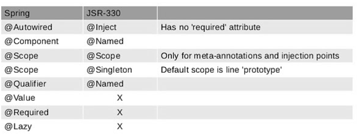

Spring -Configuring metadata
======================

Spring IoC container consumes a form of *configuration metadata*; this
configuration metadata represents how you as an application developer tell the
Spring container to instantiate, configure, and assemble the objects in your
application.

We can configurte the metadata in following ways

### 1.XML Based 

You have already seen XML based configuration metadata. The following example
shows the basic structure of XML-based configuration metadata:
```xml
<?xml version="1.0" encoding="UTF-8"?>
<beans xmlns="http://www.springframework.org/schema/beans"
        xmlns:xsi="http://www.w3.org/2001/XMLSchema-instance"
        xsi:schemaLocation="http://www.springframework.org/schema/beans
                http://www.springframework.org/schema/beans/spring-beans.xsd">

        <bean id="..." class="...">
                <!-- collaborators and configuration for this bean go here -->
        </bean>

        <bean id="..." class="...">
                <!-- collaborators and configuration for this bean go here -->
        </bean>

        <!-- more bean definitions go here -->

</beans>
```


### 2.Annotation based
Spring 2.5 introduced support for annotation-based configuration metadata.

For using annotation based cpnfiguration we need to place following line of code
in our SpringConfig.xml
```xml
<context:annotation-config/>
```


`<context:annotation-config/>` only looks for annotations on beans in the
same application context in which it is defined. This means that, if you
put <context:annotation-config> in a WebApplicationContext for
a DispatcherServlet, it only checks for @Autowired beans in your controllers,
and not your services. 

<br>

<u>XML vs Annotation Configuration</u>

-   XML excels at wiring up components without touching their source code or
    recompiling them. annotated classes are no longer POJOs and, furthermore,
    that the configuration becomes decentralized and harder to control.

-   Annotation injection is performed *before* XML injection, thus the latter
    configuration will override the former for properties wired through both
    approaches.

<br>


### Annotations

**1.@Required**

-   The @Required annotation applies to bean property setter methods.

-   This annotation indicates that the annotated bean property must be populated
    at configuration time, otherwise it will throws NullPointerException in case
    of Object type & it will take default values in case of Primitive Types

-   It should be placed at the top of Setter methods, if we place other palces
    it shows: **@Required is disallowed for this location**

**2. @Autowired**

-   You can apply the @Autowired annotation to constructors:

-   you can also apply the @Autowired annotation to setter methods & varibles

**3. @Inject**

-   Instead of @Autowired, we can use @Inject

-   As with @Autowired, it is possible to use @Inject at the field level,
    method level and constructor-argument level.

-   The @Inject annotation also serves the same purpose, but the main
    difference between them is that @Inject is a **standard annotation for
    dependency injection(JSR-330)** and @Autowired **is spring specific**

    

-   You can potentially avoid that development effort by using standard
    annotations specified by JSR-330 e.g.
     **@Inject, @Named, @Qualifier, @Scope and @Singleton**.

-   A bean declared to be auto-wired using @Inject will work in both **Google
    Guice and Spring framework**, and potentially any other DI container which
    supports JSR-330 annotations.

**4. @Primary**

-   Because autowiring by type may lead to multiple candidates, it is often
    necessary to have more control over the selection process.

-   @Primary indicates that a particular bean should be given preference when
    multiple beans are candidates to be autowired to a single-valued
    dependency. 

-   We can also use @Qualifier annotation for the same purpose. The difference
    is in Qualifier we can pass paramaters.

```java
public class MovieConfiguration {
        @Bean
        @Primary
        public MovieCatalog firstMovieCatalog() { ... }

        @Bean
        public MovieCatalog secondMovieCatalog() { ... }
        // ...
}

public class MovieRecommender {

        @Autowired
        @Qualifier("main")
        private MovieCatalog movieCatalog;
        // ...
}

public class MovieRecommender {

    private MovieCatalog movieCatalog;
    private CustomerPreferenceDao customerPreferenceDao;
    @Autowired
    public void prepare(@Qualifier("main")MovieCatalog movieCatalog,
                    CustomerPreferenceDao customerPreferenceDao) {
            this.movieCatalog = movieCatalog;
            this.customerPreferenceDao = customerPreferenceDao;
    }

    // ...
}
```


```xml
<beans>

<context:annotation-config/>

<bean class="example.SimpleMovieCatalog">
        <qualifier value="main"/>
        <!-- inject any dependencies required by this bean -->
</bean>

<bean class="example.SimpleMovieCatalog">
        <qualifier value="action"/>
        <!-- inject any dependencies required by this bean -->
</bean>

<bean id="movieRecommender" class="example.MovieRecommender"/>

</beans>
```


**5.@Resource**

-   We can use @Resource annotation on fields or bean property setter methods.

-   **@Resource** takes a name attribute, and by default Spring interprets that
    value as the bean name to be injected.

-   If no name is specified explicitly, the default name is derived from the
    field name or setter method

```java
public class SimpleMovieLister {

        private MovieFinder movieFinder;

        @Resource(name="myMovieFinder")
        public void setMovieFinder(MovieFinder movieFinder) {
                this.movieFinder = movieFinder;
        }

}
```

|  Spring component model elements vs. JSR-330 variants |                         |                                                                                                                                                                                                                                                                                                                                                                                                                                                                                                              |
|-------------------------------------------------------|-------------------------|--------------------------------------------------------------------------------------------------------------------------------------------------------------------------------------------------------------------------------------------------------------------------------------------------------------------------------------------------------------------------------------------------------------------------------------------------------------------------------------------------------------|
| **Spring**                                            | **javax.inject.\***     | **javax.inject restrictions / comments**                                                                                                                                                                                                                                                                                                                                                                                                                                                                     |
| @Autowired                                           | @Inject                | @Inject has no 'required' attribute; can be used with Java 8’s Optional instead.                                                                                                                                                                                                                                                                                                                                                                                                                            |
| @Component                                           | @Named / @ManagedBean | JSR-330 does not provide a composable model, just a way to identify named components.                                                                                                                                                                                                                                                                                                                                                                                                                        |
| @Scope("singleton")                                  | @Singleton             | The JSR-330 default scope is like Spring’s prototype. However, in order to keep it consistent with Spring’s general defaults, a JSR-330 bean declared in the Spring container is a singleton by default. In order to use a scope other than singleton, you should use Spring’s @Scope annotation. javax.inject also provides a [@Scope](https://download.oracle.com/javaee/6/api/javax/inject/Scope.html)annotation. Nevertheless, this one is only intended to be used for creating your own annotations. |
| @Qualifier                                           | @Qualifier / @Named   | javax.inject.Qualifier is just a meta-annotation for building custom qualifiers. Concrete String qualifiers (like Spring’s @Qualifier with a value) can be associated through javax.inject.Named.                                                                                                                                                                                                                                                                                                           |
| @Value                                               | \-                      | no equivalent                                                                                                                                                                                                                                                                                                                                                                                                                                                                                                |
| @Required                                            | \-                      | no equivalent                                                                                                                                                                                                                                                                                                                                                                                                                                                                                                |
| @Lazy                                                | \-                      | no equivalent                                                                                                                                                                                                                                                                                                                                                                                                                                                                                                |
| ObjectFactory                                         | Provider                | javax.inject.Provider is a direct alternative to Spring’s ObjectFactory, just with a shorter get() method name. It can also be used in combination with Spring’s @Autowiredor with non-annotated constructors and setter methods.                                                                                                                                                                                                                                                                           |

###  3.Java based 

Java based configuration is introduced in Spring 3.0 onwards. we have mainly
@Bean ,@Configuration Annotations
```java
Student.java
public class Student {	 
	private int sno;
	private String name;
	public int getSno() {
		return sno;
	}
	public void setSno(int sno) {
		this.sno = sno;
	}
	public String getName() {
		return name;
	}
	public void setName(String name) {
		this.name = name;
	} 	

}
```

Annotate with @Configuration to tell Spring that this is the core Spring
configuration file, and define bean via @Bean.
```java
AppConfig.java
@Configuration
public class AppConfig {
	@Bean(name = "student")
	public Student studentBean() {
		return new Student();
	}
}
```

Load your JavaConfig class with AnnotationConfigApplicationContext.
```java
App.java
public class App {
	public static void main(String[] args) {
		ApplicationContext context = new AnnotationConfigApplicationContext(AppConfig.class);
		Student s = (Student) context.getBean("student");
	}
}
```

**1.@Configuration**  
 **@Configuration** to tell Spring that this is the core Spring configuration
file

**2.@Bean**  
Indicates that a method produces a bean to be managed by the Spring container.
This is one of the most used and important spring annotation. @Bean annotation
also can be used with parameters like name, initMethod and destroyMethod.

-   name – allows you give name for bean

-   init-Method – allows you to choose method which will be invoked on context
    register

-   destroy-Method – allows you to choose method which will be invoked on
    context shutdown
```java
@Configuration
public class AppConfig {

    @Bean(name = "comp", initMethod = "turnOn", destroyMethod = "turnOff")
    Computer computer(){
        return new Computer();
    }
}
-------------------------------
public class Computer {

    public void turnOn(){
        System.out.println("Load operating system");
    }
    public void turnOff(){
        System.out.println("Close all programs");
    }
}
```
