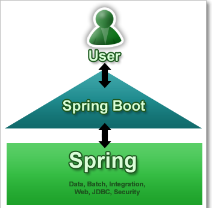

SpringBoot - Introduction
===========================

Spring Boot makes it easy to create stand-alone, production-grade Spring based
Applications that you can "just run".

### Spring vs SpringBoot

**Spring:** Spring started as a lightweight alternative to Java Enterprise
Edition (J2EE). Spring offered a simpler approach to enterprise Java
development, utilizing dependency injection and aspect-oriented programming to
achieve the capabilities of EJB with plain old Java objects (POJOs).

But while spring was lightweight in terms of component code**, it was
heavyweight in terms of configuration**. Initially, spring was configured with
**XML & Spring 2.5** introduced **annotation-based component-scanning, even so,
there was no escape from configuration.**

**Spring boot:** project is just a regular spring project that happens to
leverage Spring Boot starters and auto-configuration. Spring Boot is not a
framework, it is a way to ease to create **stand-alone application with minimal
or zero configurations.**

Finally, Spring Boot is just spring. Spring projects would not have any XML
configurations as part of it, everything will be handled by the project Spring
Boot.

## Spring Boot Features

-   Create stand-alone Spring applications

-   Embed **Tomcat, Jetty or Undertow directly** (no need to deploy WAR files)

-   Provide opinionated **'starter' POMs to simplify your Maven configuration**

-   **Automatically configure Spring whenever possible**

-   Provide production-ready features such as metrics, health checks and
    externalized configuration

-   Absolutely **no code generation and no requirement for XML configuration**

We can develop two flavors of Spring-Based Applications using Spring Boot

1.  **Java-Based Applications**

2.  **Groovy Application**

**Groovy** is also JVM language almost similar to Java Language. We can combine
both Groovy and Java into one Project. Because like Java files, **Groovy files
are finally compiled into \*.class files** only. Both ***.groovy and \*.java
files are converted to \*.class file (Same byte code format).**

Spring Boot Framework Programming model is inspired by Groovy Programming model.
Spring Boot internally uses some Groovy based techniques and tools to provide
default imports and configuration.
