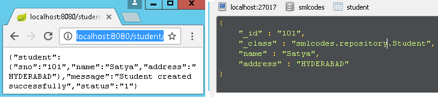

SpringBoot –MongoDB REST Example
===================================

Configuration file application.properties
```json
# Create new database : ‘smlcodes’
spring.data.mongodb.database=smlcodes
spring.data.mongodb.host=localhost
spring.data.mongodb.port=27017
```

 we need to model our documents. Let’s call ours ‘**Booking**’ and give it a
make, model, and description. Here is our Java class to accomplish this
```java
package smlcodes.repository;
import org.springframework.data.annotation.Id;
import org.springframework.data.mongodb.core.mapping.Document;

@Document
public class Student{

	@Id
	String sno;
	String name;
	String address;
	public String getSno() {
 return sno;
	}
	public void setSno(String sno) {
 this.sno = sno;
	}
	public String getName() {
 return name;
	}
	public void setName(String name) {
 this.name = name;
	}
	public String getAddress() {
 return address;
	}
	public void setAddress(String address) {
 this.address = address;
	}	
}
```

-   **@Id-**id provided by Mongo for a document.

-   **@Document-** provides a collection name.


*BookingRepository.java*

The **MongoRepository** provides basic CRUD operation methods and also an API to
find all documents in the collection.
```java
@Transactional
public interface StudentRepository extends MongoRepository<Student, String> { 
	  public Student findBySno(int sno);
}
```

```java
//BookingController.java
package smlcodes.controller;

@RestController
@RequestMapping("/student")
public class StudentController {
	
	@Autowired
	StudentRepository studentRepository;
	
	@RequestMapping("/create")
	public Map<String, Object> create(Student student) {
 student = studentRepository.save(student);
 Map<String, Object> dataMap = new HashMap<String, Object>();
 dataMap.put("message", "Student created successfully");
 dataMap.put("status", "1");
 dataMap.put("student", student);
	    return dataMap;
	}
	
	@RequestMapping("/read")
	public Map<String, Object> read(@RequestParam int sno) {
 Student student = studentRepository.findBySno(sno);
 Map<String, Object> dataMap = new HashMap<String, Object>();
 dataMap.put("message", "Student found successfully");
 dataMap.put("status", "1");
 dataMap.put("student", student);
	    return dataMap;
	}
	
	@RequestMapping("/readall")
	public Map<String, Object> readAll() {
 List<Student> students = studentRepository.findAll();
 Map<String, Object> dataMap = new HashMap<String, Object>();
 dataMap.put("message", "Student found successfully");
 dataMap.put("totalStudent", students.size());
 dataMap.put("status", "1");
 dataMap.put("students", students);
	    return dataMap;
	}
}
```

```java
//SpringBootMongoDbApplication.java
@SpringBootApplication
public class SpringBootMongoDbApplication {
	public static void main(String[] args) {
 SpringApplication.run(SpringBootMongoDbApplication.class, args);
	}
}
```

Test: <http://localhost:8080/student/create?sno=101&name=Satya&address=HYDERABAD>




# SpringBoot – with Multiple Databases / DataSources

Ref. <a href="https://www.javadevjournal.com/spring-boot/multiple-data-sources-with-spring-boot/" target="_blank">https://www.javadevjournal.com/spring-boot/multiple-data-sources-with-spring-boot/</a>


In your application you have two difftent databases MySQL, MongoDB. For using multiple databases, we need two create multiple datasources following steps.

application.properies  
Create two different datasources in application.properies  by changing prefix
```java
spring.mysql.datasource.url=jdbc:mysql://localhost/mysql
spring.mysql.datasource.username=root
spring.mysql.datasource.password=root
spring.mysql.datasource.driver-class-name=com.mysql.jdbc.Driver
```


#Database
```java
spring.mongodb.datasource.url=jdbc:mongodb://localhost/mongodb
spring.mongodb.username=root
spring.mongodb.password=root
spring.mongodb.driver-class-name=com.mongodb.jdbc.Driver
```


we have created Entity & Repository classes for each database in separate packages.  

•	`com.mysql.entity.*`	:	com.mysql.repository.MySQLRepository  
•	`com.mongo.entity.*` 	:	com.mongo.repository.MongoRepository

Spring Database configuration files
We need to create Two different Spring Configuration files & each of will contains following details.
1.	**DataSource**		:	It will Build Datasource
2.	**EntityManagerFactory**	:	Scans the entity classes in given package
3.	**TransactionManager**	:	Manages transactions using JPATrasnctions
 
MySQLDataSourceConfig.java
```java
@Configuration
@EnableTransactionManagement

@EnableJpaRepositories(
 entityManagerFactoryRef = "mysqlEntityManager",
 transactionManagerRef = "mysqlTransactionManager",
 basePackages = {
  "com.mysql.repository"
 }
)
public class MySQLDataSourceConfig {

	 @Primary
	 @Bean(name = "mysqlDatasource")
	 @ConfigurationProperties(prefix = "spring.mysql")
	 public DataSource mysqlDatasource() {
	  return DataSourceBuilder.create().build();
	 }

	 @Primary
	 @Bean(name = "mysqlEntityManager")
	 public LocalContainerEntityManagerFactoryBean	mysqlEnityManager(EntityManagerFactoryBuilder builder,  @Qualifier("mysqlDatasource") DataSource dataSource) {
	  return builder.dataSource(dataSource)
	   .packages("com.mysql.entity")
	   .persistenceUnit("db1")
	   .build();
	 }

	 @Primary
	 @Bean(name = "mysqlTransactionManager")
	 public PlatformTransactionManager customerTransactionManager(@Qualifier("mysqlEntityManager") EntityManagerFactory customerEntityManagerFactory) {
	  return new JpaTransactionManager(customerEntityManagerFactory);
	 }	
}
```


MongoDBDataSourceConfig.java
```java
@Configuration
@EnableTransactionManagement
@EnableJpaRepositories(
 entityManagerFactoryRef = "mongoEntityManager",
 transactionManagerRef = "mongoTransactionManager",
 basePackages = {
  " com.mongo.repository "
 }
)
public class MongoDBDataSourceConfig {
	@Primary
	 @Bean(name = "mongoDatasource")
	 @ConfigurationProperties(prefix = "spring.mongo")
	 public DataSource mongoDatasource() {
	  return DataSourceBuilder.create().build();
	 }

	 @Primary
	 @Bean(name = "mongoEntityManager")
	 public LocalContainerEntityManagerFactoryBean	mongoEnityManager(EntityManagerFactoryBuilder builder,  @Qualifier("mongoDatasource") DataSource dataSource) {
	  return builder.dataSource(dataSource)
	   .packages("com.mongo.entity")
	   .persistenceUnit("db1")
	   .build();
	 }

	 @Primary
	 @Bean(name = "mongoTransactionManager")
	 public PlatformTransactionManager customerTransactionManager(@Qualifier("mongoEntityManager") EntityManagerFactory customerEntityManagerFactory) {
	  return new JpaTransactionManager(customerEntityManagerFactory);
	 }	
}
```


Now if we use Repository classes, it will automatically be mapped to configured databases only.
```java
public class TestReportController {
	@Autowired
	MySQLRepository mysqlRepository;

	@Autowired
	MongoRepository mongoRepository;
}
```


