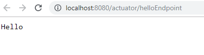
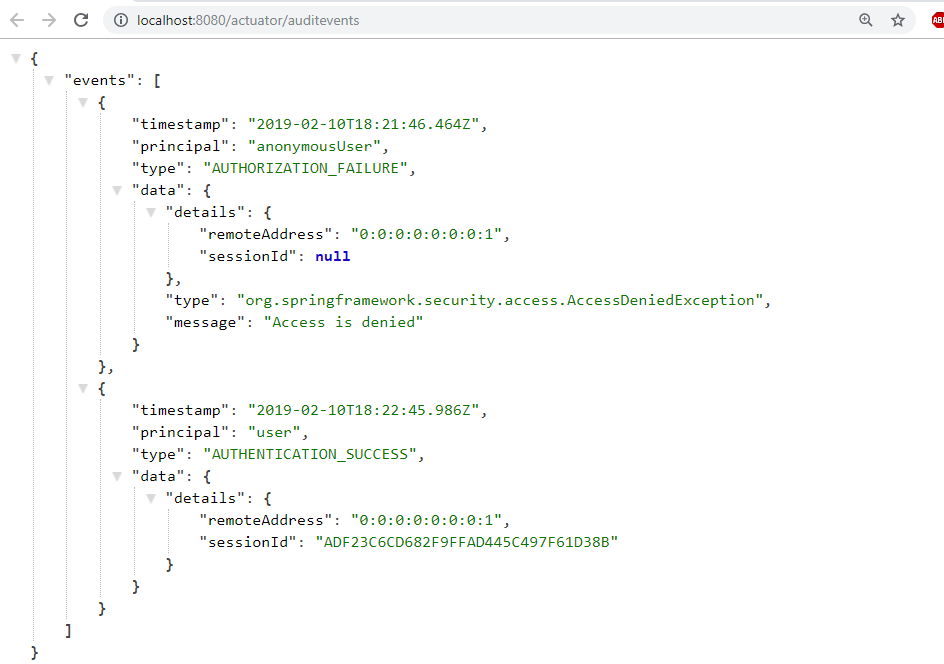
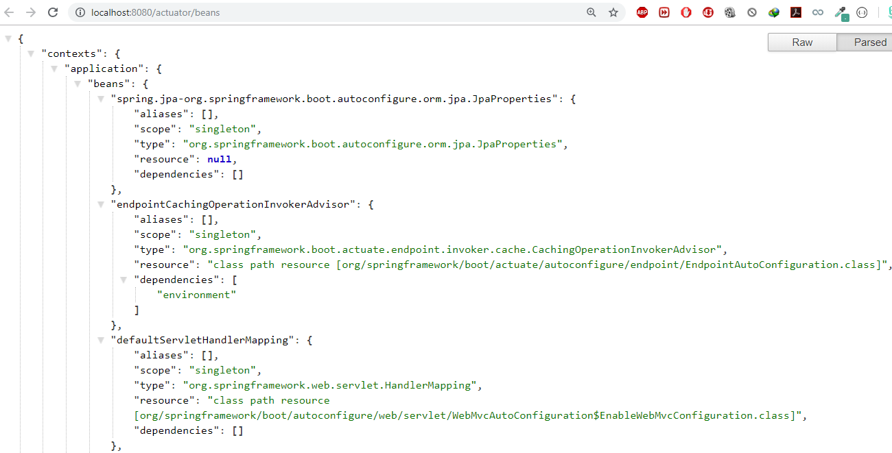
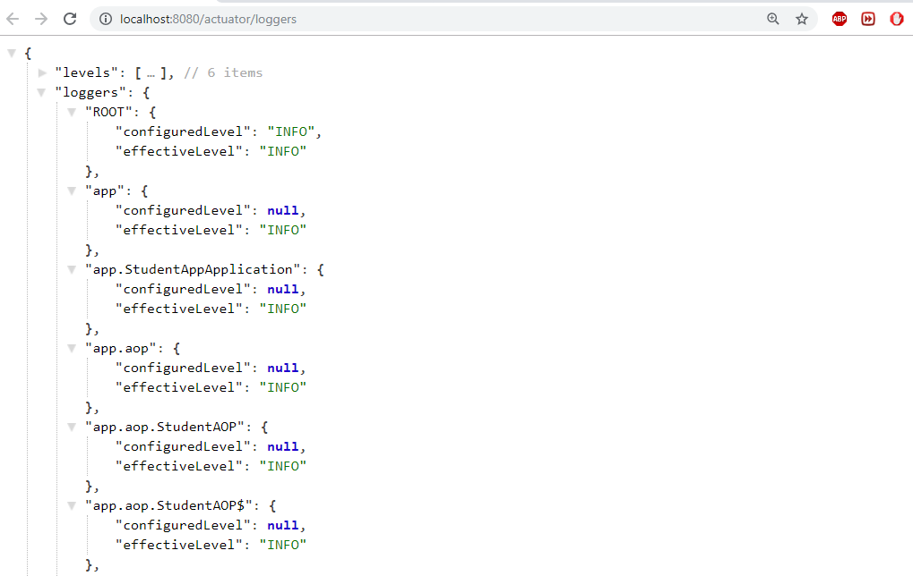

# Spring Boot – Advanced

## Spring Boot – Logging

Spring boot’s provide default logging mecahnisum, which is written with *Apache
Commons Logging*

SpringBoot supports `ERROR, WARN, INFO, DEBUG`, or TRACE as logging level. By
default, logging level is set to **INFO**. It means that code\>DEBUG and TRACE
messages are not visible.

To enable debug or trace logging, we can set the logging level in
`application.properties` file. Also, we can pass the –debug or –trace arguments
on the command line while starting the application.

~~~~~~~~~~~~~~~~~~~~~~~~~~~~~~~~~~~~~~~~~~~~~~~~~~~~~~~~~~~~~~~~~~~~~~~~~~~~~~~~
# In Console
-Dlogging.level.org.springframework=ERROR 
-Dlogging.level.com.howtodoinjava=TRACE
 
# In properties file
logging.level.org.springframework=ERROR 
logging.level.com.howtodoinjava=TRACE
~~~~~~~~~~~~~~~~~~~~~~~~~~~~~~~~~~~~~~~~~~~~~~~~~~~~~~~~~~~~~~~~~~~~~~~~~~~~~~~~

Example

~~~~~~~~~~~~~~~~~~~~~~~~~~~~~~~~~~~~~~~~~~~~~~~~~~~~~~~~~~~~~~~~~~ java
 org.slf4j.Logger;
 org.slf4j.LoggerFactory;

@SpringBootApplication
  Application 
{
       Logger =LoggerFactory.(Application.);
 
       main(String[] args) {
        SpringApplication.(Application., args);         
        .info("Simple log statement with inputs {}, {} and {}", 1,2,3);
    }
}
~~~~~~~~~~~~~~~~~~~~~~~~~~~~~~~~~~~~~~~~~~~~~~~~~~~~~~~~~~~~~~~~~~~~~~~~~~~~~~~~

## Spring Boot - Devtools 

If you have worked on latest UI development frameworks e.g. Node,
[angular](https://howtodoinjava.com/angularjs/angularjs-tutorial-helloworld-example/),
gulp etc. then you must have appreciated the auto-reload of UI in browser
whenever there is change in some code. Its pretty useful and saves a lot of
time.

To enable dev tools in spring boot application is very easy. Just add the
`spring-boot-devtools` dependency in your build file.

~~~~~~~~~~~~~~~~~~~~~~~~~~~~~~~~~~~~~~~~~~~~~~~~~~~~~~~~~~~~~~~~~~~~~~~~~~~~~~~~
<dependencies>
    <dependency>
        <groupId>org.springframework.boot</groupId>
        <artifactId></artifactId>
        <optional>true</optional>
    </dependency>
</dependencies>
~~~~~~~~~~~~~~~~~~~~~~~~~~~~~~~~~~~~~~~~~~~~~~~~~~~~~~~~~~~~~~~~~~~~~~~~~~~~~~~~

**Static Resource Caching**

To improve the performance, dev tools cache the static content/template files to
serve them faster to browser/client.

There are many such UI template libraries that support this feature. e.g.
thymeleaf, freemarker, groovy, mustache etc.

~~~~~~~~~~~~~~~~~~~~~~~~~~~~~~~~~~~~~~~~~~~~~~~~~~~~~~~~~~~~~~~~~~~~~~~~~~~~~~~~
#spring.freemarker.cache = true //set true in production environment
spring.freemarker.cache = false //set false in development environment; It is false by default.
 
//Other such properties 
spring.thymeleaf.cache = false
spring.mustache.cache = false
spring.groovy.template.cache = false
~~~~~~~~~~~~~~~~~~~~~~~~~~~~~~~~~~~~~~~~~~~~~~~~~~~~~~~~~~~~~~~~~~~~~~~~~~~~~~~~

 

**Automatic UI refresh**

The **spring-boot-devtools** module includes an embedded LiveReload server that
can be used to trigger a browser refresh when a resource is changed

~~~~~~~~~~~~~~~~~~~~~~~~~~~~~~~~~~~~~~~~~~~~~~~~~~~~~~~~~~~~~~~~~~~~~~~~~~~~~~~~
spring.devtools.livereload.enabled  = false #Set false to disable live reload
~~~~~~~~~~~~~~~~~~~~~~~~~~~~~~~~~~~~~~~~~~~~~~~~~~~~~~~~~~~~~~~~~~~~~~~~~~~~~~~~

 
 

## SpringBoot Acuator - Health check, Auditing, Metrics,Monitoring

Actuator brings production-ready features to our application.

**Monitoring our app, gathering metrics, understanding traffic or the state of
our database becomes trivial with this dependency.**

~~~~~~~~~~~~~~~~~~~~~~~~~~~~~~~~~~~~~~~~~~~~~~~~~~~~~~~~~~~~~~~~~~~~~~~~~~~~~~~~
<dependency>
    <groupId>org.springframework.boot</groupId>
    <artifactId>spring-boot-starter-actuator</artifactId>
</dependency>
~~~~~~~~~~~~~~~~~~~~~~~~~~~~~~~~~~~~~~~~~~~~~~~~~~~~~~~~~~~~~~~~~~~~~~~~~~~~~~~~

 
Once above maven dependency is included in the POM file,  16 different actuator
REST endpoints  , such as actuator, beans, dump, info, loggers, and metrics are
exposed

Some of important and widely used actuator endpoints are given below:

| **ENDPOINT** | **USAGE**                                                                                       |
|--------------|-------------------------------------------------------------------------------------------------|
| /env         | Returns list of properties in current environment                                               |
| /health      | Returns application health information.                                                         |
| /auditevents | Returns all auto-configuration candidates and the reason why they ‘were’ or ‘were not’ applied. |
| /beans       | Returns a complete list of all the Spring beans in your application.                            |
| /trace       | Returns trace logs (by default the last 100 HTTP requests).                                     |
| /dump        | It performs a thread dump.                                                                      |
| /metrics     | It shows metrics information like JVM memory used, system CPU usage, open files, and much more. |

You can access all available endpoint by this URL:
[**http://localhost:8080/actuator**](http://localhost:8080/actuator)

~~~~~~~~~~~~~~~~~~~~~~~~~~~~~~~~~~~~~~~~~~~~~~~~~~~~~~~~~~~~~~~~~~ json
{
	"_links": {
		"self": {
			"href": ,
			"templated": false
		},
		"health": {
			"href": ,
			"templated": false
		},
		"health-component-instance": {
			"href": ,
			"templated": true
		},
		"health-component": {
			"href": ,
			"templated": true
		},
		"info": {
			"href": ,
			"templated": false
		}
	}
}
~~~~~~~~~~~~~~~~~~~~~~~~~~~~~~~~~~~~~~~~~~~~~~~~~~~~~~~~~~~~~~~~~~~~~~~~~~~~~~~~

If you see we have only 2 endpoints showing (health, info) out of 16 endpoints

By default, all the actuator endpoints are exposed over **JMX** but only the
health and info endpoints are exposed over **HTTP**.

Here is how you can expose actuator endpoints over HTTP and JMX using
application properties -

 

**Exposing Actuator endpoints over HTTP**

~~~~~~~~~~~~~~~~~~~~~~~~~~~~~~~~~~~~~~~~~~~~~~~~~~~~~~~~~~~~~~~~~~~~~~~~~~~~~~~~
# Use "*" to expose all endpoints, or a comma-separated list to expose selected ones
management.endpoints.web.exposure.include=*
management.endpoints.web.exposure.exclude=
~~~~~~~~~~~~~~~~~~~~~~~~~~~~~~~~~~~~~~~~~~~~~~~~~~~~~~~~~~~~~~~~~~~~~~~~~~~~~~~~

 

**Exposing Actuator endpoints over JMX**

~~~~~~~~~~~~~~~~~~~~~~~~~~~~~~~~~~~~~~~~~~~~~~~~~~~~~~~~~~~~~~~~~~~~~~~~~~~~~~~~
# Use "*" to expose all endpoints, or a comma-separated list to expose selected ones
management.endpoints.jmx.exposure.include=*
management.endpoints.jmx.exposure.exclude=
~~~~~~~~~~~~~~~~~~~~~~~~~~~~~~~~~~~~~~~~~~~~~~~~~~~~~~~~~~~~~~~~~~~~~~~~~~~~~~~~

 

## Securing Actuator Endpoints with Spring Security

Actuator endpoints are sensitive and must be secured from unauthorized access.
you can add spring security to your application using the following dependency -

~~~~~~~~~~~~~~~~~~~~~~~~~~~~~~~~~~~~~~~~~~~~~~~~~~~~~~~~~~~~~~~~~~~~~~~~~~~~~~~~
<dependency>
   <groupId>org.springframework.boot</groupId>
   <artifactId>spring-boot-starter-security</artifactId>
</dependency>
~~~~~~~~~~~~~~~~~~~~~~~~~~~~~~~~~~~~~~~~~~~~~~~~~~~~~~~~~~~~~~~~~~~~~~~~~~~~~~~~

we can override the default spring security configuration and define our own
access rules.

#### Creating a Custom Actuator Endpoint

To customize the endpoint and define your own endpoint, simply Create a classs
annotate with @Endpoint URL :

~~~~~~~~~~~~~~~~~~~~~~~~~~~~~~~~~~~~~~~~~~~~~~~~~~~~~~~~~~~~~~~~~~ java
 org.springframework.boot.actuate.endpoint.annotation.Endpoint;
 org.springframework.boot.actuate.endpoint.annotation.ReadOperation;
 org.springframework.stereotype.Component;

@Endpoint(id="helloEndpoint")
@Component
  ListEndPoints {
    @ReadOperation
     String mypoint(){
         "Hello" ;
    }
}
~~~~~~~~~~~~~~~~~~~~~~~~~~~~~~~~~~~~~~~~~~~~~~~~~~~~~~~~~~~~~~~~~~~~~~~~~~~~~~~~

Few more Endpoints

 

 

## SpringBoot – Project Lombok

Project Lombok is a Java library tool that generates code for minimizing
boilerplate code. The library replaces boilerplate code with easy-to-use
annotations.

For example, by adding a couple of annotations, you can get rid of code
clutters, such as getters and setters methods, constructors, hashcode, equals,
and toString methods, and so on.

-   [**val**](https://projectlombok.org/features/val) :Finally! Hassle-free
    final local variables.

-   [**var**](https://projectlombok.org/features/var) :Mutably! Hassle-free
    local variables.

-   [**@Data**](https://projectlombok.org/features/Data):All together now: A
    shortcut for @ToString, @EqualsAndHashCode, @Getter on all fields, and
    @Setter on all non-final fields, and @RequiredArgsConstructor!

-   [**@NonNull**](https://projectlombok.org/features/NonNull) : How I
    learned to stop worrying and love the NullPointerException.

-   [**@Cleanup**](https://projectlombok.org/features/Cleanup) :Automatic
    resource management: Call your close() methods safely

-   [**@Getter/@Setter**](https://projectlombok.org/features/GetterSetter)
    :Never write public int getFoo() {return foo;} again.

-   [**@ToString**](https://projectlombok.org/features/ToString) : generate a
    toString for you!

-   [**@EqualsAndHashCode**](https://projectlombok.org/features/EqualsAndHashCode)
    : Generates hashCode and equals implementations from the fields of your
    object.

-   [**@NoArgsConstructor, @RequiredArgsConstructor and
    @AllArgsConstructor**](https://projectlombok.org/features/constructor)

    Constructors made to order: Generates constructors that take no arguments,
    one argument per final / non-nullfield, or one argument for every field.

-   [**@Value**](https://projectlombok.org/features/Value) :Immutable classes
    made very easy.

-   [**@Builder**](https://projectlombok.org/features/Builder) No-hassle
    fancy-pants APIs for object creation!

-   [**@SneakyThrows**](https://projectlombok.org/features/SneakyThrows) :To
    boldly throw checked exceptions where no one has thrown them before!

-   [**@Synchronized**](https://projectlombok.org/features/Synchronized):synchronized
    done right: Don't expose your locks.

-   [**@With**](https://projectlombok.org/features/With):Immutable 'setters' -
    methods that create a clone but with one changed field.

-   [**@Getter(lazy=true)**](https://projectlombok.org/features/GetterLazy):Laziness
    is a virtue!

-   [**@Log**](https://projectlombok.org/features/log) :Captain's Log, stardate
    24435.7: "What was that line again?"

-   [**experimental**](https://projectlombok.org/features/experimental/all)
    :Head to the lab: The new stuff we're working on.

Maven dependency

~~~~~~~~~~~~~~~~~~~~~~~~~~~~~~~~~~~~~~~~~~~~~~~~~~~~~~~~~~~~~~~~~~~~~~~~~~~~~~~~
<dependency>
    <groupId>org.projectlombok</groupId>
    <artifactId>lombok</artifactId>
    <optional>true</optional>
</dependency>
~~~~~~~~~~~~~~~~~~~~~~~~~~~~~~~~~~~~~~~~~~~~~~~~~~~~~~~~~~~~~~~~~~~~~~~~~~~~~~~~

 

 

## SpringBoot Security

spring-boot-starter-security: take care of all the required dependencies related
to spring security.

~~~~~~~~~~~~~~~~~~~~~~~~~~~~~~~~~~~~~~~~~~~~~~~~~~~~~~~~~~~~~~~~~~~~~~~~~~~~~~~~
<dependency>
	<groupId>org.springframework.boot</groupId>
	<artifactId>spring-boot-starter-security</artifactId>
</dependency>
~~~~~~~~~~~~~~~~~~~~~~~~~~~~~~~~~~~~~~~~~~~~~~~~~~~~~~~~~~~~~~~~~~~~~~~~~~~~~~~~

This will include the *SecurityAutoConfiguration* class – containing the
initial/default security configuration.

Just Run the project & see the magic

**We never created this login form, but from where it came from?**

SpringSecurity default comes with login page & you can login with generated
password which is already printed in the console

~~~~~~~~~~~~~~~~~~~~~~~~~~~~~~~~~~~~~~~~~~~~~~~~~~~~~~~~~~~~~~~~~~~~~~~~~~~~~~~~
Using generated security password: 8b4667a4-cc3a-47fd-b51f-b6f5e83745df
Def.user name is : user
~~~~~~~~~~~~~~~~~~~~~~~~~~~~~~~~~~~~~~~~~~~~~~~~~~~~~~~~~~~~~~~~~~~~~~~~~~~~~~~~

 

You can change the password by providing a security.user.password. This and
other useful properties are externalized via SecurityProperties (properties
prefix "security").

~~~~~~~~~~~~~~~~~~~~~~~~~~~~~~~~~~~~~~~~~~~~~~~~~~~~~~~~~~~~~~~~~~~~~~~~~~~~~~~~
security.user.name=user
security.user.name=password
security.basic.enabled=true
~~~~~~~~~~~~~~~~~~~~~~~~~~~~~~~~~~~~~~~~~~~~~~~~~~~~~~~~~~~~~~~~~~~~~~~~~~~~~~~~

 

To discard the security auto-configuration and add our own configuration, we
need to exclude the **SecurityAutoConfiguration** class.

~~~~~~~~~~~~~~~~~~~~~~~~~~~~~~~~~~~~~~~~~~~~~~~~~~~~~~~~~~~~~~~~~~ java
@SpringBootApplication(exclude = { SecurityAutoConfiguration.class })
public class SpringBootSecurityApplication { 
    public static void main(String[] args) {
        SpringApplication.run(SpringBootSecurityApplication.class, args);
    }
}
~~~~~~~~~~~~~~~~~~~~~~~~~~~~~~~~~~~~~~~~~~~~~~~~~~~~~~~~~~~~~~~~~~~~~~~~~~~~~~~~

 

Or by adding some configuration into the *application.properties* file:

~~~~~~~~~~~~~~~~~~~~~~~~~~~~~~~~~~~~~~~~~~~~~~~~~~~~~~~~~~~~~~~~~~~~~~~~~~~~~~~~
spring.autoconfigure.exclude=org.springframework.boot.autoconfigure.security.SecurityAutoConfiguration
~~~~~~~~~~~~~~~~~~~~~~~~~~~~~~~~~~~~~~~~~~~~~~~~~~~~~~~~~~~~~~~~~~~~~~~~~~~~~~~~

If we disabling security auto-configuration, we need to provide our own
configuration, by extends WebSecurityConfigurerAdapter

 

~~~~~~~~~~~~~~~~~~~~~~~~~~~~~~~~~~~~~~~~~~~~~~~~~~~~~~~~~~~~~~~~~~ java
@Configuration
@EnableWebSecurity
  SecurityConfig  WebSecurityConfigurerAdapter {

	@Override
	  configure(HttpSecurity http)  Exception {
		// It allows configuring web based security for specific http requests
		http
        .authorizeRequests()
            .anyRequest().authenticated() 
            .and()
        .formLogin()                      
            .and()
        .httpBasic();
		
		
	/* ============ Custom login Page URL ==========
	http
          .authorizeRequests()
          .antMatchers("/admin/**").hasRole("ADMIN")
          .antMatchers("/anonymous*").anonymous()
          .antMatchers("/login*").permitAll()
          .anyRequest().authenticated()
          .and()
          .formLogin()
          .loginPage("/login.html")
          .loginProcessingUrl("/perform_login")
          .defaultSuccessUrl("/homepage.html", true)
          //.failureUrl("/login.html?error=true")
          .failureHandler(authenticationFailureHandler())
          .and()
          .logout()
          .logoutUrl("/perform_logout")
          .deleteCookies("JSESSIONID")
          .logoutSuccessHandler(logoutSuccessHandler());		
		*/
	}

    @Bean
    @Override
     UserDetailsService userDetailsService() {
        UserDetails user =
             User.withDefaultPasswordEncoder()
                .username("user")
                .password("user")
                .roles("USER")
                .build();
 
          InMemoryUserDetailsManager(user);
    }
	
}
~~~~~~~~~~~~~~~~~~~~~~~~~~~~~~~~~~~~~~~~~~~~~~~~~~~~~~~~~~~~~~~~~~~~~~~~~~~~~~~~

Let’s summarize what we did in order to add Spring Boot Security to his web app.
To secure his web app,

-   we added Spring Boot Security to the classpath.

-   Once it was in the classpath, Spring Boot Security was enabled by default.

-   Then customized the security by extending WebSecurityConfigurerAdapter and
    added his own configure and userDetailsServiceimplementation.

-   <http://localhost:8080/login?logout>

-   <https://docs.spring.io/spring-security/site/docs/current/guides/html5/form-javaconfig.html>

-   <https://examples.javacodegeeks.com/enterprise-java/spring/boot/spring-boot-security-example/>

## Ref.

<https://dzone.com/articles/spring-boot-actuator-a-complete-guide>

<https://www.callicoder.com/spring-boot-actuator/>
