# 7. SpringBoot - Security

Spring Security is a framework that focuses on providing both **authentication**
and **authorization** (or -access-control”) to Java web application and
SOAP/RESTful web services.

Spring Security currently supports integration with all of the following
technologies:

-   **HTTP** basic access authentication

-   **LDAP** system

-   **OpenID** identity providers – Google, Facebook etc

-   **JAAS** API: JAAS stands for Java Authentication and Authorization Service.
    This is a pluggable module which is implemented in Java and the Spring
    Security Framework uses it for its authentication purposes.

-   **Single Sign-On**: This allows the user to get access to multiple
    applications with only one account (username and password).

-   CAS Server

-   ESB Platform

-   Your own authentication systems


<br>

<br>


## Spring Security Architecture 

*Spring security* comes with a set of security filters. Each request to the
server is intercepted by these filters. These filters will process the request
based on the logic and will **pass or reject** the incoming request, let's look
at the distinct steps of the *authentication process*.


<br>

#### 1. Incoming HTTP Request

Each incoming request will go through a chain of *filters for authentication and
authorization* process. Look at the step 1 in above diagram, each request is
passing through the security filter chain. Keep in mind the following points.

-   Each request will pass through the **filters** until it reaches relevant
    authentication filter.

-   Each request can go through a distinct set of security filters. We can
    configure filters by request patterns or even based on the request headers.

-   In above diagram, login request goes through the filter chains and reaches
    to the **UsernamePasswordAuthenticationFilter**.

-   Similarly, a basic authentication request goes through the chains of filters
    until it reaches **BasicAuthenticationFilter**.

<br>

#### 2. AuthenticationToken Based on User Credentials

For the user login, once the *authentication request* reached the authentication
filter, it will extract the username and password from the request payload.
Spring security will create an Authentication object based on the username and
password. This is how the Authentication objection creation look like:

```java
UsernamePasswordAuthenticationToken authentication
= new UsernamePasswordAuthenticationToken(username, password);
```


<br>


#### 3. Authentication Manager

*Authentication Manager* is the core for the *Spring security authentication
process*. **AuthenticationManager** is the API that defines how *Spring
Security's Filters perform authentication*.

```java
public interface AuthenticationManager {

Authentication authenticate(Authentication authentication)
throwsAuthenticationException;

}
```


Before we move ahead, let's cover important points for the
AuthenticationManager.

1.  Internally the AuthenticationProvider responsible to perform the
    authentication process.

2.  ProviderManager manager is the most used implementation of
    AuthenticationProvider.

3.  ProviderManager delegates the request to the list of AuthenticationProvider.


<br>


#### 4. AuthenticationProviders

The AuthenticationProvider are responsible to process the request and perform a
specific authentication. It provides a mechanism for getting the user details
with which we can perform authentication. This is how the AuthenticationProvider
interface looks like:

```java
public interface AuthenticationProvider {

Authentication authenticate(Authentication authentication) throws
AuthenticationException;

boolean supports(Class <?> authentication);

}
```


Our AuthenticationProvider can't execute directly but we can configure multiple
providers using the
AuthenticationProvider.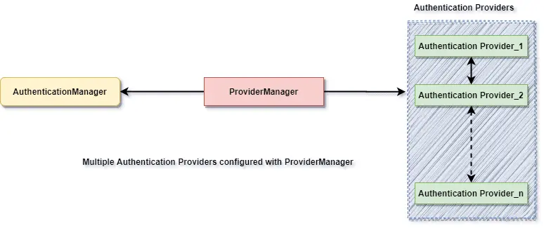

If you are curious, here is the list of some OOTB authentication providers.

-   DaoAuthenticationProvider.

-   JAAS Authentication

-   OpenID Authentication

-   X509 Authentication

-   SAML 2.0

-   OAuth 2.0

-   RememberMeAuthenticationProvider

-   LdapAuthenticationProvider


<br>


#### 5. Custom Authentication Provider

For enterprise applications, we may need a custom authentication provider.
Implement the `AuthenticationProvider` interface to create a custom authentication
provider for your application.
```java
@Component
public class CustomAuthenticationProvider implements AuthenticationProvider {

    @Override
    public Authentication authenticate(Authentication auth) throws AuthenticationException {
      String username = authentication.getName();
      String pwd = authentication.getCredentials().toString();
      if ("javadevjournal".equals(username) && "pass".equals(pwd)) {
            return new UsernamePasswordAuthenticationToken(username, password, Collections.emptyList());
       } else {
            throw new BadCredentialsException("User authentication failed!!!!");
       }
    }

    @Override
    public boolean supports(Class<?>auth) {
        return auth.equals(UsernamePasswordAuthenticationToken.class);
    }
}
```

The last step is to configure our custom authentication provider with Spring
security. We do that by creating a custom configuration class and extending the
WebSecurityConfigurerAdapter.

```java
@Configuration
public class WebSecurityConfig extends WebSecurityConfigurerAdapter {

    @Autowired
    CustomAuthenticationProvider customAuthenticationProvider;

    @Override
    public void configure(AuthenticationManagerBuilder auth) throws Exception {
        //configuring our custom auth provider
        auth.authenticationProvider(customAuthProvider);
    }
}
```

<br>


#### 6. Spring Security UserDetailsService

Not all, but few authentication providers may need `UserDetailsService` to get the
user details stored in the database by `username` (e.g.
DaoAuthenticationProvider). Most of the standard web application may use the
`UserDetailsService` to get user information during login process. This is how the
UserDetailsService interface look like:
```java
package org.springframework.security.core.userdetails;

public interface UserDetailsService {
    UserDetails loadUserByUsername(String var1) throws UsernameNotFoundException;
}
```


It's a common use case to define a [custom
UserDetailsService](https://www.javadevjournal.com/spring/spring-security-userdetailsservice/)
for our application.

<br>


#### 7. Authentication and Authentication Exception

During the authentication process, if the user authentication is successful, we
will send a fully initialized Authentication object back. For failed
authentication, AuthenticationException will be thrown. A fully populated
authentication object carries the following details:

-   User credentials.

-   List of granted authorities (for authorization).

-   Authentication flag.

```java
public interface Authentication extends Principal, Serializable {
    Collection<? extends GrantedAuthority> getAuthorities();

    Object getCredentials();
    Object getDetails();
    Object getPrincipal();
    boolean isAuthenticated();
    void setAuthenticated(boolean var1) throws IllegalArgumentException;
}
```


<br>


#### 8. Setting Authentication SecurityContext

The last step on the successful authentication is setting up the authentication
object in the SecurityContext. It wraps the SecurityContext around the
SecurityContextHolder. Keep in mind following points:

-   SecurityContextHolder is where Spring Security stores the details about
    authenticated users.

-   Spring security will not validate how the SecurityContextHolder is
    populated.

-   If it finds values in the SecurityContextHolder, it assumes that current
    user is an authenticated user.This is how the SecurityContextHolder
    populates

```java
SecurityContext context = //get the context from security holder

UsernamePasswordAuthenticationToken authentication = new UsernamePasswordAuthenticationToken(username, password);

context.setAuthentication(authentication);
SecurityContextHolder.setContext(context);
```


Ref.:
<https://www.javadevjournal.com/spring-security/spring-security-authentication/>

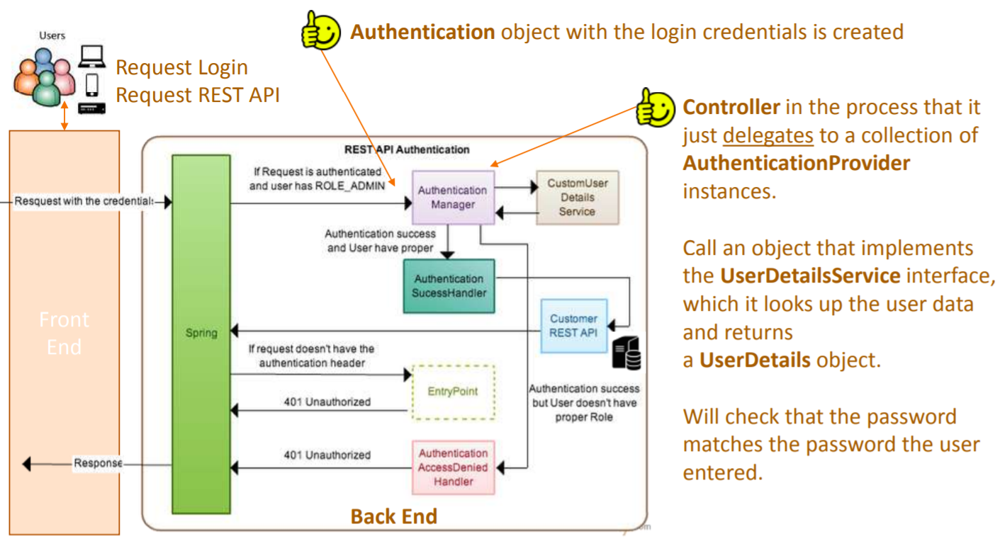

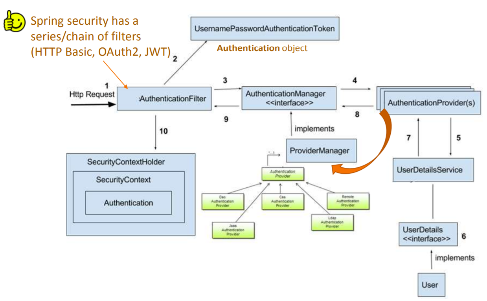

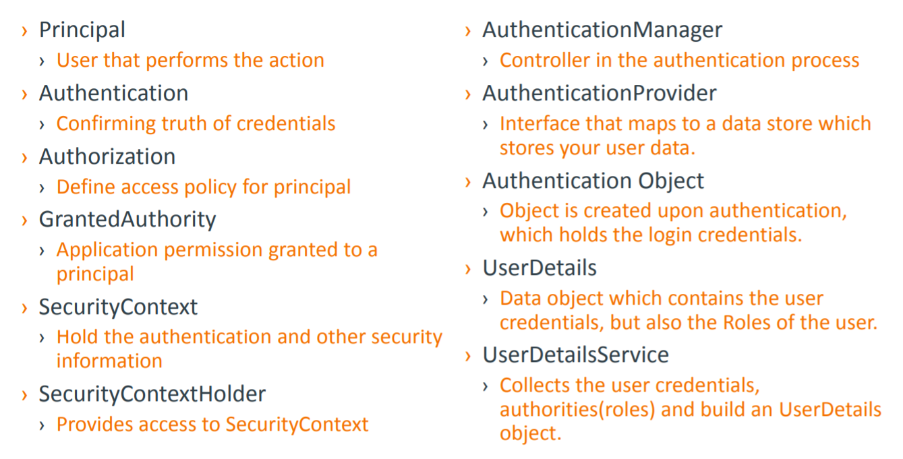


<br>


<br>


## Spring Security Authentication Types

-   Web Security Authentication (@EnableWebSecurity)

    1.  Basic Authenication

    2.  In-Memory Authentication

    3.  JDBC Authentication

    4.  LDAP Authentication

-   JWT(JSON Web Token) Authentication

-   OAuth 2.0 SSO Authentication

-   REST API


<br>


With the latest Spring Security and/or Spring Boot versions, the way to
configure Spring Security is by having a class that:

1.  Is annotated with **@EnableWebSecurity**.

2.  Extends **WebSecurityConfigurer**, which basically offers you a
    configuration DSL/method. With those methods, you can specify what URIs in
    your application to protect or what exploit protections to enable/disable.

Here’s what a typical **WebSecurityConfigurerAdapter** looks like


<br>

```java
@Configuration
@EnableWebSecurity // (1)
public class WebSecurityConfig extends WebSecurityConfigurerAdapter { // (1)

  @Override
  protected void configure(HttpSecurity http) throws Exception {  // (2)
      http
        .authorizeRequests()
          .antMatchers("/", "/home").permitAll() // (3)
          .anyRequest().authenticated() // (4)
          .and()
       .formLogin() // (5)
         .loginPage("/login") // (5)
         .permitAll()
         .and()
      .logout() // (6)
        .permitAll()
        .and()
      .httpBasic(); // (7)
  }
}
```


1.  A normal Spring @Configuration with the @EnableWebSecurity annotation,
    extending from **WebSecurityConfigurerAdapter**.

2.  By overriding the adapter’s **configure(HttpSecurity)** method, you get a
    nice little DSL with which you can configure your FilterChain.

3.  All requests going to **/ and /home** are allowed (permitted) - the user
    does *not* have to authenticate. You are using an
    [antMatcher](https://docs.spring.io/spring-framework/docs/current/javadoc-api/org/springframework/util/AntPathMatcher.html),
    which means you could have also used wildcards (\*, \\\*\\\*, ?) in the
    string.

4.  Any other request needs the user to be authenticated first, i.e. the user
    needs to login.

5.  You are allowing form login (username/password in a form), with a custom
    loginPage (*/login*, i.e. not Spring Security’s auto-generated one). Anyone
    should be able to access the login page, without having to log in first
    (permitAll; otherwise, we would have a Catch-22!).

6.  The same goes for the logout page

7.  On top of that, you are also allowing Basic Auth, i.e. sending in an HTTP
    Basic Auth Header to authenticate.


<br>


<br>


## 1.Spring Security – Quick Start Example

We have SpringBoot Application, which doesn’t have login page. After running
application, it will show all Employees Page.

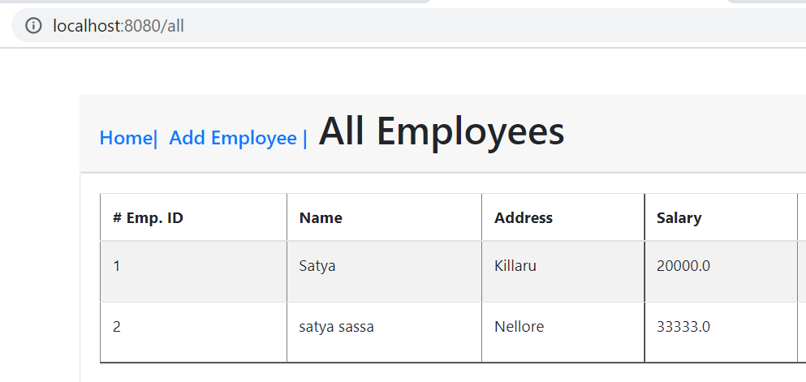

We are going to add Spring Security jar to this project.
spring-boot-starter-security: take care of all the required dependencies related
to spring security.
```java
<dependency>
   <groupId>org.springframework.boot</groupId>
   <artifactId>spring-boot-starter-security</artifactId>
</dependency>
```


This will include the *SecurityAutoConfiguration* class – containing the
initial/default security configuration.

Just Run the project & see the magic – It will Directly open Login Page

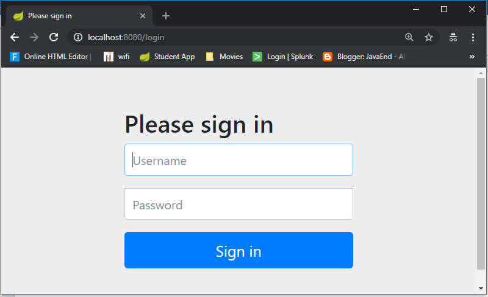


<br>


**We never created this login form, but from where it came from?**

In our application, we did not create this login page but configured the Spring
Security. This is a built-in login page provided by the framework itself to
authenticate the user.SpringSecurity default comes with login page & you can
login with generated password which is already printed in the console
```node
Using generated security password: **8b4667a4-cc3a-47fd-b51f-b6f5e83745df**
Def.user name is: **user**
```


You can change the password by providing a security.user.password. This and
other useful properties are externalized via
[SecurityProperties](https://github.com/spring-projects/spring-boot/tree/v1.4.0.RELEASE/spring-boot-autoconfigure/src/main/java/org/springframework/boot/autoconfigure/security/SecurityProperties.java)
(properties prefix "security").
```node
security.user.name=user
security.user.name=password
security.basic.enabled=true
```


**Thus, by just adding the spring boot security starter dependency the basic
security has already been configured by default.** Let’s customize the security
configuration by writing our own authorization and authentication. For this
create a new class SecurityConfig that extends the WebSecurityConfigurerAdapter
and overrides its methods.

To discard the security auto-configuration and add our own configuration, we
need to exclude the **SecurityAutoConfiguration** class.
```java
@SpringBootApplication(exclude = { SecurityAutoConfiguration.class })
public class SpringBootSecurityApplication { 
    public static void main(String[] args) {
        SpringApplication.run(SpringBootSecurityApplication.class, args);
    }
}
```


Or by adding some configuration into the *application.properties* file:  
```java
spring.autoconfigure.exclude=org.springframework.boot.autoconfigure.security.SecurityAutoConfiguration
```


<br>


<br>


## 2.Spring Security – Basic & In-Memory Authentication Example

If we are disabling security auto-configuration, we need to provide our own
configuration by creating new class annotated with **@EnableWebSecurity** which
extends **WebSecurityConfigurerAdapter**.

Spring Security provides HTTP basic authentication to authenticate the user at
the client-side and send the user credentials with the request header to the
server. The server receives these credentials, extract them from the header, and
map them with the existing record to validate the user.

The **BasicAuthenticationFilter** handles the request and check whether the
request contains an authentication header or not. The `httpBasic()` method enables
the Basic HTTP security in our application. Let's create a project and
implements HTTP security.

```java
@Configuration
@EnableWebSecurity
public class SecurityConfig extends WebSecurityConfigurerAdapter {

	@Override
	public void configure(HttpSecurity http) throws Exception {
		// It allows configuring web based security for specific http requests
		http.authorizeRequests()
            	.anyRequest().authenticated() 
            	.and()
        	.formLogin()                      
            	.and()
        	.httpBasic();	// This means it is Basic Authenication
	}

    @Bean
    @Override
    public UserDetailsService userDetailsService() {
        UserDetails user =
             User.withDefaultPasswordEncoder()
                .username("user")
                .password("user")
                .roles("USER")
                .build();
 
        return new InMemoryUserDetailsManager(user); 
// This means We probive User data using InMomory
    }	
}
```

Here we provided Static user conntenet. This type of Authurization Known as In
Memory Authrization.

Let’s summarize what we did in order to add Spring Boot Security to his web app.
To secure his web app,

-   we added Spring Boot Security to the classpath/maven.

-   Once it was in the classpath, Spring Boot Security was enabled by default.

-   Then customized the security by extending WebSecurityConfigurerAdapter and
    added his own configure and userDetailsServiceimplementation.


<br>


<br>


## 3.Spring Security – Custom Login Form

By default, the Spring Security framework provides its own login page the get
user credentials but also allows us to set our own custom login page.

It is useful when we want to render a login page that matches the company
website theme. We will do it by creating a **login.jsp**. It will submit to the
**"/authenticateTheUser"** action and then Spring Security will perform
authentication based on the provided input.

**EmployeeController.java** – add **/login** to display login page  
```java
@GetMapping("/login")
public String login() {
	return "login";
}
```


`SecurityConfig.java`  
We used HttpSecurity class to configure the login page. The loginPage() is used
to specify our **login.jsp** page. We can also use any other name for login form
such as login-form.jsp or user-login.jsp and then specify the mapping to this
method. The **"/login"** value passed here will map to the controller's action
and then render the JSP page.
```java
@Override
public void configure(HttpSecurity http) throws Exception {
	http.authorizeRequests().anyRequest().
	authenticated().and()
	.formLogin()
	.loginPage("/login")
	.loginProcessingUrl("/authenticateTheUser").permitAll();
}
```


Now It will display our own custom form.
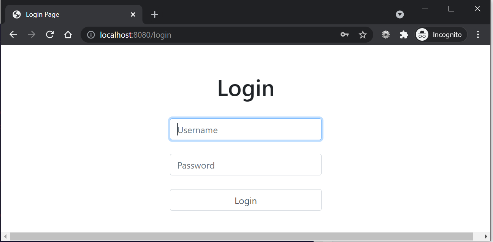


<br>


### Custom Error message

If the user enters the wrong credentials then Spring Security responds by
attaching an **error** parameter to the URL.Update **login.jsp** page
```java
<%@ taglib uri="http://java.sun.com/jsp/jstl/core" prefix="c"%>

<c:if test="${param.error!=null}">
    <p style="color: red">You entered wrong credentials!</p>
</c:if>
```


<br>


### Logout User

To implement this feature, follow these steps

1.  Add a Logout Button

2.  Configure Security

3.  Show Message


**1. Add a Logout Button(index.jsp)**  
add a button to the JSP page that enables logout to the user. This button is a
submit button that submits a form request to the logout URL that will be handle
by Spring Security. Put it on the JSP home page.
```java
<form:form
	action="${pageContext.request.contextPath}/logout"
	method="post">
	<input type="submit" value="logout" class="list-group-item list-group-item-action">
</form:form>
```


**2. Configure Security(SecurityConfig.java)**  
Now, update the **SecurityConfig.java** class by adding **logout()** and
**permitAll()** method.

-   **logout()** method will logout the user

-   **permitAll()** method give access to all the users to use the logout
    feature.  
    
```java
.logout().permitAll();
```

```java
@Override
public void configure(HttpSecurity http) throws Exception {
	// 2.Custom Login Form
	http.authorizeRequests().anyRequest()
	.authenticated()
	.and()
	.formLogin()
	.loginPage("/login")
	.loginProcessingUrl("/authenticateTheUser")
	.permitAll()
	.and()
	.logout()
	.permitAll();
}
```


**3.Show Message(login.jsp)**  
Now, set a message to show the user when the user logged out successfully. Add
it to the **login.jsp** to display a logout message to the user after successful
logout.
```java
<c:if test="${param.logout!=null}">
	<p style="color: green">You have successfully logged out.!</p>
</c:if>
```


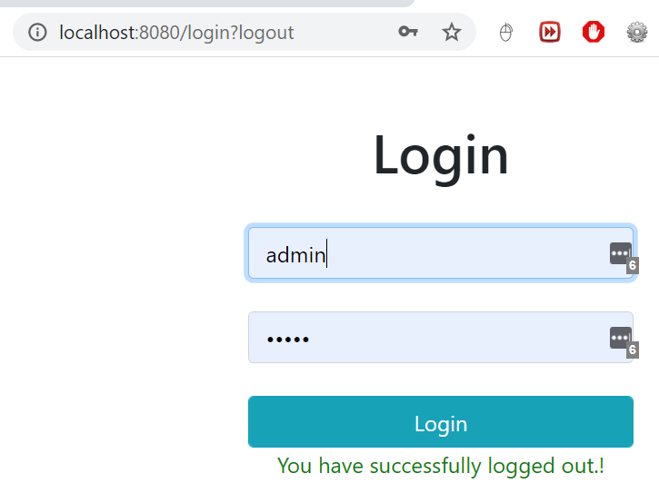


<br>


### Remember Me Feature

**remember-me** feature of Spring Security allows a user to remember even after
the session is closed. It performs automatic login by using the stored
**cookies**.

An application that has a remember-me feature, stores a cookie in the browser
which is used to identify the user and avoid entering the user credentials each
time to log in. So what we need to do is just simply use the **rememberMe()**
method in the **configure()** method of SecurityConfig class.
```java
@Override
public void configure(HttpSecurity http) throws Exception {
	// 2.Custom Login Form
	http.authorizeRequests().anyRequest()
	.authenticated()
	.and()
	.formLogin().loginPage("/login").loginProcessingUrl("/authenticateTheUser")
	.permitAll()
	.and()
	.logout().permitAll()
	.and()
.rememberMe().key("rem-me-key")  
		   .rememberMeParameter("remember")  
		   .rememberMeCookieName("rememberlogin")  
		   .tokenValiditySeconds(200);
}
```


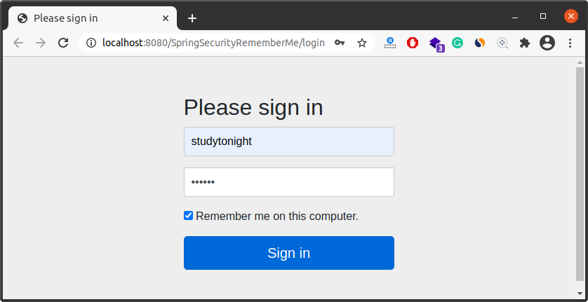  


**Verify the Cookies**  
See it stores the cookie that we set in the SecurityConfig file. It has the same
name that we set and a token in encrypted form and expiring life of the cookie.

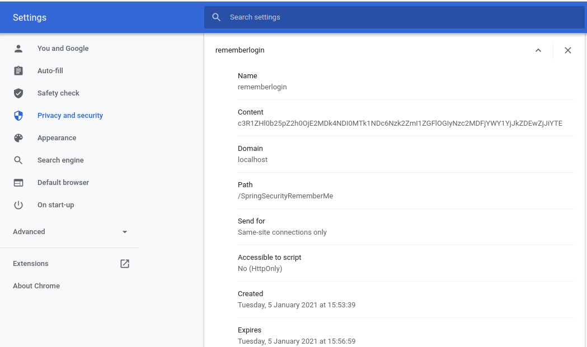


<br>


## 4.Spring Security – JDBC Authentication

By default, spring security expects tables named **users** table for storing
username, passwords and **authorities** table for storing the associated roles.

```sql
CREATE TABLE `users` (
  `username` varchar(50) NOT NULL,
  `password` varchar(50) NOT NULL,
  `enabled` tinyint(1) NOT NULL,
  PRIMARY KEY (`username`)
) ENGINE=InnoDB DEFAULT CHARSET=latin1;

INSERT INTO `users` 
VALUES 
('satya','{noop}satya',1),
('a','{noop}a',1);


CREATE TABLE `authorities` (
  `username` varchar(50) NOT NULL,
  `authority` varchar(50) NOT NULL,
  UNIQUE KEY `authorities_idx_1` (`username`,`authority`),
  CONSTRAINT `authorities_ibfk_1` FOREIGN KEY (`username`) REFERENCES `users` (`username`)
) ENGINE=InnoDB DEFAULT CHARSET=latin1;

INSERT INTO `authorities` 
VALUES 
('satya','ROLE_ADMIN'),
('a', 'ROLE_GUEST')
```


Override **configure(AuthenticationManagerBuilder)** — this method will help us
in fetching user data from DB and validate if the credentials provided by the
user is valid

`SecurityConfig.java`  

```java
package springboot.security;
import javax.sql.DataSource;

@Configuration
@EnableWebSecurity
public class SecurityConfig extends WebSecurityConfigurerAdapter {

    @Autowired
    DataSource dataSource;
		
    //Enable jdbc authentication
    @Autowired
    public void configAuthentication(AuthenticationManagerBuilder auth) {
        auth.jdbcAuthentication().dataSource(dataSource);
    }
		
	@Override
	public void configure(HttpSecurity http) throws Exception {

		//3. JDBC Authenication
		//role should not start with 'ROLE_' since it is automatically inserted
		// ADMIN - Allowed All Operations - ADD, EDIT , DELETE
		// GUEST- Allowed VIEW Operations - VIEW, SHOW
		http.authorizeRequests()
		.antMatchers("/").hasAnyRole("GUEST","ADMIN")
		.antMatchers("/all").hasAnyRole("GUEST","ADMIN")
		.antMatchers("/addEmployee").hasRole("ADMIN")
		.antMatchers("/saveEmployee").hasRole("ADMIN")
		.antMatchers("/deleteEmployee").hasRole("ADMIN")
		.and()
		.formLogin()
		.loginPage("/login")
		.loginProcessingUrl("/authenticateTheUser")
		.permitAll()
		.and()
		.logout()
		.permitAll()
		.and()
		.exceptionHandling().accessDeniedPage("/unauthorized");		
	}
}
```


<br>


## 5. Spring Security – LDAP Authentication

### What is LDAP?

LDAP is Lightweight Directory Access Protocol that is used to interact with
directory server. LDAP is a centralized directory acts as a data source, which
contains all important information related to the organization such as user
details, system information, etc. LDAP is used for authentication and storing
information about users, groups and applications.

Spring Security provides LdapAuthenticationProvider class to authenticate a user
against a LDAP server. The equivalent XML element is
\<ldap-authentication-provider\>.  
LDAP node is created with following keywords.

-   **uid** : User Id

-   **cn** : Common Name

-   **sn** : Surname

-   **o** : Organization

-   **ou** : Organizational unit

-   **dn** : Distinguished name

-   **dc** : Domain Component

When the user submits login form, then to find the user a LDAP DN is created.
Suppose the username is **'krishna**' then the actual name used to authenticate
to LDAP will be the full DN as following.
```java
uid=krishna,ou=people,dc=concretepage,dc=com
```


### LDAP Server Configuration (Free Online)

**LDAP Server Information (read-only access):**
```java
Server: ldap.forumsys.com   
Port: 389

Bind DN: cn=read-only-admin,dc=example,dc=com  
Bind Password: password
```

All user passwords are *password*.

Ref.
<https://www.forumsys.com/tutorials/integration-how-to/ldap/online-ldap-test-server/>

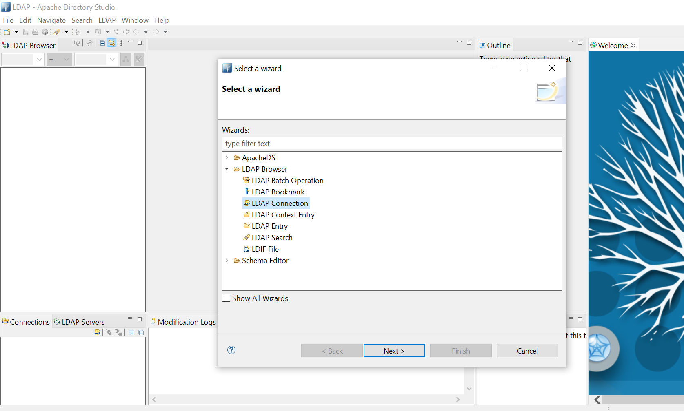

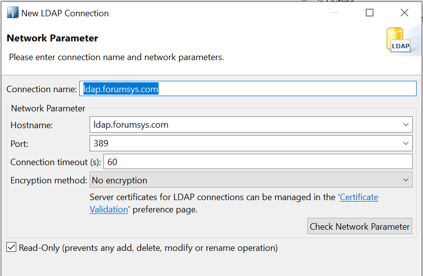

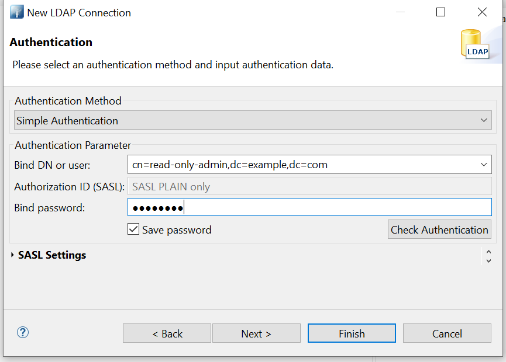

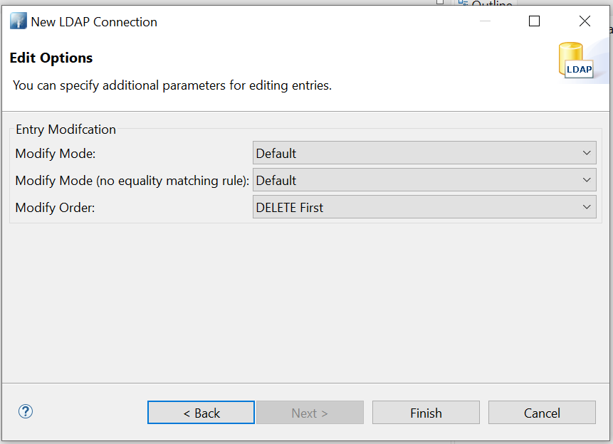

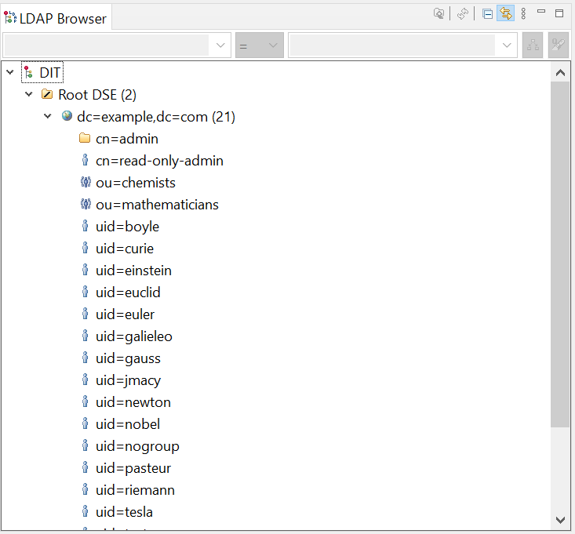

### Example Code

**Pom.xml** – Update Maven Dependency
```xml
<dependency>
   <groupId>org.springframework.security</groupId>
   <artifactId>spring-security-ldap</artifactId>
</dependency>

<dependency>
   <groupId>org.apache.directory.server</groupId>
   <artifactId>apacheds-server-jndi</artifactId>
   <version>1.5.5</version>
</dependency>
```


**application.properties** – update LDAP Server Properties
```xml
ldap.urls=ldap://ldap.forumsys.com:389/
ldap.base.dn=dc=example,dc=com
ldap.username=cn=read-only-admin,dc=example,dc=com
ldap.password=password
ldap.user.dn.pattern = uid={0}
```


**SpringSecurityConfig**

At this point, we need to tell spring how to we are doing authentication, as in
which URLs should be authenticated. We need to update Authentication provider as
LDAP in our code.
```java
@Configuration
@EnableWebSecurity
public class LDAPAuthenticationSecurityConfig extends WebSecurityConfigurerAdapter { 
	
    @Value("${ldap.urls}")
    private String ldapUrls;	

    @Value("${ldap.base.dn}")
    private String ldapBaseDn;

    @Value("${ldap.username}")
    private String ldapSecurityPrincipal;

    @Value("${ldap.password}")
    private String ldapPrincipalPassword;

    @Value("${ldap.user.dn.pattern}")
    private String ldapUserDnPattern;
    
 
    @Override
    protected void configure(AuthenticationManagerBuilder auth) throws Exception {
        	auth.ldapAuthentication()
                .contextSource()
                .url(ldapUrls + ldapBaseDn)
                .managerDn(ldapSecurityPrincipal)
                .managerPassword(ldapPrincipalPassword)
                .and()
                .userDnPatterns(ldapUserDnPattern);
    }
	
    
	//4. LDAP Authenication
	//role should not start with 'ROLE_' since it is automatically inserted
	// authenticated - Allowed All Operations - ADD, EDIT , DELETE
	// permitAll- Allowed VIEW Operations - VIEW, SHOW
    
    @Override
    protected void configure(HttpSecurity http) throws Exception {
    		http.authorizeRequests()
                .antMatchers("/login**").anonymous()
                .antMatchers("/all").permitAll()
                .antMatchers("/view**").permitAll()
                .antMatchers("/addEmployee").authenticated()
                .antMatchers("/addEmployee").authenticated()
                .antMatchers("/deleteEmployee").authenticated()
                .and()
                .formLogin()
                .loginPage("/login")
                .loginProcessingUrl("/authenticateTheUser")
                .permitAll()
                .and()
                .logout()
                .permitAll()
                .and()
                .csrf()
                .disable();
    }
}
```

For Testing
```java
//All UID’s password is: **password**
uid=boyle
uid=curie
uid=einstein
uid=euclid
uid=euler
```


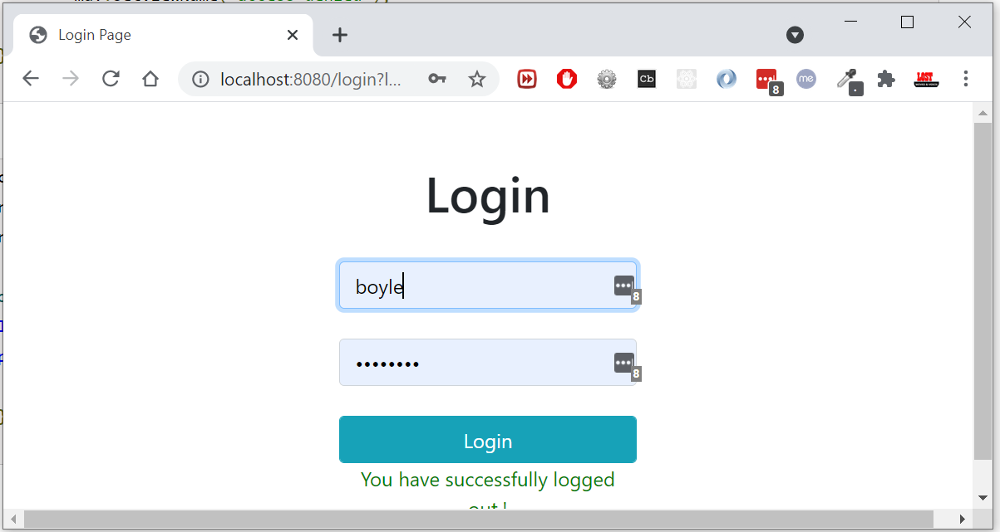

We can access /all , /view\*\* - with out login. But for /addEmployee,
/saveEmployee user must login with LDAP credencials.


<br>


<br>


## 6. Spring Security – JWT Authentication

### What is JWT Authentication

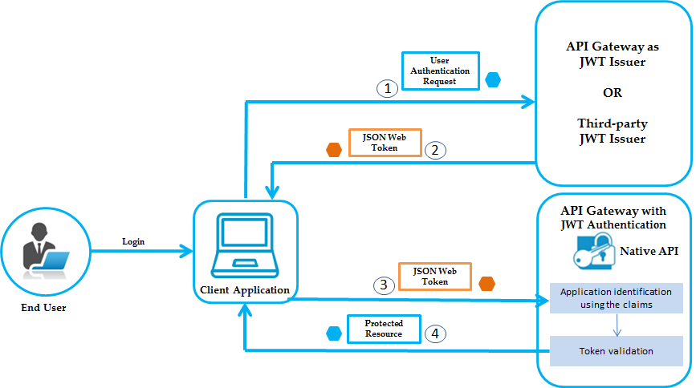

By using JWT authentication you no longer have to store user information in a
session to authenticate each request. Instead, we send this information with
each request along with any data we want.

When the client logs in, the server gives them a JSON Web Token (JWT).
Afterward, the client has to put that token in the Authorization header of each
request after the word *Bearer* and space.

The token has three different **parts, the header, the payload, and the
signature**.

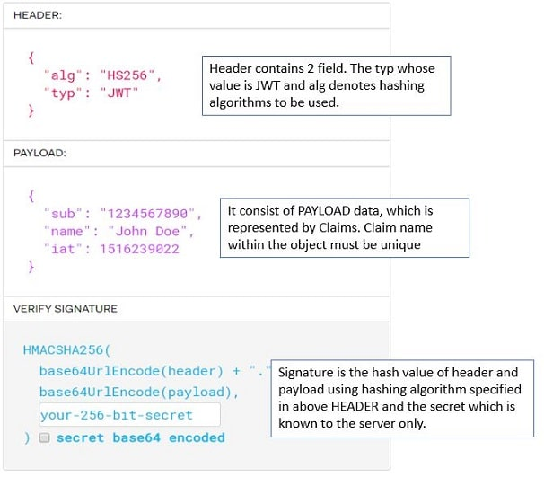


<br>


**Create JWT Token Online**

Will generate JWT Token by using [JWT Online Token
Generator](http://jwtbuilder.jamiekurtz.com/).Provide the payload as given
below: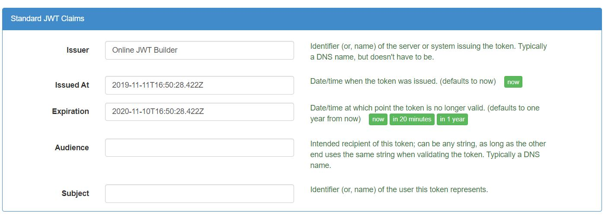Provide
Claim data.We'll have the following
claims in the payload.Sign the payload using the
hashing algorithm.


<br>


### Example

Pom.xml
```java
<dependency>
   <groupId>io.jsonwebtoken</groupId>
   <artifactId>jjwt</artifactId>
   <version>0.9.1</version>
</dependency>
```


We have API for Employee Services
```java
/ 	 	GET 	 Homepage
/login 	 	GET 	 Loginform
/all 	 	GET 	 All Employees 
/saveEmployee 	POST 	 saveEmployee

```


Not much Important for now, Skipping

Ref.
<https://www.tutorialspoint.com/spring_security/spring_security_with_jwt.htm>


<br>


## 7. Spring Security – OAuth 2.0 SSO Authentication

Spring Boot 2.x provides full auto-configuration for OAuth2 login. We just need
to configure client id and client secret for OAuth2 provider such as GitHub,
Facebook and Google in **application.property** file and we are done.

We can customize the configuration by overriding methods of
WebSecurityConfigurerAdapter and using HttpSecurity.oauth2Login() method
introduced in Spring 5.0.

We need to create a bean for ClientRegistrationRepository to override OAuth2
property value.  
Here on this page we will create a Spring Boot Security application for OAuth2
login using GitHub, Facebook and Google authentication provider.  

```xml
<dependency>
	<groupId>org.springframework.boot</groupId>
	<artifactId>spring-boot-starter-oauth2-client</artifactId>
</dependency>
```


### Example

1.Genetrate github API Keys by going <https://github.com/settings/developers>

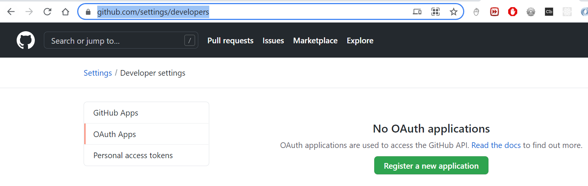


redirect URI as
```xml
http://localhost:8080/login/oauth2/code/github
http://localhost:8081/login/oauth2/code/google
http://localhost:8081/login/oauth2/code/facebook
```

Watch this : <https://www.youtube.com/watch?v=R9lxXQcy-nM>

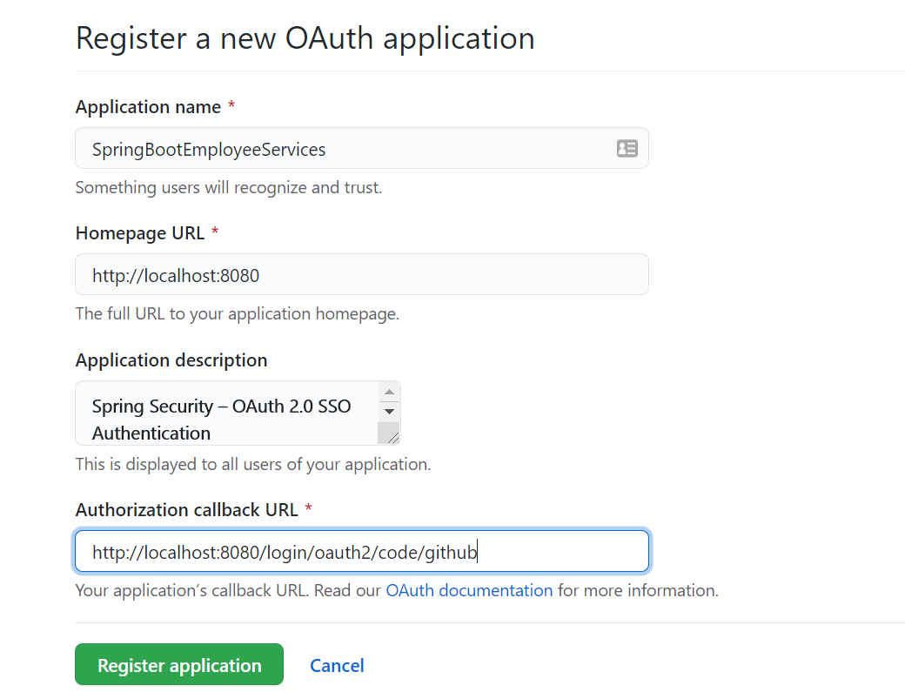


<br>


2.Update **application.properties**
```xml
spring.security.oauth2.client.registration.google.client-id=\<your client id\>
spring.security.oauth2.client.registration.google.client-secret=\<your client
secret\>

spring.security.oauth2.client.registration.facebook.client-id=\<your client id\>
spring.security.oauth2.client.registration.facebook.client-secret=\<your client
secret\>

spring.security.oauth2.client.registration.github.client-id=4d381Dummy
spring.security.oauth2.client.registration.github.client-secret=2876951aSercrit
```


<br>


3. Update Login Page

```xml
<a href=" /oauth2/authorization/github">Login with GitHub</a>
```


<br>


`4.CustomOAuth2User.java`

this class extends OAuthUser interface as defined by Spring OAuth2 API. this
class wraps an instance of **OAuth2User**, which will be passed by Spring OAuth2
upon successful OAuth authentication. And we override the **getName()** method
to return **username** associated with GitHub account.  
 ```java
public class CustomOAuth2User implements OAuth2User {
	private OAuth2User oauth2User;
	
	public CustomOAuth2User(OAuth2User oauth2User) {
		this.oauth2User = oauth2User;
	}
	@Override
	public Map<String, Object> getAttributes() {
		return oauth2User.getAttributes();
	}
	@Override
	public Collection<? extends GrantedAuthority> getAuthorities() {
		return oauth2User.getAuthorities();
	}
	@Override
	public String getName() {
		return oauth2User.getAttribute("name");
	}
}
```

 

<br>


5.CustomOAuth2UserService subclass of DefaultOAuth2UserService. we override
the loadUser() method which will be called by Spring OAuth2 upon successful
authentication, and it returns a new CustomOAuth2User object  
```java
@Service
public class CustomOAuth2UserService extends DefaultOAuth2UserService  {

	@Override
	public OAuth2User loadUser(OAuth2UserRequest userRequest) throws OAuth2AuthenticationException {
		OAuth2User user =  super.loadUser(userRequest);
		return new CustomOAuth2User(user);
	}
}
```

 

<br>


6.OAuth2AuthenticationSecurityConfig To integrate single sign on with GitHub
with traditional username and password login, update configuration for Spring
security as follows   
```java
@Configuration
@EnableWebSecurity
public class OAuth2AuthenticationSecurityConfig extends WebSecurityConfigurerAdapter {
	
	@Autowired
	private CustomOAuth2UserService userService;

	@Override
	protected void configure(HttpSecurity http) throws Exception {
		http.authorizeRequests().antMatchers("/", "/login").permitAll()
		.and()
		.formLogin()
		.loginPage("/login")
		.loginProcessingUrl("/authenticateTheUser")
		.permitAll()
		.and()
		.logout()
		.permitAll()
       .and()
              .oauth2Login()
              .loginPage("/login")
              .userInfoEndpoint()
              .userService(userService);
	}
}
```


<br>


7.Test Login using GitHub

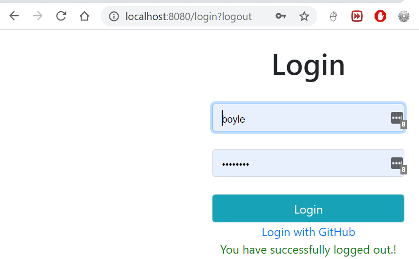

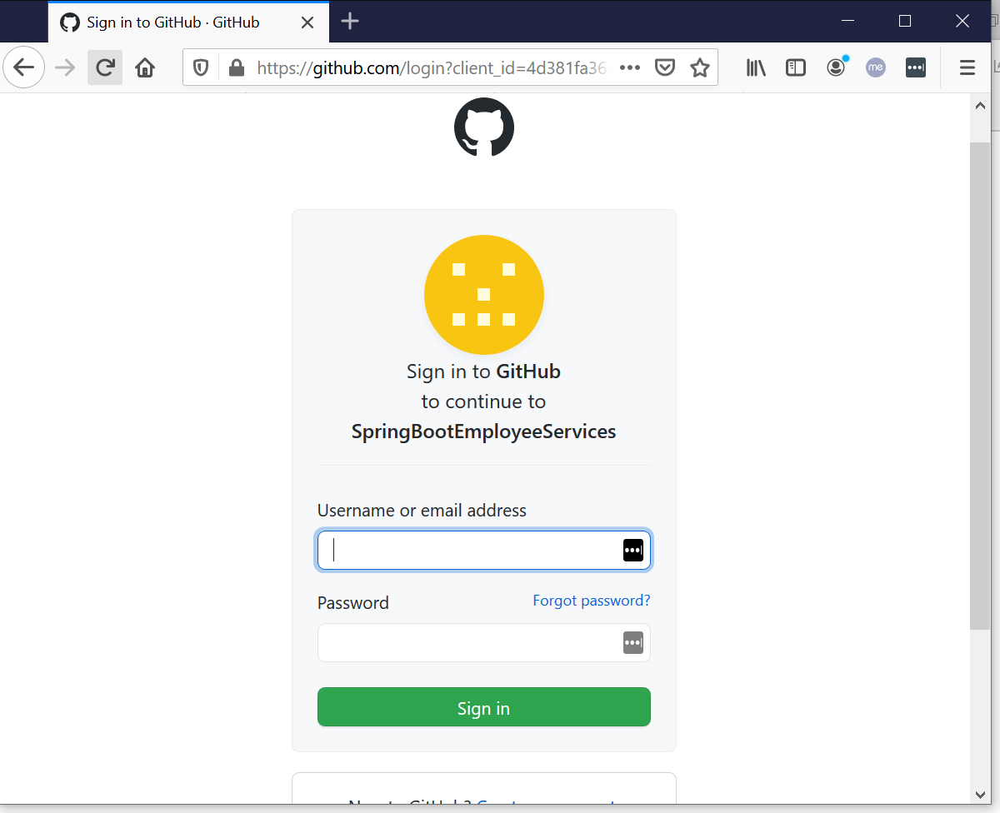

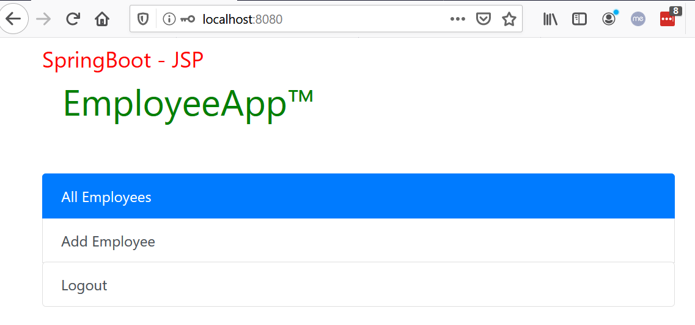


## 8. Spring Security – Summary 

To customize Spring Security, we need a configuration class annotated with
**@EnableWebSecurity** annotation in our classpath. Also, to simplify the
customization process, the framework exposes a **WebSecurityConfigurerAdapter**
class.

We will extend this adapter and override both of its functions so as to:

-   **Configure** the authentication manager with the correct provider

-   **Configure** web security (public URLs, private URLs, authorization, etc.)


```java
@EnableWebSecurity
public class SecurityConfig extends WebSecurityConfigurerAdapter {

    @Override
    protected void configure(AuthenticationManagerBuilder auth) throws Exception {
        // TODO configure authentication manager
    }

    @Override
    protected void configure(HttpSecurity http) throws Exception {
        // TODO configure web security
    }
}
```

## 9.Spring Security – Ref.

<https://www.studytonight.com/spring-framework/spring-security-introduction>

<https://www.section.io/engineering-education/an-all-in-one-spring-security-crash-course-for-java-developers/>

<https://www.concretepage.com/spring-5/spring-security-ldap-authentication>

<https://medium.com/codeops/spring-boot-security-ldap-example-1ce1bdfc5816>

<https://www.logicbig.com/tutorials/spring-framework/spring-security.html>

<https://examples.javacodegeeks.com/enterprise-java/spring/boot/spring-boot-in-memory-basic-authentication-example/>

<https://www.techgeeknext.com/spring/spring-boot-security-token-authentication-jwt>

<https://www.baeldung.com/spring-security-5-oauth2-login>

<https://www.codejava.net/frameworks/spring-boot/oauth2-login-with-github-example>
