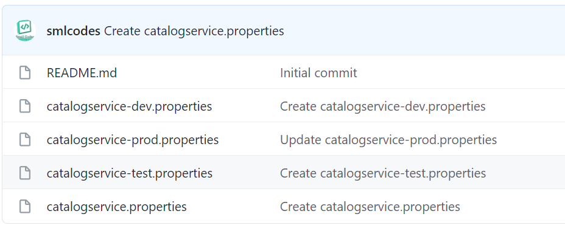
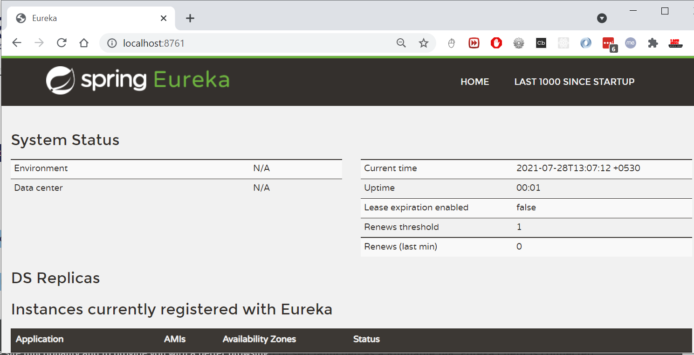

# SpringBoot Cloud – Microservices 

The major use-case for Spring Cloud is the ready-to-use solution that it
provides to common problems observed in distributed environments like load
balancing, service discovery, circuit breaking, etc., which can easily be
integrated in an existing Spring project.

Before we look at Spring Cloud, let’s have a brief overview on Microservice
Architecture and the role of Spring Boot in creating microservices.

<https://github.com/sivaprasadreddy/spring-boot-microservices-series>

## Microservices

#### Monoliths

Traditionally we are building large enterprise applications in modularised
fashion, but finally deploy them together as a single deployment unit (EAR or
WAR). These are called Monolithic applications.

There are some issues with the monolithic architecture such as:

-   Large codebases become mess over the time

-   Multiple teams working on single codebase become tedious

-   It is not possible to scale up only certain parts of the application

-   Technology updates/rewrites become complex and expensive tasks

Microservice architecture is a style of application development where the
application is broken down into small services and these services have loose
coupling among them. Following are the major advantages of using microservice
architecture −

**Advantages of MicroServices**

-   Comprehending smaller codebase is easy

-   Can independently scale up highly used services

-   Each team can focus on one (or few) MicroService(s)

-   Technology updates/rewrites become simpler

SpringBoot and SpringCloud are a good choice for MicroServices

 

# 1. Spring Cloud

Spring Cloud provides a collection of components which are useful in building
distributed applications in cloud. We can develop these components on our own,
however that would waste time in developing and maintaining this boilerplate
code.

That is where Spring Cloud comes into picture. It provides ready-to-use cloud
patterns for common problems which are observed in a distributed environment.
Some of the patterns which it attempts to address are −

-   Distributed Messaging

-   Load Balancing

-   Circuit Breakers

-   Routing

-   Distributed Logging

-   Service Registration

-   Distributed Lock

-   Centralized Configuration

 

#### Spring Cloud Components

Let us now take a look at the various components which Spring Cloud provides and
the problems these components solve

| **Problem**                         | **Components**                                                           |
|-------------------------------------|--------------------------------------------------------------------------|
| **Distributed Cloud Configuration** | Spring Cloud Configuration, Spring Cloud Zookeeper, Spring Consul Config |
| **Distributed Messaging**           | Spring Stream with Kafka, Spring Stream with RabbitMQ                    |
| **Service Discovery**               | Spring Cloud Eureka, Spring Cloud Consul, Spring Cloud Zookeeper         |
| **Logging**                         | Spring Cloud Zipkin, Spring Cloud Sleuth                                 |
| **Spring Service Communication**    | Spring Hystrix, Spring Ribbon, Spring Feign, Spring Zuul                 |

 

### Projects Of Spring Cloud 

**Spring Cloud Config Server:** Configuring application properties, environment
details etc. We can use Spring Cloud Config Server with git or Consul or
ZooKeeper as config repository.

**Service Registry and Discovery:** As there could be many services and we need
the ability to scale up or down dynamically, we need Service Registry and
Discovery mechanism so that service-to-service communication should not depend
on hard-coded hostnames and port numbers. Spring Cloud provides Netflix
Eureka-based Service Registry and Discovery support with just minimal
configuration. We can also use Consul or ZooKeeper for Service Registry and
Discovery.

**Circuit Breaker:** In microservices based architecture, one service might
depend on another service and if one service goes down then failures may cascade
to other services as well. Spring Cloud provides Netflix Hystrix based Circuit
Breaker to handle these kinds of issues.

**Spring Cloud Data Streams:** These days we may need to work with huge volumes
of data streams using Kafka or Spark etc. Spring Cloud Data Streams provides
higher-level abstractions to use those frameworks in an easier manner.

**Spring Cloud Security:** Some of the microservices needs to be accessible to
authenticated users only and most likely we might want a **Single Sign-On**
feature to propagate the authentication context across services. Spring Cloud
Security provides authentication services using **OAuth2**.

**Distributed Tracing:** simple end-user action might trigger a chain of
microservice calls, there should be a mechanism to trace the related call
chains. We can use Spring Cloud Sleuth with Zipkin to trace the cross-service
invocations.

**Spring Cloud Contract:** There is a high chance that separate teams work on
different microservices. There should be a mechanism for teams to agree upon API
endpoint contracts so that each team can develop their APIs independently.
Spring Cloud Contract helps to create such contracts and validate them by both
service provider and consumer.

### 1. Spring Cloud Config Server

SpringBoot provides lot of flexibility in externalizing configuration properties
via properties or YAML files. We can also configure properties for each
environment (dev, qa, prod etc) separately using profile specific configuration
files such as **application.properties**, **application-dev.properties**,
**application-prod.properties** etc. But once the application is started we can
not update the properties at runtime. If we change the properties we need to
restart the application to use the updated configuration properties.

We can create a Spring Cloud Config Server which provides the configuration
values for all of our microservices. We can use **git**, **svn**, **database**
or **Consul** as a backend to store the configuration parameters.

Spring Cloud Config Server is nothing but a SpringBoot application with a
configured configuration properties source. The configuration source can be a
**git** repository, **svn** repository or Consul service
(<https://www.consul.io/>).

Then we can configure the location of Spring Cloud Config server in our
microservice so that it will load all the properties when we start the
application. In addition to that, whenever we update the properties we can
invoke **/refresh** REST endpoint in our microservice so that it will reload the
configuration changes without requiring to restart the application.

 

# 1. SpringCloud – Example 

We are going to build a simple shopping cart application and assume we are going
to start with the following microservices:

1.  **catalog-service:** It provides REST API to provide catalog information
    like products.

2.  **inventory-service:** It provides REST API to manage product inventory.

3.  **cart-service:** It provides REST API to hold the customer cart details.

4.  **order-service:** It provides REST API to manage orders.

5.  **customer-service:** It provides REST API to manage customer information.

6.  **shoppingcart-ui:** It is customer facing front-end web application.

We are going to build various services and REST endpoints as we go through
various microservice concepts.

 

## a.Catalog-Service

Create a SpringBoot app with **Web, JPA, MySQL, Actuator, DevTools, Lombok**
starters

#### Database : MySQL as Docker Container 

We are going to use Docker and run MySQL as a Docker container.

`docker-compose.yml`

~~~~~~~~~~~~~~~~~~~~~~~~~~~~~~~~~~~~~~~~~~~~~~~~~~~~~~~~~~~~~~~~~~~~~~~~~~~ yaml
version: '3'
services:
  mysqldb:
    image: 'mysql:5.7'
    container_name: mysqldb
    ports:
      - '3306:3306'
    environment:
      MYSQL_ROOT_PASSWORD: passw0rd
      MYSQL_DATABASE: catalog
~~~~~~~~~~~~~~~~~~~~~~~~~~~~~~~~~~~~~~~~~~~~~~~~~~~~~~~~~~~~~~~~~~~~~~~~~~~~~~~~

 

Download & Start MySQL Docker container

`docker-compose up`

 

Open any MySQL Editor & provide login details

~~~~~~~~~~~~~~~~~~~~~~~~~~~~~~~~~~~~~~~~~~~~~~~~~~~~~~~~~~~~~~~~~~~~~~~~~~~~ sql
  `products` (
	`id` (20)  ,
	`code` (255)    'latin1_swedish_ci',
	`description` (255)     'latin1_swedish_ci',
	`name` (255)    'latin1_swedish_ci',
	`price`   ,
	  (`id`)  ,
	  `UK_57ivhy5aj3qfmdvl6vxdfjs4p` (`code`)  
)
='latin1_swedish_ci'
=
;
~~~~~~~~~~~~~~~~~~~~~~~~~~~~~~~~~~~~~~~~~~~~~~~~~~~~~~~~~~~~~~~~~~~~~~~~~~~~~~~~

 

`application.properties`

~~~~~~~~~~~~~~~~~~~~~~~~~~~~~~~~~~~~~~~~~~~~~~~~~~~~~~~~~~~~~~~~~~~~~~~~~~~~~~~~
server.port=8181
logging.level.catalog=debug
 
spring.datasource.driver-class-name=com.mysql.jdbc.Driver
spring.datasource.url=jdbc:mysql://localhost:3306/catalog?useSSL=false
spring.datasource.username=root
spring.datasource.password=passw0rd
 
spring.datasource.initialization-mode=always
spring.jpa.hibernate.ddl-auto=update
spring.jpa.show-sql=true
 
//expose all the Actuator endpoints
management.endpoints.web.exposure.include=*
~~~~~~~~~~~~~~~~~~~~~~~~~~~~~~~~~~~~~~~~~~~~~~~~~~~~~~~~~~~~~~~~~~~~~~~~~~~~~~~~

 

 

**Pom.xml**

~~~~~~~~~~~~~~~~~~~~~~~~~~~~~~~~~~~~~~~~~~~~~~~~~~~~~~~~~~~~~~~~~~~~~~~~~~~~ xml
<?xml version= encoding=?>
<project xmlns= xmlns:xsi=
	xsi:schemaLocation=>
	<modelVersion>4.0.0</modelVersion>
	<parent>
		<groupId>org.springframework.boot</groupId>
		<artifactId>spring-boot-starter-parent</artifactId>
		<version>2.5.3</version>
		<relativePath/> <!-- lookup parent from repository -->
	</parent>
	<groupId>catalog</groupId>
	<artifactId>catalog-service</artifactId>
	<version>0.0.1-SNAPSHOT</version>
	<name>catalog-service</name>
	<description>Demo project for Spring Boot</description>
	<properties>
		<java.version>11</java.version>
	</properties>
	<dependencies>
		<dependency>
			<groupId>org.springframework.boot</groupId>
			<artifactId>spring-boot-starter-actuator</artifactId>
		</dependency>
		<dependency>
			<groupId>org.springframework.boot</groupId>
			<artifactId>spring-boot-starter-data-jpa</artifactId>
		</dependency>
		<dependency>
			<groupId>org.springframework.boot</groupId>
			<artifactId>spring-boot-starter-web</artifactId>
		</dependency>

		<dependency>
			<groupId>org.springframework.boot</groupId>
			<artifactId>spring-boot-devtools</artifactId>
			<scope>runtime</scope>
			<optional>true</optional>
		</dependency>
		<dependency>
			<groupId>mysql</groupId>
			<artifactId>mysql-connector-java</artifactId>
			<scope>runtime</scope>
		</dependency>
		<dependency>
			<groupId>org.projectlombok</groupId>
			<artifactId>lombok</artifactId>
			<optional>true</optional>
		</dependency>
		<dependency>
			<groupId>org.springframework.boot</groupId>
			<artifactId>spring-boot-starter-test</artifactId>
			<scope>test</scope>
		</dependency>
	</dependencies>

	<build>
		<plugins>
			<plugin>
				<groupId>org.springframework.boot</groupId>
				<artifactId>spring-boot-maven-plugin</artifactId>
				<configuration>
					<excludes>
						<exclude>
							<groupId>org.projectlombok</groupId>
							<artifactId>lombok</artifactId>
						</exclude>
					</excludes>
				</configuration>
			</plugin>
		</plugins>
	</build>

</project>
~~~~~~~~~~~~~~~~~~~~~~~~~~~~~~~~~~~~~~~~~~~~~~~~~~~~~~~~~~~~~~~~~~~~~~~~~~~~~~~~

 

~~~~~~~~~~~~~~~~~~~~~~~~~~~~~~~~~~~~~~~~~~~~~~~~~~~~~~~~~~~~~~~~~~~~~~~~~~~ java
 catalog.entity;

 lombok.Data;
 javax.persistence.*;

@Data
@Entity
@Table(name = "products")
  Product {
	@Id
	@GeneratedValue(strategy = GenerationType.)
	 Long id;
	
	@Column(nullable = , unique = )
	 String code;
	
	@Column(nullable = )
	 String name;
	
	 String description;
	
	  price;

	
	
}
~~~~~~~~~~~~~~~~~~~~~~~~~~~~~~~~~~~~~~~~~~~~~~~~~~~~~~~~~~~~~~~~~~~~~~~~~~~~~~~~

 

~~~~~~~~~~~~~~~~~~~~~~~~~~~~~~~~~~~~~~~~~~~~~~~~~~~~~~~~~~~~~~~~~~~~~~~~~~~ java
 catalog.repository;
  
  ProductRepository  JpaRepository<Product, Long> {
    Optional<Product> findByCode(String code);
}
~~~~~~~~~~~~~~~~~~~~~~~~~~~~~~~~~~~~~~~~~~~~~~~~~~~~~~~~~~~~~~~~~~~~~~~~~~~~~~~~

 

~~~~~~~~~~~~~~~~~~~~~~~~~~~~~~~~~~~~~~~~~~~~~~~~~~~~~~~~~~~~~~~~~~~~~~~~~~~ java
@Service
@Transactional
@Slf4j
  ProductService {
      ProductRepository productRepository;
 
    @Autowired
     ProductService(ProductRepository productRepository) {
        .productRepository = productRepository;
    }
 
     List<Product> findAllProducts() {
    	
    	List<Product> list =	productRepository.findAll();
    	(Product p : list) {
    		System..println(p.getName());
    	}
    	
         list;
    }
 
     Optional<Product> findProductByCode(String code) {
         productRepository.findByCode(code);
    }
}
~~~~~~~~~~~~~~~~~~~~~~~~~~~~~~~~~~~~~~~~~~~~~~~~~~~~~~~~~~~~~~~~~~~~~~~~~~~~~~~~

 

~~~~~~~~~~~~~~~~~~~~~~~~~~~~~~~~~~~~~~~~~~~~~~~~~~~~~~~~~~~~~~~~~~~~~~~~~~~ java
@RestController
@RequestMapping("/api/products")
@Slf4j
  ProductController {
 
      ProductService productService;
 
    @Autowired
     ProductController(ProductService productService) {
        .productService = productService;
    }
 
    @GetMapping("")
     List<Product> allProducts() {
         productService.findAllProducts();
    }
 
	@GetMapping("/{code}")
	 Product productByCode(@PathVariable String code) {
		 productService.findProductByCode(code).orElseThrow(() ->  ProductNotFoundException("Product with code [" + code + "] doesn't exist"));
	}
}
~~~~~~~~~~~~~~~~~~~~~~~~~~~~~~~~~~~~~~~~~~~~~~~~~~~~~~~~~~~~~~~~~~~~~~~~~~~~~~~~

 

Okay, now we can start our SpringBoot application and hit
<http://localhost:8181/api/products>

 

 

# 2. Spring Cloud Config Server – to Store our Properties 

SpringBoot provides lot of flexibility in externalizing configuration properties
via properties or YAML files. We can also configure properties for each
environment (dev, qa, prod etc) separately using profile specific configuration
files such as **application.properties**, **application-dev.properties**,
**application-prod.properties** etc.

But once the application is started we can not update the properties at runtime.
If we change the properties we need to restart the application to use the
updated configuration properties.

To Solve this, We can use **Spring Cloud Config Server** to centralize all the
applications configuration and use **Spring Cloud Config Client** module from
the applications to consume configuration properties from Config Server. We can
also update the configuration properties at runtime without requiring to restart
the application.

Spring Cloud Config Server is nothing but a SpringBoot application with a
configured configuration properties source. The configuration source can be a
**git** , **svn** or any
repository.

 

Steps to configure Spring Cloud Config Server

1.Create a git repo to store our **properties** with different envromnets.

<https://github.com/smlcodes/SpringConfigServer>

 

2.Let us create a SpringBoot application **spring-cloud-config-server** from
[http://start.spring.io](http://start.spring.io/) by selecting the starters
**Config Server** and **Actuator**.

 

3.To make our SpringBoot application as a SpringCloud Config Server, we just
need to add **@EnableConfigServer** annotation to the main entry point class

~~~~~~~~~~~~~~~~~~~~~~~~~~~~~~~~~~~~~~~~~~~~~~~~~~~~~~~~~~~~~~~~~~~~~~~~~~~ java
@SpringBootApplication
@EnableConfigServer
  SpringCloudConfigServerApplication {

	   main(String[] args) {
		SpringApplication.(SpringCloudConfigServerApplication., args);
	}
}
~~~~~~~~~~~~~~~~~~~~~~~~~~~~~~~~~~~~~~~~~~~~~~~~~~~~~~~~~~~~~~~~~~~~~~~~~~~~~~~~

 

4.configure **git url** property pointing to the git repository in
**application.propertis**

~~~~~~~~~~~~~~~~~~~~~~~~~~~~~~~~~~~~~~~~~~~~~~~~~~~~~~~~~~~~~~~~~~~~~~~~~~~~~~~~
spring.config.name=configserver
server.port=8182
spring.cloud.config.server.git.uri=https://github.com/smlcodes/SpringConfigServer.git
spring.cloud.config.server.git.default-label=main
management.security.enabled=false
~~~~~~~~~~~~~~~~~~~~~~~~~~~~~~~~~~~~~~~~~~~~~~~~~~~~~~~~~~~~~~~~~~~~~~~~~~~~~~~~

 

5.Start the application. Spring Cloud Config Server exposes the **following REST
endpoints** to get application specific configuration properties:

~~~~~~~~~~~~~~~~~~~~~~~~~~~~~~~~~~~~~~~~~~~~~~~~~~~~~~~~~~~~~~~~~~~~~~~~~~~~~~~~
/{application}/{profile}[/{label}]
/{application}-{profile}.yml
/{label}/{application}-{profile}.yml
/{application}-{profile}.properties
/{label}/{application}-{profile}.properties
~~~~~~~~~~~~~~~~~~~~~~~~~~~~~~~~~~~~~~~~~~~~~~~~~~~~~~~~~~~~~~~~~~~~~~~~~~~~~~~~

Here **{application}** refers to value of **spring.config.name** property,
**{profile}** is an active profile and **{label}** is an optional git label
(defaults to “master”).

Now if you access the URL **http://localhost:8182/catalogservice/default** then
you will get the following response with catalogservice **default**
configuration details:

 

Similary we can enviroment propertils like

-   <http://localhost:8182/catalogservice/default>

-   <http://localhost:8182/catalogservice/dev>

-   <http://localhost:8182/catalogservice/test>

-   <http://localhost:8182/catalogservice/prod>

 

 

### Spring Cloud Config Client Example

Let us see how we can create a SpringBoot application and use configuration
properties from Config Server instead of putting them inside the application.

1.Update **catalog-service** with **Config Client,** **Web** and **Actuator**
starters.

~~~~~~~~~~~~~~~~~~~~~~~~~~~~~~~~~~~~~~~~~~~~~~~~~~~~~~~~~~~~~~~~~~~~~~~~~~~~~~~~
		<dependency>
			<groupId>org.springframework.boot</groupId>
			<artifactId>spring-boot-starter-actuator</artifactId>
		</dependency>

		<dependency>
			<groupId>org.springframework.cloud</groupId>
			<artifactId>spring-cloud-starter-config</artifactId>
		</dependency>
		<dependency>
			<groupId>org.springframework.cloud</groupId>
			<artifactId>spring-cloud-starter-bootstrap</artifactId>
		</dependency>
~~~~~~~~~~~~~~~~~~~~~~~~~~~~~~~~~~~~~~~~~~~~~~~~~~~~~~~~~~~~~~~~~~~~~~~~~~~~~~~~

 

**2.Create REST Resource**

Add one **RestController** to view the Server side property values in the
response. And add a method to request/response the perticalur value from
Repository values.

~~~~~~~~~~~~~~~~~~~~~~~~~~~~~~~~~~~~~~~~~~~~~~~~~~~~~~~~~~~~~~~~~~~~~~~~~~~ java
@RefreshScope
@RestController
 SpringCloudConfigClinet{
	
	    @Value("${msg:Config Server is not working. Please check...}")
	     String msg;
	 
	    @GetMapping("/msg")
	     String getMsg() {
	         .msg;
	    }
}
~~~~~~~~~~~~~~~~~~~~~~~~~~~~~~~~~~~~~~~~~~~~~~~~~~~~~~~~~~~~~~~~~~~~~~~~~~~~~~~~

Usually in SpringBoot application we configure properties in
**application.properties.** But while using Spring Cloud Config Server we use
**bootstrap.properties** or **bootstrap.yml** file to configure the URL of
Config Server.

 

Configure the following properties in
**src/main/resources/bootstrap.properties**:

~~~~~~~~~~~~~~~~~~~~~~~~~~~~~~~~~~~~~~~~~~~~~~~~~~~~~~~~~~~~~~~~~~~~~~~~~~~~~~~~
server.port=8181
spring.application.name=catalogservice
spring.cloud.config.uri=http://localhost:8182
management.security.enabled=false
~~~~~~~~~~~~~~~~~~~~~~~~~~~~~~~~~~~~~~~~~~~~~~~~~~~~~~~~~~~~~~~~~~~~~~~~~~~~~~~~

*Note that the value of* **spring.application.name** *property should match with
base filename (catalogservice) in config-repo*

Now run the following catalog-service main entry point class. We can access the
actuator endpoint **http://localhost:8181/env** to see all the configuration
properties.

 

You open <http://localhost:8181/msg> you get property value of msg

Ref.
<https://www.sivalabs.in/2017/08/spring-cloud-tutorials-introduction-to-spring-cloud-config-server/>

Now if we delete the **application.properties** file, the application will works
normally.

 

 **3. Spring Cloud Service Registry and Discovery**

In the microservices world, **Service Registry and Discovery** plays an
important role because we most likely run multiple instances of services and we
need a mechanism to call other services without hardcoding their hostnames or
port numbers.

-   Think of it as a lookup service where microservices (clients) can register
    themselves and discover other registered microservices.

-   When a client microservice registers with Eureka it provides metadata such
    as host, port, and health indicator thus allowing for other microservices to
    discover it.

-   The discovery server expects a regular heartbeat message from each
    microservice instance. If an instance begins to consistently fail to send a
    heartbeat, the discovery server will remove the instance from his registry.

| **Netflix Component Name** | **Functionality**                  |
|----------------------------|------------------------------------|
| Eureka                     | Service Registration and Discovery |
| Ribbon                     | Dynamic Routing and Load Balancer  |
| Hystrix                    | Circuit Breaker                    |
| Zuul                       | Edge Server                        |

Steps to create Netflix Eureka based Service Registry

add **Eureka Server** starter.

~~~~~~~~~~~~~~~~~~~~~~~~~~~~~~~~~~~~~~~~~~~~~~~~~~~~~~~~~~~~~~~~~~~~~~~~~~~~~~~~
<dependency>
    <groupId>org.springframework.cloud</groupId>
    <artifactId>spring-cloud-starter-netflix-eureka-server</artifactId>
</dependency>
~~~~~~~~~~~~~~~~~~~~~~~~~~~~~~~~~~~~~~~~~~~~~~~~~~~~~~~~~~~~~~~~~~~~~~~~~~~~~~~~

 

We need to add **@EnableEurekaServer** annotation on main class to make our
SpringBoot application a Eureka Server based Service Registry.

~~~~~~~~~~~~~~~~~~~~~~~~~~~~~~~~~~~~~~~~~~~~~~~~~~~~~~~~~~~~~~~~~~~~~~~~~~~ java
@SpringBootApplication
@EnableEurekaServer
  SpringCloudEurekaServerApplication {

	   main(String[] args) {
		SpringApplication.(SpringCloudEurekaServerApplication., args);
	}
}
~~~~~~~~~~~~~~~~~~~~~~~~~~~~~~~~~~~~~~~~~~~~~~~~~~~~~~~~~~~~~~~~~~~~~~~~~~~~~~~~

 

By default, each Eureka Server is also a Eureka client and needs at least one
service URL to locate a peer. As we are going to have a single Eureka Server
node (Standalone Mode), we are going to disable this client-side behavior by
configuring the following properties in **application.properties file**.

~~~~~~~~~~~~~~~~~~~~~~~~~~~~~~~~~~~~~~~~~~~~~~~~~~~~~~~~~~~~~~~~~~~~~~~~~~~~~~~~
spring.application.name=service-registry
server.port=8761
eureka.instance.hostname=localhost
eureka.instance.client.registerWithEureka=false
eureka.instance.client.fetchRegistry=false
eureka.instance.client.serviceUrl.defaultZone=http://${eureka.instance.hostname}:${server.port}/eureka/
~~~~~~~~~~~~~~~~~~~~~~~~~~~~~~~~~~~~~~~~~~~~~~~~~~~~~~~~~~~~~~~~~~~~~~~~~~~~~~~~

 

Netflix Eureka Service provides UI where we can see all the details about
registered services.Now run the main class, check url
[**http://localhost:8761/**](http://localhost:8761/)

### Register Catalog-Service to Eureka

Add the **Eureka Discovery** starter to **catalog-service** which will add the
following dependency.

~~~~~~~~~~~~~~~~~~~~~~~~~~~~~~~~~~~~~~~~~~~~~~~~~~~~~~~~~~~~~~~~~~~~~~~~~~~~~~~~
<dependency>
    <groupId>org.springframework.cloud</groupId>
    <artifactId></artifactId>
</dependency>
~~~~~~~~~~~~~~~~~~~~~~~~~~~~~~~~~~~~~~~~~~~~~~~~~~~~~~~~~~~~~~~~~~~~~~~~~~~~~~~~

 

we just need to configure **eureka.client.service-url.defaultZone** property in
**application.properties** to automatically register with the Eureka Server.

~~~~~~~~~~~~~~~~~~~~~~~~~~~~~~~~~~~~~~~~~~~~~~~~~~~~~~~~~~~~~~~~~~~~~~~~~~~~~~~~
eureka.client.service-url.defaultZone=http://localhost:8761/eureka/
~~~~~~~~~~~~~~~~~~~~~~~~~~~~~~~~~~~~~~~~~~~~~~~~~~~~~~~~~~~~~~~~~~~~~~~~~~~~~~~~

 

With this configuration in place, start catalog-service and visit
**http://localhost:8761**. You should see catalog-service is registered with
**SERVICE ID** as **CATALOG-SERVICE**.

 

## b.Inventory-service

Create **inventory-service** SpringBoot application with **Web, JPA, H2/MySQL,
Actuator, Config Client and Eureka Discovery** starters.

~~~~~~~~~~~~~~~~~~~~~~~~~~~~~~~~~~~~~~~~~~~~~~~~~~~~~~~~~~~~~~~~~~~~~~~~~~~~~~~~
  `inventory` (
	`id` (20)  ,
	`quantity` (11)   ,
	`product_code` (255)    'latin1_swedish_ci',
	  (`id`)  ,
	  `UK_40r5uxke3xlbf7qeqfhklx0uc` (`product_code`)  
)
='latin1_swedish_ci'
=
;
~~~~~~~~~~~~~~~~~~~~~~~~~~~~~~~~~~~~~~~~~~~~~~~~~~~~~~~~~~~~~~~~~~~~~~~~~~~~~~~~

 

**Model class**

~~~~~~~~~~~~~~~~~~~~~~~~~~~~~~~~~~~~~~~~~~~~~~~~~~~~~~~~~~~~~~~~~~~~~~~~~~~ java
@Data
@Entity
@Table(name = "inventory")
  InventoryItem {
	@Id
	@GeneratedValue(strategy = GenerationType.)
	 Long id;
	
	@Column(name = "product_code", nullable = , unique = )
	 String productCode;
	
	@Column(name = "quantity")
	 Integer availableQuantity = 0;	
	
}
~~~~~~~~~~~~~~~~~~~~~~~~~~~~~~~~~~~~~~~~~~~~~~~~~~~~~~~~~~~~~~~~~~~~~~~~~~~~~~~~

 

**InventoryItemRepository**

~~~~~~~~~~~~~~~~~~~~~~~~~~~~~~~~~~~~~~~~~~~~~~~~~~~~~~~~~~~~~~~~~~~~~~~~~~~ java
  InventoryItemRepository  JpaRepository<InventoryItem, Long> {
	Optional<InventoryItem> findByProductCode(String productCode);
}
~~~~~~~~~~~~~~~~~~~~~~~~~~~~~~~~~~~~~~~~~~~~~~~~~~~~~~~~~~~~~~~~~~~~~~~~~~~~~~~~

 

**InventoryController**

~~~~~~~~~~~~~~~~~~~~~~~~~~~~~~~~~~~~~~~~~~~~~~~~~~~~~~~~~~~~~~~~~~~~~~~~~~~ java
@RestController
@Slf4j
  InventoryController {
	  InventoryItemRepository inventoryItemRepository;

	@Autowired
	 InventoryController(InventoryItemRepository inventoryItemRepository) {
		.inventoryItemRepository = inventoryItemRepository;
	}

	@GetMapping("/api/inventory/{productCode}")	 
	 ResponseEntity<InventoryItem> findInventoryByProductCode(@PathVariable("productCode") String productCode) {
		.info("Finding inventory for product code :" + productCode);
		Optional<InventoryItem> inventoryItem = inventoryItemRepository.findByProductCode(productCode);
		 (inventoryItem.isPresent()) {
			  ResponseEntity(inventoryItem, HttpStatus.);
		}  {
			  ResponseEntity(HttpStatus.);
		}
	}

	@GetMapping("/api/inventory") 
	 List<InventoryItem> getInventory() {
		.info("Finding inventory for all products ");
		 inventoryItemRepository.findAll();
	}
}
~~~~~~~~~~~~~~~~~~~~~~~~~~~~~~~~~~~~~~~~~~~~~~~~~~~~~~~~~~~~~~~~~~~~~~~~~~~~~~~~

 

**InventoryServiceApplication**

~~~~~~~~~~~~~~~~~~~~~~~~~~~~~~~~~~~~~~~~~~~~~~~~~~~~~~~~~~~~~~~~~~~~~~~~~~~ java
@SpringBootApplication
  InventoryServiceApplication {

	   main(String[] args) {
		SpringApplication.(InventoryServiceApplication., args);
		
		
		System..println(" ");
		System..println("InventoryService ® ™ ");
		System..println(" ");
	
		
		System..println(" ===============================================");
		System..println("http://localhost:9992/api/inventory/");
		System..println(" ===============================================");
	}
}
~~~~~~~~~~~~~~~~~~~~~~~~~~~~~~~~~~~~~~~~~~~~~~~~~~~~~~~~~~~~~~~~~~~~~~~~~~~~~~~~

 

**bootstrap.properties**

~~~~~~~~~~~~~~~~~~~~~~~~~~~~~~~~~~~~~~~~~~~~~~~~~~~~~~~~~~~~~~~~~~~~~~~~~~~~~~~~
server.port=9992
spring.application.name=inventoryservice
spring.cloud.config.uri=http://localhost:501
management.security.enabled=false
eureka.client.service-url.defaultZone=http://localhost:8761/eureka/
~~~~~~~~~~~~~~~~~~~~~~~~~~~~~~~~~~~~~~~~~~~~~~~~~~~~~~~~~~~~~~~~~~~~~~~~~~~~~~~~

Test API : <http://localhost:9992/api/inventory/>

 

Now we can see Invetory Service in Eureka Server

 

Ref. <https://www.sivalabs.in/2018/03/microservices-springcloud-eureka/>

 

 

# 4. Spring Cloud Load balancing 

Lets remove **server.port=9992** from both boostrap & git property file. And
start 2 Inventoy instance manullay.

~~~~~~~~~~~~~~~~~~~~~~~~~~~~~~~~~~~~~~~~~~~~~~~~~~~~~~~~~~~~~~~~~~~~~~~~~~~~~~~~
java -jar -Dserver.port=9898 inventory-service-0.0.1-SNAPSHOT.jar
java -jar -Dserver.port=9899 inventory-service-0.0.1-SNAPSHOT.jar
~~~~~~~~~~~~~~~~~~~~~~~~~~~~~~~~~~~~~~~~~~~~~~~~~~~~~~~~~~~~~~~~~~~~~~~~~~~~~~~~

 

Now you can visit Eureka Dashboard **http://localhost:8761/** and see 3
instances of inventory-service registered.

 

Suppoce we if want to call Inventory Service from Catalog Srervice, which of
above 3 instance will call ?

Suppose we want to invoke inventory-service REST endpoint from catalog-service.
We can use **RestTemplate** to invoke REST endpoint but there are 2 instances
running.

We can register **RestTemplate** as a Spring bean with **@LoadBalanced**
annotation. The RestTemplate with **@LoadBalanced** annotation will internally
use **Ribbon LoadBalancer** to resolve the **ServiceID** and invoke REST
endpoint using one of the available servers.

 

**Catalog-service/ CatalogServiceApplication.java**

~~~~~~~~~~~~~~~~~~~~~~~~~~~~~~~~~~~~~~~~~~~~~~~~~~~~~~~~~~~~~~~~~~~~~~~~~~~ java
@SpringBootApplication
  CatalogServiceApplication {
 
    @Bean
    @LoadBalanced
     RestTemplate restTemplate() {
          RestTemplate();
    }
 
       main(String[] args) {
        SpringApplication.run(CatalogServiceApplication., args);
    }
}
~~~~~~~~~~~~~~~~~~~~~~~~~~~~~~~~~~~~~~~~~~~~~~~~~~~~~~~~~~~~~~~~~~~~~~~~~~~~~~~~

 

Use RestTemplate to invoke **inventory-service** endpoint from
**catalog-service/ProductService.java**

~~~~~~~~~~~~~~~~~~~~~~~~~~~~~~~~~~~~~~~~~~~~~~~~~~~~~~~~~~~~~~~~~~~~~~~~~~~ java
@Service
@Transactional
@Slf4j
  ProductService {
      ProductRepository productRepository;
      RestTemplate restTemplate;
    
    @Autowired
     ProductService(ProductRepository productRepository, RestTemplate restTemplate) {
        .productRepository = productRepository;
        .restTemplate = restTemplate;
    }    
    
     Optional<Product> findProductByCode(String code) {
        Optional<Product> productOptional = productRepository.findByCode(code);
        (productOptional.isPresent()) {
            .info("Fetching inventory level for product_code: "+code);
            ResponseEntity<ProductInventoryResponse> itemResponseEntity =
                    restTemplate.getForEntity("http://inventory-service/api/inventory/{code}",
                                                ProductInventoryResponse.,
                                                code);
            (itemResponseEntity.getStatusCode() == HttpStatus.) {
                Integer quantity = itemResponseEntity.getBody().getAvailableQuantity();
                .info("Available quantity: "+quantity);
            }  {
                .error("Unable to get inventory level for product_code: "+code +
                ", StatusCode: "+itemResponseEntity.getStatusCode());
            }
        }
         productOptional;
    }
}
~~~~~~~~~~~~~~~~~~~~~~~~~~~~~~~~~~~~~~~~~~~~~~~~~~~~~~~~~~~~~~~~~~~~~~~~~~~~~~~~

Note that we have used **http://inventory-service/api/inventory/{code}** instead
of **http://localhost:9898/api/inventory/{code}** or
**http://localhost:9999/api/inventory/{code}**

 

With this kind of automatic Service Registration and Discovery mechanism, we no
need to worry about how many instances are running and what are their hostnames
and ports etc.

 

 

# 5. Spring Cloud Circuit Breaker using Netflix Hystrix

In the microservices world, to fulfill a client request one microservice may
need to talk to other microservices. We should minimize this kind of direct
dependencies on other microservices but in some cases it is unavoidable. If a
microservice is down or not functioning properly then the issue may cascade up
to the upstream services.

Netflix created Hystrix library implementing [Circuit
Breaker](https://martinfowler.com/bliki/CircuitBreaker.html) pattern to address
these kinds of issues. We can use **Spring Cloud Netflix Hystrix Circuit
Breaker** to protect microservices from cascading failures.

 

 

### Steps to Spring Cloud Circuit Breaker using Netflix Hystrix

From **catalog-service** we are invoking REST endpoint on **inventory-service**
to get the inventory level of a product. What if inventory-service is down? What
if inventory-service is taking too long to respond thereby slowing down all the
services depending on it? We would like to have some **timeouts** and implement
some **fallback mechanism**.

Add **Hystrix** starter to catalog-service.

~~~~~~~~~~~~~~~~~~~~~~~~~~~~~~~~~~~~~~~~~~~~~~~~~~~~~~~~~~~~~~~~~~~~~~~~~~~~~~~~
<dependency>
    <groupId>org.springframework.cloud</groupId>
    <artifactId>spring-cloud-starter-netflix-hystrix</artifactId>
</dependency>
~~~~~~~~~~~~~~~~~~~~~~~~~~~~~~~~~~~~~~~~~~~~~~~~~~~~~~~~~~~~~~~~~~~~~~~~~~~~~~~~

 

To enable Circuit Breaker add **@EnableCircuitBreaker** annotation on
catalog-service entry-point class.

~~~~~~~~~~~~~~~~~~~~~~~~~~~~~~~~~~~~~~~~~~~~~~~~~~~~~~~~~~~~~~~~~~~~~~~~~~~ java
@SpringBootApplication
@EnableCircuitBreaker
  CatalogServiceApplication {

	@Bean
	@LoadBalanced
	 RestTemplate restTemplate() {
		  RestTemplate();
	}
	
	   main(String[] args) {
		SpringApplication.(CatalogServiceApplication., args);
	}
}
~~~~~~~~~~~~~~~~~~~~~~~~~~~~~~~~~~~~~~~~~~~~~~~~~~~~~~~~~~~~~~~~~~~~~~~~~~~~~~~~

 

~~~~~~~~~~~~~~~~~~~~~~~~~~~~~~~~~~~~~~~~~~~~~~~~~~~~~~~~~~~~~~~~~~~~~~~~~~~ java
@Service
@Slf4j
  InventoryServiceClient {
      RestTemplate restTemplate;
 
    @Autowired
     InventoryServiceClient(RestTemplate restTemplate) {
        .restTemplate = restTemplate;
    }
 
    @HystrixCommand(fallbackMethod = "getDefaultProductInventoryByCode")
     Optional<ProductInventoryResponse> getProductInventoryByCode(String productCode)
    {
        ResponseEntity<ProductInventoryResponse> itemResponseEntity =
                restTemplate.getForEntity("http://inventory-service/api/inventory/{code}",
                        ProductInventoryResponse.,
                        productCode);
         (itemResponseEntity.getStatusCode() == HttpStatus.) {
             Optional.(itemResponseEntity.getBody());
        }  {
            .error("Unable to get inventory level for product_code: " + productCode + ", StatusCode: " + itemResponseEntity.getStatusCode());
             Optional.();
        }
    }
 
    @SuppressWarnings("unused")
    Optional<ProductInventoryResponse> getDefaultProductInventoryByCode(String productCode) {
        .info("Returning default ProductInventoryByCode for productCode: "+productCode);
        ProductInventoryResponse response =  ProductInventoryResponse();
        response.setProductCode(productCode);
        response.setAvailableQuantity(50);
         Optional.(response);
    }
}
~~~~~~~~~~~~~~~~~~~~~~~~~~~~~~~~~~~~~~~~~~~~~~~~~~~~~~~~~~~~~~~~~~~~~~~~~~~~~~~~

We have annotated the method from where we are making a REST call with
**@HystrixCommand(fallbackMethod = “getDefaultProductInventoryByCode”)** so that
if it doesn’t receive the response within the certain time limit the call gets
timed out and invoke the configured fallback method.

The fallback method should be defined in the same class and should have the same
signature. In the fallback method **getDefaultProductInventoryByCode()** we are
setting the **availableQuantity** to 50, obviously, this behavior depends on
what business wants.

Spring Cloud also provides a nice dashboard to monitor the status of Hystrix
commands. Create a Spring Boot application with **Hystrix Dashboard** starter
and annotate the main entry-point class with **@EnableHystrixDashboard**.

~~~~~~~~~~~~~~~~~~~~~~~~~~~~~~~~~~~~~~~~~~~~~~~~~~~~~~~~~~~~~~~~~~~~~~~~~~~~~~~~
<dependency>
    <groupId>org.springframework.cloud</groupId>
    <artifactId>spring-cloud-starter-netflix-hystrix-dashboard</artifactId>
</dependency>
~~~~~~~~~~~~~~~~~~~~~~~~~~~~~~~~~~~~~~~~~~~~~~~~~~~~~~~~~~~~~~~~~~~~~~~~~~~~~~~~

 

Now in Hystrix Dashboard home page enter
**http://localhost:8181/actuator/hystrix.stream** as stream URL and give Catalog
Service as Title and click on Monitor Stream
button.

 

 

# 6. Spring Cloud Zuul Proxy as API Gateway

Spring Cloud provides Zuul proxy, similar to **Nginx**, that can be used to
create API Gateway.

API Gateway, aka Edge Service, provides a unified interface for a set of
microservices so that clients no need to know about all the details of
microservices internals. However, there are some pros and cons of using API
Gateway pattern in microservices architecture.

**Pros:**

-   Provides easier interface to clients

-   Can be used to prevent exposing the internal microservices structure to
    clients

-   Allows to refactor microservices without forcing the clients to refactor
    consuming logic

-   Can centralize cross-cutting concerns like security, monitoring, rate
    limiting etc

**Cons:**

-   It could become a single point of failure if proper measures are not taken
    to make it highly available

-   Knowledge of various microservice API may creep into API Gateway

 

 

# 7. Distributed Tracing with Spring Cloud Sleuth and Zipkin

One of the challenges in microservices architecture is the ability to debug
issues. A simple user action might trigger a chain of downstream microservice
calls. It would be tedious to trace the logs related to a particular user action
across microservices.

We can use [Spring Cloud
Sleuth](http://cloud.spring.io/spring-cloud-static/Finchley.M7/single/spring-cloud.html#_spring_cloud_sleuth)
to handle these kinds of issues. Spring Cloud Sleuth provides the distributed
tracing capabilities and we can also export these trace information to
[Zipkin](https://zipkin.io/) to visualize the call traces.

 

 

### Ref.

<https://www.sivalabs.in/2018/03/microservices-using-springboot-spring-cloud-part-1-overview/>

<https://github.com/sivaprasadreddy/spring-boot-microservices-series>
