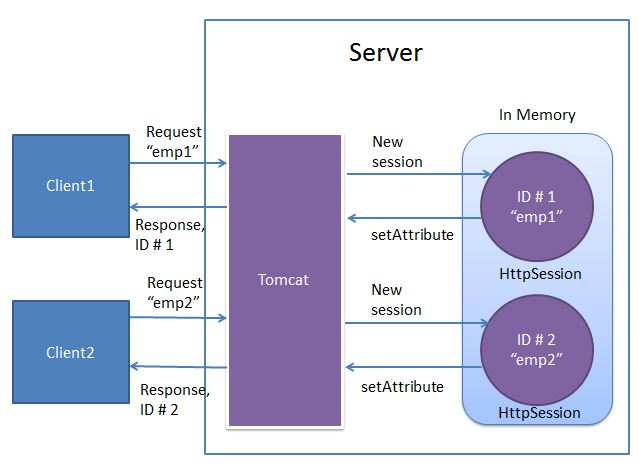
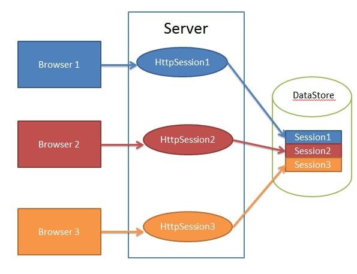
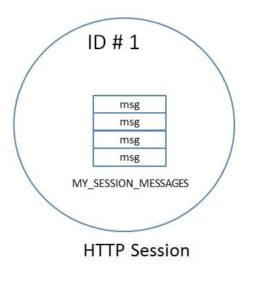
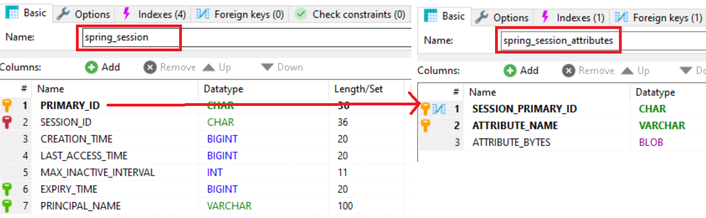
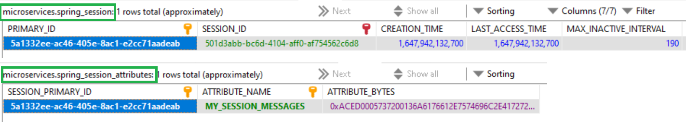

# SpringBoot – Session Management

We all know that **HTTP is a stateless protocol**. All requests and responses
are independent. The server cannot distinguish between new visitors and
returning visitors. But sometimes we may need to keep track of client's activity
across multiple requests. This is achieved using Session Management. It is a
mechanism used by the Web container to store session information for a
particular user.  
Session management can be achieved in one of the following ways-

-   Cookies

-   Hidden form field

-   URL Rewriting

-   HttpSession

In this example we will be making use of HttpSession to achieve Session
management. Also we will be using the **Spring Session module.** Spring Session
consists of the following modules:

-   **Spring Session Core -** provides core Spring Session functionalities and
    APIs

-   **Spring Session Data Redis -** provides `SessionRepository` and
    `ReactiveSessionRepository` implementation backed by Redis and configuration
    support

-   **Spring Session JDBC -** provides `SessionRepository` implementation backed
    by a relational database and configuration support

-   **Spring Session Hazelcast -** provides `SessionRepository` implementation
    backed by Hazelcast and configuration support

here we will be using **Spring Session JDBC** to store spring session
information. By default, Apache Tomcat stores HTTP session objects in memory.  


In order to achieve writing the session objects to MySQL database, **we dont
have to write any code**. Spring Boot provides us this functionality out of the
box by specifying the following configuration property

`spring.session.store-type=jdbc`

**Spring session** replaces the `HttpSession` implementation by a custom
implementation. To perform this task spring session creates a
SessionRepositoryFilter bean named as springSessionRepositoryFilter.  


Example

```java
		<dependency>
			<groupId>org.springframework.session</groupId>
			<artifactId>spring-session-core</artifactId>
		</dependency>
		<dependency>
			<groupId>org.springframework.session</groupId>
			<artifactId>spring-session-jdbc</artifactId>
		</dependency>
```

```java
@RestController
public class SpringSessionController {

	@GetMapping("/")
	public List<String> process(Model model, HttpSession session) {
		@SuppressWarnings("unchecked")
		List<String> messages = session.getAttribute("MY_SESSION_MESSAGES");

		if (messages == null) {
			messages = new ArrayList<>();
		}
		model.addAttribute("sessionMessages", messages);

		return messages;
	}

	@PostMapping("/persistMessage")
	public List<String> persistMsg(@RequestParam("msg") String msg, HttpServletRequest request) {
		
	List<String> messages = request.getSession().getAttribute("MY_SESSION_MESSAGES");
		if (messages == null) {
			messages = new ArrayList<>();
			request.getSession().setAttribute("MY_SESSION_MESSAGES", messages);
		}
		messages.add(msg);
		request.getSession().setAttribute("MY_SESSION_MESSAGES", messages);
		return messages;
	}

	@PostMapping("/destroy")
	public String destroySession(HttpServletRequest request) {
		request.getSession().invalidate();
		return "Session Destroyed";
	}
}
```

So if not already present, we create an ArrayList named `MY_SESSION_MESSAGES` in
a HTTPSession and persist messages in this list  


Application.properties

```java
spring.datasource.url= jdbc:mysql://localhost:3306/microservices?useSSL=false
spring.datasource.username= root
spring.datasource.password= root
spring.jpa.properties.hibernate.dialect= org.hibernate.dialect.MySQL5InnoDBDialect
# Hibernate ddl auto (create, create-drop, validate, update)
spring.jpa.hibernate.ddl-auto= update
 
spring.session.store-type=jdbc
spring.session.jdbc.initialize-schema=always
server.servlet.session.timeout=90s
```

How it works

On Starting the application Spring Session creates 2 tables for storing session
related information.( **spring_session, spring_session_attributes**)



Instead of Storing session data in browser, it will store in DB. We can retrieve
all attributes by comaparing SESSION_ID from HTTP Headers & Database SESSION_ID.

The Data in database will be removed after session timeout or Session close

`server.servlet.session.timeout=90s`


