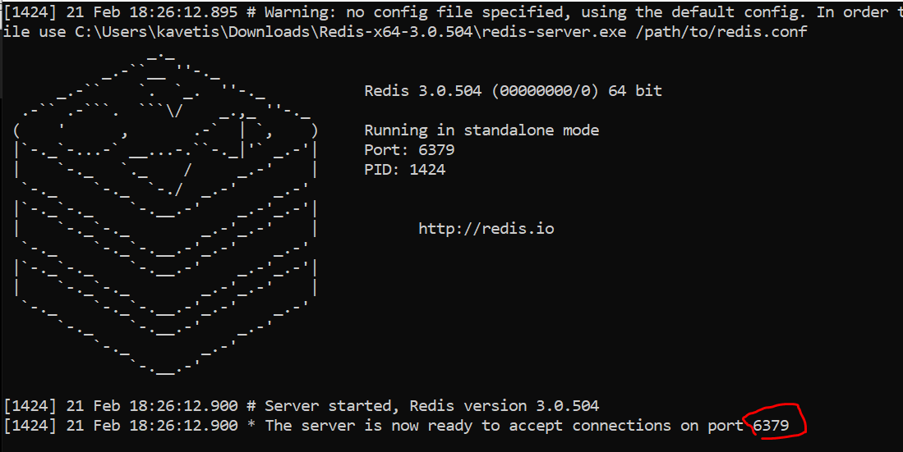

# Spring Data Redis

Spring Data Redis - Spring Boot Cache with Redis is used to reduce the no.of
round trips between Application & Database


When we perform a DB retrieve operation via an Application, the Redis Cache
stores the result in it’s cache. Further, when we perform the same retrieve
operation, it returns the result from the cache itself and ignore the second
call to database.

**What is Redis Database?**

-   Redis Database is an in-memory database that persists on **disk**. It means
    when we use Redis Database, we occupy **a memory on the disk** to use as a
    Database.

-   The data model is **key-value**, but many several kind of values are
    supported such as Strings, Lists, Sets, Sorted Sets, Hashes, Streams,
    HyperLogLogs, Bitmaps etc.

**What is Redis Server?**

The full form of Redis is **RE**mote **DI**ctionary **S**erver. When we use
Redis in any form such as database, cache or Message Broker, we need to download
a Redis Server in our system. People in the industry just call it Redis Server.

-   Visit any of the link below to download Redis  
    [Download Redis
    Server](https://github.com/microsoftarchive/redis/releases/tag/win-3.2.100)
    : version 3.2.100  
    [Download Redis Server](https://github.com/tporadowski/redis/releases) :
    version 5.0.10

-   unzip ‘Redis-x64-5.0.10’, you will find redis-server.exe

-   In order to start Redis Server, double click on ‘redis-server.exe’ to start
    Redis Server



**@EnableCaching :** We apply this annotation at the main class (starter class)
of our application in order to tell Spring Container that we need Caching
feature in our application.

**@Cacheable :**@Cacheable is used to **fetch(retrieve)** data from the DB to
application and store in Redis Cache. We apply it on the **methods** that get
(retrieve) data from DB. (**SELECT oprations**).

**@CachePut :**We use @CachePut in order to update data in the Redis Cache while
there is any update of data in DB. We apply it on the methods that make
modifications in DB (**DML oprations**).

**@CacheEvict :**We use @CachePut in order to remove data in the Redis Cache
while there is any removal of data in DB. We apply it on the methods that delete
data from DB.

```java
@Service
public class InvoiceServiceImpl implements InvoiceService {

    @Autowired
    private InvoiceRepository invoiceRepo;

    @Override
    public Invoice saveInvoice(Invoice inv) {

        return invoiceRepo.save(inv);
    }

    @Override
    @CachePut(value="Invoice", key="#invId")
    public Invoice updateInvoice(Invoice inv, Integer invId) {
       Invoice invoice = invoiceRepo.findById(invId)
            .orElseThrow(() -> new InvoiceNotFoundException("Invoice Not Found"));
       invoice.setInvAmount(inv.getInvAmount());
       invoice.setInvName(inv.getInvName());
       return invoiceRepo.save(invoice);
    }

    @Override
    @CacheEvict(value="Invoice", key="#invId")
    // @CacheEvict(value="Invoice", allEntries=true) //in case there are multiple entires to delete
    public void deleteInvoice(Integer invId) {
       Invoice invoice = invoiceRepo.findById(invId)
           .orElseThrow(() -> new InvoiceNotFoundException("Invoice Not Found"));
       invoiceRepo.delete(invoice);
    }

    @Override
    @Cacheable(value="Invoice", key="#invId")
    public Invoice getOneInvoice(Integer invId) {
       Invoice invoice = invoiceRepo.findById(invId)
         .orElseThrow(() -> new InvoiceNotFoundException("Invoice Not Found"));
       return invoice;
    }

    @Override
    @Cacheable(value="Invoice")
    public List<Invoice> getAllInvoices() {
       return invoiceRepo.findAll();
    }
}
```
