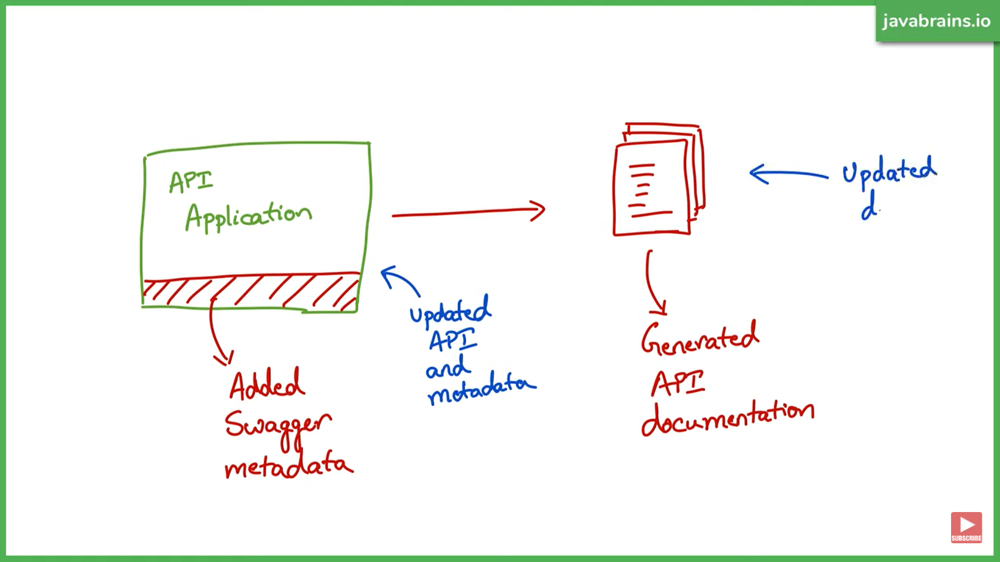
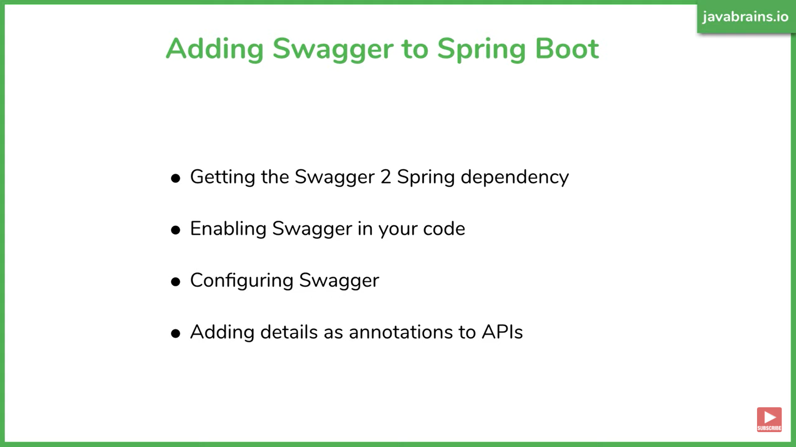
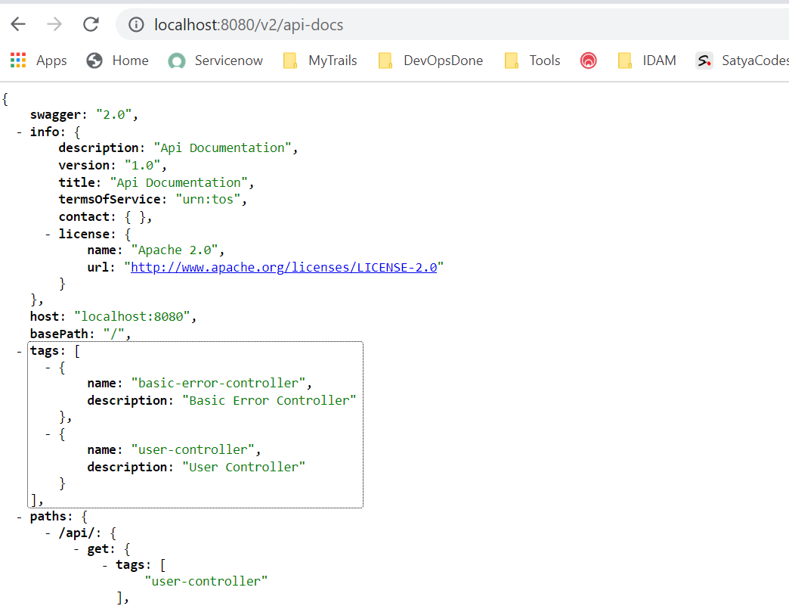
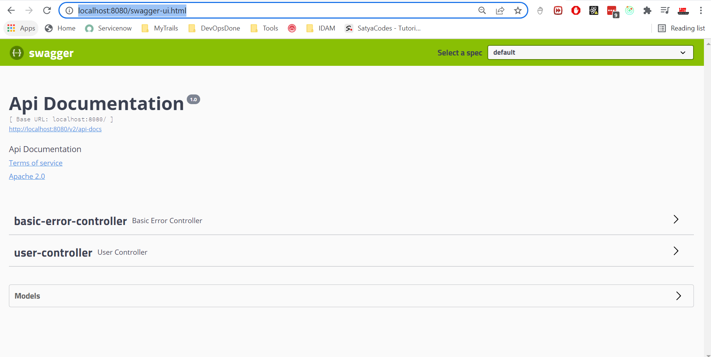

# SpringBoot – Swagger

*Swagger is a set of open source tools for writing REST-based APIs.* It
simplifies the process of writing APIs by notches, specifying the standards &
providing the tools required to write beautiful, safe, performant & scalable
APIs.





1.Add Dependency – it will generate JSON documentation

``` java
<!-- https://mvnrepository.com/artifact/io.springfox/springfox-swagger2 -->
<dependency>
    <groupId>io.springfox</groupId>
    <artifactId>springfox-swagger2</artifactId>
    <version>2.9.2</version>
</dependency>

	<dependency>
			<groupId>com.google.guava</groupId>
			<artifactId>guava</artifactId>
			<version>20.0</version>
		</dependency>
```

2.Enable Swagger2 in our SpringBoot application

``` java
@EnableSwagger2
@SpringBootApplication 
public class SatyaCodesAuthServicesApplication {

	public static void main(String[] args) {
		SpringApplication.run(SatyaCodesAuthServicesApplication.class, args);
	}
}
```

Run the Application, access
<http://localhost:8080/v2/api-docs>

To get UI Documentation add below dependency

``` java
<!-- https://mvnrepository.com/artifact/io.springfox/springfox-swagger-ui -->
<dependency>
    <groupId>io.springfox</groupId>
    <artifactId>springfox-swagger-ui</artifactId>
    <version>2.9.2</version>
</dependency>
```

To access UI : <http://localhost:8080/swagger-ui.html>



Using Swagger 3

-   No need to add **@EnableSwagger2**

-   **Just add below dependency & access**
    [**http://localhost:8080/swagger-ui.html**](http://localhost:8080/swagger-ui.html)

``` java
    <dependency>
        <groupId>org.springdoc</groupId>
        <artifactId>springdoc-openapi-ui</artifactId>
        <version>1.6.6</version>
    </dependency>
```
