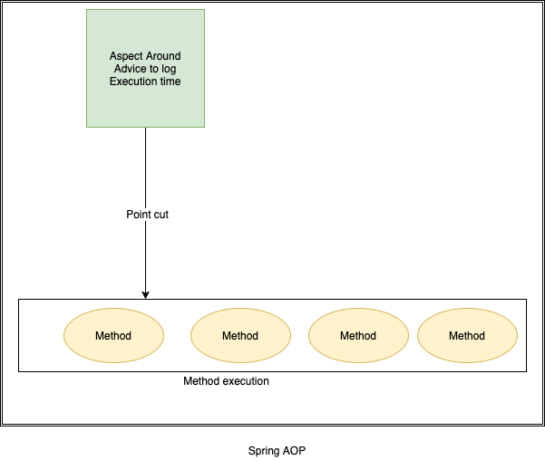

# SpringBoot – Performance Monitoring

## Development - Spring Boot Performance Logging

To calculate how much time taken to execute method, with start & end time. We
use AOP aspectj based interceptor to write **performance logging** based on time
taken in method executions of aop intercepted methods.

```java
 <dependency>
      <groupId>org.springframework.boot</groupId>
      <artifactId>spring-boot-starter-aop</artifactId>
 </dependency>
```

**Log the method execution time using AOP for a spring boot application.**



1.Create Aspect class by Implemeting Around advice

-   Create a clas and use annotation
    [**@Aspect**](https://howtodoinjava.com/spring-aop/spring-aop-aspectj-example-tutorial-using-annotation-config/)
    on class to make it AOP aspect.

-   Write logic for logging inside a method & annotate with **@Around** to make
    its will before & after method execution

-   Provide packge name where the Aspect will be introduced in method calls.

-   We used StopWatch class to capture start time of method and end time of
    method.

-   The **ProceedingJoinPoint** class argument provides us the class name and
    method name which is going to be executed.

-   You may use enabling/disabling component with properties with
    **ConditionalOnExpression** annotation.

```java
@Component
@Aspect
@ConditionalOnExpression("${performance.logging.aspect.active:true}")// enabled by default
public class PerformanceLoggingAspect {
	private static final Logger LOGGER = LogManager.getLogger(PerformanceLoggingAspect.class);
	 
	  //AOP expression for which methods shall be intercepted
	  @Around("execution(* com.edc.controller..*(..)))")
	  public Object profileAllMethods(ProceedingJoinPoint proceedingJoinPoint) throws Throwable 
	  {
	    MethodSignature methodSignature = (MethodSignature) proceedingJoinPoint.getSignature();
	     
	    //Get intercepted method details
	    String className = methodSignature.getDeclaringType().getSimpleName();
	    String methodName = methodSignature.getName();
	     
	    final StopWatch stopWatch = new StopWatch();
	     
	    //Measure method execution time
	    stopWatch.start();
	    Object result = proceedingJoinPoint.proceed();
	    stopWatch.stop();
	 
	    //Log method execution time
	    LOGGER.info("====> \n \n \n Execution time of " + className + "." + methodName + " :: " + stopWatch.getTotalTimeMillis() + " ms");
	 
	    return result;
	  }
}
```

On executing any controller method, we can see logs with Class: method name

```java
/testReport/all
2022-03-28 13:04:20.133  INFO 20128 --- [nio-8031-exec-3] com.edc.utils.PerformanceLoggingAspect   : ====>  
Execution time of TestReportController.getAllTestReports :: 3 ms
```

We can enable / Disable AOP by configuring below in **application.properties**

```java
logging.level.root=INFO
performance.logging.aspect.active=true
```

## Production: SpringBoot Actuator - Health check, Auditing, Monitoring

Actuator brings production-ready features to our application. **Monitoring our
app, gathering metrics, understanding traffic or the state of our database.**

```java
<dependency>
    <groupId>org.springframework.boot</groupId>
    <artifactId>spring-boot-starter-actuator</artifactId>
</dependency>
```

Once above maven dependency is included in the POM file, **16 different actuator
REST endpoints**, such as actuator, beans, dump, info, loggers, and metrics are
exposed

Some of important and widely used actuator endpoints are given below:

-   **auditevents** – Audit events of your application

-   **info**– Displays information about your application – you can customize to
    show version information.

-   **health** – application’s health status

-   **metrics** – various metrics information of application

-   **loggers** – Displays and modifies configured loggers

-   **logfile** – Shows the contents of the log file

-   **httptrace** – Displays HTTP trace info for the last 100 HTTP
    request/response

-   **env** – Displays current environment information

-   flyway – Shows Flyway database migrations details

-   liquidbase – Shows details of liquibase database migrations

-   shutdown – Allows to shut down the application gracefully

-   **mappings**– Displays a list of all **@RequestMapping** paths

-   scheduledtasks – Displays the scheduled tasks in the application

-   **threaddump** – Performs a thread dump

-   headdump – Returns JVM head dump

You can access all available endpoint by this URL:
[**http://localhost:8080/actuator**](http://localhost:8080/actuator)

```java
{
	"_links": {
		"self": {
			"href": "http://localhost:8080/actuator",
			"templated": false
		},
		"health": {
			"href": "http://localhost:8080/actuator/health",
			"templated": false
		},
		"health-component-instance": {
			"href": "http://localhost:8080/actuator/health/{component}/{instance}",
			"templated": true
		},
		"health-component": {
			"href": "http://localhost:8080/actuator/health/{component}",
			"templated": true
		},
		"info": {
			"href": "http://localhost:8080/actuator/info",
			"templated": false
		}
	}
}
```

If you see we have only 2 endpoints showing (health, info) out of 16 endpoints

By default, all the actuator endpoints are exposed over **JMX** but only the
health and info endpoints are exposed over **HTTP**.Here is how you can expose
actuator endpoints over HTTP and JMX using application properties -

**Exposing Actuator endpoints over HTTP**

```java
# Use "*" to expose all endpoints, or a comma-separated list to expose selected ones
management.endpoints.web.exposure.include=*
management.endpoints.web.exposure.exclude=
```

**Exposing Actuator endpoints over JMX**

```java
# Use "*" to expose all endpoints, or a comma-separated list to expose selected ones
management.endpoints.jmx.exposure.include=*
management.endpoints.jmx.exposure.exclude=
```

#### Securing Actuator Endpoints with Spring Security

Actuator endpoints are sensitive and must be secured from unauthorized access.
you can add spring security to your application using the following dependency -

```java
<dependency>
   <groupId>org.springframework.boot</groupId>
   <artifactId>spring-boot-starter-security</artifactId>
</dependency>
```

we can override the default spring security configuration and define our own
access rules.

#### Creating a Custom Actuator Endpoint

To customize the endpoint and define your own endpoint, simply Create a classs
annotate with @Endpoint URL :

```java
import org.springframework.boot.actuate.endpoint.annotation.Endpoint;
import org.springframework.boot.actuate.endpoint.annotation.ReadOperation;
import org.springframework.stereotype.Component;

@Endpoint(id="helloEndpoint")
@Component
public class ListEndPoints {
    @ReadOperation
    public String mypoint(){
        return "Hello" ;
    }
}
```


Few more Endpoints


-   env – Displays current environment information

-   flyway – Shows Flyway database migrations details

-   liquidbase – Shows details of liquibase database migrations

-   shutdown – Allows to shut down the application gracefully

-   mappings– Displays a list of all @RequestMapping paths

-   scheduledtasks – Displays the scheduled tasks in the application

-   threaddump – Performs a thread dump

-   headdump – Returns JVM head dump

 
