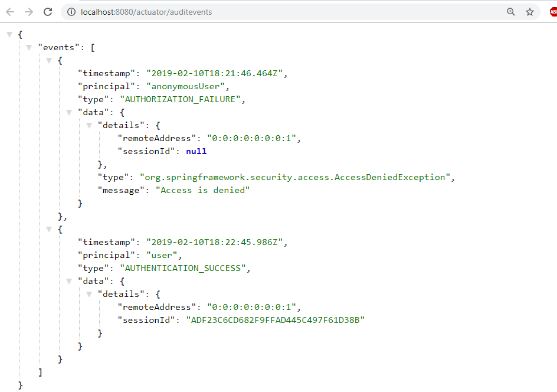
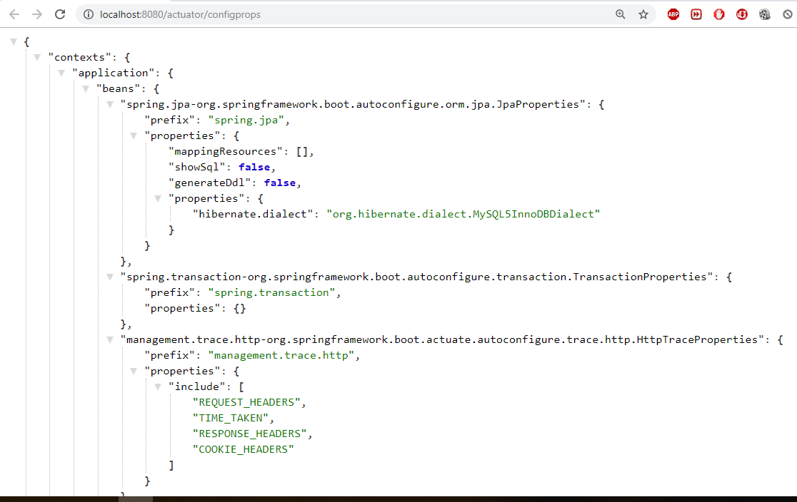
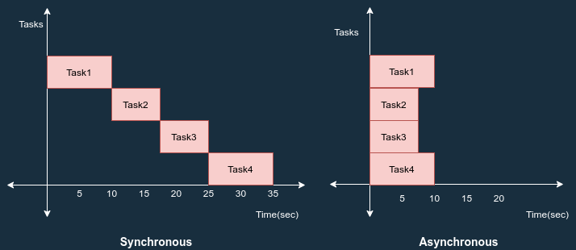

# Spring Boot – Advanced

# Spring Boot – Logging

Spring boot’s provide default logging mecahnisum, which is written with *Apache
Commons Logging*

SpringBoot supports `ERROR, WARN, INFO, DEBUG`, or TRACE as logging level. By
default, logging level is set to **INFO**. It means that code\>DEBUG and TRACE
messages are not visible.

To enable debug or trace logging, we can set the logging level in
`application.properties` file. Also, we can pass the –debug or –trace arguments
on the command line while starting the application.

```
# In Console
-Dlogging.level.org.springframework=ERROR 
-Dlogging.level.com.howtodoinjava=TRACE
 
# In properties file
logging.level.org.springframework=ERROR 
logging.level.com.howtodoinjava=TRACE
```

Example

``` java
 org.slf4j.Logger;
 org.slf4j.LoggerFactory;

@SpringBootApplication
  Application 
{
       Logger =LoggerFactory.(Application.);
 
       main(String[] args) {
        SpringApplication.(Application., args);         
        .info("Simple log statement with inputs {}, {} and {}", 1,2,3);
    }
}
```

# Spring Boot - Devtools

If you have worked on latest UI development frameworks e.g. Node,
[angular](https://howtodoinjava.com/angularjs/angularjs-tutorial-helloworld-example/),
gulp etc. then you must have appreciated the auto-reload of UI in browser
whenever there is change in some code. Its pretty useful and saves a lot of
time.

To enable dev tools in spring boot application is very easy. Just add the
`spring-boot-devtools` dependency in your build file.

```
<dependencies>
    <dependency>
        <groupId>org.springframework.boot</groupId>
        <artifactId></artifactId>
        <optional>true</optional>
    </dependency>
</dependencies>
```

**Static Resource Caching**

To improve the performance, dev tools cache the static content/template files to
serve them faster to browser/client.

There are many such UI template libraries that support this feature. e.g.
thymeleaf, freemarker, groovy, mustache etc.

```
#spring.freemarker.cache = true //set true in production environment
spring.freemarker.cache = false //set false in development environment; It is false by default.
 
//Other such properties 
spring.thymeleaf.cache = false
spring.mustache.cache = false
spring.groovy.template.cache = false
```

**Automatic UI refresh**

The **spring-boot-devtools** module includes an embedded LiveReload server that
can be used to trigger a browser refresh when a resource is changed

```
spring.devtools.livereload.enabled  = false #Set false to disable live reload
```

# SpringBoot Acuator - Health check, Auditing, Metrics,Monitoring

Actuator brings production-ready features to our application.

**Monitoring our app, gathering metrics, understanding traffic or the state of
our database becomes trivial with this dependency.**

```
<dependency>
    <groupId>org.springframework.boot</groupId>
    <artifactId>spring-boot-starter-actuator</artifactId>
</dependency>
```

Some of important and widely used actuator endpoints are given below:

| **ENDPOINT** | **USAGE**                                                                                       |
|--------------|-------------------------------------------------------------------------------------------------|
| /env         | Returns list of properties in current environment                                               |
| /health      | Returns application health information.                                                         |
| /auditevents | Returns all auto-configuration candidates and the reason why they ‘were’ or ‘were not’ applied. |
| /beans       | Returns a complete list of all the Spring beans in your application.                            |
| /trace       | Returns trace logs (by default the last 100 HTTP requests).                                     |
| /dump        | It performs a thread dump.                                                                      |
| /metrics     | It shows metrics information like JVM memory used, system CPU usage, open files, and much more. |

You can access all available endpoint by this URL:
[**http://localhost:8080/actuator**](http://localhost:8080/actuator)

``` json
{
	"_links": {
		"self": {
			"href": ,
			"templated": false
		},
		"health": {
			"href": ,
			"templated": false
		},
		"health-component-instance": {
			"href": ,
			"templated": true
		},
		"health-component": {
			"href": ,
			"templated": true
		},
		"info": {
			"href": ,
			"templated": false
		}
	}
}
```

If you see we have only 2 endpoints showing (health, info) out of 16 endpoints

By default, all the actuator endpoints are exposed over **JMX** but only the
health and info endpoints are exposed over **HTTP**.

Here is how you can expose actuator endpoints over HTTP and JMX using
application properties -

**Exposing Actuator endpoints over HTTP**

```
# Use "*" to expose all endpoints, or a comma-separated list to expose selected ones
management.endpoints.web.exposure.include=*
management.endpoints.web.exposure.exclude=
```

**Exposing Actuator endpoints over JMX**

```
# Use "*" to expose all endpoints, or a comma-separated list to expose selected ones
management.endpoints.jmx.exposure.include=*
management.endpoints.jmx.exposure.exclude=
```

# Securing Actuator Endpoints with Spring Security

Actuator endpoints are sensitive and must be secured from unauthorized access.
you can add spring security to your application using the following dependency -

```
<dependency>
   <groupId>org.springframework.boot</groupId>
   <artifactId>spring-boot-starter-security</artifactId>
</dependency>
```

we can override the default spring security configuration and define our own
access rules.

#### Creating a Custom Actuator Endpoint

To customize the endpoint and define your own endpoint, simply Create a classs
annotate with @Endpoint URL :

``` java
 org.springframework.boot.actuate.endpoint.annotation.Endpoint;
 org.springframework.boot.actuate.endpoint.annotation.ReadOperation;
 org.springframework.stereotype.Component;

@Endpoint(id="helloEndpoint")
@Component
  ListEndPoints {
    @ReadOperation
     String mypoint(){
         "Hello" ;
    }
}
```


Few more Endpoints







# SpringBoot – Project Lombok

Project Lombok is a Java library tool that generates code for minimizing
boilerplate code. The library replaces boilerplate code with easy-to-use
annotations.

For example, by adding a couple of annotations, you can get rid of code
clutters, such as getters and setters methods, constructors, hashcode, equals,
and toString methods, and so on.

-   [**val**](https://projectlombok.org/features/val) :Finally! Hassle-free
    final local variables.

-   [**var**](https://projectlombok.org/features/var) :Mutably! Hassle-free
    local variables.

-   [**@Data**](https://projectlombok.org/features/Data):All together now: A
    shortcut for @ToString, @EqualsAndHashCode, @Getter on all fields, and
    @Setter on all non-final fields, and @RequiredArgsConstructor!

-   [**@NonNull**](https://projectlombok.org/features/NonNull) : How I learned
    to stop worrying and love the NullPointerException.

-   [**@Cleanup**](https://projectlombok.org/features/Cleanup) :Automatic
    resource management: Call your close() methods safely

-   [**@Getter/@Setter**](https://projectlombok.org/features/GetterSetter)
    :Never write public int getFoo() {return foo;} again.

-   [**@ToString**](https://projectlombok.org/features/ToString) : generate a
    toString for you!

-   [**@EqualsAndHashCode**](https://projectlombok.org/features/EqualsAndHashCode)
    : Generates hashCode and equals implementations from the fields of your
    object.

-   [**@NoArgsConstructor, @RequiredArgsConstructor and
    @AllArgsConstructor**](https://projectlombok.org/features/constructor)

    Constructors made to order: Generates constructors that take no arguments,
    one argument per final / non-nullfield, or one argument for every field.

-   [**@Value**](https://projectlombok.org/features/Value) :Immutable classes
    made very easy.

-   [**@Builder**](https://projectlombok.org/features/Builder) No-hassle
    fancy-pants APIs for object creation!

-   [**@SneakyThrows**](https://projectlombok.org/features/SneakyThrows) :To
    boldly throw checked exceptions where no one has thrown them before!

-   [**@Synchronized**](https://projectlombok.org/features/Synchronized):synchronized
    done right: Don't expose your locks.

-   [**@With**](https://projectlombok.org/features/With):Immutable 'setters' -
    methods that create a clone but with one changed field.

-   [**@Getter(lazy=true)**](https://projectlombok.org/features/GetterLazy):Laziness
    is a virtue!

-   [**@Log**](https://projectlombok.org/features/log) :Captain's Log, stardate
    24435.7: "What was that line again?"

-   [**experimental**](https://projectlombok.org/features/experimental/all)
    :Head to the lab: The new stuff we're working on.

Maven dependency

```
<dependency>
    <groupId>org.projectlombok</groupId>
    <artifactId>lombok</artifactId>
    <optional>true</optional>
</dependency>
```

## Ref.

<https://dzone.com/articles/spring-boot-actuator-a-complete-guide>

<https://www.callicoder.com/spring-boot-actuator/>

# Spring Boot – Asynchronous Implementation

This article is about how asynchronous behavior can be achieved in spring boot.
But first of all, let’s see the difference between synchronous and asynchronous.

-   **Synchronous Programming:** In synchronous programming, tasks are performed
    one at a time and only when one is completed the next is unblocked.

-   **Asynchronous Programming:** In asynchronous programming, multiple tasks
    can be executed simultaneously. You can move to another task before the
    previous one finishes.



In spring boot, we can achieve asynchronous behavior using `@EnableAsync` &
`@Async` annotations.

-   `@EnableAsync` - to enable async support by annotating the main application
    class.

-   `@Async` - annotate the method

When you annotate a method with `@Async` annotation, it creates a **proxy** for
that object based on `“proxyTargetClass”` property.

When spring executes this method, by default it will be searching for associated
thread pool definition. Either a unique spring framework **TaskExecutor** bean
in the context or Executor bean named “taskExecutor”. If neither of these two is
resolvable, default it will use spring framework **SimpleAsyncTaskExecutor** to
process async method execution.

Example – Without Async

```java
@RestController
public class DecomController {
	@Autowired
	DecomService service;

	@GetMapping("/decomTrial")
	public String decomClinicalTrial() {
		System.out.println(" *** decomClinicalTrial :: Started*** ");
		service.ArchiveUsers();
		service.ArchiveReports();
		System.out.println(" *** decomClinicalTrial :: Completed.*** ");
		return "decomClinicalTrial Complted.";
	}
}
@Service
public class DecomService {

	public void ArchiveUsers() {
     S.o.p(Thread.currentThread().getName() + " :ArchiveUsers :Start "+new Date());
		try {
			Thread.sleep(5000);
		} catch (InterruptedException e) {
			e.printStackTrace();
		}
     S.o.p (Thread.currentThread().getName() + " :ArchiveUsers :End " + new Date());
	}

	public void ArchiveReports() {
	S.o.p(Thread.currentThread().getName() + ":ArchiveReports : Start" + new Date());
		try {
			Thread.sleep(5000);
		} catch (InterruptedException e) {
			e.printStackTrace();
		}
	S.o.p(Thread.currentThread().getName() + " :ArchiveReports : End" + new Date());
	}
}
@SpringBootApplication
public class TrialServicesApplication {
	public static void main(String[] args) {
		SpringApplication.run(TrialServicesApplication.class, args);
		System.out.println("*************************************");
		System.out.println("Trial Services Startred ... ");
		System.out.println("*************************************");
	}
}
*** decomClinicalTrial: Started*** 
http-nio-8080-exec-1:ArchiveUsers :Start 24 Sep 2021 07:52:32 GMT
http-nio-8080-exec-1:ArchiveUsers :End 24 Sep 2021 07:52:37 GMT
http-nio-8080-exec-1:ArchiveReports :Start24 Sep 2021 07:52:37 GMT
http-nio-8080-exec-1:ArchiveReports :End24 Sep 2021 07:52:42 GMT
 *** decomClinicalTrial: Completed.***
```

Here all methods execute by single Thread `http-nio-8080-exec-1`

With @Aync

Place `@EnableAsync` on the Top of SpringBoot Main class -
**TrialServicesApplication**

```java
@EnableAsync 
@SpringBootApplication
public class TrialServicesApplication {
	public static void main(String[] args) {
		SpringApplication.run(TrialServicesApplication.class, args);
		System.out.println("*************************************");
		System.out.println("Trial Services Startred ... ");
		System.out.println("*************************************");
	}
}
```

Place `@Async `on the top of each method, which we want to execute in parallel.

```java
@Service
public class DecomService {
	@Async
	public void ArchiveUsers() {
S.o.p(Thread.currentThread().getName() + " :ArchiveUsers :Start " + new Date());
		try {
			Thread.sleep(5000);
		} catch (InterruptedException e) {
			e.printStackTrace();
		}
		S.o.p(Thread.currentThread().getName() + " :ArchiveUsers :End " + new Date());
	}

	@Async
	public void ArchiveReports() {
	 S.o.p(Thread.currentThread().getName() + ":ArchiveReports : Start" + new Date());
		try {
			Thread.sleep(5000);
		} catch (InterruptedException e) {
			e.printStackTrace();
		}
	S.o.p(Thread.currentThread().getName() + " :ArchiveReports : End" + new Date());
	}
}
*** decomClinicalTrial :: Started*** 
*** decomClinicalTrial :: Completed.*** 
task-1 :ArchiveUsers : Start 24 Sep 2021 08:01:20 GMT
task-2 :ArchiveReports : Start24 Sep 2021 08:01:20 GMT
task-2 :ArchiveReports : End24 Sep 2021 08:01:25 GMT
task-1 :ArchiveUsers :End 24 Sep 2021 08:01:25 GMT
```

In above ArchiveUsers, ArchiveReports are executed paralley by two different
threads **task-1, task-2**

**Async methods with Return Types**

Previously, The async method only used a void return type. And in my opinion,
that is the best way to write self sufficient asynchronous functions. However,
If you want to handle the results from an @Async function, you are in luck.
Because Spring framework provides out of the box support for these situations
using **Future** type. This is possible by wrapping the result inside of an
**AsyncResult** class.

```java
@Async
public Future<String> longRunningProcessThatReturns() {
    try {
        Thread.sleep(10000);
    } catch (InterruptedException e) {
        e.printStackTrace();
    }
    return new AsyncResult<>("I take 10 seconds to return on a Thread named : " + Thread.currentThread().getName());
}
```

<https://medium.com/globant/asynchronous-calls-in-spring-boot-using-async-annotation-d34d8a82a60c>

<https://springhow.com/spring-async/>

<https://howtodoinjava.com/spring-boot2/rest/enableasync-async-controller/>

# SpringBoot – Switch Between Environments

<https://stackabuse.com/how-to-access-property-file-values-in-spring-boot/>

Spring Boot already [has
support](http://docs.spring.io/spring-boot/docs/current/reference/html/boot-features-external-config.html)
for
[profile](http://docs.spring.io/spring/docs/current/spring-framework-reference/html/beans.html#beans-definition-profiles)
based properties.

Simply add an `application-[profile].properties` file and specify the profiles
to use using the `spring.profiles.active` property.

```
-Dspring.profiles.active=local
```

This will load the application.properties and the application-local.properties
with the latter overriding properties from the first.

# SpringBoot – Reactive Web

[Spring
WebFlux](https://docs.spring.io/spring-framework/docs/current/reference/html/web-reactive.html)
provides reactive, async, non-blocking programming support for web applications
in an annotated Controller format similar to SpringMVC.

This approach is similar to how
[Node.js](https://medium.com/javarevisited/top-10-online-courses-to-learn-node-js-in-depth-8ef0e31ca139)
uses an async, non-blocking model which helps make it more scalable. Spring
WebFlux uses a similar model but with multiple event loops.

**Spring WebFlux** moves away from the thread-per-request blocking model in
traditional
[SpringMVC](https://javarevisited.blogspot.com/2020/08/top-5-courses-to-learn-spring-mvc-for.html)(with
Tomcat by default) and moves towards a multi-EventLoop, async, non-blocking(with
[Netty](https://netty.io/) by default) paradigm with back-pressure that is more
scalable and efficient than traditional blocking code.
