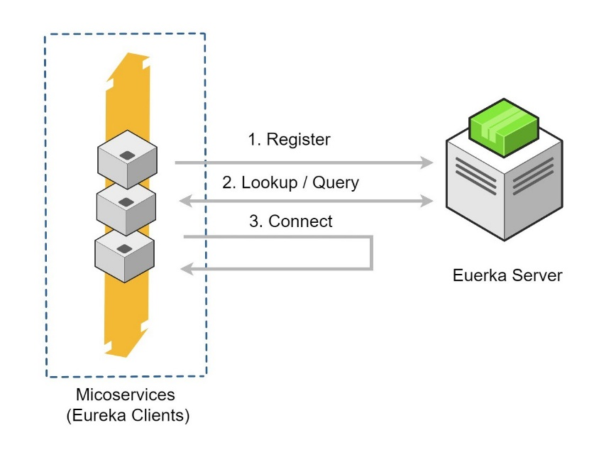

# Spring Cloud – Microservices

The major use-case for Spring Cloud is the ready-to-use solution that it
provides to common problems observed in distributed environments like load
balancing, service discovery, circuit breaking, etc., which can easily be
integrated in an existing Spring project.

Before we look at Spring Cloud, let’s have a brief overview on Microservice
Architecture and the role of Spring Boot in creating microservices.

<https://github.com/sivaprasadreddy/spring-boot-microservices-series>

<https://www.sivalabs.in/2018/03/microservices-using-springboot-spring-cloud-part-1-overview/>

<a href="https://github.com/smlcodes/IDAAMMicroServices" target="_blank">SmlCodes-Example Code</a>

# Microservices

#### Monoliths

Traditionally we are building large enterprise applications in modularised
fashion, but finally deploy them together as a single deployment unit (EAR or
WAR). These are called Monolithic applications.

There are some issues with the monolithic architecture such as:

-   Large codebases become mess over the time

-   Multiple teams working on single codebase become tedious

-   It is not possible to scale up only certain parts of the application

-   Technology updates/rewrites become complex and expensive tasks

#### Microservices

Microservice architecture is a style of application development where the
application is broken down into small services and these services have loose
coupling among them. Following are the major advantages of using microservice
architecture –

**Advantages of MicroServices**

-   Comprehending smaller codebase is easy

-   Can independently scale up highly used services

-   Each team can focus on one (or few) MicroService(s)

-   Technology updates/rewrites become simpler

SpringBoot and SpringCloud are a good choice for MicroServices

# Spring Cloud – Components

Spring Cloud provides a collection of components which are useful in building
distributed applications in cloud. We can develop these components on our own,
however that would waste time in developing and maintaining this boilerplate
code.

That is where Spring Cloud comes into picture. It provides ready-to-use **cloud
design patterns** for common problems which are observed in a distributed
environment. Some of the patterns which it attempts to address are −

-   Service Registration

-   Centralized Configuration

-   Load Balancing

-   Circuit Breakers / Fault Tolerence

-   Distributed Messaging (Kafka)

-   Routing (API Gateway)

-   Distributed Logging

-   Distributed Lock

#### Spring Cloud Components

Look at the various components which Spring Cloud provides and the problems
these components solve

| **Problem**                                                          | **Components**                                                              |
|----------------------------------------------------------------------|-----------------------------------------------------------------------------|
| **Distributed Cloud Configuration**                                  | **Spring Cloud Configuration**, Spring Cloud Zookeeper, Spring Cloud Config |
| **Distributed Messaging**                                            | Spring Stream with **Kafka**, Spring Stream with **RabbitMQ**               |
| **Service Discovery**                                                | Spring Cloud **Eureka**, Spring Cloud Consul, Spring Cloud **Zookeeper**    |
| **Logging**                                                          | Spring Cloud **Zipkin**, Spring Cloud **Sleuth**                            |
| **Spring Service Communication(Circuit Breakers / Fault Tolerence)** | Spring **Hystrix**, Spring Ribbon, Spring Feign, Spring Zuul(API gateWay)   |

#### Projects Of Spring Cloud

**Spring Cloud Config Server:** Configuring application properties, environment
details etc. We can use Spring Cloud Config Server with **git** or **Consul** or
**ZooKeeper** as config repository.

**Service Registry and Discovery:** As there could be many services and we need
the ability to scale up or down dynamically. we need Service Registry and
Discovery mechanism so that service-to-service communication should not depend
on hard-coded hostnames and port numbers. Spring Cloud provides Netflix
Eureka-based Service Registry and Discovery support with just minimal
configuration. We can also use **Consul** or **ZooKeeper** for Service Registry
and Discovery.

**Circuit Breaker:** In microservices based architecture, one service might
depend on another service and if one service goes down then failures may cascade
to other services as well. Spring Cloud provides Netflix **Hystrix** based
Circuit Breaker to handle these kinds of issues.

**Spring Cloud Data Streams:** These days we may need to work with huge volumes
of data streams using **Kafka** or Spark etc. Spring Cloud Data Streams provides
higher-level abstractions to use those frameworks in an easier manner.

**Spring Cloud Security:** Some of the microservices needs to be accessible to
authenticated users only and most likely we might want a **Single Sign-On**
feature to propagate the authentication context across services. Spring Cloud
Security provides authentication services using **OAuth2**.

**Distributed Tracing:** simple end-user action might trigger a chain of
microservice calls, there should be a mechanism to trace the related call
chains. We can use Spring Cloud **Sleuth** with **Zipkin** to trace the
cross-service invocations.

**Spring Cloud API gateway:** There is a high chance that separate teams work on
different microservices. There should be a mechanism for teams to agree upon API
endpoint contracts so that each team can develop their APIs independently.
Spring Cloud Contract helps to create such contracts and validate them by both
service provider and consumer.
