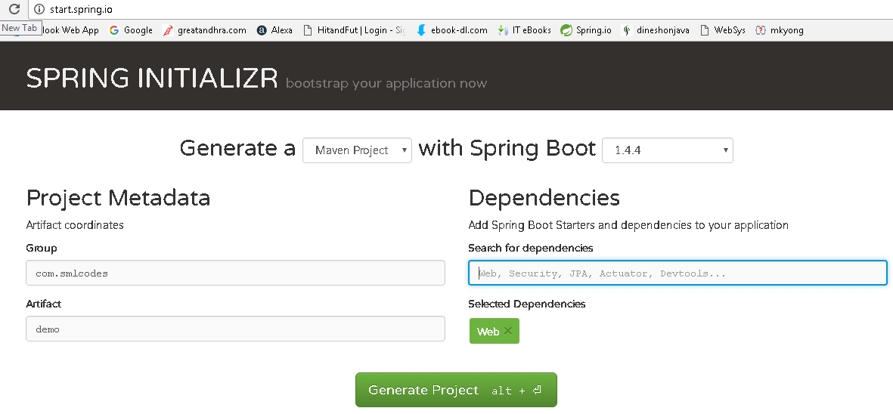
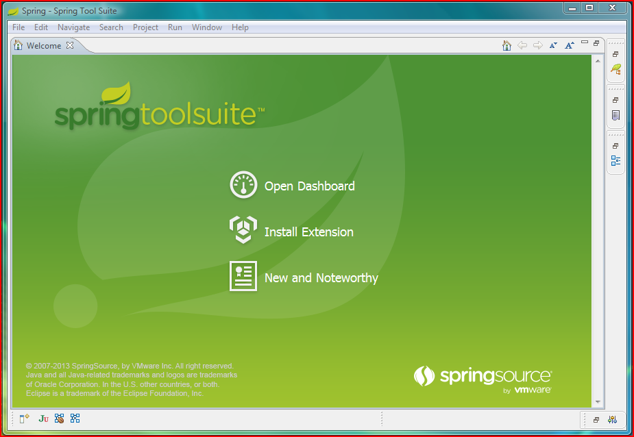

SpringBoot - Creating Spring Boot Application
===============================================

To create Spring Boot based applications The Spring Team (The Pivotal Team) has
provided the following three approaches.

1.  *Using Maven*

2.  *Using Spring Initializer (*<http://start.spring.io/>*)*

3.  *Using Spring STS IDE*

4.  *Using Spring Boot CLI Tool*


## 1. Spring Boot using Maven

Add maven dependencies in pom.xml & do maven build
```xml
<project>
	<parent>
		<groupId>org.springframework.boot</groupId>
		<artifactId>spring-boot-starter-parent</artifactId>
		<version>1.5.6.RELEASE</version>
	</parent>

	<dependencies>
		<dependency>
			<groupId>org.springframework.boot</groupId>
			<artifactId>spring-boot-starter-web</artifactId>
		</dependency>
	</dependencies>

	<properties>
		<java.version>1.8</java.version>
	</properties>

</project>
```


## 2.Spring Initializer 

Spring Initializer provides an extensible API to **generate quick start
projects**. It also provides a configurable service: you can see our default
instance at [https://start.spring.io](https://start.spring.io/)**.** It provides
a simple web UI to configure the project to generate and endpoints that you can
use via plain HTTP.



It will generate the Artifact.zip file, extract it and run maven build: **mvn
clean install package**
```dos
[INFO] --- spring-boot-maven-plugin:1.4.4.RELEASE:repackage (default) @ SpringBootDemo ---
[INFO] ------------------------------------------------------------------------
[INFO] BUILD SUCCESS
[INFO] ------------------------------------------------------------------------
[INFO] Total time: 01:27 min
[INFO] Finished at: 2017-01-30T18:55:21+05:30
[INFO] Final Memory: 27M/160M
[INFO] ------------------------------------------------------------------------
```


## 3.Spring STS IDE

The **Spring Tool Suite** is an Eclipse-based development environment that is
customized for developing **spring** applications. We can download it from
[here](https://spring.io/tools/sts/all).




## 4.Spring Boot CLI Tool

**The Spring Boot CLI is a command line tool** that can be used if you want to
quickly prototype (creates project Structure) with Spring. It allows you to
run [Groovy](http://groovy.codehaus.org/) scripts, which means that you have a
familiar Java-like syntax, without so much boilerplate code.

You don’t need to use the CLI to work with Spring Boot but it’s definitely the
quickest way to get a spring application off the ground.

You can download the Spring CLI distribution from the Spring software
repository:

-   [spring-boot-cli-1.5.0.RELEASE-bin.zip](http://repo.spring.io/release/org/springframework/boot/spring-boot-cli/1.5.0.RELEASE/spring-boot-cli-1.5.0.RELEASE-bin.zip)

-   [spring-boot-cli-1.5.0.RELEASE-bin.tar.gz](http://repo.spring.io/release/org/springframework/boot/spring-boot-cli/1.5.0.RELEASE/spring-boot-cli-1.5.0.RELEASE-bin.tar.gz)

**SDKMAN! (The Software Development Kit Manager)** can be used for managing
multiple versions of various binary SDKs, including Groovy and the Spring Boot
CLI. Get SDKMAN! from [sdkman.io](http://sdkman.io/) and install Spring Boot
with
```dos
$ sdk install springboot
$ spring --version
Spring Boot v1.5.0.RELEASE
```


A simple web application that you can use to test your installation. Create a
file called **app.groovy as**
```dos
$ spring run app.groovy
```


It will take some time when you first run the application as dependencies are
downloaded. Subsequent runs will be much quicker.
