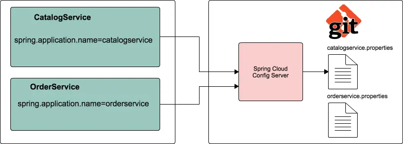
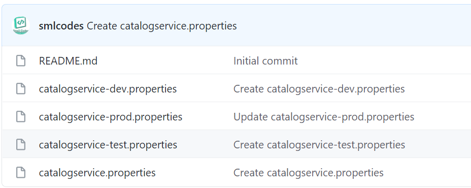
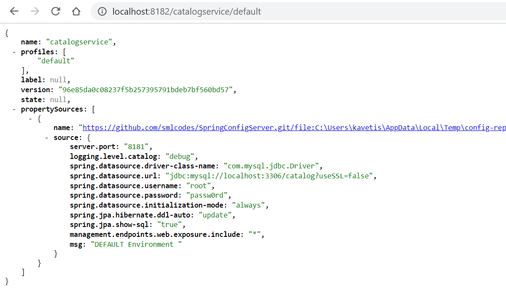
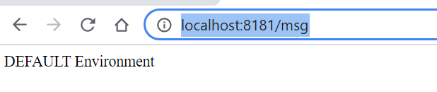
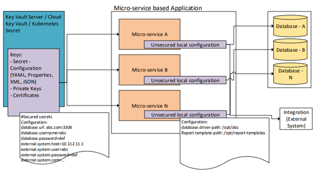
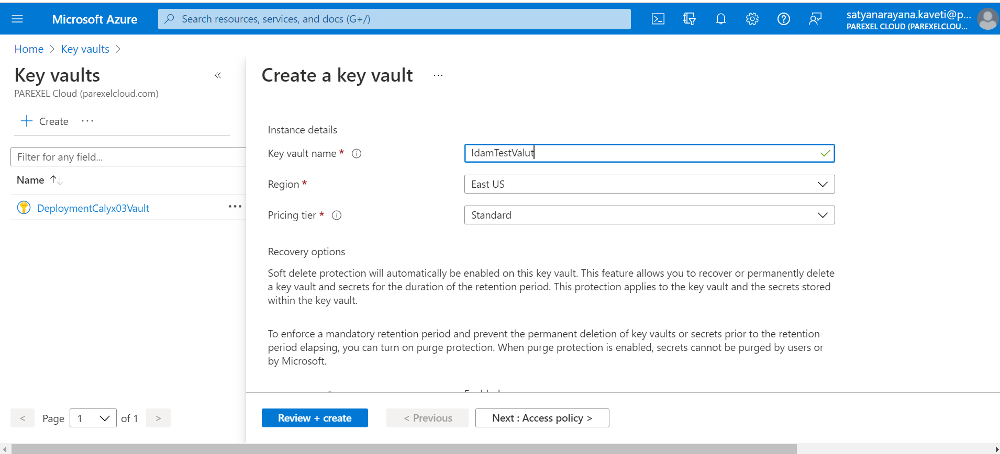

# Spring Cloud Config Server – to Store our Properties

SpringBoot provides lot of flexibility in externalizing configuration properties
via properties or YAML files. We can also configure properties for each
environment (dev, qa, prod etc) separately using profile specific configuration
files such as **application.properties**, **application-dev.properties**,
**application-prod.properties** etc. But once the application is started we can
not update the properties at runtime. If we change the properties we need to
**restart** the application to use the updated configuration properties.

To Solve this, We can use **Spring Cloud Config Server** to centralize all the
applications configuration and use **Spring Cloud Config Client** module from
the applications to consume configuration properties from Config Server. We can
also update the configuration properties at runtime without requiring to restart
the application.

Spring Cloud Config Server is nothing but a SpringBoot application with a
configured configuration properties source. The configuration source can be a
**git** , **svn** or any
repository.

Steps to configure Spring Cloud Config Server

1.Create a git repo to store our **properties** with different envromnets.

<https://github.com/smlcodes/SpringConfigServer>

2.Let us create a SpringBoot application **spring-cloud-config-server** from
[http://start.spring.io](http://start.spring.io/) by selecting the starters
**Config Server** and **Actuator**.

3.To make our SpringBoot application as a SpringCloud Config Server, we just
need to add **@EnableConfigServer** annotation to the main entry point class

~~~~~~~~~~~~~~~~~~~~~~~~~~~~~~~~~~~~~~~~~~~~~~~~~~~~~~~~~~~~~~~~~~~~~~~~~~~ java
@SpringBootApplication
@EnableConfigServer
public class SpringCloudConfigServerApplication {
	public static void main(String[] args) {
		SpringApplication.run(SpringCloudConfigServerApplication.class, args);
	}
}
~~~~~~~~~~~~~~~~~~~~~~~~~~~~~~~~~~~~~~~~~~~~~~~~~~~~~~~~~~~~~~~~~~~~~~~~~~~~~~~~

4.configure **git url** property pointing to the git repository in
**application.propertis**

~~~~~~~~~~~~~~~~~~~~~~~~~~~~~~~~~~~~~~~~~~~~~~~~~~~~~~~~~~~~~~~~~~~~~~~~~~~ java
spring.config.name=configserver
server.port=8182
spring.cloud.config.server.git.uri=https://github.com/smlcodes/SpringConfigServer.git
spring.cloud.config.server.git.default-label=main
management.security.enabled=false
~~~~~~~~~~~~~~~~~~~~~~~~~~~~~~~~~~~~~~~~~~~~~~~~~~~~~~~~~~~~~~~~~~~~~~~~~~~~~~~~

5.Start the application. Spring Cloud Config Server exposes the **following REST
endpoints** to get application specific configuration properties:

~~~~~~~~~~~~~~~~~~~~~~~~~~~~~~~~~~~~~~~~~~~~~~~~~~~~~~~~~~~~~~~~~~~~~~~~~~~ java
/{application}/{profile}[/{label}]
/{application}-{profile}.yml
/{label}/{application}-{profile}.yml
/{application}-{profile}.properties
/{label}/{application}-{profile}.properties
~~~~~~~~~~~~~~~~~~~~~~~~~~~~~~~~~~~~~~~~~~~~~~~~~~~~~~~~~~~~~~~~~~~~~~~~~~~~~~~~

Here **{application}** refers to value of **spring.config.name** property,
**{profile}** is an active profile and **{label}** is an optional git label
(defaults to “master”).

Now if you access the URL **http://localhost:8182/catalogservice/default** then
you will get the following response with catalogservice **default**
configuration details: 

Similary we can enviroment propertils like

-   <http://localhost:8182/catalogservice/default>

-   <http://localhost:8182/catalogservice/dev>

-   <http://localhost:8182/catalogservice/test>

-   <http://localhost:8182/catalogservice/prod>

Spring Cloud Config Client Example

Let us see how we can create a SpringBoot application and use configuration
properties from Config Server instead of putting them inside the application.

1.Update **catalog-service** with **Config Client,** **Web** and **Actuator**
starters.

~~~~~~~~~~~~~~~~~~~~~~~~~~~~~~~~~~~~~~~~~~~~~~~~~~~~~~~~~~~~~~~~~~~~~~~~~~~ java
		<dependency>
			<groupId>org.springframework.boot</groupId>
			<artifactId>spring-boot-starter-actuator</artifactId>
		</dependency>
		<dependency>
			<groupId>org.springframework.cloud</groupId>
			<artifactId>spring-cloud-starter-config</artifactId>
		</dependency>
		<dependency>
			<groupId>org.springframework.cloud</groupId>
			<artifactId>spring-cloud-starter-bootstrap</artifactId>
		</dependency>
~~~~~~~~~~~~~~~~~~~~~~~~~~~~~~~~~~~~~~~~~~~~~~~~~~~~~~~~~~~~~~~~~~~~~~~~~~~~~~~~

**2.Create REST Resource**

Add one **RestController** to view the Server side property values in the
response. And add a method to request/response the perticalur value from
Repository values.

~~~~~~~~~~~~~~~~~~~~~~~~~~~~~~~~~~~~~~~~~~~~~~~~~~~~~~~~~~~~~~~~~~~~~~~~~~~ java
@RefreshScope
@RestController
class SpringCloudConfigClinet{	
	    @Value("${msg:Config Server is not working. Please check...}")
	    private String msg;
	 
	    @GetMapping("/msg")
	    public String getMsg() {
	        return this.msg;
	    }
}
~~~~~~~~~~~~~~~~~~~~~~~~~~~~~~~~~~~~~~~~~~~~~~~~~~~~~~~~~~~~~~~~~~~~~~~~~~~~~~~~

Usually in SpringBoot application, we configure properties in
**application.properties.** But while using Spring Cloud Config Server we use
**bootstrap.properties** or **bootstrap.yml** file to configure the URL of
Config Server.

Configure the following properties in
**src/main/resources/bootstrap.properties**:

~~~~~~~~~~~~~~~~~~~~~~~~~~~~~~~~~~~~~~~~~~~~~~~~~~~~~~~~~~~~~~~~~~~~~~~~~~~ java
server.port=8181
spring.application.name=catalogservice
spring.cloud.config.uri=http://localhost:8182
management.security.enabled=false
~~~~~~~~~~~~~~~~~~~~~~~~~~~~~~~~~~~~~~~~~~~~~~~~~~~~~~~~~~~~~~~~~~~~~~~~~~~~~~~~

*Note that the value of* **spring.application.name** *property should match with
base filename (catalogservice) in config-repo*

Now run the following catalog-service main entry point class. We can access the
actuator endpoint **http://localhost:8181/env** to see all the configuration
properties.

You open <http://localhost:8181/msg> you get property value of msg

Now if we delete the **application.properties** file, the application will works
normally. Ref.
<https://www.sivalabs.in/2017/08/spring-cloud-tutorials-introduction-to-spring-cloud-config-server/>

# Azure Key Vault

1.Create Azure Key Valut

Configure these properties:

~~~~~~~~~~~~~~~~~~~~~~~~~~~~~~~~~~~~~~~~~~~~~~~~~~~~~~~~~~~~~~~~~~~~~~~~~~~ java
azure.keyvault.enabled=true
azure.keyvault.uri=put-your-azure-keyvault-uri-here
azure.keyvault.client-id=put-your-azure-client-id-here
azure.keyvault.client-key=put-your-azure-client-key-here
~~~~~~~~~~~~~~~~~~~~~~~~~~~~~~~~~~~~~~~~~~~~~~~~~~~~~~~~~~~~~~~~~~~~~~~~~~~~~~~~

Add dependency. \<version\> can be skipped because we already add
azure-spring-boot-bom.

~~~~~~~~~~~~~~~~~~~~~~~~~~~~~~~~~~~~~~~~~~~~~~~~~~~~~~~~~~~~~~~~~~~~~~~~~~~ java
<dependency>
  <groupId>com.azure.spring</groupId>
  <artifactId>azure-spring-boot-starter-keyvault-secrets</artifactId>
</dependency>
~~~~~~~~~~~~~~~~~~~~~~~~~~~~~~~~~~~~~~~~~~~~~~~~~~~~~~~~~~~~~~~~~~~~~~~~~~~~~~~~

Now we can read Azure KeyVault secrets directly as any other Spring boot
configuration properties,( as Key Vault will be bound as custom Properties
Datasource) Example in TestController.java, where
**@Value("\${my-very-secret}")** is read from Azure KeyVault.

~~~~~~~~~~~~~~~~~~~~~~~~~~~~~~~~~~~~~~~~~~~~~~~~~~~~~~~~~~~~~~~~~~~~~~~~~~~ java
@RestController
@RequestMapping("/v1")
public class TestController {

    @Value("${my-very-secret}")
    private String secretValue;

    @Value("${my-not-secret}")
    private String nosecretValue;

    @GetMapping("/values")
    public String[] Values() {
        return  new String[] { secretValue, nosecretValue};
    }
}
~~~~~~~~~~~~~~~~~~~~~~~~~~~~~~~~~~~~~~~~~~~~~~~~~~~~~~~~~~~~~~~~~~~~~~~~~~~~~~~~

Azure KeyValut properties are automatically available, due to Azure Valut
Dependency.So we can directly Access
