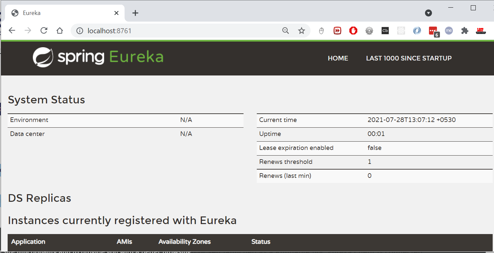
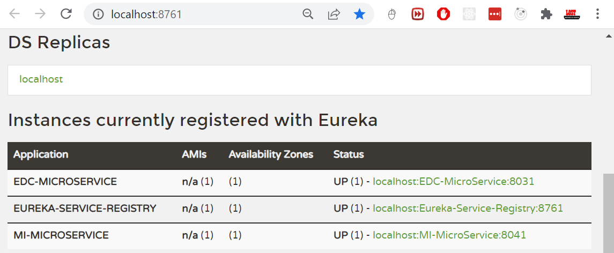

# Eureka Service Registry and Discovery

In the microservices world, **Service Registry and Discovery** plays an
important role because we most likely run multiple instances of services and we
need a mechanism to call other services without hardcoding their hostnames or
port numbers.

-   Think of it as a lookup service where microservices (clients) can register
    themselves and discover other registered microservices.

-   When a client microservice registers with Eureka it provides metadata such
    as host, port, and health indicator thus allowing for other microservices to
    discover it.

-   The discovery server expects a regular heartbeat message from each
    microservice instance. If an instance begins to consistently fail to send a
    heartbeat, the discovery server will remove the instance from his registry.

Suppose we have 2 microservices **EDC-Microservice** and **MI- Microservice**
and we are running 2 instances of **EDC-Microservice** at http://localhost:8031/
and http://localhost:8032/. Now let’s say we want to invoke some
**EDC-Microservice** REST endpoint from **MI- Microservice**. Which URL should
we hit? Generally, in these scenarios, we use a load balancer configuring these
2 URLs to be delegated to and we will invoke the REST endpoint on load balancer
URL. Fine.

But, what if you want to spin up new instances dynamically based on load? Even
if you are going to run only few server nodes, manually updating the server node
details in load balancer configuration is error-prone and tedious. This is why
we need automatic Service Registration mechanism and be able to invoke a service
using some **logical service id** instead of using specific IP Address and port
numbers.

We can use Netflix Eureka Server to create a Service Registry and make our
microservices as Eureka Clients so that as soon as we start a microservice it
will get registered with Eureka Server automatically with a **logical Service
ID**. Then, the other microservices, which are also Eureka Clients, can use
Service ID to invoke REST endpoints.

Steps to create Netflix Eureka based Service Registry

add **Eureka Server** starter.

~~~~~~~~~~~~~~~~~~~~~~~~~~~~~~~~~~~~~~~~~~~~~~~~~~~~~~~~~~~~~~~~~~~~~~~~~~~ java
<dependency>
    <groupId>org.springframework.cloud</groupId>
    <artifactId>spring-cloud-starter-netflix-eureka-server</artifactId>
</dependency>
~~~~~~~~~~~~~~~~~~~~~~~~~~~~~~~~~~~~~~~~~~~~~~~~~~~~~~~~~~~~~~~~~~~~~~~~~~~~~~~~

We need to add **@EnableEurekaServer** annotation on main class to make our
SpringBoot application a Eureka Server based Service Registry.

~~~~~~~~~~~~~~~~~~~~~~~~~~~~~~~~~~~~~~~~~~~~~~~~~~~~~~~~~~~~~~~~~~~~~~~~~~~ java
@SpringBootApplication
@EnableEurekaServer
public class SpringCloudEurekaServerApplication {

	public static void main(String[] args) {
		SpringApplication.run(SpringCloudEurekaServerApplication.class, args);
	}
}
~~~~~~~~~~~~~~~~~~~~~~~~~~~~~~~~~~~~~~~~~~~~~~~~~~~~~~~~~~~~~~~~~~~~~~~~~~~~~~~~

By default, each Eureka Server is also a Eureka client and needs at least one
service URL to locate a peer. As we are going to have a single Eureka Server
node (Standalone Mode), we are going to disable this client-side behavior by
configuring the following properties in **application.properties file**.

~~~~~~~~~~~~~~~~~~~~~~~~~~~~~~~~~~~~~~~~~~~~~~~~~~~~~~~~~~~~~~~~~~~~~~~~~~~ java
spring.application.name=service-registry
server.port=8761
eureka.instance.hostname=localhost
eureka.instance.client.registerWithEureka=false
eureka.instance.client.fetchRegistry=false
eureka.instance.client.serviceUrl.defaultZone=http://${eureka.instance.hostname}:${server.port}/eureka/
~~~~~~~~~~~~~~~~~~~~~~~~~~~~~~~~~~~~~~~~~~~~~~~~~~~~~~~~~~~~~~~~~~~~~~~~~~~~~~~~

Netflix Eureka Service provides UI where we can see all the details about
registered services.Now run the main class, check url
[**http://localhost:8761/**](http://localhost:8761/)

## Register EDC-Microservice to Eureka

Add the **Eureka Discovery** starter to **EDC-Microservice** which will add the
following dependency.

~~~~~~~~~~~~~~~~~~~~~~~~~~~~~~~~~~~~~~~~~~~~~~~~~~~~~~~~~~~~~~~~~~~~~~~~~~~ java
<dependency>
    <groupId>org.springframework.cloud</groupId>
    <artifactId>spring-cloud-starter-netflix-eureka-client</artifactId>
</dependency>
~~~~~~~~~~~~~~~~~~~~~~~~~~~~~~~~~~~~~~~~~~~~~~~~~~~~~~~~~~~~~~~~~~~~~~~~~~~~~~~~

we just need to configure **eureka.client.service-url.defaultZone** property in
**application.properties** to automatically register with the Eureka Server.

~~~~~~~~~~~~~~~~~~~~~~~~~~~~~~~~~~~~~~~~~~~~~~~~~~~~~~~~~~~~~~~~~~~~~~~~~~~~~~~~
eureka.client.service-url.defaultZone=http://localhost:8761/eureka/
~~~~~~~~~~~~~~~~~~~~~~~~~~~~~~~~~~~~~~~~~~~~~~~~~~~~~~~~~~~~~~~~~~~~~~~~~~~~~~~~

With this configuration in place, start **EDC-Microservice** and visit
**http://localhost:8761**. You should see EDC-Microservice is registered with
**SERVICE ID** as **EDC-MICROSERVICE**

