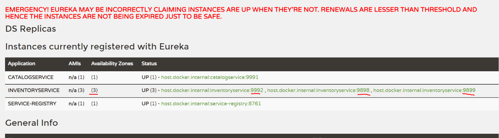
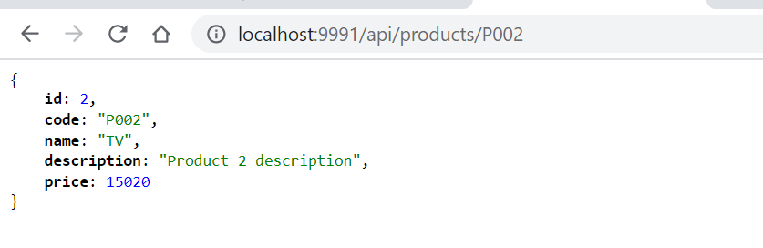

# Ribbon Load balancer

remove **server.port=9992** from both bootstrap & git property file. And start 2
MI-MicroService instances manually.

~~~~~~~~~~~~~~~~~~~~~~~~~~~~~~~~~~~~~~~~~~~~~~~~~~~~~~~~~~~~~~~~~~~~~~~~~~~~~~~~
java -jar -Dserver.port=9898 mi-service-0.0.1-SNAPSHOT.jar
java -jar -Dserver.port=9899 mi-service-0.0.1-SNAPSHOT.jar
~~~~~~~~~~~~~~~~~~~~~~~~~~~~~~~~~~~~~~~~~~~~~~~~~~~~~~~~~~~~~~~~~~~~~~~~~~~~~~~~

Now visit Eureka Dashboard **http://localhost:8761/** and see 3 instances of
inventory-service registered.

**Suppose we if want to call MI-MicroService from EDC-MicroService, which of
above 3 instance will call ?**

We do by enablling LoadBalancer mechanisum in Our MicroServices. Eureka by
default provides **Ribbon LoadBalancer**. To enable Ribbon LoadBalancer in Our
Microservices do below steps

In SpringBoot main Application class we need to following things

-   Create & Return **RestTemplate** **Object**

-   We can register **RestTemplate** as a Spring bean with **@LoadBalanced**
    annotation.

-   The RestTemplate with **@LoadBalanced** annotation will internally use
    **Ribbon LoadBalancer** to resolve the **ServiceID** and invoke REST
    endpoint using one of the available servers.

**Catalog-service/ CatalogServiceApplication.java**

~~~~~~~~~~~~~~~~~~~~~~~~~~~~~~~~~~~~~~~~~~~~~~~~~~~~~~~~~~~~~~~~~~~~~~~~~~~ java
@SpringBootApplication
public class CatalogServiceApplication {
 
    @Bean
    @LoadBalanced
    public RestTemplate restTemplate() {
        return new RestTemplate();
    }
 
    public static void main(String[] args) {
        SpringApplication.run(CatalogServiceApplication.class, args);
    }
}
~~~~~~~~~~~~~~~~~~~~~~~~~~~~~~~~~~~~~~~~~~~~~~~~~~~~~~~~~~~~~~~~~~~~~~~~~~~~~~~~

In Service Class Create **RestTemplate** object & Autowire It.

Use RestTemplate to invoke **inventory-service** endpoint from
**catalog-service/ProductService.java**

~~~~~~~~~~~~~~~~~~~~~~~~~~~~~~~~~~~~~~~~~~~~~~~~~~~~~~~~~~~~~~~~~~~~~~~~~~~ java
@Service
@Transactional
@Slf4j
public class ProductService {
    @Autowired
    private final ProductRepository productRepository;

    @Autowired
    private final RestTemplate restTemplate;
    
    public Optional<Product> findProductByCode(String code) {
        Optional<Product> productOptional = productRepository.findByCode(code);
        if(productOptional.isPresent()) {
            log.info("Fetching inventory level for product_code: "+code);
            ResponseEntity<ProductInventoryResponse> itemResponseEntity =
                    restTemplate.getForEntity("http://inventory-service/api/inventory/{code}",
                                                ProductInventoryResponse.class,
                                                code);
            if(itemResponseEntity.getStatusCode() == HttpStatus.OK) {
                Integer quantity = itemResponseEntity.getBody().getAvailableQuantity();
                log.info("Available quantity: "+quantity);
            } else {
                log.error("Unable to get inventory level for product_code: "+code +
                ", StatusCode: "+itemResponseEntity.getStatusCode());
            }
        }
        return productOptional;
    }
}
~~~~~~~~~~~~~~~~~~~~~~~~~~~~~~~~~~~~~~~~~~~~~~~~~~~~~~~~~~~~~~~~~~~~~~~~~~~~~~~~

Note that we have used **http://inventory-service/api/inventory/{code}** instead
of **http://localhost:9898/api/inventory/{code}** or
**http://localhost:9999/api/inventory/{code}**

With this kind of automatic Service Registration and Discovery mechanism, we no
need to worry about how many instances are running and what are their hostnames
and ports etc.
