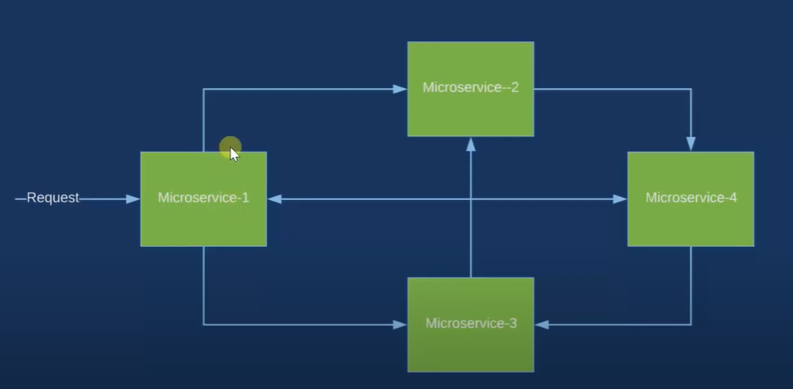
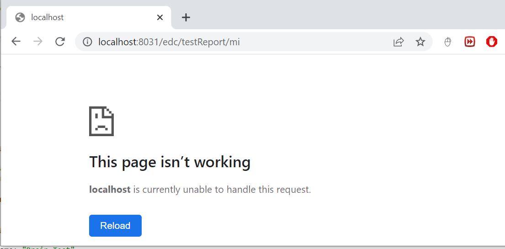
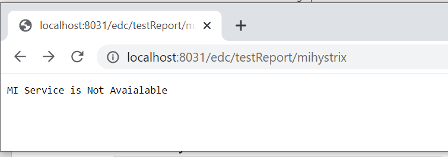
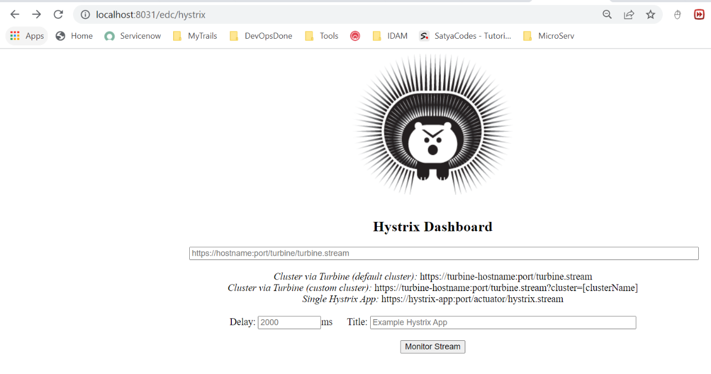

# Hystrix Circuit Breaker

Spring Cloud Circuit Breaker using Netflix Hystrix

In the microservices world, to fulfill a client request one microservice may
need to talk to other microservices. We should minimize this kind of direct
dependencies on other microservices but in some cases it is unavoidable. **If a
microservice is down or not functioning properly then the issue may cascade up
to the upstream services**.

Netflix created Hystrix library implementing [Circuit
Breaker](https://martinfowler.com/bliki/CircuitBreaker.html) pattern to address
these kinds of issues. We can use **Spring Cloud Netflix Hystrix Circuit
Breaker** to protect microservices from cascading failures.

Steps to Spring Cloud Circuit Breaker using Netflix Hystrix

From **EDC-Micrservice** we are invoking REST endpoint on **MI-service** to
testReports of the user. What if Mi-service is down? What if MI-service is
taking too long to respond thereby slowing down all the services depending on
it? We would like to have some **timeouts** and implement some **fallback
mechanism**.

Following Steps we need to Perform

-   Add **Hystrix** Dependency

-   Enable Hystrix functaionlity in our EDC-Microservice, by adding
    **@EnableHystrix** on our main SpringBoot Class

-   Use **@HystrixCommand**(**fallbackMethod** = "**miReportFallBackMethod**")
    to define fallback method if called microservice is down or unreachable

Add **Hystrix** starter to catalog-service.

~~~~~~~~~~~~~~~~~~~~~~~~~~~~~~~~~~~~~~~~~~~~~~~~~~~~~~~~~~~~~~~~~~~~~~~~~~~ java
<dependency>
    <groupId>org.springframework.cloud</groupId>
    <artifactId>spring-cloud-starter-netflix-hystrix</artifactId>
    <version>2.2.10.RELEASE</version>
</dependency>
~~~~~~~~~~~~~~~~~~~~~~~~~~~~~~~~~~~~~~~~~~~~~~~~~~~~~~~~~~~~~~~~~~~~~~~~~~~~~~~~

To enable Circuit Breaker add **@@EnableHystrix** annotation on
**catalog-service** entry-point class.

~~~~~~~~~~~~~~~~~~~~~~~~~~~~~~~~~~~~~~~~~~~~~~~~~~~~~~~~~~~~~~~~~~~~~~~~~~~ java
@SpringBootApplication 
@EnableHystrix
public class EDCMicroServiceMainApplication {
	
    @Bean
    @LoadBalanced
    public RestTemplate restTemplate() {
        return new RestTemplate();
    }

 public static void main(String[] args) {
		SpringApplication.run(EDCMicroServiceMainApplication.class, args); 
		System.out.println(" EDC Service... ");  
    }
}

@RestController
public class TestReportController {

	@Autowired
	TestReportRepository repository;
	
	@Autowired
	RestTemplate restTemplate;
	 	 

 
	@GetMapping(value =  "/testReport/mi", produces = "application/json")
       @HystrixCommand(fallbackMethod = "miReportFallBackMethod")
	public ResponseEntity<Object> getAllMIReportsWithHyStrix() {
		try {			
			ResponseEntity<Object> responseEntity =  restTemplate.getForEntity("http://MI-MICROSERVICE/mi/anthology/all", Object.class);
			System.out.println(responseEntity);
			 
			return new ResponseEntity<>(responseEntity, HttpStatus.OK);
		} catch (Exception e) {
			return new ResponseEntity<>(null, HttpStatus.INTERNAL_SERVER_ERROR);
		}
	}
  
	public ResponseEntity<Object> miReportFallBackMethod() {
	try {			
		return new ResponseEntity<>("MI Service is Not Avaialable", HttpStatus.OK);
	     }catch (Exception e) {
		return new ResponseEntity<>(null, HttpStatus.INTERNAL_SERVER_ERROR);
	   }
	}	

}
~~~~~~~~~~~~~~~~~~~~~~~~~~~~~~~~~~~~~~~~~~~~~~~~~~~~~~~~~~~~~~~~~~~~~~~~~~~~~~~~

We have annotated the method from where we are making a REST call with
**@HystrixCommand(fallbackMethod = “miReportFallBackMethod”)** so that if it
doesn’t receive the response within the certain time limit the call gets timed
out and invoke the configured fallback method.

The fallback method should be defined in the same class and should have the same
signature(return type). In the fallback method **miReportFallBackMethod()** we
are setting default behavior depends on what business wants.

I have Stopped MI-MicroService, for checking HyStrix Working

Without Hystrix

With Hystrix

# HyStrix Dashboard

We have two ways to configure Hystrix Dashoboard

**1.Enable Hystrix Dashboard EDC-MicroService it self.**

Add Dashboard Dependency

~~~~~~~~~~~~~~~~~~~~~~~~~~~~~~~~~~~~~~~~~~~~~~~~~~~~~~~~~~~~~~~~~~~~~~~~~~~ java
	<dependency>
		<groupId>org.springframework.cloud</groupId>
		<artifactId>spring-cloud-starter-netflix-hystrix-dashboard</artifactId>
		<version>2.2.10.RELEASE</version>
	</dependency>
~~~~~~~~~~~~~~~~~~~~~~~~~~~~~~~~~~~~~~~~~~~~~~~~~~~~~~~~~~~~~~~~~~~~~~~~~~~~~~~~

2.Add @EnableHystrixDashboard annotation to SpringBoot main Class

~~~~~~~~~~~~~~~~~~~~~~~~~~~~~~~~~~~~~~~~~~~~~~~~~~~~~~~~~~~~~~~~~~~~~~~~~~~ java
@SpringBootApplication 
@EnableHystrix
@EnableHystrixDashboard
public class EDCMicroServiceMainApplication {
}
~~~~~~~~~~~~~~~~~~~~~~~~~~~~~~~~~~~~~~~~~~~~~~~~~~~~~~~~~~~~~~~~~~~~~~~~~~~~~~~~

Once we add **Hystrix** starter to EDC-Microservice we can get the circuits
status as a stream of events using Actuator endpoint.

<http://localhost:8181/actuator/hystrix.stream> , assuming catalog-service is
running on 8181 port.

**2.Separate Server for Connecting Hystrix**

Spring Cloud also provides a nice dashboard to monitor the status of Hystrix
commands. Create a Spring Boot application with **Hystrix Dashboard** starter
and annotate the main entry-point class with **@EnableHystrixDashboard**.

~~~~~~~~~~~~~~~~~~~~~~~~~~~~~~~~~~~~~~~~~~~~~~~~~~~~~~~~~~~~~~~~~~~~~~~~~~~ java
<dependency>
    <groupId>org.springframework.cloud</groupId>
    <artifactId>spring-cloud-starter-netflix-hystrix-dashboard</artifactId>
</dependency>
~~~~~~~~~~~~~~~~~~~~~~~~~~~~~~~~~~~~~~~~~~~~~~~~~~~~~~~~~~~~~~~~~~~~~~~~~~~~~~~~

Now in Hystrix Dashboard home page enter
**http://localhost:8181/actuator/hystrix.stream** as stream URL and give Catalog
Service as Title and click on Monitor Stream
button.
