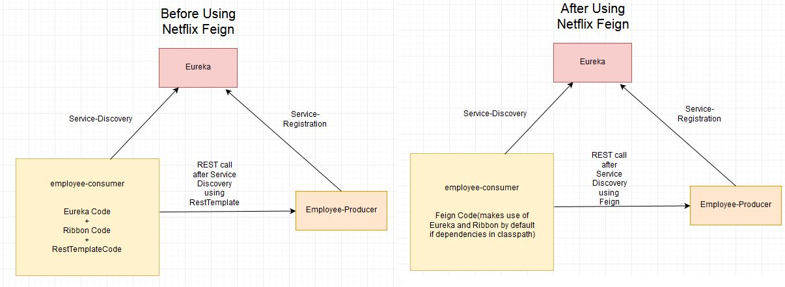

# Spring Cloud Feign

Spring Cloud Feign(Pain) - Declarative REST Client

In Previous example we used **RestTemplate** class for calling external
MicroService.

~~~~~~~~~~~~~~~~~~~~~~~~~~~~~~~~~~~~~~~~~~~~~~~~~~~~~~~~~~~~~~~~~~~~~~~~~~~ java
@RestController
public class TestReportController {

	@Autowired
	TestReportRepository repository;
	
	@Autowired
	RestTemplate restTemplate;
	 	  
	@GetMapping(value =  "/testReport/mi", produces = "application/json")
       @HystrixCommand(fallbackMethod = "miReportFallBackMethod")
	public ResponseEntity<Object> getAllMIReportsWithHyStrix() {
	 		
	ResponseEntity<Object> responseEntity =  
restTemplate.getForEntity("http://MI-MICROSERVICE/mi/anthology/all", Object.class);
			return new ResponseEntity<>(responseEntity, HttpStatus.OK);		 
	}
  
	public ResponseEntity<Object> miReportFallBackMethod() {
	try {			
		return new ResponseEntity<>("MI Service is Not Avaialable", HttpStatus.OK);
	     }catch (Exception e) {
		return new ResponseEntity<>(null, HttpStatus.INTERNAL_SERVER_ERROR);
	   }
	}	
}
~~~~~~~~~~~~~~~~~~~~~~~~~~~~~~~~~~~~~~~~~~~~~~~~~~~~~~~~~~~~~~~~~~~~~~~~~~~~~~~~

~~~~~~~~~~~~~~~~~~~~~~~~~~~~~~~~~~~~~~~~~~~~~~~~~~~~~~~~~~~~~~~~~~~~~~~~~~~ java
<dependency>
	<groupId>org.springframework.cloud</groupId>
	<artifactId>spring-cloud-starter-openfeign</artifactId>
</dependency>
~~~~~~~~~~~~~~~~~~~~~~~~~~~~~~~~~~~~~~~~~~~~~~~~~~~~~~~~~~~~~~~~~~~~~~~~~~~~~~~~

In above Example we are calling **MIMicroService** from **EDCMicroService**
using **RestTemplate**. But this call is tightly coupled with controller method
itself. If any other Controller want to call same microservice url, it needs to
be rewrite whole RestTemplate calling.

To resolve this, we are using Feign client to takeout that external calls and
defined in a Feiyn Client.

-   annotate the Spring Boot Main class with **@EnableFeignClients**.

-   Create a Separate interface for MIService calls in EDCService
    MIServiceFeignClient.java

-   Add **@FeignClient** and provide logical ServiceID of MIService in eureka,

@FeignClient(name="MI-MICROSERVICE")

-   Now you can write all abstract methods which are same as MIMiccroService
    Controller with **@Get** /**@Post** mappings.

~~~~~~~~~~~~~~~~~~~~~~~~~~~~~~~~~~~~~~~~~~~~~~~~~~~~~~~~~~~~~~~~~~~~~~~~~~~ java
@FeignClient(name="MI-MICROSERVICE")
public interface MIServiceFeignClient {
	
	@GetMapping("/{id}")
	public AnthologyDTO getAnthologyById(@PathVariable(value = "id") Integer anthologyId);
	
	@GetMapping(value = "/all",  produces = "application/json")	
	public List<AnthologyDTO> getAllAnthologys();	
}
~~~~~~~~~~~~~~~~~~~~~~~~~~~~~~~~~~~~~~~~~~~~~~~~~~~~~~~~~~~~~~~~~~~~~~~~~~~~~~~~

-   Create DTO class to store MIRelated Data responce.

~~~~~~~~~~~~~~~~~~~~~~~~~~~~~~~~~~~~~~~~~~~~~~~~~~~~~~~~~~~~~~~~~~~~~~~~~~~ java
@Data
public class AnthologyDTO {
	private int anthologyId;
	private int userId;
	private String reportName;
	private String reportUrl;
	private String trialId;
	private String trialName;
}
~~~~~~~~~~~~~~~~~~~~~~~~~~~~~~~~~~~~~~~~~~~~~~~~~~~~~~~~~~~~~~~~~~~~~~~~~~~~~~~~

-   Now in TestController class Autowire MIServiceFeignClient & replace
    RestTemplate call with MIServiceFeignClient method call.

~~~~~~~~~~~~~~~~~~~~~~~~~~~~~~~~~~~~~~~~~~~~~~~~~~~~~~~~~~~~~~~~~~~~~~~~~~~ java
@RestController
public class TestReportController {	 
	
	@Autowired
	MIServiceFeignClient miFeignClient;

	@GetMapping(value =  "/testReport/mifeign", produces = "application/json")
@HystrixCommand(fallbackMethod = "miReportFallBackMethod")
	public ResponseEntity<List<AnthologyDTO>> getAllMIReportsWithHyStrixFeign() { 
			List<AnthologyDTO> responce =  miFeignClient.getAllAnthologys();
			return new ResponseEntity<>(responce, HttpStatus.OK);		 
}
~~~~~~~~~~~~~~~~~~~~~~~~~~~~~~~~~~~~~~~~~~~~~~~~~~~~~~~~~~~~~~~~~~~~~~~~~~~~~~~~
