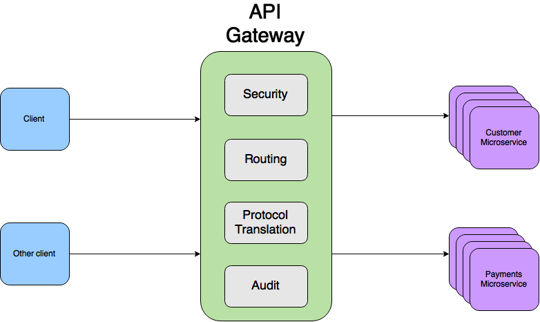
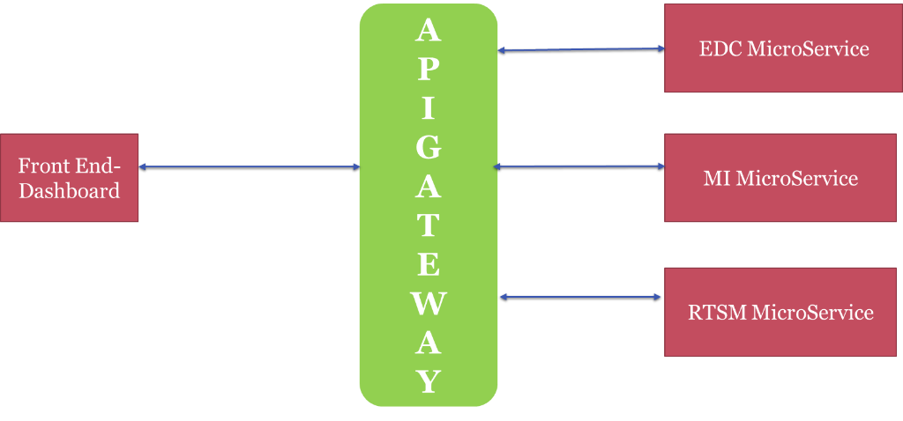
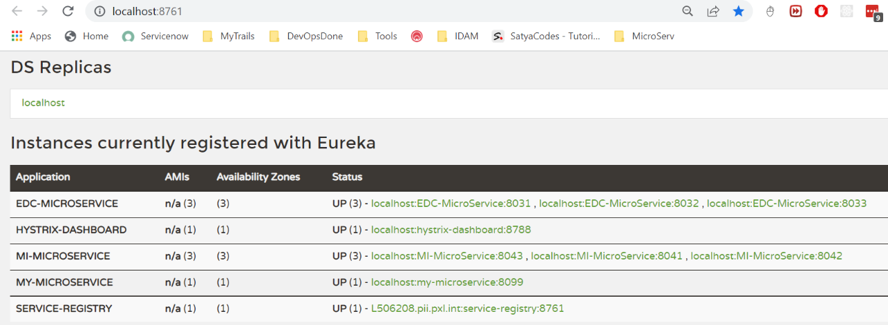

# Zuul API Gateway

Spring Cloud provides **Zuul(Zool)** proxy, similar to **Nginx**, that can be
used to create API Gateway.

API Gateway, aka Edge Service, provides a unified interface for a set of
microservices. so that clients no need to know about all the details of
microservices internals like hostname & port numbers. However, there are some
pros and cons of using API Gateway pattern in microservices architecture.

**Pros:**

-   Provides easier interface to clients

-   Can be used to prevent exposing the internal microservices structure to
    clients

-   Allows to refactor microservices without forcing the clients to refactor
    consuming logic

-   Can centralize cross-cutting concerns like security, monitoring, rate
    limiting etc

**Cons:**

-   It could become a single point of failure if proper measures are not taken
    to make it highly available

-   Knowledge of various microservice API may creep into API Gateway

    

    <https://www.youtube.com/watch?v=-I-9gK8NWXY>

~~~~~~~~~~~~~~~~~~~~~~~~~~~~~~~~~~~~~~~~~~~~~~~~~~~~~~~~~~~~~~~~~~~~~~~~~~~ java
server:
  port: 8100

zuul:
  routes:
    doctors-service:
      url: http://localhost:8082
    patient-service:
      url: http://localhost:8083
    disease-service:
      url: http://localhost:8081
  host:
    connect-timeout-millis: 2000
    socket-timeout-millis: 5000
~~~~~~~~~~~~~~~~~~~~~~~~~~~~~~~~~~~~~~~~~~~~~~~~~~~~~~~~~~~~~~~~~~~~~~~~~~~~~~~~

<https://github.com/greenlearner01/ApiGateway>

Steps to Implement Zuul in our Application

1.Add Zuul & other required dependecies.

~~~~~~~~~~~~~~~~~~~~~~~~~~~~~~~~~~~~~~~~~~~~~~~~~~~~~~~~~~~~~~~~~~~~~~~~~~~ java
<dependency>
	<groupId>org.springframework.cloud</groupId>
	<artifactId>spring-cloud-starter-netflix-zuul</artifactId>
	<version>2.2.10.RELEASE</version>
</dependency>
~~~~~~~~~~~~~~~~~~~~~~~~~~~~~~~~~~~~~~~~~~~~~~~~~~~~~~~~~~~~~~~~~~~~~~~~~~~~~~~~

2.Enable Zuul API gateway by adding **@EnableZuulProxy** annotation to our main
class

~~~~~~~~~~~~~~~~~~~~~~~~~~~~~~~~~~~~~~~~~~~~~~~~~~~~~~~~~~~~~~~~~~~~~~~~~~~ java
@SpringBootApplication
@EnableZuulProxy
public class IDaamApiGatewayApplication {

	public static void main(String[] args) {
		SpringApplication.run(IDaamApiGatewayApplication.class, args);
	}
}
~~~~~~~~~~~~~~~~~~~~~~~~~~~~~~~~~~~~~~~~~~~~~~~~~~~~~~~~~~~~~~~~~~~~~~~~~~~~~~~~

3.Configure **application.yaml** file with Route Details (**without Eureka
Server** Load balancer)

~~~~~~~~~~~~~~~~~~~~~~~~~~~~~~~~~~~~~~~~~~~~~~~~~~~~~~~~~~~~~~~~~~~~~~~~~~~ java
server:
  port: 8099
  
eureka:
  client:
    serviceUrl:
      defaultZone: http://localhost:8761/eureka/

# without Eureka Server
zuul:
  routes:
    edc-service:
      url: http://localhost:8031/edc/
    mi-service:
      url: http://localhost:8041/mi/

  host:
    connect-timeout-millis: 2000
    socket-timeout-millis: 5000
~~~~~~~~~~~~~~~~~~~~~~~~~~~~~~~~~~~~~~~~~~~~~~~~~~~~~~~~~~~~~~~~~~~~~~~~~~~~~~~~

4\. To access MicroService API via API Gateway use following URL’s

~~~~~~~~~~~~~~~~~~~~~~~~~~~~~~~~~~~~~~~~~~~~~~~~~~~~~~~~~~~~~~~~~~~~~~~~~~~ java
IDAAM API GATEWAY STARTED 
 http://localhost:8099/ 
 	 EDC Service:  http://localhost:8099/edc-service
 	 MI Service :  http://localhost:8099/mi-service
~~~~~~~~~~~~~~~~~~~~~~~~~~~~~~~~~~~~~~~~~~~~~~~~~~~~~~~~~~~~~~~~~~~~~~~~~~~~~~~~

With Eureka Server

~~~~~~~~~~~~~~~~~~~~~~~~~~~~~~~~~~~~~~~~~~~~~~~~~~~~~~~~~~~~~~~~~~~~~~~~~~~ java
# WITH Eureka Server      
zuul:
 routes:
    edcservice:
      path: /edc/**
      serviceId: EDC-MICROSERVICE
 
    miservice:
      path: /mi/**
      serviceId: MI-MICROSERVICE      
 host:
    connect-timeout-millis: 2000
    socket-timeout-millis: 5000
~~~~~~~~~~~~~~~~~~~~~~~~~~~~~~~~~~~~~~~~~~~~~~~~~~~~~~~~~~~~~~~~~~~~~~~~~~~~~~~~

As Zuul act as a proxy to all our microservices, we can use Zuul service to
implement some cross-cutting concerns like security, rate limiting etc. One
common use-case is forwarding the **Authentication headers** to all the
downstream services.

**Typically in microservices, we will use OAuth service for authentication and
authorization**. Once the client is authenticated OAuth service will generate a
token which should be included in the requests making to other microservices so
that client need not be authenticated for every service separately. We can use
Zuul filter to implement features like this.

~~~~~~~~~~~~~~~~~~~~~~~~~~~~~~~~~~~~~~~~~~~~~~~~~~~~~~~~~~~~~~~~~~~~~~~~~~~ java
package com.idaam;

import com.netflix.zuul.ZuulFilter;
import com.netflix.zuul.context.RequestContext;
import javax.servlet.http.HttpServletRequest;
import java.util.UUID;
import static org.springframework.cloud.netflix.zuul.filters.support.FilterConstants.PRE_TYPE;
 
public class AuthHeaderFilter extends ZuulFilter {
    @Override
    public String filterType() {
        return PRE_TYPE;
    }
 
    @Override
    public int filterOrder() {
        return 0;
    }
 
    @Override
    public boolean shouldFilter() {
        return true;
    } 
    @Override
    public Object run()  {
        RequestContext ctx = RequestContext.getCurrentContext();
        HttpServletRequest request = ctx.getRequest();
 
        if (request.getAttribute("AUTH_HEADER") == null) {
            String sessionId = UUID.randomUUID().toString();             
            ctx.addZuulRequestHeader("AUTH_HEADER", sessionId);
        }
        return null;
    }
}
~~~~~~~~~~~~~~~~~~~~~~~~~~~~~~~~~~~~~~~~~~~~~~~~~~~~~~~~~~~~~~~~~~~~~~~~~~~~~~~~

We are adding **AUTH_HEADER** as a request header using
**RequestContext.addZuulRequestHeader()** which will be forwarded to downstream
services. We need to register it as a Spring bean in our MicroServices.

~~~~~~~~~~~~~~~~~~~~~~~~~~~~~~~~~~~~~~~~~~~~~~~~~~~~~~~~~~~~~~~~~~~~~~~~~~~ java
@Bean
AuthHeaderFilter authHeaderFilter() {
    return new AuthHeaderFilter();
}
~~~~~~~~~~~~~~~~~~~~~~~~~~~~~~~~~~~~~~~~~~~~~~~~~~~~~~~~~~~~~~~~~~~~~~~~~~~~~~~~
