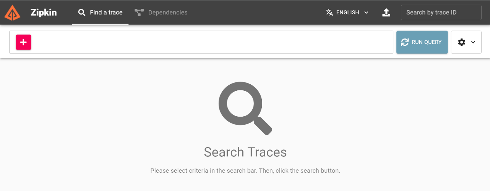

# Sleuth and Zipkin

Distributed Tracing with Spring Cloud Sleuth(Sluuth) and Zipkin

In the microservices world, a user action on UI may invoke one microservice API
endpoint, which in turn invoke another microservice endpoint.

For example, when a user sees the catalog, **shoppingcart-ui** will invoke
**catalog-service** REST API <http://localhost:8181/api/products> which in turn
calls **inventory-service** REST API <http://localhost:8282/api/inventory> to
check for inventory availability.

Suppose, an exception has occurred or the data returned is invalid and you want
to investigate what is wrong by looking at logs. But as of now, there is no way
to correlate the logs of that particular user across multiple services.

## Olden Days

One solution to this is at the beginning of the call chain we can create a
**CORRELATION_ID** and add it to all log statements. Along with it, send
CORRELATION_ID as a header to all the downstream services as well so that those
downstream services also use CORRELATION_ID in logs. This way we can identify
all the log statements related to a particular action across services.

We can implement this solution using
[MDC](https://logback.qos.ch/manual/mdc.html) feature of Logging frameworks.
Typically we will have a WebRequest Interceptor where you can check whether
there is a CORRELATION_ID header. If there is no CORRELATION_ID in the header
then create a new one and set it in MDC. The logging frameworks include the
information set in MDC with all log statements.

But, instead of we doing all this work we can use Spring Cloud Sleuth which will
do all this and much more for us.

## Using Sleuth

Add Sleuth Dependecy in All Microservices (EDC, MI)

\<dependency\>

\<groupId\>org.springframework.cloud\</groupId\>

\<artifactId\>spring-cloud-starter-sleuth\</artifactId\>

\<version\>2.2.8.RELEASE\</version\>

\</dependency\>

Once you add **Sleuth** starter and start the services you can observe in logs
something like this.

2018-03-20 10:19:15.512 INFO [inventory-service,,,] 53685 --- [trap-executor-0]
c.n.d.s.r.aws.ConfigClusterResolver ...

2018-03-20 10:24:15.507 INFO [inventory-service,,,] 53685 --- [trap-executor-0]
c.n.d.s.r.aws.ConfigClusterResolver ...

Now hit any inventory-service REST endpoint, say
http://localhost:8282/api/inventory. Then you can observe **TraceID, SpanID** in
the logs.

2018-03-20 10:15:38.466 INFO
[inventory-service,**683f8e4370413032**,**d8abe400c68a9a6b**,false] 53685 ---
[oryController-3] ...

Sleuth includes the pattern **[appname,traceId,spanId,exportable]** in logs from
the MDC.

Now invoke the catalog-service endpoint <http://localhost:8181/api/products>
endpoint which internally invokes inventory-service endpoint
<http://localhost:8282/api/inventory> .

In catalog-service logs you can find log statements something like:

~~~~~~~~~~~~~~~~~~~~~~~~~~~~~~~~~~~~~~~~~~~~~~~~~~~~~~~~~~~~~~~~~~~~~~~~~~~ java
2018-03-20 10:54:29.625  INFO [catalog-service,0335da07260d3d6f,0335da07260d3d6f,false] 53617 --- [io-8181-exec-10] ...
~~~~~~~~~~~~~~~~~~~~~~~~~~~~~~~~~~~~~~~~~~~~~~~~~~~~~~~~~~~~~~~~~~~~~~~~~~~~~~~~

And, check logs in inventory-service, you can find log statements something
like:

~~~~~~~~~~~~~~~~~~~~~~~~~~~~~~~~~~~~~~~~~~~~~~~~~~~~~~~~~~~~~~~~~~~~~~~~~~~ java
2018-03-20 10:54:29.662  INFO [inventory-service,0335da07260d3d6f,1af68249ac3a6902,false] 53685 --- [oryController-6] ...
~~~~~~~~~~~~~~~~~~~~~~~~~~~~~~~~~~~~~~~~~~~~~~~~~~~~~~~~~~~~~~~~~~~~~~~~~~~~~~~~

Observe that TraceID **0335da07260d3d6f** is same in both catalog-service and
inventory-service for the same REST API call. This way we can easily correlate
the logs across services.

The **false** in [inventory-service,0335da07260d3d6f,1af68249ac3a6902,false]
indicates that this trace is not exported to any Tracing Server like Zipkin. Let
us see how we can export the tracing information to Zipkin.

## Zipkin – Distributed Tracing Configuration

Zipkin is a distributed tracing system. It helps gather timing data needed to
troubleshoot latency problems in service architectures. Features include both
the collection and lookup of this data.

If you have a **traceID** in a log file, you can jump directly to it. Otherwise,
you can query based on attributes such as service, operation name, tags and
duration. Some interesting data will be summarized for you, such as the
percentage of time spent in a service, and whether or not operations failed.

The quick and easiest way to start a Zipkin server is using zipkin executable
jar provided by Zipkin team.

-   Download Jar file : <https://zipkin.io/pages/quickstart.html>

-   Run Server **: java -jar zipkin.jar**

-   Access using : [**http://127.0.0.1:9411/**](http://127.0.0.1:9411/)

We observed that the tracing information is printed in logs but not exported. We
can export them to Zipkin server so that we can visualize traces in Zipkin
Server UI Dashboard.

Add **Zipkin Client** starter to both inventory-service and catalog-service.

~~~~~~~~~~~~~~~~~~~~~~~~~~~~~~~~~~~~~~~~~~~~~~~~~~~~~~~~~~~~~~~~~~~~~~~~~~~ java
<dependency>
	<groupId>org.springframework.cloud</groupId>
	<artifactId>spring-cloud-starter-zipkin</artifactId>
	<version>2.2.8.RELEASE</version>
</dependency>
~~~~~~~~~~~~~~~~~~~~~~~~~~~~~~~~~~~~~~~~~~~~~~~~~~~~~~~~~~~~~~~~~~~~~~~~~~~~~~~~

Configure Zipkin server URL in **application.properties** of both
inventory-service and catalog-service.

~~~~~~~~~~~~~~~~~~~~~~~~~~~~~~~~~~~~~~~~~~~~~~~~~~~~~~~~~~~~~~~~~~~~~~~~~~~ java
spring.zipkin.base-url=http://localhost:9411/
spring.sleuth.sampler.probability=1
~~~~~~~~~~~~~~~~~~~~~~~~~~~~~~~~~~~~~~~~~~~~~~~~~~~~~~~~~~~~~~~~~~~~~~~~~~~~~~~~

Now restart both inventory-service and catalog-service and invoke
<http://localhost:8181/api/products> endpoint. You can observe that **true** is
printed in logs meaning it is exported.

~~~~~~~~~~~~~~~~~~~~~~~~~~~~~~~~~~~~~~~~~~~~~~~~~~~~~~~~~~~~~~~~~~~~~~~~~~~ java
2018-03-20 11:41:02.241  INFO [catalog-service,7d0d44fe314d7758,7d0d44fe314d7758,true] 53617 --- [nio-8181-exec-5] c.s.c.services.ProductService
~~~~~~~~~~~~~~~~~~~~~~~~~~~~~~~~~~~~~~~~~~~~~~~~~~~~~~~~~~~~~~~~~~~~~~~~~~~~~~~~

Now go to Zipkin UI Dashboard, you can see the service names populated in the
first dropdown. Select the service you want to check or select all and then
click on Find Traces button.
