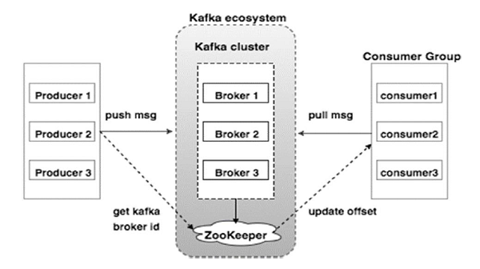

# Kafka – Message Broker

Kafka as “an open-source message broker project developed by the [Apache
Software Foundation](https://en.wikipedia.org/wiki/Apache_Software_Foundation)
written in Scala and is a distributed publish-subscribe messaging system.

Kafka is designed for transferring Big data. Kafka has better throughput,
**built-in partitioning**, **replication** and inherent **fault-tolerance**,
which makes it a good fit for large-scale message processing applications.

Two types of messaging patterns are available − **one is point** to point and
the other is **publish-subscribe** (pub-sub) messaging system. Most of the
messaging patterns follow **pub-sub**.

| **High Throughput**   | Support for millions of messages with modest hardware                                                                                 |
|-----------------------|---------------------------------------------------------------------------------------------------------------------------------------|
| **Scalability**       | Highly scalable distributed systems with no downtime                                                                                  |
| **Replication**       | Messages are replicated across the cluster to provide support for multiple subscribers and balances the consumers in case of failures |
| **Durability**        | Provides support for persistence of message to disk                                                                                   |
| **Stream Processing** | Used with real-time streaming applications like Apache Spark & Storm                                                                  |
| **Data Loss**         | Kafka with proper configurations can ensure zero data loss                                                                            |

-   **Producer**: responsible for producing messages for a specific topic.

-   **Consumer**: responsible for reading the messages that the producer puts on
    a topic.

-   **Brokers** – a set of servers where the publishes messages are stored

-   **Topic**: topic is a **categorized group** of messages.

-   **Message**: I think that all events in Kafka can be summarized in messages.
    A message can contain a simple text like “Hello World” or an **object** in
    **json** format for example.

## Partition & Offset

In the above diagram, a topic is configured into three partitions.

-   Partition 1 has two offset factors 0 and 1.

-   Partition 2 has four offset factors 0, 1, 2, 3.

-   Partition 3 has one offset factor 0.

-   The id of the replica is same as the id of the server that hosts it.

Assume, if the replication factor of the topic is set to 3, then Kafka will
create 3 identical replicas of each partition and place them in the cluster to
make available for all its operations. To balance a load in cluster, each broker
stores one or more of those partitions. Multiple producers and consumers can
publish and retrieve messages at the same time.

## Cluster Architecture

**Broker:** Kafka cluster typically consists of multiple brokers to maintain
load balance. Kafka brokers are stateless, so they use ZooKeeper for maintaining
their cluster state. One Kafka broker instance can handle hundreds of thousands
of reads and writes per second and each bro-ker can handle TB of messages
without performance impact. Kafka broker leader election can be done by
ZooKeeper.

**ZooKeeper:** ZooKeeper is used for managing and coordinating Kafka broker.
ZooKeeper service is mainly used to notify producer and consumer about the
presence of any new broker in the Kafka system or failure of the broker in the
Kafka system. As per the notification received by the Zookeeper regarding
presence or failure of the broker then pro-ducer and consumer takes decision and
starts coordinating their task with some other broker.

**Producers:** Producers push data to brokers. When the new broker is started,
all the producers search it and automatically sends a message to that new
broker. Kafka producer doesn’t wait for acknowledgements from the broker and
sends messages as fast as the broker can handle

## Windows Install & Configuration

-   Got to the [Apache Kafka downloads page](https://kafka.apache.org/downloads)
    and download the [https://kafka.apache.org/download the **Scala 2.12
    kafka_2.12-0.10.2.1.tgz**](https://kafka.apache.org/download%20the Scala%202.12%20kafka_2.12-0.10.2.1.tgz)**.**
    Next unzip & start Apache Kafka

-   This Kafka installation comes with an inbuilt zookeeper. **Zookeeper is
    mainly used to track status of nodes present in Kafka cluster** and also to
    keep track of Kafka topics, messages, etc.

-   Open a command prompt and **start the Zookeeper-**

~~~~~~~~~~~~~~~~~~~~~~~~~~~~~~~~~~~~~~~~~~~~~~~~~~~~~~~~~~~~~~~~~~~~~~~~~~~~~~~~
cd C:\kafka
.\bin\windows\zookeeper-server-start.bat .\config\zookeeper.properties
~~~~~~~~~~~~~~~~~~~~~~~~~~~~~~~~~~~~~~~~~~~~~~~~~~~~~~~~~~~~~~~~~~~~~~~~~~~~~~~~

-   Open a new command prompt and **start the Apache Kafka**

~~~~~~~~~~~~~~~~~~~~~~~~~~~~~~~~~~~~~~~~~~~~~~~~~~~~~~~~~~~~~~~~~~~~~~~~~~~~~~~~
cd C:\kafka
.\bin\windows\kafka-server-start.bat .\config\server.properties

//If any errors add below line in Environment propertis in User Serction
%SystemRoot%\System32\Wbem;%SystemRoot%\System32\;SystemRoot%
~~~~~~~~~~~~~~~~~~~~~~~~~~~~~~~~~~~~~~~~~~~~~~~~~~~~~~~~~~~~~~~~~~~~~~~~~~~~~~~~

# Create UserProvision Topic

-   Open a new command prompt and **create a topic with name
    UserProvision-topic, that has only one partition & one replica.**

~~~~~~~~~~~~~~~~~~~~~~~~~~~~~~~~~~~~~~~~~~~~~~~~~~~~~~~~~~~~~~~~~~~~~~~~~~~ java
cd C:\kafka
.\bin\windows\kafka-topics.bat --create --zookeeper localhost:2181 --replication-factor 1 --partitions 1 --topic UserProvision-topic
~~~~~~~~~~~~~~~~~~~~~~~~~~~~~~~~~~~~~~~~~~~~~~~~~~~~~~~~~~~~~~~~~~~~~~~~~~~~~~~~

-   Next Open a new command prompt and **create a PRODUCER to send message to
    the above created UserProvision-topic and send a message - Hello World
    Javainuse to it-**

~~~~~~~~~~~~~~~~~~~~~~~~~~~~~~~~~~~~~~~~~~~~~~~~~~~~~~~~~~~~~~~~~~~~~~~~~~~ java
cd C:\kafka
.\bin\windows\kafka-console-producer.bat --broker-list localhost:9092 --topic UserProvision-topic Hello Message:User is Created
~~~~~~~~~~~~~~~~~~~~~~~~~~~~~~~~~~~~~~~~~~~~~~~~~~~~~~~~~~~~~~~~~~~~~~~~~~~~~~~~

-   Finally Open a new command prompt and **start the CONSUMER which listens to
    the topic javainuse-topic we just created above**. We will get the message
    we had sent using the producer

~~~~~~~~~~~~~~~~~~~~~~~~~~~~~~~~~~~~~~~~~~~~~~~~~~~~~~~~~~~~~~~~~~~~~~~~~~~ java
cd C:\kafka
.\bin\windows\kafka-console-consumer.bat --bootstrap-server localhost:9092 --topic UserProvision-topic --from-beginning
~~~~~~~~~~~~~~~~~~~~~~~~~~~~~~~~~~~~~~~~~~~~~~~~~~~~~~~~~~~~~~~~~~~~~~~~~~~~~~~~

# SpringBoot Kafka Application Example

When ever new User is Created, we need to send the User details to Kafka.
Downstream applications will consume those User details. So we have need Create
below Projects.

**Producer: Send messages to Topic**

-   UserManagementMicroServiceWithKafka

**Consumer: Consumes messages**

-   EDC-MicroService

-   MI-MicroService

1.Producer Application : UserManagementMicroServiceWithKafka

Create SpringBoot Project & Add Dependencies

~~~~~~~~~~~~~~~~~~~~~~~~~~~~~~~~~~~~~~~~~~~~~~~~~~~~~~~~~~~~~~~~~~~~~~~~~~~ java
	<dependencies>
		<dependency>
			<groupId>org.springframework.kafka</groupId>
			<artifactId>spring-kafka</artifactId>
		</dependency>
		<dependency>
			<groupId>org.springframework.boot</groupId>
			<artifactId>spring-boot-starter-web</artifactId>
		</dependency>
		<dependency>
			<groupId>org.springframework.boot</groupId>
			<artifactId>spring-boot-starter-test</artifactId>
			<scope>test</scope>
		</dependency>
	</dependencies>
~~~~~~~~~~~~~~~~~~~~~~~~~~~~~~~~~~~~~~~~~~~~~~~~~~~~~~~~~~~~~~~~~~~~~~~~~~~~~~~~

application.properties:

~~~~~~~~~~~~~~~~~~~~~~~~~~~~~~~~~~~~~~~~~~~~~~~~~~~~~~~~~~~~~~~~~~~~~~~~~~~ java
# Producer properties
spring.kafka.producer.bootstrap-servers=127.0.0.1:9092
spring.kafka.producer.key-serializer=org.apache.kafka.common.serialization.StringSerializer
spring.kafka.producer.value-serializer=org.apache.kafka.common.serialization.StringSerializer
spring.kafka.producer.group-id=group_id
topic.name.producer=user.provision.topic

# Common Kafka Properties
auto.create.topics.enable=true
~~~~~~~~~~~~~~~~~~~~~~~~~~~~~~~~~~~~~~~~~~~~~~~~~~~~~~~~~~~~~~~~~~~~~~~~~~~~~~~~

-   At first I put the StringSerializer class to serialize the messages, just to
    send some text.

-   The **auto.create.topics.enable** = true property automatically creates
    topics registered to those properties. In that case I put
    topic.name.producer = **user.provision.topic**

SpringBootMainClass : In the main class I put the annotation “**@EnableKafka**”,
which makes it possible to connect to a topic.

~~~~~~~~~~~~~~~~~~~~~~~~~~~~~~~~~~~~~~~~~~~~~~~~~~~~~~~~~~~~~~~~~~~~~~~~~~~ java
@SpringBootApplication
@EnableKafka
public class UserManagementKafkaApplication {
	public static void main(String[] args) {
		SpringApplication.run(UserManagementKafkaApplication.class, args);
	}
}

@RestController
@RequestMapping(value = "/userprovision/")
public class UserProvisionController {

	@Autowired
	KafkaSenderService kafkaSender;

	@PostMapping(value = "/add", produces = "text/html")
	public ResponseEntity<String> producer(@RequestBody UserDetails userDetails) {		 
		kafkaSender.send(userDetails.toString());
		return ResponseEntity.ok().body(userDetails.toString());
	}
}

@Service
public class KafkaSenderService {	
	@Autowired
	private KafkaTemplate<String, String> kafkaTemplate;
	
	//String kafkaTopic = "UserProvision-topic";
	@Value("${topic.name.producer}")
    	private String kafkaTopic;	
	
	public void send(String data) {	    
	  System.out.println("KafkaSenderService : Message STRAT");
	    kafkaTemplate.send(kafkaTopic, data);
	    System.out.println("KafkaSenderService : Message SENT");
	}
}
~~~~~~~~~~~~~~~~~~~~~~~~~~~~~~~~~~~~~~~~~~~~~~~~~~~~~~~~~~~~~~~~~~~~~~~~~~~~~~~~

The **KafkaTemplate** class is the class that sends messages to topics, the
first String is the topic and the second the type of information.

Test <http://localhost:8051/userprovision/add>

~~~~~~~~~~~~~~~~~~~~~~~~~~~~~~~~~~~~~~~~~~~~~~~~~~~~~~~~~~~~~~~~~~~~~~~~~~~ java
{
  "userId": 101,
  "firstName": "Satya",
  "lastName": "Kaveti",
  "role": "Admin",
  "trialName": "Trial123",
  "city": "UNITEDKINGDOM"
}
~~~~~~~~~~~~~~~~~~~~~~~~~~~~~~~~~~~~~~~~~~~~~~~~~~~~~~~~~~~~~~~~~~~~~~~~~~~~~~~~

Consumer Application : EDC-MicroService, MI-MicroService

Add Dependecy to both pom.xmls

~~~~~~~~~~~~~~~~~~~~~~~~~~~~~~~~~~~~~~~~~~~~~~~~~~~~~~~~~~~~~~~~~~~~~~~~~~~ java
<dependency>
	<groupId>org.apache.kafka</groupId>
	<artifactId>kafka-streams</artifactId>
</dependency>
<dependency>
	<groupId>org.springframework.kafka</groupId>
	<artifactId>spring-kafka</artifactId>
</dependency>
~~~~~~~~~~~~~~~~~~~~~~~~~~~~~~~~~~~~~~~~~~~~~~~~~~~~~~~~~~~~~~~~~~~~~~~~~~~~~~~~

Update Kafka application.properties:

\# Consumer properties

~~~~~~~~~~~~~~~~~~~~~~~~~~~~~~~~~~~~~~~~~~~~~~~~~~~~~~~~~~~~~~~~~~~~~~~~~~~ java
spring.kafka.producer.bootstrap-servers=127.0.0.1:9092
spring.kafka.producer.key-serializer=org.apache.kafka.common.serialization.StringSerializer
spring.kafka.producer.value-serializer=org.apache.kafka.common.serialization.StringSerializer
spring.kafka.producer.group-id=group_id
topic.name.consumer=user.provision.topic

# Common Kafka Properties
auto.create.topics.enable=true
~~~~~~~~~~~~~~~~~~~~~~~~~~~~~~~~~~~~~~~~~~~~~~~~~~~~~~~~~~~~~~~~~~~~~~~~~~~~~~~~

main class annotated with “**@EnableKafka**”, which makes it possible to connect
to a topic.

~~~~~~~~~~~~~~~~~~~~~~~~~~~~~~~~~~~~~~~~~~~~~~~~~~~~~~~~~~~~~~~~~~~~~~~~~~~ java
@SpringBootApplication 
@EnableHystrix
@EnableHystrixDashboard
@EnableKafka
public class EDCMicroServiceMainApplication {
	
    @Bean
    @LoadBalanced
    public RestTemplate restTemplate() {
        return new RestTemplate();
   }
	
	public static void main(String[] args) {
		SpringApplication.run(EDCMicroServiceMainApplication.class, args);		
	}

}
~~~~~~~~~~~~~~~~~~~~~~~~~~~~~~~~~~~~~~~~~~~~~~~~~~~~~~~~~~~~~~~~~~~~~~~~~~~~~~~~

Create Service class which consumes Topic messages

~~~~~~~~~~~~~~~~~~~~~~~~~~~~~~~~~~~~~~~~~~~~~~~~~~~~~~~~~~~~~~~~~~~~~~~~~~~ java
@Slf4j
@RequiredArgsConstructor
@Service
public class KafkaConsumerService {

	@Value("${topic.name.consumer")
	private String topicName;

	@KafkaListener(topics = "${topic.name.consumer}", groupId = "group_id")
	public void consume(ConsumerRecord<String, String> payload) {		
		log.info("Tópico: {}", topicName);
		log.info("key: {}", payload.key());
		log.info("Headers: {}", payload.headers());
		log.info("Partion: {}", payload.partition());
		log.info("Order: {}", payload.value());
 	}
}
~~~~~~~~~~~~~~~~~~~~~~~~~~~~~~~~~~~~~~~~~~~~~~~~~~~~~~~~~~~~~~~~~~~~~~~~~~~~~~~~

Start Both UserKafkaService & EDC, MI Services

Open SwaggerUI of user provison sent data

Producer Log

~~~~~~~~~~~~~~~~~~~~~~~~~~~~~~~~~~~~~~~~~~~~~~~~~~~~~~~~~~~~~~~~~~~~~~~~~~~ java
2022-03-16 12:42:36.322  INFO 15408 --- [ad | producer-1] org.apache.kafka.clients.Metadata        : [Producer clientId=producer-1] Cluster ID: kaWxu5VsTbulOsUgCos2zQ
KafkaSenderService : Message SENT
~~~~~~~~~~~~~~~~~~~~~~~~~~~~~~~~~~~~~~~~~~~~~~~~~~~~~~~~~~~~~~~~~~~~~~~~~~~~~~~~

Consumer Log

~~~~~~~~~~~~~~~~~~~~~~~~~~~~~~~~~~~~~~~~~~~~~~~~~~~~~~~~~~~~~~~~~~~~~~~~~~~ java
Tópico: {}${topic.name.consumer
key: {}null
Headers: {}RecordHeaders(headers = [], isReadOnly = false)
Partion: {}0
Order: {}UserDetails [userId=101, firstName=Satya, lastName=Kaveti, role=Admin, trialName=Trial123, city=UNITEDKINGDOM]
~~~~~~~~~~~~~~~~~~~~~~~~~~~~~~~~~~~~~~~~~~~~~~~~~~~~~~~~~~~~~~~~~~~~~~~~~~~~~~~~

**Remember** : We got errors while Sluth& Zipkin jars enabled in pom.xml. So
while running Kafka please comment those

<https://medium.com/geekculture/implementing-a-kafka-consumer-and-kafka-producer-with-spring-boot-60aca7ef7551>

<https://www.youtube.com/watch?v=L_iu8HOus8k>
