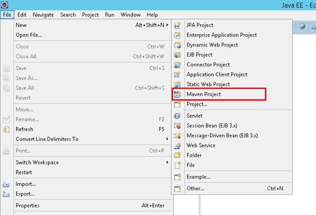
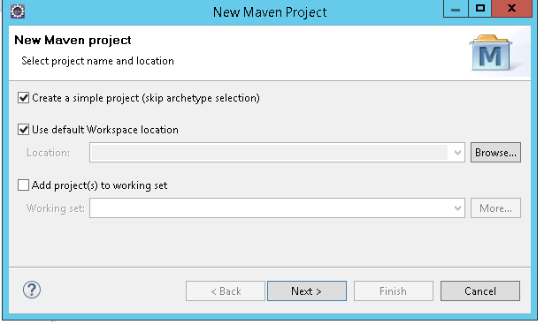
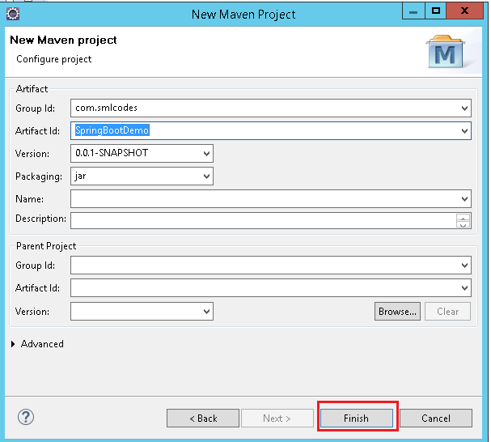
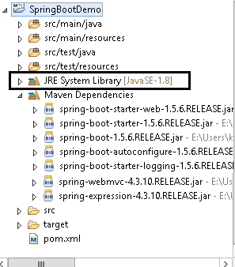

SpringBoot - maven and Eclipse Example
===========================================

1.Open Eclipse > File > New > Maven Project



**2.Tick ‘Create a simple project (skip archetype selection) ‘ check box >
click Next**



**3. Provide Group Id (its your package), Artifact Id (project name) and click
Finish**



4.open pom.xml, add Spring Boot dependencies
```xml
<project>
	<modelVersion>4.0.0</modelVersion>
	<groupId>com.smlcodes</groupId>
	<artifactId>SpringBootDemo</artifactId>
	<version>0.0.1-SNAPSHOT</version>
	<parent>
 <groupId>org.springframework.boot</groupId>
 <artifactId>spring-boot-starter-parent</artifactId>
 <version>1.5.6.RELEASE</version>
	</parent>

	<dependencies>
 <dependency>
 	<groupId>org.springframework.boot</groupId>
 	<artifactId>spring-boot-starter-web</artifactId>
 </dependency>
	</dependencies>

	<properties>
 <java.version>1.8</java.version>
	</properties>
</project>
```

-   **spring-boot-starter-parent:** is an existing project given by spring team
    which **contains Spring Boot supporting configuration data** (just
    configuration data, it won’t download any jars), we have added this in a
    **<parent>** tag means, we are instructing Maven to consider
    our SpringBootHelloWorld project as a child to it

-   **spring-boot-starter-web**: Starter for building web, including RESTful,
    applications using Spring MVC. Uses Tomcat as the default embedded container

**5.Now right click on the application > Maven > Update Project,**  
if you observe the directory structure of the project, it will create a new
folder named “*Maven Dependencies*" which contains all supporting. jars to run
the Spring Boot application and the Java version also changed to **1.8.**




-   if you observe pom.xml, we haven’t included version number for
    **spring-boot-starter-web** but maven downloaded some jar files with **some
    version(s) related to spring-boot-starter-web**, that’s because of Maven’s
    parent child relation.

-   While adding spring boot parent project, we included version as
    1.5.6.RELEASE, so again we no need to add version numbers for the
    dependencies.  As we know spring-boot-starter-parent contains configuration
    meta data, this means, it knows which version of dependency need to be
    downloaded.  So we no need to worry about dependencies versions., it
    will save lot of our time.


6.create a java class with main() method, in a `pakage.com.smlcodes.app.SpringBootApp.java`.
```java
@SpringBootApplication
public class SpringBootApp {
	public static void main(String[] args) {
 SpringApplication.run(SpringBootApp.class, args);
 System.out.println("****n Hello, World \n ***");
	}
}
```


-   **@SpringBootApplication** annotation, is the starting point for our Spring
    Boot application

-   **SpringApplication.run(SpringBootApp.class, args);** it will bootstrapping
    the application

remember, for every spring boot application we have to create a main class and
that need to be annotate with @SpringBootApplication and bootstrap it 


7.Finally, right click on the application > Run As > Java Application
```dos
.   ____          _            __ _ _
 \\ / ___'_ __ _ _(_)_ __  __ _ \ \ \ \
( ( )\___ | '_ | '_| | '_ \/ _` | \ \ \ \
 \\/  ___)| |_)| | | | | || (_| |  ) ) ) )
  '  |____| .__|_| |_|_| |_\__, | / / / /
 =========|_|==============|___/=/_/_/_/
 :: Spring Boot ::        (v1.5.6.RELEASE)

2017-09-11 16:04:04.006  INFO 6724 --- [           main] com.smlcodes.app.SpringBootApp           : Starting SpringBootApp on HYDPCMCSTS with PID 6724 
2017-09-11 16:04:13.444  INFO 6724 --- [           main] com.smlcodes.app.SpringBootApp           : Started SpringBootApp in 10.738 seconds (JVM running for 12.252)
*****************
 Hello, World 
*****************
```
